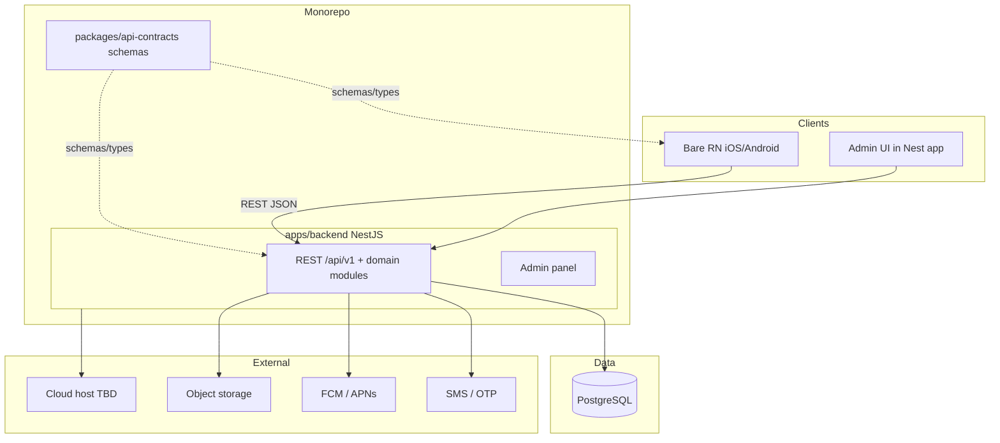

# 00 — Product & Stack

**Status:** `accepted`  
**Last updated:** 2026-10-07  
**Decisions log:** [`01-architecture-decisions.md`](01-architecture-decisions.md)

## What PartOn is

PartOn (legacy code name StaffMatch) is a **mobile** marketplace that connects **part-time job seekers** with **employers**.

| Role (product v1) | Primary jobs |
| --- | --- |
| Job seeker (worker) | Profile, availability, apply, check-in, ratings, notifications |
| Employer | Company / branch setup, job posting, applicant review |

Branch **manager** appears in the legacy case catalog; whether it is a first-class role is **open** ([AO-11](01-architecture-decisions.md)).

Initial market: **Turkey only**. Cloud region TBD.

Domain coverage for acceptance still uses the Turkish Parton case catalog (248 cases / 19 groups): [`cases/`](cases/).

## Why rebuild

| Old approach | New approach |
| --- | --- |
| Kotlin Multiplatform client | React Native **bare** (iOS + Android); **Expo forbidden** |
| Firebase Auth + Firestore as backend | NestJS 11 **REST / JSON API** + admin panel (same app) |
| Client-heavy business rules | Server-enforced rules in Nest domain modules |
| Document store + local Room cache | **PostgreSQL 18** as system of record (`uuidv7`, modern indexes) |
| Client SDK / listeners as the contract | Versioned REST under `/api/v1` + **Zod** shared schema packages |

Goals:

1. **Own the data model** — relational integrity, migrations, reporting.
2. **Centralize business rules** — API and admin share one rule layer.
3. **Stable client contract** — versioned REST; mobile never depends on DB models.
4. **Monorepo clarity** — mobile app and backend app as separate packages; shared contracts only.

## Locked stack

| Choice | Status |
| --- | --- |
| Monorepo (mobile + backend + shared packages) | `accepted` — [ADR-0005](backend/adr/0005-monorepo.md) |
| NestJS modular monolith (API + admin, same app) | `accepted` — [ADR-0001](backend/adr/0001-nestjs-modular-monolith.md) |
| PostgreSQL | `accepted` — [ADR-0002](backend/adr/0002-postgresql-owned-db.md) |
| REST / JSON over HTTPS | `accepted` — [ADR-0004](backend/adr/0004-rest-json-api.md) |
| Base path `/api/v1` | `accepted` |
| TypeScript (mobile, backend, shared) | `accepted` |
| React Native bare (iOS + Android); Expo forbidden | `accepted` — [ADR-0006](backend/adr/0006-bare-react-native-no-expo.md) |
| No separate worker process at start | `accepted` |
| Cloud hosting (vendor TBD) | `accepted` (vendor `open`) |
| GraphQL / gRPC / tRPC for clients | Rejected for v1 |

## Sep 2026 proposed tool chain

See [`03-tech-radar-2026.md`](03-tech-radar-2026.md) and phased delivery in [`02-product-roadmap.md`](02-product-roadmap.md).

| Concern | Proposed default | Status |
| --- | --- | --- |
| Monorepo tooling | pnpm + Turborepo | `proposed` |
| Validation / contracts | Zod 4 in `packages/api-contracts` | `proposed` |
| ORM | Prisma 7+ (`@prisma/adapter-pg`) | `proposed` |
| Mobile toolchain | Bare RN CLI + owned `ios/`/`android/`; Fastlane (or equiv.) | `accepted` |
| Observability | OpenTelemetry → OTLP | `proposed` |
| API docs | `@nestjs/swagger` from controllers + Zod | `proposed` |

## Non-goals (now)

- Microservices split
- GraphQL (or any non-REST public client API)
- Blind 1:1 Firestore collection port
- Separate worker / queue process until need is proven
- Feature-complete domain naming before product scoping

## Shared vs owned code

| Lives in shared packages | Backend only | Mobile only |
| --- | --- | --- |
| API request/response schemas | DB access / ORM models | Screens & navigation |
| Derived TypeScript types | Business rules & AuthZ | Device APIs (GPS, push token, secure storage) |
| Platform-agnostic helpers | Server secrets & env | |

Mobile talks to the backend **only** through the REST contract. Shared packages must not contain backend-only code or secrets.

## Scalability stance

Design for growth toward large user bases, but **do not** treat architecture choice as a capacity guarantee. Concurrent load, latency/availability SLOs, connection pooling, cache, and background jobs are decided later and proven with load tests. See [`01-architecture-decisions.md`](01-architecture-decisions.md).

## Target runtime sketch

In-process async (outbox / timers) is allowed; a **separate worker app is deferred**.

## Clarification order

1. App boundaries, tooling, shared packages, deploy  
2. Features → domain names, data model, detailed API/security  

## Related docs

- Decisions: [`01-architecture-decisions.md`](01-architecture-decisions.md)
- Roadmap: [`02-product-roadmap.md`](02-product-roadmap.md)
- Tech radar: [`03-tech-radar-2026.md`](03-tech-radar-2026.md)
- Backend index: [`backend/README.md`](backend/README.md)
- Legacy wiki: [`../parton-codebase-wiki/00-index.md`](../parton-codebase-wiki/00-index.md)
