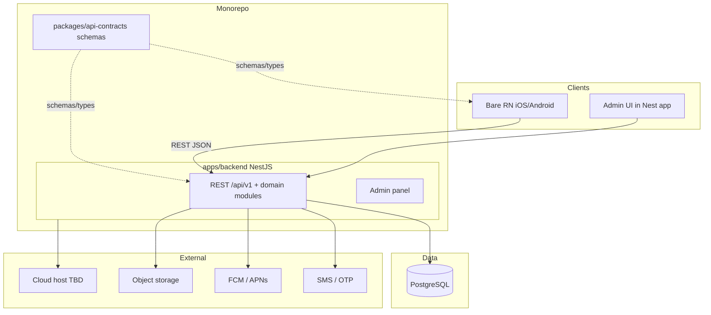

# 00 — Product & Stack

**Status:** `accepted`  
**Last updated:** 2026-10-09  
**Decisions log:** [`01-architecture-decisions.md`](01-architecture-decisions.md)  
**Architecture:** [`04-application-architecture.md`](04-application-architecture.md) · **Privacy:** [`backend/17-privacy-kvkk-gdpr.md`](backend/17-privacy-kvkk-gdpr.md)

## What PartOn is

PartOn (legacy code name StaffMatch) is a **mobile** marketplace that connects **part-time job seekers** with **employers**.

| Role (product v1) | Primary jobs |
| --- | --- |
| Job seeker (worker) | Profile, availability, apply, check-in, ratings, notifications |
| Employer | Company / branch setup, job posting, applicant review |

Branch **manager** appears in the legacy case catalog; whether it is a first-class role is **open** ([AO-11](01-architecture-decisions.md)).

Initial market: **Turkey only**. Cloud region TBD.  
**Primary product language:** Turkish (`tr-TR`) — [ADR-0023](backend/adr/0023-i18n-turkish-primary.md) · [shared/07-i18n.md](shared/07-i18n.md).

Domain coverage for acceptance still uses the Turkish Parton case catalog (248 cases / 19 groups): [`cases/`](cases/).

## Why rebuild

| Old approach | New approach |
| --- | --- |
| Kotlin Multiplatform client | React Native **bare** (iOS + Android); **Expo forbidden** |
| Firebase Auth + Firestore as backend | NestJS **12** **REST / JSON API** + admin panel (same app) |
| Client-heavy business rules | Server-enforced rules in Nest domain modules |
| Document store + local Room cache | **PostgreSQL 18** as system of record (`uuidv7`, modern indexes) |
| Client SDK / listeners as the contract | Versioned REST under `/api/v1` + **Zod** shared schema packages |

Goals:

1. **Own the data model** — relational integrity, migrations, reporting.
2. **Centralize business rules** — API and admin share one rule layer.
3. **Stable client contract** — versioned REST; mobile never depends on DB models.
4. **Monorepo clarity** — mobile app and backend app as separate packages; shared contracts only.
5. **Privacy-by-design** — KVKK primary for Turkey launch; GDPR-ready DSR/retention/minimization (ADR-0010).

## Locked stack

| Choice | Status |
| --- | --- |
| Monorepo (mobile + backend + shared packages) | `accepted` — [ADR-0005](backend/adr/0005-monorepo.md) |
| NestJS modular monolith (API + admin, same app) | `accepted` — [ADR-0001](backend/adr/0001-nestjs-modular-monolith.md) |
| Admin Web UI: Vite + shadcn/ui dark | `accepted` — [ADR-0014](backend/adr/0014-web-ui-shadcn-dark.md) · [web/04](web/04-shadcn-dark-ui.md) |
| Mobile UI: NativeWind on bare RN | `accepted` — [ADR-0015](backend/adr/0015-mobile-ui-nativewind.md) · [mobile/04](mobile/04-nativewind-ui.md) |
| Mobile design: Liquid Glass / WWDC principles | `accepted` — [ADR-0016](backend/adr/0016-mobile-ui-wwdc-liquid-glass.md) · [mobile/05](mobile/05-wwdc-liquid-glass.md) |
| Color system (Web + Mobile) | `accepted` — [ADR-0017](backend/adr/0017-color-system.md) · [shared/01](shared/01-color-system.md) |
| PostgreSQL | `accepted` — [ADR-0002](backend/adr/0002-postgresql-owned-db.md) |
| REST / JSON over HTTPS | `accepted` — [ADR-0004](backend/adr/0004-rest-json-api.md) |
| Base path `/api/v1` | `accepted` |
| TypeScript (mobile, backend, shared) | `accepted` |
| React Native bare (iOS + Android); Expo forbidden | `accepted` — [ADR-0006](backend/adr/0006-bare-react-native-no-expo.md) |
| No separate worker process at start | `accepted` |
| Cloud hosting (vendor TBD) | `accepted` (vendor `open`) |
| GraphQL / gRPC / tRPC for clients | Rejected — [ADR-0009](backend/adr/0009-rest-vs-grpc.md) / [16](backend/16-rest-vs-grpc.md) |
| REST + gRPC dual public edge | Hold (monolith) |

## Sep 2026 proposed tool chain

See [`03-tech-radar-2026.md`](03-tech-radar-2026.md) and phased delivery in [`02-product-roadmap.md`](02-product-roadmap.md).

| Concern | Proposed default | Status |
| --- | --- | --- |
| Monorepo tooling | pnpm + Turborepo **latest** | `accepted` — ADR-0038 |
| Backend framework | NestJS **12** latest + TypeScript **6** | `accepted` — ADR-0028 |
| Validation / contracts | Zod **4** latest in `packages/api-contracts` | `accepted` — ADR-0027 |
| ORM | Prisma **latest stable** (`@prisma/adapter-pg`) | `accepted` — ADR-0003 / 0028 |
| Mobile toolchain | Bare RN **latest stable** + owned `ios/`/`android/`; **Fastlane** release | `accepted` — ADR-0006/0028/0030 |
| Web process manager | **PM2** for Nest (API + admin) staging/prod | `accepted` — ADR-0031 |
| Web edge proxy | **NGINX** TLS + reverse proxy to Nest | `accepted` — ADR-0032 |
| Marketing site | Vite `apps/marketing` **production** (all `w.public.*` + prerender); NGINX www | `accepted` — ADR-0033 |
| Observability | OpenTelemetry → OTLP **latest**; **Admin DevOps** UI + **MCP** | `proposed` OTel · `accepted` ADR-0035/0036 |
| Legal audit | Append-only logger + admin **CSV/PDF** reports | `accepted` — ADR-0037 |
| API docs | `@nestjs/swagger` from controllers + Zod | `accepted` — ADR-0027 |

## Non-goals (now)

- Microservices split
- GraphQL (or any non-REST public client API)
- Blind 1:1 Firestore collection port
- Separate worker / queue process until need is proven
- Feature-complete domain naming before product scoping

## Shared vs owned code

| Lives in shared packages | Backend only | Mobile only |
| --- | --- | --- |
| API request/response schemas | DB access / ORM models | Screens & navigation |
| Derived TypeScript types | Business rules & AuthZ | Device APIs (GPS, push token, secure storage) |
| Platform-agnostic helpers | Server secrets & env | |

Mobile talks to the backend **only** through the REST contract. Shared packages must not contain backend-only code or secrets.

## Scalability stance

Design for growth toward large user bases, but **do not** treat architecture choice as a capacity guarantee. Concurrent load, latency/availability SLOs, connection pooling, cache, and background jobs are decided later and proven with load tests. See [`01-architecture-decisions.md`](01-architecture-decisions.md).

## Target runtime sketch

In-process async (outbox / timers) is allowed; a **separate worker app is deferred**. When an external queue is justified: **BullMQ + Redis**, not RabbitMQ — [ADR-0007](backend/adr/0007-bullmq-over-rabbitmq.md).

## Clarification order

1. App boundaries, tooling, shared packages, deploy  
2. Features → domain names, data model, detailed API/security  

## Related docs

- **Application architecture:** [`04-application-architecture.md`](04-application-architecture.md)
- Doc index / cohesion: [`DOC-INDEX.md`](DOC-INDEX.md) · [`DOC-COHESION.md`](DOC-COHESION.md)
- Decisions: [`01-architecture-decisions.md`](01-architecture-decisions.md)
- Roadmap: [`02-product-roadmap.md`](02-product-roadmap.md)
- Tech radar: [`03-tech-radar-2026.md`](03-tech-radar-2026.md)
- API contracts: [`shared/12-api-contracts.md`](shared/12-api-contracts.md) (ADR-0027)
- AI agents: [`AGENTS.md`](AGENTS.md)
- Backend index: [`backend/README.md`](backend/README.md)
- Legacy wiki: [`../parton-codebase-wiki/00-index.md`](../parton-codebase-wiki/00-index.md)
