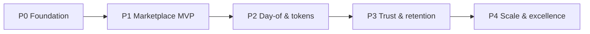

# 02 — Product roadmap (state of the art · Sep 2026)

**Status:** `proposed`  
**Last updated:** 2026-10-07  
**Horizon:** Foundation → Turkey MVP → Scale  
**Anchors:** [`01-architecture-decisions.md`](01-architecture-decisions.md) · [`03-tech-radar-2026.md`](03-tech-radar-2026.md) · [`cases/`](cases/)

This roadmap turns locked architecture into a **delivery plan**. Feature detail still comes from the 248-case catalog; phases below sequence *what ships when* and *which modern stack enables it*.

## North star

> Turkey’s trusted marketplace where part-time job seekers and employers complete a verified shift — discover → apply → confirm → check-in → rate — with server-owned rules and a versioned REST contract.

| Outcome | How we know |
| --- | --- |
| **Match quality** | Eligible jobs only (CASE-MATCHING); favorites-only never leaks |
| **Day-of reliability** | Check-in / dispute / token capture consistent under retries |
| **Trust** | Firm verification + abuse controls before growth marketing |
| **Operability** | One Nest deploy (API + admin); OTel traces for `/api/v1` |
| **Contract integrity** | Shared Zod schemas; OpenAPI from Nest; mobile never imports DB |

## Principles (roadmap-specific)

1. **Case catalog = acceptance** — each phase cites `CASE-*` / E2E journeys.  
2. **Thin vertical slices** — ship auth→publish→apply before polishing every screen.  
3. **Platform before features** — monorepo, contracts, CI, observability in P0.  
4. **Modern defaults, locked boundaries** — Sep 2026 tech *inside* Nest modular monolith + RN + Postgres (no GraphQL, no day-1 microservices/worker).  
5. **Measure before scale** — load tests and SLOs before a separate worker process.

## Phase map

| Phase | Goal | Exit criteria |
| --- | --- | --- |
| **P0** Foundation | Shipable monorepo + `/api/v1` skeleton + RN shell | CI green; OTP auth smoke; OpenAPI published; staging DB |
| **P1** Marketplace MVP | Employer posts; worker sees feed & applies | E2E Journey 1 through T-199 (accept) |
| **P2** Day-of & tokens | 3h confirm, check-in, ledger capture/release | Journeys 1–3 + 5 (tokens / GPS / multi-headcount) |
| **P3** Trust & retention | Docs, verification, favorites, ratings, abuse basics | Journeys 4; gap-P0 closed; admin ops usable |
| **P4** Scale & excellence | Perf, deeper admin, optional worker, ASO | Load plan T-226–T-234; deprecation policy AO-12 |

Suggested calendar (team-size agnostic): **P0 ~4–6 wks · P1 ~6–8 · P2 ~6–8 · P3 ~6–8 · P4 continuous**.

---

## P0 — Foundation (architecture → running system)

**Product:** No marketplace value yet; unlocks every later slice.

| Workstream | Deliverable | Tech (Sep 2026) |
| --- | --- | --- |
| Monorepo | `apps/mobile`, `apps/backend`, `packages/api-contracts` | **pnpm** workspaces + **Turborepo** (AO-7 proposed) |
| Backend shell | Nest modular monolith, global prefix `/api/v1`, health | **NestJS 11.x** (Node ≥20), `@nestjs/swagger` |
| Contracts | Shared request/response schemas + TS types | **Zod 4** in `packages/api-contracts`; Nest validates via nestjs-zod / Standard Schema (AO-8 proposed) |
| Data | Postgres + migrations + Prisma module | **PostgreSQL 18** (`uuidv7()`), **Prisma 7+** driver adapters (ADR-0003) |
| Auth vertical | OTP request/verify + JWT access/refresh | CASE-AUTH critical path |
| Mobile shell | Bare RN app, secure token store, typed API client | **Bare React Native** (owned `ios/`/`android/`); **no Expo** — [ADR-0006](backend/adr/0006-bare-react-native-no-expo.md) |
| Admin stub | Nest-hosted admin shell calling same services | Locked: same app as API |
| Observability | Structured logs + request id + OTel traces | OpenTelemetry Node SDK → OTLP |
| CI | Path-filtered lint/typecheck/test/build | GitHub Actions / GitLab CI |

**Exit checklist**

- [ ] `GET /health/live|ready` green on staging  
- [ ] `POST /api/v1/auth/otp/*` works end-to-end with SMS sandbox  
- [ ] OpenAPI for `/api/v1` generated and consumed by mobile client gen  
- [ ] Mobile boots on iOS + Android development builds  
- [ ] No secrets in shared packages; mobile cannot import Prisma  

**Closes / advances:** AO-2 (bare RN / no Expo — accepted); AO-7, AO-8 (as proposed); BQ-1 done; scaffolding for AO-1 (path filters).

---

## P1 — Marketplace MVP (discover → apply → accept)

**Product:** First closed loop for Turkey soft launch (invite-only OK).

| Capability | Cases / journeys | Modules |
| --- | --- | --- |
| Worker profile + availability | CASE-WORKER-PROFILE, T-016–T-029 | `workers` |
| Employer + branch + geo | CASE-EMPLOYER-BRANCH, T-194–T-195 | `employers`, `branches` |
| Job catalog + publish | CASE-JOB-POSTING | `jobs` (+ token **hold** stub OK) |
| Matching feed | CASE-MATCHING hard filters (subset) | `matching` |
| Apply / withdraw | CASE-APPLICATION | `applications` |
| Employer review accept/reject | CASE-EMPLOYER-REVIEW | `applications` |
| Push + inbox basics | CASE-NOTIFICATIONS | `notifications` |

**Exit checklist**

- [ ] E2E Journey 1 steps T-193–T-199  
- [ ] Matching omits ineligible jobs (no client-only filter)  
- [ ] Idempotent apply (`Idempotency-Key`)  
- [ ] Admin can list users / jobs (read-only OK)  

**Defer to P2+:** full token ledger semantics, check-in, ratings, favorites-only, documents.

---

## P2 — Day-of operations & token economics

**Product:** Shifts that complete with money-adjacent correctness.

| Capability | Cases | Modules |
| --- | --- | --- |
| Token ledger hold/capture/release | CASE-TOKEN, Journey 5 | `tokens` |
| 3h availability confirm | CASE-AVAILABILITY-3H | `shifts` |
| Check-in / check-out + geofence | CASE-CHECKIN, CASE-LOCATION | `shifts`, `location` |
| Dispute + manual confirm | T-210–T-214 | `shifts`, `moderation` |
| Notifications deep links | T-109–T-113 | `notifications` |

**Exit checklist**

- [ ] Journeys 1 (through T-204 tokens/ratings gate), 2, 3, 5  
- [ ] Token ops idempotent under retry (T-160)  
- [ ] Mock-GPS rejection path instrumented (even if heuristic v1)  
- [ ] Outbox drained **in-process** (no separate worker yet)  

**Product forks to decide in this phase:** TK-1 no-show policy, gap-3h-no-response, gap-payments provider.

---

## P3 — Trust, retention, and ops depth

**Product:** Ready for broader Turkey acquisition.

| Capability | Cases | Notes |
| --- | --- | --- |
| Firm verification gate | T-013, T-015 | Block publish until verified |
| Worker documents + job requirements | gap-documents | Signed object storage URLs |
| Favorites + favorites-only jobs | CASE-FAVORITES, Journey 4 | |
| Ratings window + moderation | CASE-RATINGS | |
| Abuse / ban / risk | CASE-ABUSE, CASE-SECURITY | Admin queues |
| UX polish | CASE-UX T-235–T-243 | Token explainer copy |

**Exit checklist**

- [ ] P0 gaps in [`cases/01-gap-backlog.md`](cases/01-gap-backlog.md) closed or explicitly deferred with owners  
- [ ] Admin can restrict users, resolve disputes, edit remote geofence config  
- [ ] Privacy: no continuous location tracks (T-250)  

---

## P4 — Scale & excellence

**Product:** Growth without rewriting the modular monolith.

| Theme | Work | Trigger |
| --- | --- | --- |
| Performance | Feed pagination, matching re-index, notify fan-out | CASE-PERF T-226–T-234 |
| Cache / pool | PgBouncer / managed pooler; Redis if proven | Pool saturation / p95 |
| Background worker | Extract outbox drain to separate process | AO-3 — only after load evidence |
| Client lifecycle | API deprecation window; force-update via policies | AO-12 |
| Mobile release | Fastlane / CI → App Store & Play; store ASO | Soft launch → public |
| Multi-region | Still later; Turkey region pick (AO-4, AO-10) | Compliance / latency |

**Exit checklist**

- [ ] Documented SLOs (latency / availability) and load-test report  
- [ ] Horizontal scale runbook for Nest + Postgres  
- [ ] Deprecation policy for `/api/v1` consumers  

---

## Cross-cutting workstreams (all phases)

| Stream | Practice |
| --- | --- |
| **Contract-first** | Change Zod schemas in `packages/api-contracts` → regenerate OpenAPI + mobile types in same PR |
| **AuthZ** | Role + branch guards on every mutating route; admin uses same services |
| **Idempotency** | Apply, OTP verify, check-in, token hold/capture |
| **Security** | Rate limits, ban list, secrets in cloud KMS/env — never shared packages |
| **Quality** | Nest unit + HTTP e2e; RN detox/maestro critical paths; case IDs in PRs |
| **Privacy (KVKK)** | Turkey launch: retention, consent, DSR process — track as compliance epic in P3 |

## Milestone → case mapping (summary)

| Milestone | Primary journeys / groups |
| --- | --- |
| M1 Auth | CASE-AUTH |
| M2 Post & apply | CASE-JOB-POSTING, APPLICATION, EMPLOYER-REVIEW, MATCHING (partial) |
| M3 Shift complete | AVAILABILITY-3H, CHECKIN, LOCATION, TOKEN |
| M4 Trust loop | FAVORITES, RATINGS, ABUSE, documents/verification gaps |
| M5 Hardening | SECURITY, PERF, UX, E2E full |

## Explicit non-goals (until P4+)

- Microservices split  
- GraphQL / gRPC public API  
- Day-1 separate worker  
- Multi-country localization / multi-region active-active  
- Full employer web console as a second product surface (admin in Nest is enough)

## Decision gates (must not skip)

| Gate | Before starting | Owner |
| --- | --- | --- |
| G0 | Confirm Nest (not Next) for API+admin | Architecture |
| G1 | ~~Expo vs bare~~ → **Bare RN locked; Expo forbidden** (ADR-0006) | Mobile |
| G2 | Accept Zod + OpenAPI pipeline | Full-stack |
| G3 | Accept Prisma 7+ (or supersede ADR-0003) | Backend |
| G4 | Pick cloud vendor + Turkey region | Ops |
| G5 | Token no-show + payment provider | Product |
| G6 | Manager role (AO-11) | Product |

## Related docs

- Tech radar: [`03-tech-radar-2026.md`](03-tech-radar-2026.md)  
- E2E scripts: [`cases/02-e2e-journeys.md`](cases/02-e2e-journeys.md)  
- Gap backlog: [`cases/01-gap-backlog.md`](cases/01-gap-backlog.md)  
- REST: [`backend/06-api-conventions.md`](backend/06-api-conventions.md)  
