# 04 — Application architecture

**Status:** `accepted` (structural baseline)  
**Last updated:** 2026-10-10  
**Audience:** Engineers, tech leads, reviewers  
**Companion docs:** [DOC-INDEX](DOC-INDEX.md) · [DOC-COHESION](DOC-COHESION.md) · [AGENTS](AGENTS.md) · [decisions](01-architecture-decisions.md) · [roadmap](02-product-roadmap.md) · [radar](03-tech-radar-2026.md) · [NFRs](05-quality-nfr.md) · [testing](06-testing-strategy.md) · [ops](07-environments-and-ops.md) · [glossary](shared/11-glossary.md) · [API contracts](shared/12-api-contracts.md) · [color system](shared/01-color-system.md) · [UI components](shared/02-ui-components.md) · [screen UX](shared/03-screen-ux-layout.md) · [wizard state](shared/04-wizard-state.md) · [push UX](shared/05-push-notifications-ux.md) · [a11y WCAG](shared/06-accessibility-wcag.md) · [i18n](shared/07-i18n.md) · [routing](shared/08-routing.md) · [modern UI principles](shared/09-modern-ui-principles.md) · [modern UX principles](shared/10-modern-ux-principles.md) · [UI mandate](cases/03-ui-coverage-mandate.md) · [client security](backend/21-client-security.md) · [mobile UI](mobile/04-nativewind-ui.md) · [Liquid Glass](mobile/05-wwdc-liquid-glass.md) · [web UI](web/04-shadcn-dark-ui.md) · [FCM](backend/20-fcm-messaging.md) · [auth/RBAC](backend/18-auth-rbac.md) · [privacy](backend/17-privacy-kvkk-gdpr.md) · [ADRs](backend/adr/)

This is the **canonical application architecture** for PartOn’s rebuild. Feature screens and case catalogs refine *what* we build; this document defines *how the system is structured*, how **clients integrate (REST vs gRPC)**, how **async work is transported (BullMQ vs RabbitMQ)**, how **AuthN / RBAC** work, how **FCM push** is delivered, how **mobile UI (NativeWind)** and **admin Web UI (shadcn/ui dark)** are built, and how **personal data is protected under KVKK (primary) and GDPR-ready controls**.

---

## 0. Executive integration map

PartOn separates concerns that are often confused:

| Concern | Question | PartOn answer |
| --- | --- | --- |
| **North-south API** | How do mobile/admin talk to the backend? | **REST / JSON `/api/v1` only** |
| **East-west / jobs** | How do we run background work reliably? | **Postgres outbox now → BullMQ later**; **not RabbitMQ** by default |
| **Internal modules** | How do Nest modules call each other? | **In-process** providers (`exports`) — **not** gRPC |
| **AuthN / AuthZ** | Who is calling, and what may they do? | **OTP + JWT sessions**; **RBAC + employer/branch scope** — ADR-0011 |
| **Background notify** | How do we alert users when the app is not open? | **FCM** (Android + iOS via APNs) — ADR-0013 |
| **Foreground live UX** | How do open screens get live hints? | **SSE** (not WebSocket) — ADR-0012 |
| **Mobile UI** | How do we style the bare RN app? | **[NativeWind](https://www.nativewind.dev/)** + **Liquid Glass principles** (WWDC) — ADR-0015 / 0016 |
| **Admin Web UI** | How do platform ops use the product on web? | **Vite React + [shadcn/ui](https://github.com/shadcn-ui/ui), dark default**, Nest-hosted — ADR-0014 |
| **Personal data** | How do we process PII under Turkish / EU law? | **KVKK primary**, GDPR-ready DSR/retention/minimization — ADR-0010 |

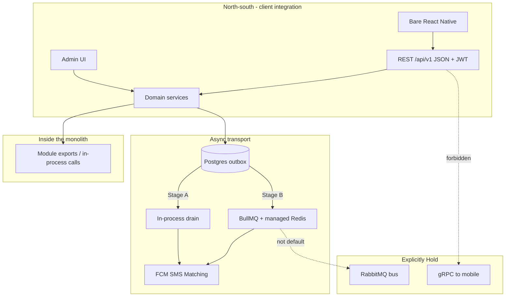

| Technology / regime | Role in architecture | Status |
| --- | --- | --- |
| **REST** | Sole public/mobile API | **Adopt / locked** — ADR-0004 |
| **gRPC** | Not for clients; optional future east-west after service extract | **Hold** — ADR-0009 |
| **BullMQ** | Job queue when Stage B evidence hits | **Trial → Adopt at Stage B** — ADR-0007 |
| **RabbitMQ** | AMQP bus for polyglot/fan-out platforms | **Hold** — wrong fit for Nest job monolith |
| **FCM** | Background / OS push (Android + iOS via APNs) | **Adopt** — ADR-0013 |
| **SSE** | Foreground server→client live hints | **Adopt (phased)** — ADR-0012 |
| **NativeWind** | Bare RN styling (Tailwind `className`) | **Adopt** — ADR-0015 |
| **Liquid Glass (principles)** | iOS UI/content layering (WWDC 25/26) | **Adopt** — ADR-0016 |
| **Color tokens** | Shared cream / forest / orange system (Web + Mobile) | **Adopt** — ADR-0017 |
| **shadcn/ui (dark)** | Nest-hosted admin SPA (Vite React) | **Adopt** — ADR-0014 |
| **OTP + JWT + RBAC** | Identity, sessions, role/branch AuthZ | **Adopt (eng)** — ADR-0011 |
| **KVKK / GDPR controls** | Privacy-by-design in Nest + REST + jobs | **Adopt (eng)** — ADR-0010; legal texts with counsel |

Deep dives: [DOC-INDEX](DOC-INDEX.md) · [API contracts](shared/12-api-contracts.md) · [Glossary](shared/11-glossary.md) · [NFRs](05-quality-nfr.md) · [Testing](06-testing-strategy.md) · [Ops](07-environments-and-ops.md) · [Color system](shared/01-color-system.md) · [UI components](shared/02-ui-components.md) · [Screen UX](shared/03-screen-ux-layout.md) · [Wizard state](shared/04-wizard-state.md) · [Push UX](shared/05-push-notifications-ux.md) · [Accessibility WCAG](shared/06-accessibility-wcag.md) · [i18n](shared/07-i18n.md) · [Routing](shared/08-routing.md) · [Modern UI principles](shared/09-modern-ui-principles.md) · [Modern UX principles](shared/10-modern-ux-principles.md) · [UI mandate](cases/03-ui-coverage-mandate.md) · [Client security](backend/21-client-security.md) · [Mobile NativeWind](mobile/04-nativewind-ui.md) · [WWDC Liquid Glass](mobile/05-wwdc-liquid-glass.md) · [Web UI shadcn](web/04-shadcn-dark-ui.md) · [FCM](backend/20-fcm-messaging.md) · [SSE](backend/19-sse.md) · [Auth & RBAC](backend/18-auth-rbac.md) · [REST vs gRPC](backend/16-rest-vs-grpc.md) · [BullMQ vs RabbitMQ](backend/14-bullmq-vs-rabbitmq.md) · [Redis management](backend/15-redis-management.md) · [Privacy KVKK/GDPR](backend/17-privacy-kvkk-gdpr.md).

---

## 1. Mission & quality attributes

PartOn is a Turkey-first mobile marketplace connecting **part-time job seekers** and **employers**. The rebuild replaces a Kotlin + Firebase client-heavy system with a server-owned NestJS platform and a bare React Native client.

| Quality attribute | Architectural response |
| --- | --- |
| **Correctness of marketplace rules** | Domain services in Nest own matching, tokens, check-in, AuthZ — never the mobile app |
| **Contract stability** | Versioned **REST** `/api/v1` + shared Zod schemas (not gRPC protos at the edge) |
| **Reliable side effects** | Transactional **outbox**; later **BullMQ** jobs with retries/delays (not fire-and-forget) |
| **Timely user alerts** | **FCM** push + durable inbox; SSE for foreground; never Firestore listeners as API |
| **Operability** | One Nest deployable (API + admin); Postgres as SoR; OTel + request ids |
| **Evolvability** | Modular monolith with explicit module exports; extract later if proven |
| **Security / trust** | OTP AuthN; JWT sessions; RBAC + resource scope on every REST route; secrets only on backend |
| **Privacy / compliance** | KVKK-first privacy-by-design; GDPR-ready DSR, retention, minimization, subprocessor register |
| **Scalability (honest)** | Prove load before introducing BullMQ/workers; do not adopt RabbitMQ/gRPC “for scale” |
| **Testability** | Case catalog (`CASE-*`) maps to **REST paths** + modules + screens |

Non-goals: microservices day-1, GraphQL/**gRPC public APIs**, **RabbitMQ day-1**, Expo, multi-region active-active, continuous location tracking, PII in logs/job payloads.

---

## 2. C4 — System context

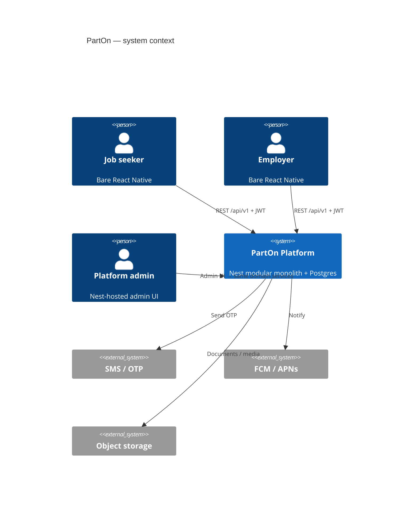

There is **no** gRPC or AMQP path from people/systems outside PartOn into the domain. **FCM/APNs** is a notification channel only — not a substitute API (see **§12**).

Detail: [`backend/02-system-context.md`](backend/02-system-context.md).

---

## 3. C4 — Containers (deployables)

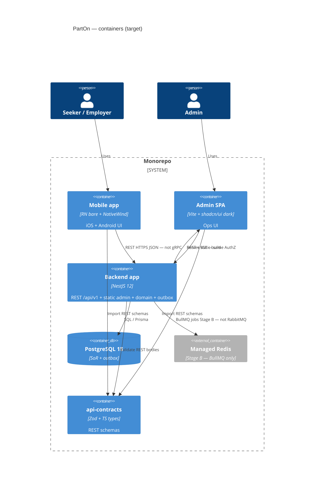

| Container | Responsibility | Must not |
| --- | --- | --- |
| `apps/mobile` | UI (NativeWind), navigation, device | Call gRPC; import Prisma; own business rules; Expo |
| `apps/admin` | Ops UI (shadcn dark) | Own business rules; import Prisma; AdminJS |
| `apps/backend` | REST edge, serve admin static, domain, outbox, (later) BullMQ | Expose RabbitMQ/gRPC publicly; leak secrets to shared pkgs |
| `packages/api-contracts` | REST request/response Zod schemas | Become `.proto` store for public API |
| PostgreSQL | Authoritative state + outbox | Be bypassed by client listeners |
| Managed Redis | BullMQ job state (Stage B+) | Host RabbitMQ; use LRU eviction for queues |

---

## 4. Integration & messaging architecture (REST · gRPC · BullMQ · RabbitMQ)

This section is the architectural home for the four technologies.

### 4.1 Two planes

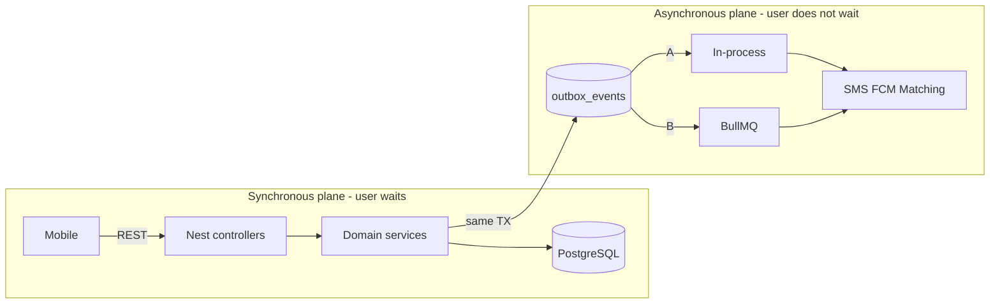

| Plane | Technologies in scope | Technologies out of scope |
| --- | --- | --- |
| **Sync (north-south)** | **REST** `/api/v1`, JWT, Zod, OpenAPI | **gRPC**, GraphQL, tRPC to clients |
| **Async (jobs)** | Outbox → **BullMQ** + managed Redis | **RabbitMQ** (default), Kafka day-1 |
| **Intra-monolith** | Nest `exports` / DI | gRPC or RabbitMQ between modules |

### 4.2 REST — public application API (locked)

**Decision:** All product capabilities reachable from mobile are **REST resources/commands** under `/api/v1`.

| Property | Choice |
| --- | --- |
| Style | Resource-oriented JSON over HTTPS |
| Versioning | `/api/v1`; breaking → `/api/v2` |
| Contracts | Shared Zod schemas in monorepo packages |
| Docs | OpenAPI from Nest (+ Zod) |
| Auth | `Authorization: Bearer <access_jwt>` |
| Critical writes | `Idempotency-Key` (apply, OTP verify, check-in, token ops) |

Why REST (not gRPC) for PartOn clients:

- Case catalog and screen docs already map to HTTP paths  
- Shared JSON schemas serve mobile pre-check + server validation  
- Curl / proxy / QA / OpenAPI tooling stay simple  
- Workloads are CRUD + commands, not high-frequency RPC streams  

Conventions: [`backend/06-api-conventions.md`](backend/06-api-conventions.md) · ADR-0004.

### 4.3 gRPC — not for clients (Hold)

**Decision:** Do **not** expose gRPC (or gRPC-Web) to mobile or the public internet.

| Surface | gRPC? |
| --- | --- |
| Mobile ↔ backend | **No** |
| Admin ↔ domain | **No** (in-process / optional REST) |
| Nest module ↔ module (today) | **No** (DI exports) |
| Future service ↔ service (after extract) | **Maybe** — new ADR + measured need |

**“Both REST and gRPC”** is a *future hybrid* pattern (REST north-south, gRPC east-west), **not** the current architecture. Adopting both now means double controllers and fake microservices inside one process.

Comparison: [`backend/16-rest-vs-grpc.md`](backend/16-rest-vs-grpc.md) · ADR-0009.

### 4.4 BullMQ — job transport for Stage B (accepted product)

**Decision:** When the outbox/in-process drain is no longer enough, use **BullMQ on managed Redis** (`@nestjs/bullmq`).

PartOn async work is **jobs** (retry, delay, observe), not a polyglot message bus:

| Job family | Examples | Why BullMQ fits |
| --- | --- | --- |
| Notifications | Push/SMS retry, inbox fan-out | Attempts + backoff |
| Matching | Feed recompute | Concurrency / isolation by queue |
| Schedule | 3h confirm, check-in nudge, +24h rating | **Delayed / repeatable** jobs |
| Moderation | Abuse heuristics | Low-priority queue |

**Promotion gates (any one):** outbox drain hurts HTTP p95; CASE-PERF notify/matching budgets fail; need worker replicas independent of API.

**Integrity pattern (required):**

```text
HTTP handler → DB transaction (domain write + outbox row)
            → outbox relay enqueues BullMQ job
            → worker loads entities from Postgres (small payload: ids + type)
```

Do **not** dual-write Redis inside the DB transaction without an outbox.

Redis for BullMQ must be **managed**, `maxmemory-policy=noeviction`, AOF `everysec` — [`backend/15-redis-management.md`](backend/15-redis-management.md) · ADR-0007/0008.

### 4.5 RabbitMQ — Hold (not the PartOn job backbone)

**Decision:** Do **not** introduce RabbitMQ as the default async backbone for the Nest modular monolith.

| BullMQ | RabbitMQ |
| --- | --- |
| Job queue on Redis | AMQP broker (exchanges, bindings) |
| First-class delayed/cron jobs | Delayed work via TTL/DLX/plugins |
| Best for Node/Nest job workers | Best for polyglot / complex routing / shared bus |
| Nest: `@nestjs/bullmq` | Nest: microservices AMQP transport |

Revisit RabbitMQ **only** if several become true: non-Node consumers on the same bus, true pub/sub fan-out across independently deployed services, org-standard AMQP platform. That requires a **new ADR** superseding 0007.

Comparison: [`backend/14-bullmq-vs-rabbitmq.md`](backend/14-bullmq-vs-rabbitmq.md).

### 4.6 Decision matrix (use in design reviews)

| Need | Use | Do not use |
| --- | --- | --- |
| Mobile reads/writes marketplace state | **REST** | gRPC, RabbitMQ, BullMQ as the client API |
| Apply / check-in / accept (user waits for result) | **REST** + DB TX | Fire-and-forget queue as source of truth |
| Send push after accept | Outbox → drain / **BullMQ** | RabbitMQ; sync SMS in request without outbox |
| 3h “can you still come?” reminder | **BullMQ** delayed job (Stage B) or Nest `@Cron` (Stage A) | RabbitMQ TTL hacks as default |
| Module A calls Module B in same deployable | Nest **exports** | gRPC or RabbitMQ |
| Future extracted matching service, high internal QPS | Consider **gRPC** east-west (new ADR) | gRPC to the phone |
| Multi-language enterprise bus | Consider **RabbitMQ** (new ADR) | Force RabbitMQ into monolith “just in case” |

### 4.7 Target runtime (all four technologies placed)

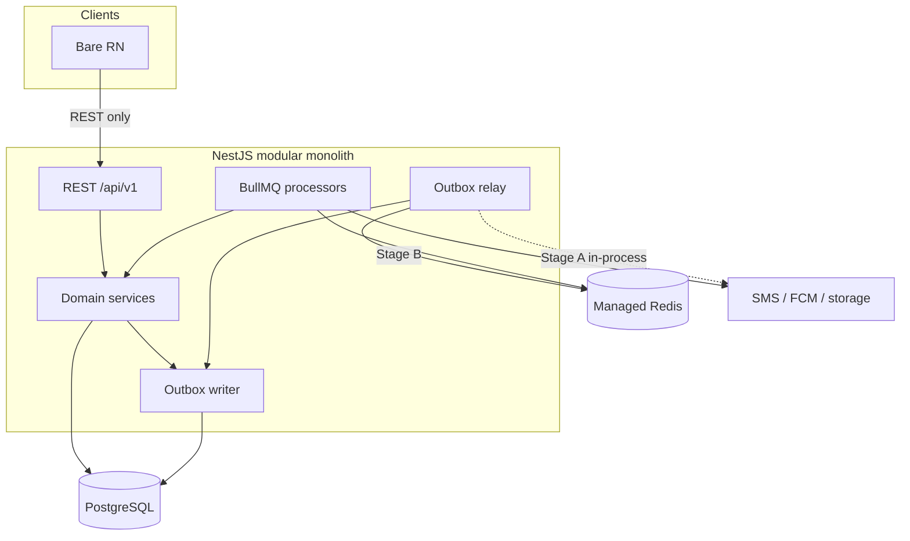

| Path | Protocol / tool |
| --- | --- |
| RN → Nest | **REST** |
| Nest module → Nest module | In-process |
| Nest → background work | Outbox → **BullMQ** (Stage B) |
| Nest → mobile realtime UX | FCM/APNs (not gRPC streams) |
| Unused by default | **gRPC**, **RabbitMQ** |

---

## 5. Logical application layers

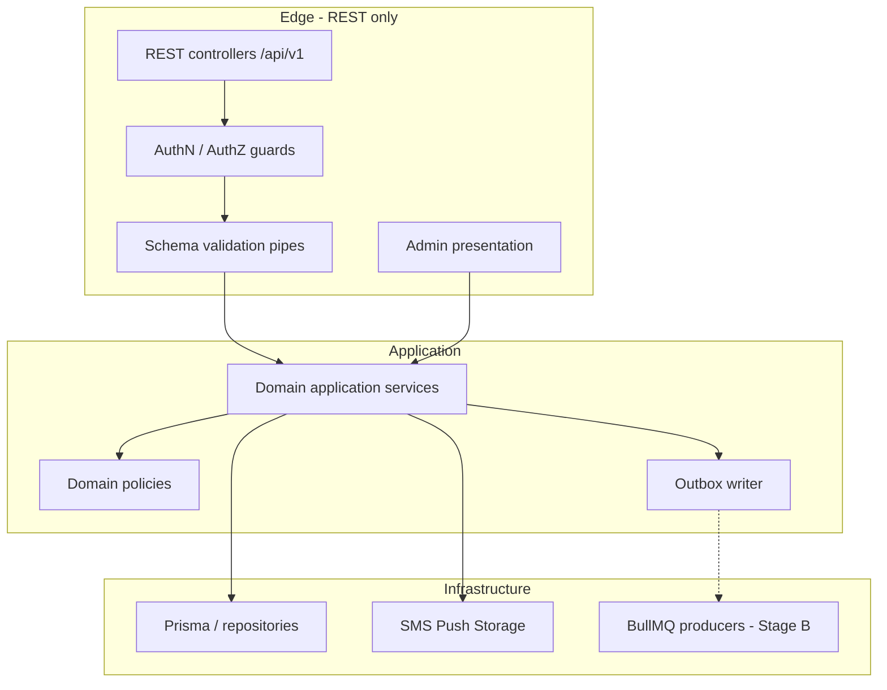

| Layer | Owns | Forbidden |
| --- | --- | --- |
| **Edge** | REST mapping, Zod validation, HTTP status, admin UI glue | gRPC controllers for mobile; business SQL |
| **Application / domain** | Use-cases, invariants, state machines, AuthZ | Enqueue without outbox; framework HTTP details |
| **Infrastructure** | Postgres, managed Redis/BullMQ, SMS, FCM, storage | Inventing product policy; RabbitMQ by default |

Module shape: [`backend/03-modular-monolith.md`](backend/03-modular-monolith.md).

---

## 6. Backend component view (modular monolith)

One Nest process hosts **REST + admin + domain modules**. Cross-module access only via `exports` (not gRPC/RabbitMQ).

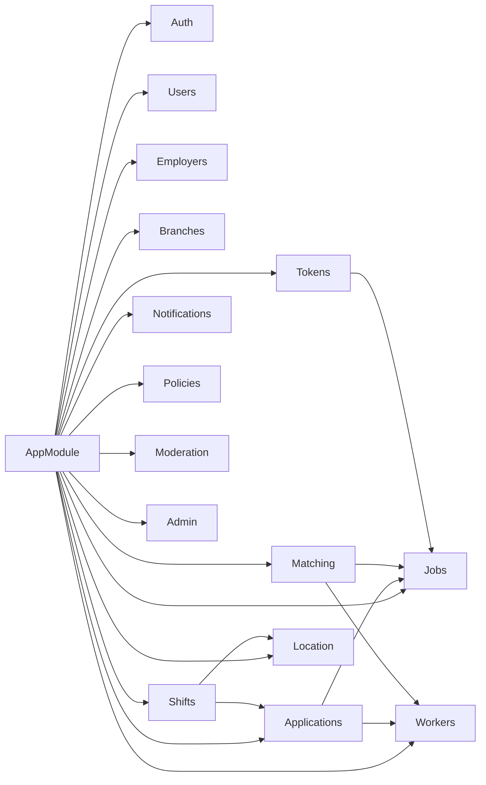

Module catalog (**final for v1**): [`backend/04-domain-modules.md`](backend/04-domain-modules.md).

**Critical invariants (server-enforced via REST → domain services):**

1. Publish requires verification + token hold capacity  
2. Matching eligibility on server; favorites-only must not leak  
3. Application / shift state machines server-side only  
4. Check-in validates assignment + geofence + time window (or manual/dispute)  
5. Token ledger ops idempotent  
6. Banned identities cannot re-register  

---

## 7. Synchronous request path (REST)

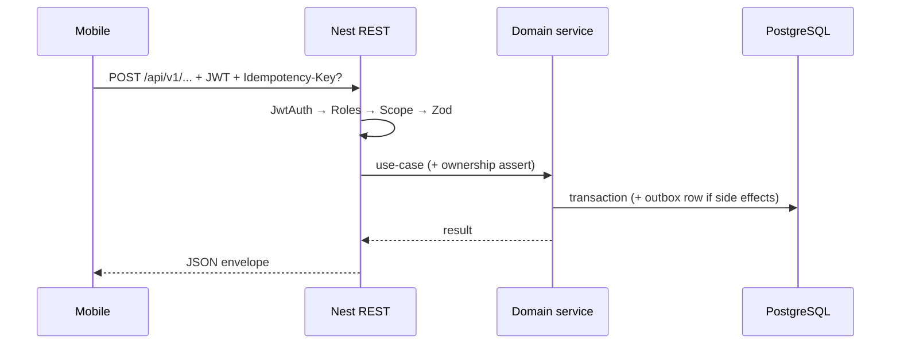

Auth pipeline detail: **§10**. No gRPC stub, no AMQP publish, on this path for the user-visible result.

---

## 8. Asynchronous path (outbox → BullMQ; not RabbitMQ)

### Stage A — locked now

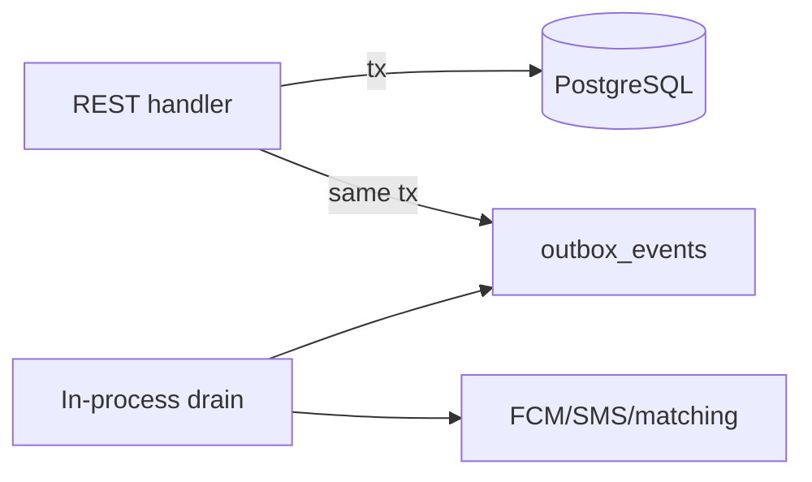

### Stage B — BullMQ (evidence-gated)

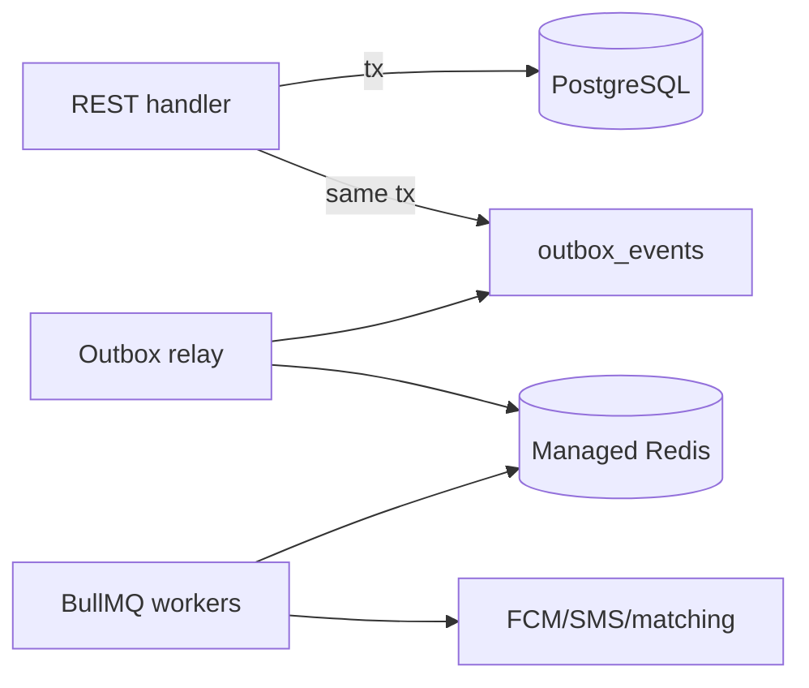

| Stage | Mechanism | Status |
| --- | --- | --- |
| A | Outbox + in-process / `@Cron` | **Locked** |
| B | Outbox relay → **BullMQ** + managed Redis | **Accepted product**, Trial until gates |
| — | **RabbitMQ** | **Hold** |
| C | Separate worker process hosting BullMQ consumers | After B still saturates API |

Docs: [08](backend/08-async-events.md) · [14](backend/14-bullmq-vs-rabbitmq.md) · [15](backend/15-redis-management.md) · FCM consumer: [20](backend/20-fcm-messaging.md).

---

## 9. Data architecture

| Concern | Choice |
| --- | --- |
| System of record | PostgreSQL 18+ (+ outbox table) |
| Access | Prisma 7+ (proposed) in backend only |
| IDs | UUIDv7 preferred for ordered entities |
| Migrations | Versioned, required in CI |
| Queue durability | Managed Redis AOF + `noeviction` (Stage B) |
| Mobile offline | Cache OK; never authoritative |

Doc: [`backend/05-data-layer.md`](backend/05-data-layer.md).

---

## 10. Auth & RBAC architecture

Identity and authorization are **server-owned**. Mobile/admin UI may hide controls by role; they never grant power. Detail: [`backend/18-auth-rbac.md`](backend/18-auth-rbac.md) · [ADR-0011](backend/adr/0011-auth-rbac.md).

### 10.1 AuthN vs AuthZ

| Layer | Question | Mechanism |
| --- | --- | --- |
| **AuthN** | Who is calling? | Phone OTP → access JWT + rotating refresh (`sid`) |
| **RBAC** | What role may call this route? | `RolesGuard` + memberships |
| **Scope** | On which org/branch/row? | Employer / branch / ownership checks |
| **Domain** | Is the transition legal? | State machines (apply, accept, check-in, …) |

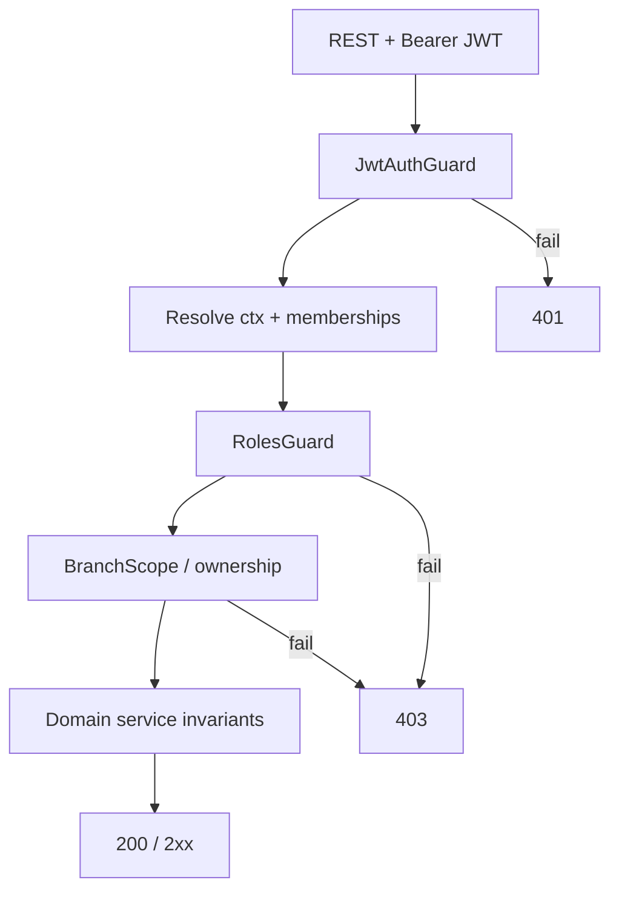

### 10.2 Identity model

| Concept | Storage |
| --- | --- |
| User | `users` — unique phone (E.164) |
| Memberships | Worker profile, `employer_memberships`, `branch_managers`, platform admin |
| Sessions | `refresh_sessions` (hashed refresh, rotation family) |
| Challenges | `otp_challenges` (hashed code, attempts, expiry) |
| Bans | `auth_bans` — phone / tax / device |

**Default (AS-3):** one account, **multiple memberships**, **context switch** — not separate logins per role.

### 10.3 Tokens & sessions

| Token | Lifetime | Notes |
| --- | --- | --- |
| Access JWT | 15–30 min | Claims: `sub`, `sid`, `ctx.role`, `ctx.employerId`, `ctx.branchIds` |
| Refresh | days, rotating | Secure store on device; reuse of rotated token → revoke family (T-247, AS-2) |

```http
POST /api/v1/auth/otp/request
POST /api/v1/auth/otp/verify
POST /api/v1/auth/token/refresh
POST /api/v1/auth/logout
GET  /api/v1/auth/contexts
POST /api/v1/auth/context
```

Clients cannot forge `ctx`; only `POST /auth/context` mints a new access token for an allowed membership.

### 10.4 Roles

| Role | Scope | Product note |
| --- | --- | --- |
| `worker` | Own profile, applications, shifts | v1 primary seeker |
| `employer` | Own org + all branches; tokens; verification | v1 primary employer |
| `manager` | Explicit `branchIds` only | AuthZ-ready; AO-11 naming open |
| `admin` | Platform-wide; audited | Nest admin UI |

### 10.5 Authorization pipeline & matrix (summary)

Every protected route: **AuthN → role → resource scope → domain rules**. List endpoints **filter in SQL** by scope (T-244, T-245, T-037).

| Capability | worker | employer | manager | admin |
| --- | --- | --- | --- | --- |
| Apply to jobs | ✓ | — | — | — |
| Review applicants | — | ✓ org | ✓ branch | ✓ |
| Create branch | — | ✓ (T-014) | — | ✓ |
| Publish job | — | ✓ if verified (T-015) | ✓ if permitted | ✓ |
| Check-in | ✓ assigned | — | — | — |
| Manual confirm attendance | — | ✓ | ✓ branch | ✓ |
| Token ledger | — | ✓ | limited | ✓ |
| Platform moderation | — | — | — | ✓ |

**Gates:** policy acceptance before session; profile complete before apply (T-010); firm verification before publish (T-015); bans block AuthN/AuthZ (T-192).

### 10.6 Nest building blocks

| Piece | Role |
| --- | --- |
| `JwtAuthGuard` | Signature, expiry, `sid` not revoked |
| `RolesGuard` + `@Roles` | Route role allow-list |
| `ContextGuard` | JWT `ctx` matches DB membership |
| `BranchScopeGuard` | `branchId` ∈ manager/employer scope |
| Domain asserts | Defense in depth on every mutation |
| Throttler | OTP request/verify, refresh, apply |

Shared packages: role/permission **enums only** — no AuthZ engine in `packages/*`.

### 10.7 Admin & abuse

- Admin uses the **same domain services**; separate platform principals; privileged actions audited.  
- OTP throttle, verify lockout, ban list, device-risk Trial (P2–P3).  
- Impersonation **Hold** unless product requires (then time-boxed + audit).

### 10.8 Delivery

| Phase | Outcomes |
| --- | --- |
| P0 | OTP + JWT + refresh; worker/employer contexts; ownership guards |
| P1 | T-014 / T-015 gates; scoped list queries |
| P2 | Manager context + `BranchScopeGuard` |
| P3 | Admin RBAC + audit; ban ops; DSR AuthZ |

Docs: [`backend/18-auth-rbac.md`](backend/18-auth-rbac.md) · [`backend/07-auth-security.md`](backend/07-auth-security.md) · [ADR-0011](backend/adr/0011-auth-rbac.md).

---

## 11. Security & privacy architecture (KVKK + GDPR)

PartOn is **Turkey-first**: **KVKK (Law 6698)** is the primary regime. Engineering implements **GDPR-ready** technical controls so EU expansion does not require a rewrite. Legal counsel owns lawful bases, VERBIS, retention durations, and policy wording — this section is **architecture only**. AuthN/AuthZ details live in **§10**.

### 11.1 Security controls

| Control | Implementation |
| --- | --- |
| AuthN | Phone OTP → JWT sessions (§10) |
| AuthZ | RBAC + branch/org scope (§10) |
| Transport | TLS for REST; TLS for Redis |
| Validation | Shared Zod schemas before domain rules |
| Jobs | No OTP/secrets/PII in BullMQ payloads — ids only |
| Surface hardening | No public gRPC; no public AMQP |
| Logging | Redact phone, tokens, geo, document contents (T-252) |

### 11.2 Privacy-by-design (KVKK primary)

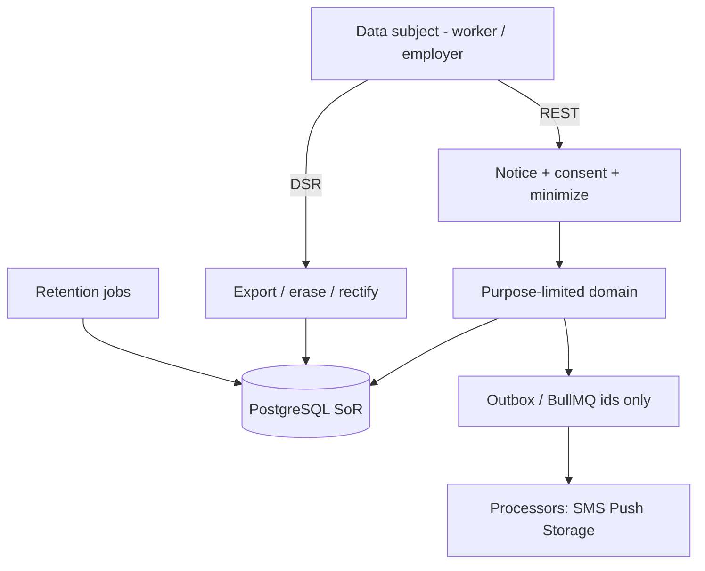

| Principle | Architectural response |
| --- | --- |
| **Aydınlatma / notice** | Versioned `policy_documents`; fetch via REST before/at collection |
| **Acceptance / açık rıza hooks** | Immutable `policy_acceptances` (version, time, channel); marketing opt-in **separate** |
| **Minimization** | Zod rejects excess fields; store only what matching/check-in/account need |
| **Purpose limitation** | Domain services tagged to purposes (auth, matching, attendance, security) |
| **Storage limitation** | Retention matrix + scheduled purge/anonymize (`privacy.retention`) |
| **Location** | Event-based check-in only — **no continuous tracks** (T-250) |
| **Ilgili kişi hakları / DSR** | Export + erasure request APIs + admin assist; portability-ready JSON |
| **Accountability** | Subprocessor register; privileged admin access audited |
| **Cross-border** | Prefer TR/EU region (AO-10); every vendor listed; no shadow processors in jobs/logs |
| **Breach readiness** | Correlation ids + ops playbook for detect/contain/notify |

### 11.3 Roles mapped to the system (privacy)

| Role | Who | Implication |
| --- | --- | --- |
| Controller (veri sorumlusu) | PartOn operating company | Owns purposes, DSR answers, notices |
| Processor (veri işleyen) | SMS, FCM/APNs, cloud, object storage, managed Redis | DPA + register; config-visible |
| Data subject | App users | Self-service + admin-assisted rights |

### 11.4 Delivery

| Phase | Privacy outcomes |
| --- | --- |
| P0–P1 | Policy accept APIs; hashed OTP/refresh; log redaction; TLS |
| P2 | Check-in geo minimization + evidence window; job payloads without PII |
| P3 | DSR export/erasure MVP; retention jobs; subprocessor register; notice updates |
| P4+ | Breach tabletop; GDPR transfer pack if EU expansion |

Docs: [`backend/17-privacy-kvkk-gdpr.md`](backend/17-privacy-kvkk-gdpr.md) · [ADR-0010](backend/adr/0010-privacy-kvkk-gdpr.md) · Auth: §10 / [`18`](backend/18-auth-rbac.md).

---

## 12. Firebase Cloud Messaging (FCM)

FCM is PartOn’s **background / OS push** channel. Business state stays in Nest + Postgres; push is a **delivery hint** with deep-link ids. Detail: [`backend/20-fcm-messaging.md`](backend/20-fcm-messaging.md) · [ADR-0013](backend/adr/0013-fcm-push.md).

### 12.1 Three delivery paths (do not conflate)

| Path | Role | When |
| --- | --- | --- |
| **REST** | Commands, inbox CRUD, token register | Always |
| **FCM** | Tray / wake / deep link | App background, killed, or OS banner |
| **SSE** | Foreground live hints | Open admin/RN connection — [19](backend/19-sse.md) / ADR-0012 |

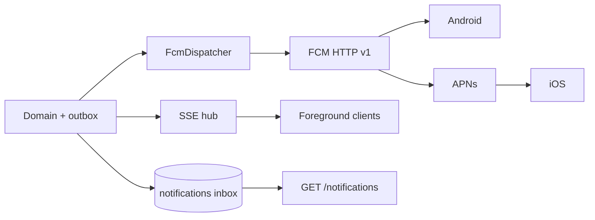

### 12.2 Provider & send stack

| Choice | Stance |
| --- | --- |
| Provider | **Firebase Cloud Messaging** only for v1 mobile push |
| iOS | FCM → **APNs** (APNs key in Firebase console) |
| API | **HTTP v1** via **Firebase Admin SDK** on Nest — **no** legacy server keys |
| SoR | Postgres `notifications` + `device_push_tokens` — **not** Firestore |
| Client | Bare RN `@react-native-firebase/messaging` — **no Expo push** |
| Job path | Outbox → dispatcher (Stage A); BullMQ `notifications` (Stage B) |

### 12.3 Token lifecycle

1. RN obtains FCM registration token (after OS permission — soft).  
2. `POST /api/v1/devices/push-tokens` with JWT (upsert; multi-device allowed).  
3. Refresh/logout → upsert or detach.  
4. On FCM `UNREGISTERED` → disable token; stop retry.

### 12.4 Dispatch invariants (CASE-NOTIFICATIONS)

| Invariant | How |
| --- | --- |
| Inbox first (T-111) | Insert `notifications` in same TX as outbox — push optional |
| No duplicates (T-110) | `dedupe_key` + outbox/job idempotency |
| Correct user (T-113) | Server-side audience only; never client-chosen recipient |
| Deep link (T-109) | `data.type` + ids → screen map; invalid → role home |
| No FCM in request | Dispatcher runs after commit |
| Minimization | Ids in payload; no OTP/secrets/precise home geo |

### 12.5 Template catalog & user experience

**User-centered catalog** (copy, timing, prefs, tone): [`shared/05-push-notifications-ux.md`](shared/05-push-notifications-ux.md) · [ADR-0021](backend/adr/0021-push-notifications-ux.md).

| `type` | Cases | User job |
| --- | --- | --- |
| `job.matched` / favorites variants | T-100, T-107–T-108, T-226 | Discover / invited work |
| `application.*` (received/accepted/rejected/revoked/closed) | T-096–T-099, T-101–T-103 | Hire / outcome clarity |
| `shift.confirm_3h` / `cannot_come` / `confirm_timeout` | T-104, T-114–T-122, T-206 | 3h availability loop |
| `shift.checkin_due` / `worker_checked_in` / manual / dispute | T-105, T-123, T-133–T-135 | Day-of check-in loop |
| `rating.pending` | T-106, T-172 | Trust loop |
| Cross-cuts | T-109–T-113, T-231 | Deep link, dedupe, inbox, audience, lag |

**Mandate:** every notify need in `parton_case_tests_tr.json` appears in [`shared/05-push-notifications-ux.md`](shared/05-push-notifications-ux.md) §0. Payload: `notification` + string `data`; high priority for shift criticals; prefs: shifts · applications · matching · favorites · marketing.

### 12.6 Nest ownership

| Piece | Responsibility |
| --- | --- |
| `notifications` module | Inbox, preferences, templates |
| `FcmDispatcher` | Token load, prefs filter, HTTP v1 send, token hygiene |
| Outbox / BullMQ | Reliable trigger — not RabbitMQ |
| Config | `FIREBASE_PROJECT_ID` + service account secret |

### 12.7 Delivery

| Phase | Outcomes |
| --- | --- |
| P0 | Token API + inbox + outbox→FCM for apply/decision |
| P1 | Matching/favorites + deep links + preferences |
| P2 | Scheduled 3h / 10m / +24h nudges |
| P3 | Admin broadcast audit; retention |
| P4 | BullMQ fan-out if needed |

Docs: [`shared/05-push-notifications-ux.md`](shared/05-push-notifications-ux.md) · [`backend/20-fcm-messaging.md`](backend/20-fcm-messaging.md) · [`backend/08-async-events.md`](backend/08-async-events.md) · [`mobile/03-flows-and-deep-links.md`](mobile/03-flows-and-deep-links.md).

---

## 13. Web UI — shadcn/ui (dark)

Platform **admin** is the locked web surface. Stack: **React + Vite**, **[shadcn/ui](https://github.com/shadcn-ui/ui)** (Tailwind + Radix, components owned in-repo), **dark theme default**, served by the **same Nest** app as `/api/v1`. Detail: [`web/04-shadcn-dark-ui.md`](web/04-shadcn-dark-ui.md) · [ADR-0014](backend/adr/0014-web-ui-shadcn-dark.md).

### 13.1 Placement

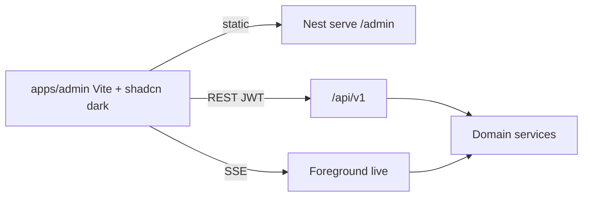

| Rule | Stance |
| --- | --- |
| Hosting | Nest serves `admin` build artifacts (ADR-0001) |
| Business rules | **Never** in the SPA — REST → guards → domain |
| Contracts | Shared Zod / `api-contracts` |
| Live updates | **SSE** — not FCM, not WebSocket |
| Employer web | Not locked v1; reuse stack if revisited |
| Rejected | AdminJS; separate Next.js admin app (v1) |

### 13.2 Stack

| Layer | Choice |
| --- | --- |
| App | React + Vite + TypeScript (`apps/admin`) |
| UI kit | **shadcn/ui** via CLI → `components/ui` |
| CSS | Tailwind + CSS variables mapped from [color system](shared/01-color-system.md) |
| Theme | **`defaultTheme="dark"`** (forest cards); light cream optional |
| Icons | `lucide-react` |
| Forms / tables | RHF + Zod; TanStack Table + shadcn patterns |
| Shell | shadcn Sidebar on `surface-level-1` |

### 13.3 Color & theme

- **Source:** [`shared/01-color-system.md`](shared/01-color-system.md) · ADR-0017.  
- Dark default: `#252823` base, `#234D3C` cards, orange `#E97A3D` primary, rust `#B94E32` destructive.  
- Light optional: cream ladder `#F3E8CF` / `#EADCC5` / `#DDD4C7`.  
- Elevation via surfaces, not heavy shadows; one primary CTA per view.

### 13.4 Screens & building blocks

Map catalog [`web/02-screen-catalog.md`](web/02-screen-catalog.md) → features (`users`, `abuse`, `catalog`, `policies`, …) using `Table`, `Sheet`, `Dialog`, `Form`, `Badge`, `Alert`, `Sonner`.

### 13.5 Delivery

| Phase | Outcomes |
| --- | --- |
| P0 | Scaffold + dark shell + login + users + abuse queue |
| P1 | Employers, catalog, policies, SSE badges, audit |
| P2 | Risk, remote config, broadcast |
| P3 | Finer admin RBAC + DSR assist UI |

Docs: [`web/04-shadcn-dark-ui.md`](web/04-shadcn-dark-ui.md) · [`web/README.md`](web/README.md).

---

## 14. Mobile UI — NativeWind + WWDC Liquid Glass

Seekers and employers use **bare React Native**. Styling engine: **[NativeWind](https://www.nativewind.dev/)**. Design language on iOS: **Liquid Glass principles** from Apple / WWDC (UI chrome vs content; brand in content) — not a SwiftUI rewrite. Detail: [`mobile/04-nativewind-ui.md`](mobile/04-nativewind-ui.md) · [`mobile/05-wwdc-liquid-glass.md`](mobile/05-wwdc-liquid-glass.md) · ADR-0015 / [0016](backend/adr/0016-mobile-ui-wwdc-liquid-glass.md).

### 14.1 Stack

| Layer | Choice |
| --- | --- |
| App | Bare RN (owned `ios/` + `android/`) — ADR-0006 |
| Styling | **NativeWind** v4.x stable at scaffold; v5 Assess |
| Design language (iOS) | **Liquid Glass principles** — ADR-0016 |
| Metro | `withNativeWind(config, { input: "./global.css" })` |
| Navigation | React Navigation (prefer translucent chrome on iOS) |
| Primitives | `src/components/ui` + Tailwind; solid **content** cards |
| Theme | `system` default + override; cream light / forest dark — [color system](shared/01-color-system.md) |
| Colors | Shared tokens ADR-0017 (`surface-*`, `action-*`, `feedback-*`) |
| Optional kit | React Native Reusables — **Trial** |

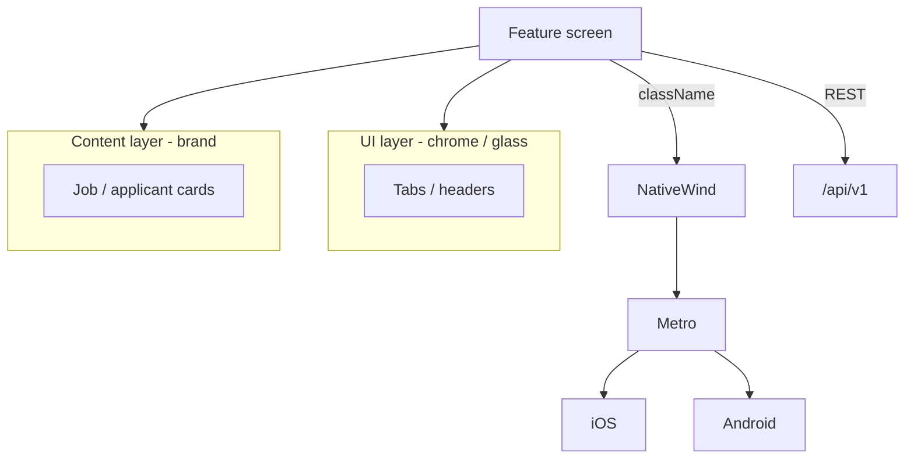

### 14.2 NativeWind rules

| Do | Don’t |
| --- | --- |
| Prefer `className` on RN views | Make Expo a dependency for styling |
| Shared color tokens (`bg-surface-base`, `bg-action-primary`) | Raw hex in feature screens |
| Same token **names** as admin | Import shadcn DOM components into RN |
| `StyleSheet` for rare escapes | StyleSheet as the primary system |

### 14.3 WWDC / Liquid Glass rules

| Do | Don’t |
| --- | --- |
| Keep glass/translucency on **nav & controls** | Frost every job card / map |
| Put PartOn brand in **content** (WWDC26) | Paint tab bars with heavy brand fill |
| Solid fallbacks for Reduce Transparency | Ignore Increase Contrast / Dark Mode |
| Material chrome on Android | Fake iOS glass on Android |
| Layered app icon for modern iOS | Single flat icon forever |

Apple refs: [Adopting Liquid Glass](https://developer.apple.com/documentation/TechnologyOverviews/adopting-liquid-glass) · WWDC26 [brand on iOS](https://developer.apple.com/videos/play/wwdc2026/251/).

### 14.4 Delivery

| Phase | Outcomes |
| --- | --- |
| P0 | NativeWind scaffold; UI vs content layering; translucent tabs; solid cards |
| P1 | Brand content moments; accent discipline; feed/list primitives |
| P2 | Theme setting; blur chrome Trial; check-in high-contrast; icon variants |
| Later | Optional shared tokens; assess native `UIGlassEffect` bridge |

Docs: [`mobile/04-nativewind-ui.md`](mobile/04-nativewind-ui.md) · [`mobile/05-wwdc-liquid-glass.md`](mobile/05-wwdc-liquid-glass.md) · [`mobile/README.md`](mobile/README.md).

---

## 15. Client architecture

| Client | Stack | Talks via |
| --- | --- | --- |
| Job seeker / employer | **Bare RN + NativeWind + Liquid Glass principles** (§14) | **REST `/api/v1`** + **FCM** + optional **SSE** |
| Platform admin | **Vite + shadcn/ui (dark)** (§13) | **REST `/api/v1`** + **SSE** |
| Employer web console | Not locked for v1 (still catalogued for case coverage) | — |

**Forbidden on mobile:** Expo (incl. Expo push/Router), gRPC clients, Prisma, direct Redis/RabbitMQ, StyleSheet-only as architecture.  
**Forbidden on admin web:** Domain/Prisma in the SPA; AdminJS; Expo; treating UI as AuthZ.

### 15.1 Case → UI coverage (mandatory)

Every capability in [`parton_case_tests_tr.json`](../parton_case_tests_tr.json) (248 cases) **must** have:

1. At least one **screen** (mobile and/or web/admin) or named system surface owned by a screen.  
2. **Named components** from [`shared/02-ui-components.md`](shared/02-ui-components.md).  
3. Traceability: case IDs on screen docs.

| Doc | Role |
| --- | --- |
| [`cases/03-ui-coverage-mandate.md`](cases/03-ui-coverage-mandate.md) | Group → screens → components gate |
| [`mobile/02-screen-catalog.md`](mobile/02-screen-catalog.md) | Mobile inventory (~74) |
| [`web/02-screen-catalog.md`](web/02-screen-catalog.md) | Web/admin inventory (~47) |

**Gate:** Nest rule for a `T-###` without the mapped screen/component is incomplete.

### 15.2 Client security (Web + Mobile)

Best practical baseline — [ADR-0018](backend/adr/0018-client-security.md) · [`backend/21-client-security.md`](backend/21-client-security.md). Complements Auth/RBAC (§10); does not replace Nest AuthZ.

| Topic | Mobile | Web (admin / employer console) |
| --- | --- | --- |
| Access JWT | Process **memory** | Process **memory** |
| Refresh | **Keychain / Keystore** | **`HttpOnly` + `Secure` + `SameSite=Strict` cookie** |
| CSRF | N/A (Bearer) | Required on cookie refresh/logout |
| TLS | 1.2+; pinning **Trial** | TLS + HSTS + CSP / frame denial |
| AuthZ | Nest only | Nest only |
| Docs | Signed URLs | Signed URLs |
| Forbidden | AsyncStorage refresh; tokens in deep links; secrets in bundle | localStorage refresh; UI-as-AuthZ |

### 15.3 Screen UX & layout

Best experience for catalog screens — [ADR-0019](backend/adr/0019-screen-ux-layout.md) · [`shared/03-screen-ux-layout.md`](shared/03-screen-ux-layout.md).

| Rule | Practice |
| --- | --- |
| Recipes | **R1–R8** (tab root, detail, wizard, confirm, day-of, settings, admin, blocker) |
| CTA | One `action-primary` per viewport |
| Components | Named set in [`shared/02-ui-components.md`](shared/02-ui-components.md) |
| States | loading / empty / error / blocked with next step |
| CASE-UX | T-235–T-243 mapped to recipes (feed, check-in, permission, tokens, …) |
| Spec fields | Recipe + Primary CTA + Components + States on every screen note |

### 15.4 Wizard / multi-step form state

Back must not wipe answers — [ADR-0020](backend/adr/0020-wizard-state.md) · [`shared/04-wizard-state.md`](shared/04-wizard-state.md).

| Rule | Practice |
| --- | --- |
| Required | Lift values to **`WizardShell`** (controlled steps) |
| Multi-route steps | Scoped **Zustand** or Context store per wizard instance |
| Durable (create job) | **Nest draft** via REST; client cache optional only |
| Forbidden | Step-only `useState` as SoR; hide-only / keep-alive as sole fix |
| Inventory | Create job, worker/employer onboarding, short top-up wizards |

### 15.5 Accessibility (WCAG)

Web **WCAG 2.2 AA**; mobile equivalent AA outcomes — [ADR-0022](backend/adr/0022-accessibility-wcag.md) · [`shared/06-accessibility-wcag.md`](shared/06-accessibility-wcag.md).

| Rule | Practice |
| --- | --- |
| Contrast | 4.5:1 text / 3:1 UI via color tokens (light + dark) |
| Chrome | Glass only with solid Reduce Transparency fallback |
| Day-of | High-contrast solid check-in / 3h CTAs |
| Web | Keyboard + focus visible + Radix names/roles |
| Mobile | Labels, 44pt targets, Dynamic Type, VO/TalkBack on P0 |
| Gate | P0 screens a11y-complete before ship |

### 15.6 Internationalization (i18n)

**Turkish (`tr-TR`) primary** — [ADR-0023](backend/adr/0023-i18n-turkish-primary.md) · [`shared/07-i18n.md`](shared/07-i18n.md).

| Rule | Practice |
| --- | --- |
| Default locale | `tr-TR` |
| Secondary | `en` (same keys; fill over time) |
| Copy | Locale catalogs — no hardcoded UI strings |
| API | English `error.code`; localized `error.message` |
| Format | `Intl` + TRY + `Europe/Istanbul` display |
| Push/SMS | Recipient locale → TR default |
| Hold | RTL / extra languages until market ADR |

### 15.7 Fluid routing

**React Navigation (native stack + tabs) on mobile · React Router on admin SPA** — [ADR-0024](backend/adr/0024-fluid-routing.md) · [`shared/08-routing.md`](shared/08-routing.md).

| Rule | Practice |
| --- | --- |
| Mobile | Native stack + bottom tabs; `react-native-screens`; Expo Router **Hold** |
| Deep links / push | Linking config + `DeepLinkRouter`; gates: session → role → onboarding → AuthZ → screen |
| Fluid | Platform transitions; Reduce Motion; preserve tab stacks |
| Web | React Router data APIs; nested layouts; Nest serves SPA |
| Hold | Next App Router for admin · HashRouter default · JS stack as primary |
| IDs | `m.*` / `w.*` canonical; wizard draft outside URL (ADR-0020) |

### 15.8 Modern UI principles (September 2026)

**Chrome vs content · surface elevation · one CTA · calm density · anti-AI-generic** — [ADR-0025](backend/adr/0025-modern-ui-principles.md) · [`shared/09-modern-ui-principles.md`](shared/09-modern-ui-principles.md).

| Rule | Practice |
| --- | --- |
| Snapshot | September 2026 bar (P1–P12); revise only via new ADR |
| Layers | Translucent chrome; solid branded content |
| Elevation | Surface ladder; shadows secondary |
| Motion | Purposeful; Reduce Motion first-class |
| Platform | iOS Liquid Glass · Android M3 Expressive · admin dense dark |
| Hold | Purple glow, glass-on-cards, pill decoration, emoji chrome |

### 15.9 Modern UX principles (September 2026)

**Outcome-first · time-to-value · honest permissions/costs · continuity · calm attention** — [ADR-0026](backend/adr/0026-modern-ux-principles.md) · [`shared/10-modern-ux-principles.md`](shared/10-modern-ux-principles.md).

| Rule | Practice |
| --- | --- |
| Snapshot | September 2026 bar (X1–X12); revise only via new ADR |
| Split | UX = behavior (this); UI = look (ADR-0025) |
| Cases | CASE-UX T-235–T-243 map to X-principles |
| Continuity | Wizard Back, deep links, drafts (ADR-0020 / 0024) |
| Attention | Inbox-first push; no engagement spam (ADR-0021) |
| Hold | Dark patterns, silent disables, 10+ step onboarding |

### 15.10 API contracts

**Envelope + Zod 4 + cursor pagination** — [ADR-0027](backend/adr/0027-api-contracts-baseline.md) · [`shared/12-api-contracts.md`](shared/12-api-contracts.md).

| Rule | Practice |
| --- | --- |
| Success | `{ data, meta }` with `requestId` |
| Error | `{ error: { code, message, details? }, meta }` — EN code, TR message default |
| Feeds | Cursor; admin may use offset |
| Validation | Zod in `packages/api-contracts`; Nest before domain |
| Idempotency | `Idempotency-Key` on critical POSTs |

---

## 16. Cross-cutting concerns

| Concern | Approach |
| --- | --- |
| Correlation | `X-Request-Id` on REST; propagate into outbox/BullMQ/`event_id` for FCM |
| Observability | Logs + OTel; FCM success/fail/disabled-token rates; queue depth Stage B; **PII redaction** |
| Idempotency | REST `Idempotency-Key` + notification `dedupe_key` + job consumers |
| Config | `DATABASE_URL`, `REDIS_QUEUE_URL` (Stage B), JWT/SMS/**Firebase** secrets; subprocessor env visibility |
| Auth / RBAC | OTP + JWT + role/branch scope — §10 |
| Client security | Memory access + Keychain / HttpOnly refresh — §15.2 · ADR-0018 |
| Screen UX | Layout recipes R1–R8 — §15.3 · ADR-0019 |
| Wizard state | WizardShell + scoped store + Nest draft — §15.4 · ADR-0020 |
| Accessibility | WCAG 2.2 AA (web) + mobile equivalent — §15.5 · ADR-0022 |
| i18n | Turkish (`tr-TR`) primary — §15.6 · ADR-0023 |
| Routing | React Navigation + React Router — §15.7 · ADR-0024 |
| UI principles | Sept 2026 modern bar (P1–P12) — §15.8 · ADR-0025 |
| UX principles | Sept 2026 experience bar (X1–X12) — §15.9 · ADR-0026 |
| API contracts | Envelope / Zod / cursor — §15.10 · ADR-0027 |
| NFRs / SLOs | Proposed targets — [05](05-quality-nfr.md) |
| Testing | Case-driven pyramid — [06](06-testing-strategy.md) |
| Ops / envs | Health, deploy, secrets — [07](07-environments-and-ops.md) |
| Privacy | KVKK/GDPR controls — §11; FCM = processor |
| Push | FCM background — §12; SSE foreground — [19](backend/19-sse.md) |
| Admin Web UI | shadcn/ui dark — §13 |
| Mobile UI | NativeWind + WWDC Liquid Glass principles — §14 |
| Acceptance | `CASE-*` ↔ REST paths ↔ modules ↔ **screens + components** |

---

## 17. Evolution roadmap (architecture)

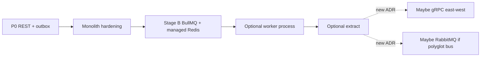

| Step | Add | Still forbidden |
| --- | --- | --- |
| Now | **REST** + outbox | gRPC to clients; RabbitMQ; BullMQ without evidence |
| Stage B | **BullMQ** + managed Redis | RabbitMQ as default; LRU Redis for queues |
| Extract | Optional internal deployables | Dual REST+gRPC public edge without ADR |
| Later | Possible **gRPC** east-west and/or **RabbitMQ** | gRPC to mobile without superseding ADR-0004/0009 |

Product phases: [`02-product-roadmap.md`](02-product-roadmap.md).

---

## 18. Architecture decision index (quick)

| ID | Decision | Status |
| --- | --- | --- |
| [0001](backend/adr/0001-nestjs-modular-monolith.md) | Nest modular monolith (API + admin) | accepted |
| [0002](backend/adr/0002-postgresql-owned-db.md) | PostgreSQL SoR | accepted |
| [0003](backend/adr/0003-orm-choice.md) | Prisma latest stable on PG 18 | accepted |
| [0004](backend/adr/0004-rest-json-api.md) | **REST** `/api/v1` public API | accepted |
| [0005](backend/adr/0005-monorepo.md) | Monorepo apps + packages | accepted |
| [0006](backend/adr/0006-bare-react-native-no-expo.md) | Bare RN; Expo forbidden | accepted |
| [0007](backend/adr/0007-bullmq-over-rabbitmq.md) | **BullMQ** over **RabbitMQ** | accepted |
| [0008](backend/adr/0008-managed-redis.md) | Managed Redis for BullMQ | accepted |
| [0009](backend/adr/0009-rest-vs-grpc.md) | **REST** edge; no client **gRPC** | accepted |
| [0010](backend/adr/0010-privacy-kvkk-gdpr.md) | **KVKK** primary; GDPR-ready privacy-by-design | accepted |
| [0011](backend/adr/0011-auth-rbac.md) | **OTP + JWT** AuthN; **RBAC + scope** AuthZ | accepted |
| [0012](backend/adr/0012-sse-foreground-realtime.md) | **SSE** foreground realtime (not WebSocket) | accepted |
| [0013](backend/adr/0013-fcm-push.md) | **FCM** mobile push (HTTP v1 + inbox/outbox) | accepted |
| [0014](backend/adr/0014-web-ui-shadcn-dark.md) | **Vite + shadcn/ui dark** admin Web UI | accepted |
| [0015](backend/adr/0015-mobile-ui-nativewind.md) | **NativeWind** bare RN mobile UI | accepted |
| [0016](backend/adr/0016-mobile-ui-wwdc-liquid-glass.md) | **Liquid Glass / WWDC** principles on mobile | accepted |
| [0017](backend/adr/0017-color-system.md) | **Shared color tokens** (Web + Mobile) | accepted |
| [0018](backend/adr/0018-client-security.md) | **Client security** (Web + Mobile sessions / TLS / CSRF) | accepted |
| [0019](backend/adr/0019-screen-ux-layout.md) | **Screen UX & layout** recipes (CASE-UX) | accepted |
| [0020](backend/adr/0020-wizard-state.md) | **Wizard state** (lift / scoped store / Nest draft) | accepted |
| [0021](backend/adr/0021-push-notifications-ux.md) | **User-centered push** (templates / prefs / deep links) | accepted |
| [0022](backend/adr/0022-accessibility-wcag.md) | **Accessibility** WCAG 2.2 AA (Web + Mobile) | accepted |
| [0023](backend/adr/0023-i18n-turkish-primary.md) | **i18n** Turkish (`tr-TR`) primary | accepted |
| [0024](backend/adr/0024-fluid-routing.md) | **Fluid routing** React Navigation + React Router | accepted |
| [0025](backend/adr/0025-modern-ui-principles.md) | **Modern UI principles** (September 2026) | accepted |
| [0026](backend/adr/0026-modern-ux-principles.md) | **Modern UX principles** (September 2026) | accepted |
| [0027](backend/adr/0027-api-contracts-baseline.md) | **API contracts** (envelope / Zod / pagination) | accepted |
| [0028](backend/adr/0028-latest-stable-stack.md) | **Latest stable** stack within ADR fences | accepted |
| [0029](backend/adr/0029-dual-platform-ios-android.md) | **Dual-platform** latest iOS & Android | accepted |
| [0030](backend/adr/0030-fastlane-mobile-release.md) | **Fastlane** mobile build & store release | accepted |
| [0031](backend/adr/0031-pm2-web-process-manager.md) | **PM2** Nest web process manager | accepted |
| [0032](backend/adr/0032-nginx-reverse-proxy.md) | **NGINX** reverse proxy / TLS | accepted |
| [0033](backend/adr/0033-marketing-site.md) | **Marketing site** (public Vite) | accepted |
| [0034](backend/adr/0034-admin-full-case-coverage.md) | **Admin** covers all CASE-* domains | accepted |
| [0035](backend/adr/0035-admin-devops-error-tracking.md) | **Admin DevOps** errors & releases | accepted |
| [0036](backend/adr/0036-admin-devops-mcp.md) | **Admin DevOps MCP** for AI agents | accepted |
| [0037](backend/adr/0037-legal-audit-logger.md) | **Legal audit logger** + admin CSV/PDF | accepted |
| [0038](backend/adr/0038-monorepo-tooling.md) | **pnpm + Turborepo** + locked packages | accepted |
| [0039](backend/adr/0039-design-md.md) | **DESIGN.md** visual SoR (Stitch / awesome-design-md) | accepted |

---

## 19. Review checklist (PRs / design reviews)

- [ ] Business rule in Nest domain service (not RN / not admin SPA)  
- [ ] New public capability is **REST** `/api/v1` + shared schema — **not gRPC**  
- [ ] Cross-module use via `exports` — **not** gRPC/RabbitMQ inside the monolith  
- [ ] Side effects: outbox (A) or outbox→**BullMQ** (B) — **not** raw RabbitMQ publish  
- [ ] No dual-write Redis without outbox; queue Redis stays `noeviction` + AOF  
- [ ] No Expo / no client gRPC / no Prisma in mobile  
- [ ] Mobile UI: prefer **NativeWind** `className`; semantic tokens; no Expo for styling  
- [ ] Mobile UI: glass/translucency on **chrome only**; solid content; a11y solid fallback; no fake glass on Android  
- [ ] Colors: only [shared/01-color-system](shared/01-color-system.md) tokens — no ad-hoc palette; one primary CTA  
- [ ] Admin UI: shadcn primitives mapped to PartOn surfaces/actions; no domain logic in Vite  
- [ ] Protected route has AuthN + role + **resource scope** (not UI-only AuthZ)  
- [ ] List queries filtered by employer/branch/ownership in SQL  
- [ ] New notify: inbox + outbox before **FCM**; `dedupe_key`; server-side audience (T-110–T-113)  
- [ ] FCM payload: ids only; no OTP/secrets; deep-link `type` documented  
- [ ] Push template matches [user-centered catalog](shared/05-push-notifications-ux.md) (copy, category, collapse, tap target)  
- [ ] Notify-related `T-###` listed in push catalog §0 matrix (no orphan cases)  
- [ ] Token register/unregister on login/logout/refresh  
- [ ] New personal data fields classified; purpose + retention considered (KVKK)  
- [ ] No PII/OTP in logs, OpenAPI examples, or BullMQ/outbox payloads  
- [ ] Policy/consent impact? Update `policies` version or preferences — do not overload TOS  
- [ ] New vendor/subprocessor? Register + region noted  
- [ ] Related `CASE-*` / `T-###` in PR  
- [ ] Case feature has **screen ID(s)** + **named components** ([UI mandate](cases/03-ui-coverage-mandate.md))  
- [ ] Client security: no refresh in AsyncStorage/localStorage; web CSRF if cookie refresh; no secrets in bundles ([21](backend/21-client-security.md))  
- [ ] Screen UX: layout **recipe**, one primary CTA, named components, loading/empty/error/blocked ([03](shared/03-screen-ux-layout.md))  
- [ ] Wizards: values in **WizardShell**/scoped store; Back restores fields; Nest draft when required ([04](shared/04-wizard-state.md))  
- [ ] A11y: contrast tokens; labeled controls; keyboard (web); no glass on critical CTAs ([06](shared/06-accessibility-wcag.md))  
- [ ] i18n: no hardcoded UI copy; `tr-TR` key present; `error.code` EN / message localized ([07](shared/07-i18n.md))  
- [ ] Routing: native stack + tabs (mobile); React Router layouts (admin); deep links through gate pipeline ([08](shared/08-routing.md))  
- [ ] UI principles: one job/CTA; chrome vs content; no anti-patterns; checklist ([09](shared/09-modern-ui-principles.md))  
- [ ] UX principles: next action clear; honest gates; continuity; CASE-UX map ([10](shared/10-modern-ux-principles.md))  
- [ ] API: `{data,meta}` / `{error,meta}`; new `error.code` in catalog; Zod schema ([12](shared/12-api-contracts.md))  
- [ ] Tests: case tags; domain/API/UI layers ([06-testing-strategy](06-testing-strategy.md))  
- [ ] No mocks: real SMS/FCM/storage/DB paths; no Noop/Console providers ([agents/08](agents/08-no-mocks-fully-functional.md))  
- [ ] Latest stable: Nest 12 / TS 6 / current Node LTS; RN/Zod/Prisma verified via registry ([agents/09](agents/09-latest-stack-policy.md) · ADR-0028)  
- [ ] Mobile: iOS **and** Android builds; latest OS QA; `PLATFORM.md` mins/targets ([mobile/06](mobile/06-ios-android-platforms.md) · ADR-0029)  
- [ ] Mobile release: **Fastlane** lanes (ios/android beta+release); no EAS ([mobile/07](mobile/07-fastlane.md) · ADR-0030)  
- [ ] Web staging/prod: **PM2** ecosystem for Nest; `instances: 1` until SSE scale ([web/05](web/05-pm2.md) · ADR-0031)  
- [ ] Web edge: **NGINX** templates; TLS; SSE `proxy_buffering off` ([web/06](web/06-nginx.md) · ADR-0032)  
- [ ] Marketing: production `apps/marketing` — all `w.public.*` + prerender/SEO; no MVP gaps/stubs ([web/07](web/07-marketing.md) · ADR-0033)  
- [ ] Admin: every CASE-* group has `w.admin.*` ops surface ([web/08](web/08-admin-case-coverage.md) · ADR-0034)  
- [ ] Admin DevOps: error triage (all apps) + releases + services ([web/09](web/09-admin-devops.md) · ADR-0035)  
- [ ] Admin DevOps MCP: authenticated tools → Nest devops APIs ([web/10](web/10-devops-mcp.md) · ADR-0036)  
- [ ] Legal audit: append-only logger + admin CSV **and** PDF reports ([backend/22](backend/22-legal-audit-logger.md) · [web/11](web/11-legal-audit-reports.md) · ADR-0037)  
- [ ] Production-ready: no MVP stubs / eng TODOs; pnpm+Turborepo; Prisma SoR ([agents/10](agents/10-production-ready.md) · ADR-0038/0003)  
- [ ] UI from [`DESIGN.md`](DESIGN.md) tokens/rules (ADR-0039); no purple-glow / invented palette  

---

## 20. Document map

| Need | Go to |
| --- | --- |
| Full documentation index | [`DOC-INDEX.md`](DOC-INDEX.md) |
| Doc cohesion (hubs/spokes) | [`DOC-COHESION.md`](DOC-COHESION.md) |
| AI agent build pack | [`AGENTS.md`](AGENTS.md) · [07](agents/07-anti-hallucination.md) · [08](agents/08-no-mocks-fully-functional.md) · [09 latest](agents/09-latest-stack-policy.md) |
| Latest stable stack | [ADR-0028](backend/adr/0028-latest-stable-stack.md) · [radar](03-tech-radar-2026.md) |
| This overview (clients, Auth, FCM, Web/Mobile UI, privacy) | **You are here** — §0, §4, §10–§15 |
| Client security (Web + Mobile) | [`backend/21-client-security.md`](backend/21-client-security.md) · §15.2 |
| Screen UX & layout recipes | [`shared/03-screen-ux-layout.md`](shared/03-screen-ux-layout.md) · §15.3 |
| Wizard / multi-step state | [`shared/04-wizard-state.md`](shared/04-wizard-state.md) · §15.4 |
| Accessibility (WCAG) | [`shared/06-accessibility-wcag.md`](shared/06-accessibility-wcag.md) · §15.5 |
| i18n (Turkish primary) | [`shared/07-i18n.md`](shared/07-i18n.md) · §15.6 |
| Fluid routing | [`shared/08-routing.md`](shared/08-routing.md) · §15.7 |
| Modern UI principles (Sept 2026) | [`shared/09-modern-ui-principles.md`](shared/09-modern-ui-principles.md) · §15.8 |
| Modern UX principles (Sept 2026) | [`shared/10-modern-ux-principles.md`](shared/10-modern-ux-principles.md) · §15.9 |
| API contracts (envelope / Zod) | [`shared/12-api-contracts.md`](shared/12-api-contracts.md) · §15.10 |
| Glossary | [`shared/11-glossary.md`](shared/11-glossary.md) |
| NFRs / proposed SLOs | [`05-quality-nfr.md`](05-quality-nfr.md) |
| Testing strategy | [`06-testing-strategy.md`](06-testing-strategy.md) |
| Environments & ops | [`07-environments-and-ops.md`](07-environments-and-ops.md) |
| Case → UI screens + components | [`cases/03-ui-coverage-mandate.md`](cases/03-ui-coverage-mandate.md) |
| UI component inventory | [`shared/02-ui-components.md`](shared/02-ui-components.md) |
| Color system (Web + Mobile) | [`shared/01-color-system.md`](shared/01-color-system.md) |
| Mobile UI (NativeWind) | [`mobile/04-nativewind-ui.md`](mobile/04-nativewind-ui.md) |
| Mobile UI (WWDC Liquid Glass) | [`mobile/05-wwdc-liquid-glass.md`](mobile/05-wwdc-liquid-glass.md) |
| iOS + Android platforms (latest) | [`mobile/06-ios-android-platforms.md`](mobile/06-ios-android-platforms.md) · ADR-0029 |
| Fastlane (mobile release) | [`mobile/07-fastlane.md`](mobile/07-fastlane.md) · ADR-0030 |
| PM2 (web process manager) | [`web/05-pm2.md`](web/05-pm2.md) · ADR-0031 |
| NGINX (web edge) | [`web/06-nginx.md`](web/06-nginx.md) · ADR-0032 |
| Marketing site | [`web/07-marketing.md`](web/07-marketing.md) · ADR-0033 |
| Admin × case coverage | [`web/08-admin-case-coverage.md`](web/08-admin-case-coverage.md) · ADR-0034 |
| Admin DevOps (errors/releases) | [`web/09-admin-devops.md`](web/09-admin-devops.md) · ADR-0035 |
| Admin DevOps MCP | [`web/10-devops-mcp.md`](web/10-devops-mcp.md) · ADR-0036 |
| Legal audit logger | [`backend/22-legal-audit-logger.md`](backend/22-legal-audit-logger.md) · ADR-0037 |
| Legal audit reports (admin) | [`web/11-legal-audit-reports.md`](web/11-legal-audit-reports.md) · ADR-0037 |
| Production-ready coding gate | [`agents/10-production-ready.md`](agents/10-production-ready.md) |
| Monorepo tooling | [ADR-0038](backend/adr/0038-monorepo-tooling.md) |
| DESIGN.md (visual SoR) | [`DESIGN.md`](DESIGN.md) · [ADR-0039](backend/adr/0039-design-md.md) |
| Admin Web UI (shadcn dark) | [`web/04-shadcn-dark-ui.md`](web/04-shadcn-dark-ui.md) |
| Push UX (user-centered) | [`shared/05-push-notifications-ux.md`](shared/05-push-notifications-ux.md) |
| FCM push architecture | [`backend/20-fcm-messaging.md`](backend/20-fcm-messaging.md) |
| SSE foreground realtime | [`backend/19-sse.md`](backend/19-sse.md) |
| Auth & RBAC detail | [`backend/18-auth-rbac.md`](backend/18-auth-rbac.md) |
| KVKK / GDPR privacy architecture | [`backend/17-privacy-kvkk-gdpr.md`](backend/17-privacy-kvkk-gdpr.md) |
| REST conventions | [`backend/06-api-conventions.md`](backend/06-api-conventions.md) |
| REST vs gRPC detail | [`backend/16-rest-vs-grpc.md`](backend/16-rest-vs-grpc.md) |
| BullMQ vs RabbitMQ detail | [`backend/14-bullmq-vs-rabbitmq.md`](backend/14-bullmq-vs-rabbitmq.md) |
| Redis ops for BullMQ | [`backend/15-redis-management.md`](backend/15-redis-management.md) |
| Auth & security | [`backend/07-auth-security.md`](backend/07-auth-security.md) |
| Location minimization | [`backend/13-location-policy.md`](backend/13-location-policy.md) |
| Async stages | [`backend/08-async-events.md`](backend/08-async-events.md) |
| Mobile deep links | [`mobile/03-flows-and-deep-links.md`](mobile/03-flows-and-deep-links.md) |
| Mobile screens index | [`mobile/README.md`](mobile/README.md) |
| Web / admin screens | [`web/README.md`](web/README.md) |
| Product + stack | [`00-product-and-stack.md`](00-product-and-stack.md) |
| Locked / open | [`01-architecture-decisions.md`](01-architecture-decisions.md) |
| Delivery phases | [`02-product-roadmap.md`](02-product-roadmap.md) |
| Tech radar | [`03-tech-radar-2026.md`](03-tech-radar-2026.md) |
| Backend index | [`backend/README.md`](backend/README.md) |
| Cases | [`cases/README.md`](cases/README.md) |
