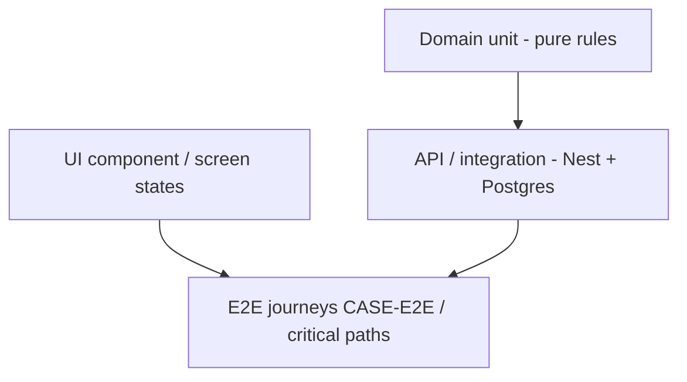

# 06 — Testing strategy (case-driven)

**Status:** `accepted` (strategy)  
**Last updated:** 2026-10-09  
**Acceptance SoR:** [`../parton_case_tests_tr.json`](../parton_case_tests_tr.json) · [`cases/`](cases/)  
**Architecture:** [`04-application-architecture.md`](04-application-architecture.md)  
**Index:** [`DOC-INDEX.md`](DOC-INDEX.md)

> Every `T-###` is an **acceptance obligation**. Tests prove Nest rules, REST contracts, and UI states — not Firebase leftovers.

---

## 1. Pyramid

| Layer | Owns | Tools (proposed) |
| --- | --- | --- |
| **Domain unit** | Matching filters, token ledger math, geofence, state machines (pure — **no mocks**) | Vitest / Jest |
| **API integration** | REST + AuthZ + **real Postgres** + outbox | Nest testing module + Compose/testcontainers |
| **Contract** | Zod schemas ↔ fixtures | `api-contracts` tests |
| **UI unit** | Components, recipes, a11y labels | RN Testing Library / Vitest (admin) |
| **E2E** | J1–Jn journeys against running API | Detox/Maestro (mobile); Playwright (admin) |
| **Perf** | CASE-PERF | k6/Artillery against staging |
| **Providers** | SMS/FCM sandbox calls (rate-limited) | Real sandbox — **no Noop** ([agents/08](agents/08-no-mocks-fully-functional.md)) |

---

## 2. Traceability rules

| Rule | Detail |
| --- | --- |
| Case ID in test name/tag | `@T-080`, `@CASE-TOKEN` |
| Nest PR | Domain/API tests for touched rules |
| UI PR | State tests (loading/empty/error/blocked) + recipe |
| Notify | Outbox + inbox + FCM sandbox send (or recorded provider message id) |
| Gap cases | Mark `skip` + link gap id until product fork closes |
| Matrix | Update [`cases/00-coverage-matrix`](cases/00-coverage-matrix.md) when coverage level changes |

Incomplete: Nest green without mapped screen/components ([UI mandate](cases/03-ui-coverage-mandate.md)).

---

## 3. What to test per concern

| Concern | Must assert |
| --- | --- |
| AuthZ | Wrong role/branch → 403; list leak absent |
| Tokens | Hold/capture/release ledger invariants |
| Matching | Hard filter exclusions deterministic |
| Check-in | Inside/outside geofence; window closed |
| Applications | Illegal transitions → 409 |
| Notifications | `dedupe_key`; audience; inbox without FCM |
| Privacy | No PII in logs/job payloads (fixture scan) |
| Wizards | Back restores fields (client) + draft PATCH |
| i18n | `error.code` stable; message locale |

---

## 4. Environments for tests

| Env | Use |
| --- | --- |
| Local | Unit + integration (docker Postgres) |
| CI | All unit/integration; contract; lint; typecheck |
| Staging | E2E + smoke + FCM sandbox |
| Perf staging | CASE-PERF only; isolated data |

See [`07-environments-and-ops.md`](07-environments-and-ops.md).

---

## 5. Definition of done (feature)

- [ ] `CASE-*` / `T-###` listed in PR  
- [ ] Domain + API tests green  
- [ ] Screen IDs + components + recipe  
- [ ] Error codes in [12-api-contracts](shared/12-api-contracts.md) if new  
- [ ] Notify template if applicable  
- [ ] No new PII without privacy note  
- [ ] Matrix/gap updated if status changed  

---

## Related

- E2E journeys: [`cases/02-e2e-journeys.md`](cases/02-e2e-journeys.md)  
- NFRs: [`05-quality-nfr.md`](05-quality-nfr.md)  
- Gap backlog: [`cases/01-gap-backlog.md`](cases/01-gap-backlog.md)  
