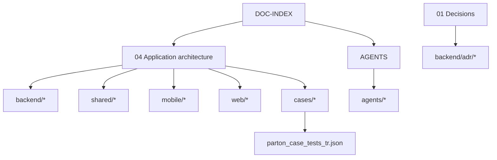

# Documentation cohesion model

**Status:** `accepted`  
**Last updated:** 2026-10-10  
**Purpose:** Keep PartonNewArch **wired, coherent, and non-contradictory**.

---

## 1. Hub documents (authoritative)

| Hub | Owns | Must stay in sync with |
| --- | --- | --- |
| [`04-application-architecture.md`](04-application-architecture.md) | System structure, §15 cross-cuts, ADR index, PR checklist | All ADRs **0001–0039**; shared/01–12; agents/10; **DESIGN.md** |
| [`01-architecture-decisions.md`](01-architecture-decisions.md) | Locked vs open (AO-*) | Every accepted ADR; agent defaults |
| [`DOC-INDEX.md`](DOC-INDEX.md) | Navigation by role/concern | New root/shared/backend docs |
| [`AGENTS.md`](AGENTS.md) | AI autonomy + bans | `agents/*`, cursor rule, CLAUDE.md |
| [`cases/00-coverage-matrix.md`](cases/00-coverage-matrix.md) | Case ↔ module/screen status | CASE groups; screen catalogs |
| [`backend/adr/README.md`](backend/adr/README.md) | ADR registry | Files on disk ADR-0001… |

Spokes **must not** contradict hubs. If a spoke is newer and correct, **update the hub in the same change**.

---

## 2. Spoke families



| Family | Prefix | Cohesion rule |
| --- | --- | --- |
| Backend deep-dives | `backend/01`–`22` | Module names match `04-domain-modules` |
| ADRs | `backend/adr/00xx` | Listed in adr/README + 01 + 04 §18 (through **0039**) |
| Design system | `DESIGN.md` | Stitch format; tokens = shared/01; ADR-0039 |
| Shared cross-cuts | `shared/01`–`12` | Linked from 04 §15.x and shared/README |
| Mobile / web | `mobile/*` `web/*` | Screen IDs unique; recipes R1–R8 |
| Cases | `cases/*` | 248 ids match JSON; UI mandate |
| Agents | `agents/00`–`10` | Defaults ⊆ gaps; bans ⊆ ADRs; no-mocks; latest-stack; **production-ready** |
| Quality/ops | `05` `06` `07` | Point at 04 + DOC-INDEX |

---

## 3. Status vocabulary (one meaning)

| Status | Meaning |
| --- | --- |
| `accepted` | Implement against this |
| `proposed` | Strong default; confirm before treating as contractual (e.g. SLO numbers) |
| `open` | Needs human/product decision — **agents use** [`agents/02-defaults`](agents/02-defaults-and-non-asks.md) |
| `legacy-ref` | Old app only |
| `covered` / `partial` / `gap` | Case matrix only |

Do not say “open” for AO-6/AO-8 — they are **accepted** via ADR-0027.

---

## 4. Cross-link requirements (when editing)

| If you change… | Also update… |
| --- | --- |
| New ADR | `backend/adr/README.md`, `01-architecture-decisions.md`, `04` §18, radar if tech, DOC-INDEX concern row if needed |
| New shared/0x doc | `shared/README.md`, `04` companion + §15 + §20, DOC-INDEX, root README snapshot if user-facing |
| New agent doc | `agents/README.md`, `AGENTS.md` load order, DOC-INDEX, cursor rule if behavioral |
| Closed AO-* / gap-* | `01` open table, `cases/01-gap-backlog`, any “still open” text in overview/radar/roadmap |
| New Nest module / REST path | `backend/04-domain-modules.md`, CASE group, coverage matrix |
| New screen ID | mobile/web catalogs + CASE + UI mandate |
| New error code | `shared/12-api-contracts.md` (+ contracts package later) |
| New notify type | `shared/05` §0 + FCM `20` |

---

## 5. Coherence invariants (must not diverge)

1. **Stack:** Nest **12** modular monolith + bare RN **latest** on **iOS + Android** (no Expo) + Postgres 18+ + REST `/api/v1` + Vite shadcn admin + Zod 4 + **latest stable** per ADR-0028/0029.  
2. **Async:** Outbox Stage A → BullMQ Stage B; RabbitMQ Hold.  
3. **Realtime:** FCM background; SSE foreground — not WebSocket as push.  
4. **i18n:** `tr-TR` primary; EN `error.code`.  
5. **UI/UX era:** Sept 2026 P1–P12 / X1–X12.  
6. **Acceptance:** 248 cases; every feature has UI + components.  
7. **Agents:** Defaults file is the only answer for open forks; anti-hallucination forbids invented IDs.  
8. **No mocks:** Fully functional sandbox integrations — [agents/08](agents/08-no-mocks-fully-functional.md).  
9. **Latest stable:** Nest 12 / TS 6 / current Node LTS / latest RN·Zod·Prisma — [ADR-0028](backend/adr/0028-latest-stable-stack.md) · [agents/09](agents/09-latest-stack-policy.md).  
10. **Mobile platforms:** iOS + Android, latest OS QA, both CI — [ADR-0029](backend/adr/0029-dual-platform-ios-android.md) · [mobile/06](mobile/06-ios-android-platforms.md).  
11. **Mobile release:** **Fastlane** (no EAS) — [ADR-0030](backend/adr/0030-fastlane-mobile-release.md) · [mobile/07](mobile/07-fastlane.md).  
12. **Web process manager:** **PM2** for Nest (API + admin) — [ADR-0031](backend/adr/0031-pm2-web-process-manager.md) · [web/05](web/05-pm2.md).  
13. **Web edge:** **NGINX** TLS + reverse proxy — [ADR-0032](backend/adr/0032-nginx-reverse-proxy.md) · [web/06](web/06-nginx.md).  
14. **Marketing site:** `apps/marketing` Vite — **production-ready** (all `w.public.*`, prerender, no MVP gaps) — [ADR-0033](backend/adr/0033-marketing-site.md) · [web/07](web/07-marketing.md).  
15. **Web admin:** ops surface for **every CASE-*** — [ADR-0034](backend/adr/0034-admin-full-case-coverage.md) · [web/08](web/08-admin-case-coverage.md).  
16. **Admin DevOps:** unified error tracking + releases — [ADR-0035](backend/adr/0035-admin-devops-error-tracking.md) · [web/09](web/09-admin-devops.md).  
17. **Admin DevOps MCP:** authenticated agent tools — [ADR-0036](backend/adr/0036-admin-devops-mcp.md) · [web/10](web/10-devops-mcp.md).  
18. **Legal audit logger:** append-only + admin CSV/PDF — [ADR-0037](backend/adr/0037-legal-audit-logger.md) · [backend/22](backend/22-legal-audit-logger.md) · [web/11](web/11-legal-audit-reports.md).  
19. **Monorepo tooling:** pnpm + Turborepo + locked packages — [ADR-0038](backend/adr/0038-monorepo-tooling.md).  
20. **Production coding gate:** docs ready for full-stack ship — [agents/10](agents/10-production-ready.md).  
21. **DESIGN.md:** visual SoR for agents — [DESIGN.md](DESIGN.md) · [ADR-0039](backend/adr/0039-design-md.md); structure from [awesome-design-md](https://github.com/voltagent/awesome-design-md).

---

## 6. Quick cohesion audit (run when docs drift)

```text
[x] ADR files on disk == adr/README table == 04 §18 (0001–0039)
[x] DESIGN.md present + ADR-0039; 09/10/01-colors point at it
[x] README architecture snapshot matches 01 locked table
[x] No “AO-6 open” / “AO-8 proposed” leftover (except history strikethrough)
[x] shared/README lists 01–12
[x] agents/README lists 00–10
[x] DOC-INDEX folder tree matches reality
[x] Gap backlog matches closed ADRs / agents/10
[x] Cursor rule + AGENTS + CLAUDE agree on bans, grounding, production-ready
[x] Domain modules AO-5 final; Prisma ADR-0003 accepted; AO-7 ADR-0038 accepted
```

**Last cohesion pass:** 2026-10-10

---

## Related

- Index: [`DOC-INDEX.md`](DOC-INDEX.md)  
- Agents: [`AGENTS.md`](AGENTS.md) · [`agents/10-production-ready.md`](agents/10-production-ready.md)  
- Decisions: [`01-architecture-decisions.md`](01-architecture-decisions.md)  
- ADR registry: [`backend/adr/README.md`](backend/adr/README.md)  
