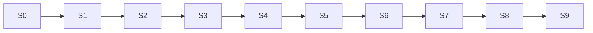

# 05 — Slice catalog (agent work units)

**Status:** `accepted`  
**Use:** Each row = one autonomous work unit. Load **Docs** only; implement **Deliverables**; prove with **Cases/Tests**.

---

## S0 — Foundation

| Field | Content |
| --- | --- |
| Deliverables | Monorepo, Compose Postgres, Nest health, contracts package, turbo CI, **PM2** + **NGINX** stubs |
| Cases | — (platform) |
| Docs | [03-scaffold](03-scaffold-spec.md) · [05-data](../backend/05-data-layer.md) · [12-contracts](../shared/12-api-contracts.md) · [web/05](../web/05-pm2.md) · [web/06](../web/06-nginx.md) · ADR-0031/0032 |
| Tests | health ready; prisma migrate |

## S1 — Auth

| Field | Content |
| --- | --- |
| Deliverables | OTP, JWT, refresh, `/me`, context switch, **real SMS sandbox** |
| Cases | CASE-AUTH critical; skip email/password per defaults |
| Docs | [18-auth](../backend/18-auth-rbac.md) · [21-security](../backend/21-client-security.md) · [CASE-AUTH](../cases/groups/CASE-AUTH.md) |
| Screens | `m.auth.phone`, `otp`, `role-select`, `policies` |
| Tests | `@T-001` family OTP; 401/403 filters |

## S2 — Client shells

| Field | Content |
| --- | --- |
| Deliverables | RN nav+NativeWind+i18n on **iOS+Android**; `PLATFORM.md`; **Fastlane** scaffold; admin Vite shadcn; **`apps/marketing` production** (all `w.public.*` + prerender/SEO); API clients |
| Cases | — |
| Docs | [mobile/06](../mobile/06-ios-android-platforms.md) · [mobile/07](../mobile/07-fastlane.md) · [08-routing](../shared/08-routing.md) · [mobile/04](../mobile/04-nativewind-ui.md) · [web/04](../web/04-shadcn-dark-ui.md) · [web/07](../web/07-marketing.md) · [07-i18n](../shared/07-i18n.md) · ADR-0029/0030/0033 |
| Screens | Auth graph; admin `/login`; landing + pricing + legal |
| Tests | `run-ios` + `run-android`; Fastlane lanes; admin login; marketing prerender build + a11y/Lighthouse smoke |

## S3 — Profiles & orgs

| Field | Content |
| --- | --- |
| Deliverables | workers, employers, branches, policies accept, demographics fields |
| Cases | CASE-WORKER-PROFILE, CASE-EMPLOYER-BRANCH |
| Docs | [04-domain](../backend/04-domain-modules.md) · [04-wizard](../shared/04-wizard-state.md) · screen catalogs |
| Screens | onboarding wizards R3; branch form |
| Defaults | `gap-profile-demographics`, `gap-firm-verification` |

## S4 — Jobs, tokens hold, feed

| Field | Content |
| --- | --- |
| Deliverables | jobs CRUD/publish, token ledger hold, matching feed |
| Cases | CASE-JOB-POSTING, CASE-TOKEN, CASE-MATCHING |
| Docs | [11-tokens](../backend/11-tokens-and-provision.md) · [12-matching](../backend/12-matching-rules.md) |
| Screens | create-job wizard; `m.worker.jobs.list/detail` |
| Defaults | `gap-favorites-only-job` flag schema even if UI later |

## S5 — Applications & notify

| Field | Content |
| --- | --- |
| Deliverables | apply/withdraw/accept/reject; snapshot; inbox/outbox; **real FCM**; deep links |
| Cases | CASE-APPLICATION, CASE-EMPLOYER-REVIEW, CASE-NOTIFICATIONS |
| Docs | [20-fcm](../backend/20-fcm-messaging.md) · [shared/05](../shared/05-push-notifications-ux.md) · [08-routing](../shared/08-routing.md) |
| Screens | apply confirm; employer applicants; notifications list/detail |
| Defaults | `gap-application-snapshot`, `gap-overlap-apply` |
| Exit | Journey 1 accept |

## S6 — Day-of

| Field | Content |
| --- | --- |
| Deliverables | 3h confirm, release 30m, check-in geofence, manual confirm, dispute |
| Cases | CASE-AVAILABILITY-3H, CASE-CHECKIN, CASE-LOCATION |
| Docs | [13-location](../backend/13-location-policy.md) · push catalog day-of |
| Screens | availability-confirm; check-in R5; dispute; manual-confirm |
| Defaults | `gap-3h-no-response`, `gap-checkin-dispute`, `gap-wifi-location`, `gap-geofence-policy` |

## S7 — Ratings, favorites, docs, token settle

| Field | Content |
| --- | --- |
| Deliverables | ratings, favorites, documents, capture/release, top-up mock |
| Cases | CASE-RATINGS, CASE-FAVORITES, CASE-TOKEN rest |
| Docs | tokens · UI components · documents screens |
| Defaults | `gap-documents`, `gap-payments` (real ledger), `gap-profanity-filter` |

## S8 — Admin & abuse (**all CASE-* domains**)

| Field | Content |
| --- | --- |
| Deliverables | Full `w.admin.*` matrix (38 screens) incl. **DevOps**; **`apps/devops-mcp`**; people; jobs; matching; applications; shifts; tokens; ratings; docs; notify; abuse; policies; config; audit; perf |
| Cases | **All 19 CASE-*** groups via admin ops surfaces + DevOps |
| Docs | [web/08](../web/08-admin-case-coverage.md) · [web/09](../web/09-admin-devops.md) · [web/10](../web/10-devops-mcp.md) · [web/11](../web/11-legal-audit-reports.md) · [backend/22](../backend/22-legal-audit-logger.md) · [admin-console](../web/screens/admin-console.md) · ADR-0034/0035/0036/0037 |
| Defaults | `gap-ban-reentry`, `gap-mock-gps`, `gap-attendance-fraud`, `gap-device-fingerprint` |

## S9 — Polish

| Field | Content |
| --- | --- |
| Deliverables | a11y, CASE-UX, OpenAPI CI, load-test skeleton, BullMQ flag, **PM2** + **NGINX** |
| Cases | CASE-UX, CASE-PERF |
| Docs | [06-a11y](../shared/06-accessibility-wcag.md) · [09/10 principles](../shared/09-modern-ui-principles.md) · [05-nfr](../05-quality-nfr.md) · [web/05](../web/05-pm2.md) · [web/06](../web/06-nginx.md) · ADR-0031/0032 |

---

## Quick dependency graph

Do not start S5 before S4 feed exists. Do not start S6 before accept creates shifts.

---

## Related

- Playbook: [`01-implementation-playbook.md`](01-implementation-playbook.md)  
- Coverage matrix: [`../cases/00-coverage-matrix.md`](../cases/00-coverage-matrix.md)  
