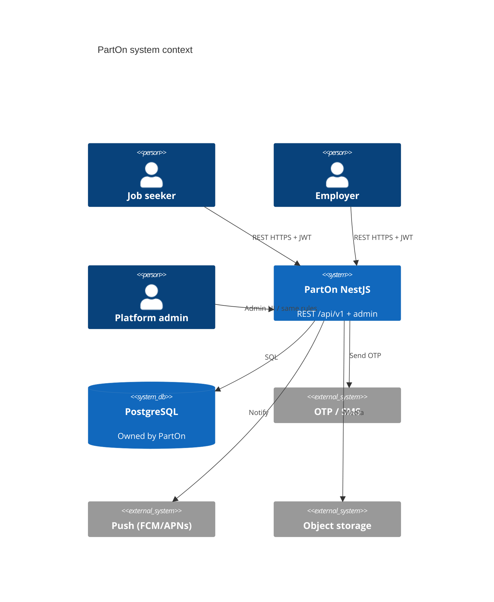

# 02 — System context

**Status:** `accepted`  
**Last updated:** 2026-10-07  
**Decisions:** [`../01-architecture-decisions.md`](../01-architecture-decisions.md)

## Actors

| Actor | Channel | Trust |
| --- | --- | --- |
| Job seeker (worker) | React Native | Authenticated JWT + role `worker` |
| Employer | React Native | JWT + role `employer` |
| Branch manager | React Native (if product keeps role — AO-11) | JWT + role `manager` (+ branch scope) |
| Platform admin | Admin UI in Nest app | JWT + role `admin` |
| Background processing | In-process / outbox at start; separate worker deferred | No public internet |
| External providers | SMS, push, storage | Outbound only; secrets in env |

Market: **Turkey** initially. Deploy region TBD.

## Context diagram

## Trust boundaries

1. **Public internet → Nest** — TLS, rate limits, auth on protected `/api/v1` routes and admin.
2. **Nest → PostgreSQL** — private network / VPC; least-privilege DB role.
3. **Nest → providers** — API keys never shipped to mobile or shared packages.
4. **Mobile local storage** — refresh tokens / session only; never long-lived server secrets.
5. **Shared packages** — schemas/types/helpers only; no DB or secrets.

## What moves off the device

| Concern | Legacy | New |
| --- | --- | --- |
| Auth session | Firebase Auth + DataStore | Nest JWT + secure device storage |
| Job / application truth | Firestore | PostgreSQL via REST |
| Matching / feed ranking | Client + Firestore queries | Server matching + `GET /api/v1/jobs/feed` |
| Check-in / active shift | Local DB + Firestore | REST shift commands |
| Notifications inbox | Local + remote | REST inbox + push fan-out |
| Policies / remote config | Firestore / Remote Config | `policies` module (+ config table) |
| Client contract | Firebase SDK / listeners | `/api/v1` + shared schema packages |
| Admin operations | (limited) | Admin UI in same Nest app / same domain services |

## Environments

| Env | Purpose |
| --- | --- |
| `local` | Docker Postgres + Nest watch |
| `staging` | Shared QA; seed data for case runs |
| `production` | Live (cloud vendor TBD) |

Config via Nest `ConfigModule` + env vars; never commit secrets; never put secrets in shared packages.

## Related case groups

`CASE-AUTH`, `CASE-SECURITY`, `CASE-TOKEN`, `CASE-NOTIFICATIONS`, `CASE-E2E`
