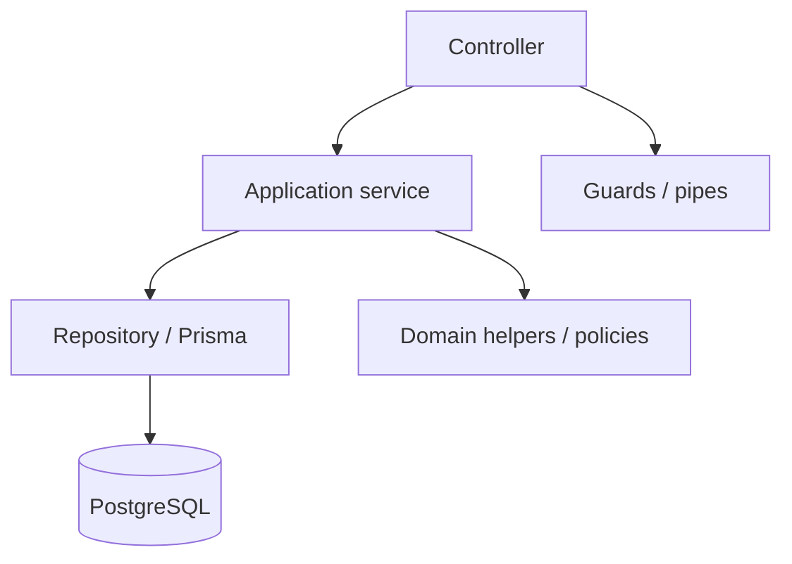
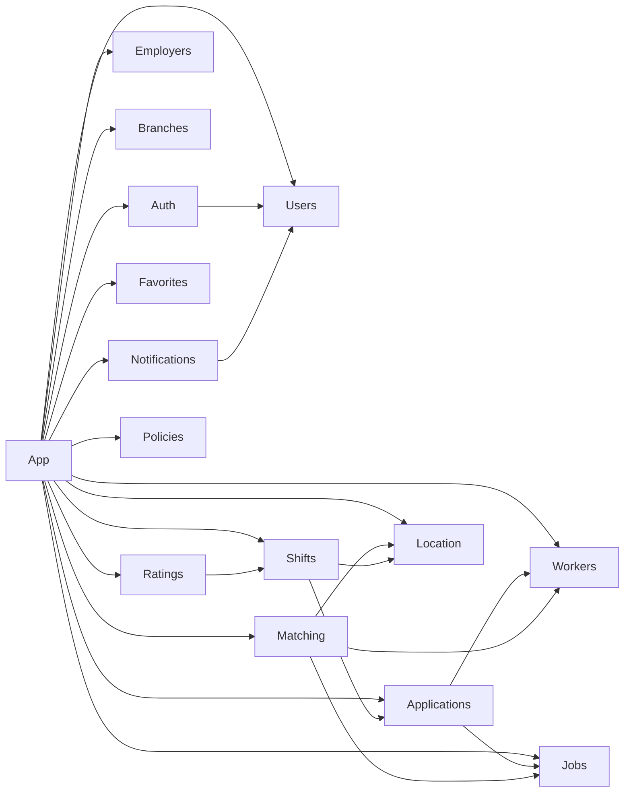

# 03 — NestJS modular monolith

**Status:** `accepted`  
**Last updated:** 2026-10-07  
**Nest reference:** [Modules](https://docs.nestjs.com/modules), [Dynamic modules](https://docs.nestjs.com/fundamentals/dynamic-modules)

## Rules

1. **Root `AppModule`** only imports feature/infra modules — no domain logic there.
2. **One feature module = one folder** under `src/modules/<name>/`.
3. **Encapsulate by default** — other modules inject only what you `exports`.
4. **Share via import, not copy** — export `UsersService` once; import `UsersModule` where needed.
5. **Infra modules are dynamic** when config is required (`DatabaseModule.forRoot()`, `ConfigModule.forRoot()`).
6. **No circular imports** — if A↔B, extract a small shared module or use events.

## Standard feature module shape

```text
modules/jobs/
  jobs.module.ts
  jobs.controller.ts
  jobs.service.ts
  dto/
  entities/          # or prisma models live elsewhere — see data layer
  policies/          # authorization helpers for this domain
  jobs.constants.ts
  jobs.module.spec.md  # optional: case links + invariants (notes)
```

`@Module` metadata:

| Field | Use |
| --- | --- |
| `controllers` | REST HTTP entrypoints for this domain (`/api/v1`) |
| `providers` | services, repositories, mappers, guards scoped here |
| `imports` | other modules whose **exported** providers you need |
| `exports` | public API of the module (usually services, rarely controllers) |

## Layering inside a module



- Controllers: REST routes, DTO validation, HTTP status codes (see [06-api-conventions.md](06-api-conventions.md))
- Services: use-cases / transactions
- Repositories: persistence only (thin if using Prisma client directly — still keep query helpers out of controllers)

## Cross-cutting modules

| Module | Responsibility |
| --- | --- |
| `ConfigModule` | Typed env |
| `DatabaseModule` | ORM client |
| `AuthModule` | OTP, JWT issue/validate, strategies |
| `CommonModule` | filters, logging, correlation id |
| `HealthModule` | liveness / readiness |
| `QueueModule` | BullMQ + Redis when Stage B enabled — not RabbitMQ ([14](14-bullmq-vs-rabbitmq.md)) |

## Import graph (target)



If the graph gets dense, prefer **domain events** (see [08-async-events.md](08-async-events.md)) over deep service coupling.

## Coding conventions

- Controllers route prefixes: `/api/v1/<resource>`
- Admin surfaces call the same exported domain services (no parallel rule layer)
- Service methods named as verbs: `createJob`, `submitApplication`
- Throw Nest HTTP exceptions from application layer; map domain errors once
- Prefer constructor injection; avoid `ModuleRef` except for advanced cases
- Cross-module deps only via `exports` — never another module’s internals

## Anti-patterns

- God `AppService` with all use-cases
- Importing Firebase / Firestore client “just for one collection”
- Circular `forwardRef` as default — treat as smell
- Controllers calling Prisma directly across domains
- Admin UI re-implementing domain rules instead of calling services
- Separate worker process before need is proven
