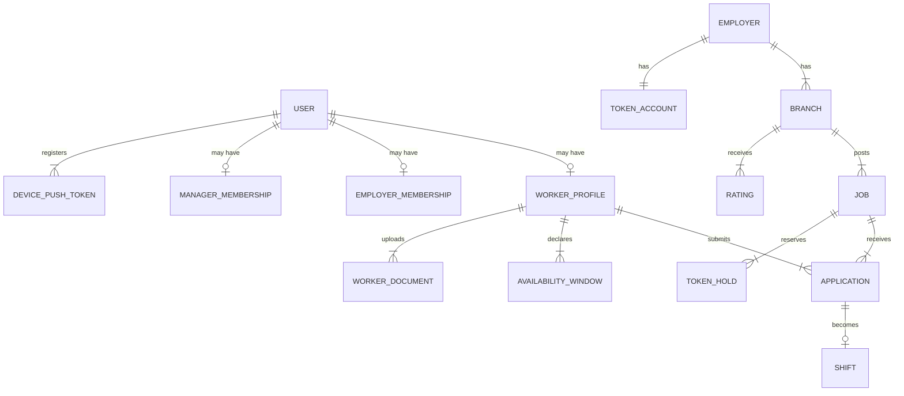

# 04 — Domain modules

**Status:** `proposed` (names provisional)  
**Last updated:** 2026-10-07  
**Note:** Locked architecture says domain module **names** are finalized when features are scoped ([AO-5](../01-architecture-decisions.md)). Catalog below is a working map from legacy + `CASE-*` groups — not a frozen naming list.

Bounded contexts for PartOn. Mapped from legacy repositories and `CASE-*` groups.

## Module catalog

| Nest module | Owns | Primary case groups | Legacy signals |
| --- | --- | --- | --- |
| `auth` | OTP (+ optional email/password), sessions, refresh, logout, device signals | `CASE-AUTH`, `CASE-SECURITY` | `FirebaseAuthRepository`, `OtpAuthRepository` |
| `users` | Account identity, roles, bans, phone/email uniqueness | `CASE-AUTH`, `CASE-ABUSE` | `FirebaseUserProfileRepository` |
| `workers` | Profile, availability, demographics, documents, home pin | `CASE-WORKER-PROFILE` | Employee onboarding / profile |
| `employers` | Org onboarding, tax ID, **verification status**, industry scope | `CASE-EMPLOYER-BRANCH`, `CASE-AUTH` (T-011–T-015) | Employer onboarding |
| `branches` | Branches, geo, manager codes/membership | `CASE-EMPLOYER-BRANCH`, `CASE-LOCATION` | `FirebaseBranchRepository` |
| `jobs` | Catalog + postings, favorites-only flag, headcount | `CASE-JOB-POSTING`, `CASE-FAVORITES` | Job repos |
| `tokens` | Balance, holds, captures, releases, ledger, top-ups | `CASE-TOKEN`, `CASE-E2E` | (legacy was weak — new ownership) |
| `applications` | Apply/withdraw + employer review state machine | `CASE-APPLICATION`, `CASE-EMPLOYER-REVIEW` | Applications repos |
| `matching` | Hard filters + ranking + reasons | `CASE-MATCHING` | Feed logic → server |
| `shifts` | 3h confirm, check-in/out, disputes, manual confirm | `CASE-AVAILABILITY-3H`, `CASE-CHECKIN` | Active shift repos |
| `location` | Geofence policy, accuracy, mock-GPS signals | `CASE-LOCATION`, `CASE-CHECKIN` | Location repos |
| `ratings` | Bidirectional ratings, windows, averages, text filter | `CASE-RATINGS` | Rating stores |
| `favorites` | Directional favorites + eligibility for exclusive jobs | `CASE-FAVORITES` | Favorites UI |
| `notifications` | Templates, outbox, push tokens, inbox | `CASE-NOTIFICATIONS` | Notification + FCM |
| `policies` | Legal versions + acceptance | `CASE-AUTH` | Policy repos |
| `moderation` | Abuse reports, disputes queue, risk flags, bans | `CASE-ABUSE`, `CASE-SECURITY` | Tickets |

See also: [11-tokens](11-tokens-and-provision.md), [12-matching](12-matching-rules.md), [13-location](13-location-policy.md), [`../cases/`](../cases/).

## REST resource map

Public surface is REST only ([06-api-conventions.md](06-api-conventions.md), [ADR-0004](adr/0004-rest-json-api.md)). Controllers expose resources; other modules call services in-process.

| Nest module | Primary REST resources (under `/api/v1`) |
| --- | --- |
| `auth` | `/auth/otp/*`, `/auth/token/refresh`, `/auth/logout` |
| `users` | `/me`, `/users/me/roles` |
| `workers` | `/workers/me`, `/workers/me/availability`, `/workers/me/documents`, `/workers/me/home` |
| `employers` | `/employers`, `/employers/me`, `/employers/me/setup-status`, `/employers/me/industries` |
| `branches` | `/branches`, `/branches/:id`, `/branches/manager-join`, `/branches/:id/managers` |
| `jobs` | `/jobs`, `/jobs/:id`, `/jobs/feed`, `/job-catalog`, `/branches/:id/jobs` |
| `tokens` | `/employers/me/tokens`, `/employers/me/tokens/ledger`, `/employers/me/tokens/top-ups` |
| `applications` | `/jobs/:id/applications`, `/applications/:id`, `.../accept\|reject\|withdraw` |
| `matching` | consumed via `GET /jobs/feed` (+ eligibility on `GET /jobs/:id`) |
| `shifts` | `/shifts/:id`, `.../check-in`, `.../check-out`, `.../availability-confirm`, `.../disputes`, `.../manual-confirm` |
| `location` | policy embedded in check-in; no separate public geo CRUD in v1 |
| `ratings` | `/ratings`, `/ratings/pending` |
| `favorites` | `/favorites` |
| `notifications` | `/notifications`, `/notifications/:id`, `.../read`, `/notifications/preferences` |
| `policies` | `/policies`, `/policies/acceptances` |
| `moderation` | `/moderation/reports` (+ admin routes later) |

## Core aggregates (conceptual)

Exact tables live in [05-data-layer.md](05-data-layer.md) and future ERD workshops.

## Role × module matrix

| Module | Worker | Employer | Manager |
| --- | --- | --- | --- |
| auth / users | ✓ | ✓ | ✓ |
| workers + documents | own | read limited | read applicants |
| employers / branches | — | ✓ | scoped |
| jobs | read feed | create/manage | create/manage scoped |
| tokens | — | ✓ | read limited |
| applications | own | review | review scoped |
| matching | consume | configure constraints | — |
| shifts / location | check-in / dispute | monitor / manual confirm | monitor / confirm |
| ratings | give/receive | give/receive | — |
| notifications | own | own | own |
| favorites | ✓ | ✓ | — |
| moderation | report | report | report |

## Invariants to protect server-side

1. A user has at most one primary role context per session (role switching rules — `open`).
2. Manager actions are always branch-scoped.
3. Application state machine is server-enforced (no client-set “hired” without transition rules).
4. Check-in requires valid assignment + location policy + time window (or manual confirm path).
5. Matching must not leak another worker’s PII; favorites-only jobs omitted for non-audience.
6. OTP verify is rate-limited and single-use.
7. Job publish requires employer verification + sufficient token balance (T-015, T-149–T-150).
8. Token ledger operations are idempotent (T-160).
9. Accept cannot exceed remaining headcount (T-094).
10. Banned identity (phone/tax/device) cannot re-register (T-192).

## Implementation order (suggested)

1. `auth` + `users` + `policies`
2. `workers` (+ documents) + `employers` (+ verification) + `branches`
3. `tokens` + `jobs` + `applications`
4. `matching` + `favorites`
5. `location` + `shifts` (3h + check-in + dispute)
6. `notifications` + `ratings`
7. `moderation` / abuse / admin risk

Aligns with CASE-E2E journeys ([`../cases/02-e2e-journeys.md`](../cases/02-e2e-journeys.md)).

## Open questions

| ID | Question |
| --- | --- |
| DM-1 | Single `users` table + role tables vs separate identity per role doc |
| DM-2 | Job catalog as seeded SQL vs CMS-managed |
| DM-3 | Availability windows: first-class table vs JSON schedule |
| DM-4 | Email/password auth in v1? (T-002, T-008, T-248) |
| DM-5 | 3h no-response timeout policy (T-117) |
| DM-6 | No-show token capture vs release (T-155) |
