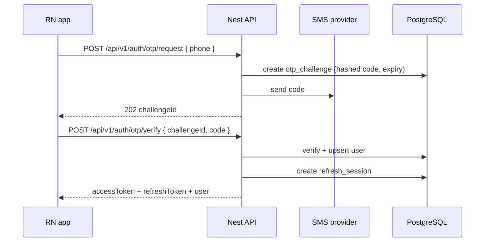

# 07 — Auth & security

**Status:** `proposed`  
**Last updated:** 2026-10-07  
**Legacy ref:** Firebase Auth + OTP repos; see `CASE-AUTH`, `CASE-SECURITY`, `CASE-TOKEN`

## Goals

- Phone OTP as primary login (CASE-AUTH T-001, T-005–T-007)
- Optional email/password path if product keeps T-002 / T-008 / T-248 (`open` — see DM-4)
- Short-lived access JWT + rotating refresh sessions stored server-side (T-247)
- Role and branch authorization on every protected route (T-014, T-244–T-246)
- Server-side abuse / rate limits (OTP spam, bot apply T-186, multi-account T-184)
- Ban list blocks re-registration (T-192)
- Registration must succeed **without** location permission (T-009)

## Auth flow (happy path)



## Tokens

| Token | Lifetime (proposed) | Storage |
| --- | --- | --- |
| Access JWT | 15–30 min | Memory / secure store |
| Refresh | days, rotating | Secure store; hashed in DB |

JWT claims (minimal):

```json
{
  "sub": "<userId>",
  "role": "worker|employer|manager|admin",
  "sid": "<sessionId>",
  "branchIds": ["…"] 
}
```

`branchIds` may be omitted and loaded via guard from DB for fresher authorization (`open`).

## Nest building blocks

| Piece | Role |
| --- | --- |
| `Passport` / custom JWT strategy | Validate access token |
| `AuthGuard` | Default authenticated |
| `RolesGuard` | Role check |
| `BranchScopeGuard` | Manager/employer resource scope |
| Throttler | OTP + login endpoints |

## Authorization model

1. **Authentication** — valid access token
2. **Role** — endpoint allows role set
3. **Resource scope** — user may act on this job/branch/application
4. **State machine** — transition allowed (e.g. accept application)

Never rely on “hidden” client screens for security.

## Secrets & PII

- OTP codes stored hashed; plaintext only in SMS
- Refresh tokens hashed at rest
- Phone numbers normalized (E.164)
- Audit sensitive actions: login, role change, check-in override

## Security checklist (maps to CASE-SECURITY)

- [ ] HTTPS only
- [ ] Rate limit OTP request/verify
- [ ] Lockout / exponential backoff on verify failures
- [ ] No stack traces to clients
- [ ] Parameterized SQL only (ORM)
- [ ] File upload type/size limits (when media lands)
- [ ] Dependency scanning in CI
- [ ] Principle of least privilege for DB role

## What changes from Firebase Auth

| Firebase | Nest |
| --- | --- |
| Firebase ID token | Our JWT |
| Firestore security rules | Nest guards + SQL constraints |
| Client listener trust | Explicit API reads |
| FCM token in Firestore | `device_push_tokens` table via API |

## Catalog-derived auth rules

| Rule | Cases |
| --- | --- |
| Unique phone | T-003 |
| Wrong / expired OTP rejected; lockout after N tries | T-005–T-007 |
| Incomplete fields rejected | T-004 |
| Employer tax ID unique | T-013 |
| Unverified firm cannot publish jobs | T-015 |
| Password strength if passwords enabled | T-008 |
| Password reset hardening if enabled | T-248 |
| Session logout / rotation | T-247 |
| No sensitive data in logs | T-252 |

## Open questions

| ID | Question |
| --- | --- |
| AS-1 | SMS provider (Twilio, Netgsm, etc.) |
| AS-2 | Device binding / refresh reuse detection (T-184) |
| AS-3 | Multi-role users: one account vs separate logins |
| AS-4 | Email + password in v1? |
