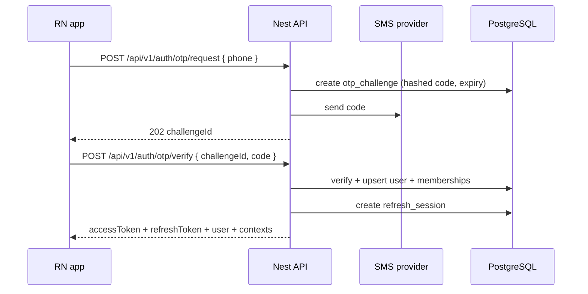

# 07 — Auth & security (checklist)

**Status:** `accepted` (checklist); full model in 18  
**Last updated:** 2026-10-09  
**Deep dive:** [`18-auth-rbac.md`](18-auth-rbac.md) · [ADR-0011](adr/0011-auth-rbac.md)  
**Client security (Web + Mobile):** [`21-client-security.md`](21-client-security.md) · [ADR-0018](adr/0018-client-security.md)  
**Architecture:** [`../04-application-architecture.md`](../04-application-architecture.md) §10 · §15.2  
**Privacy:** [`17-privacy-kvkk-gdpr.md`](17-privacy-kvkk-gdpr.md) · [ADR-0010](adr/0010-privacy-kvkk-gdpr.md)  
**Legacy ref:** Firebase Auth + OTP repos; `CASE-AUTH`, `CASE-SECURITY`, `CASE-ABUSE`

This file is the **implementation checklist**. For identity model, RBAC matrices, context switch, and guard pipeline, use **[18 — Auth & RBAC](18-auth-rbac.md)**.

## Goals

- Phone OTP as primary login (CASE-AUTH T-001, T-005–T-007)
- Optional email/password path if product keeps T-002 / T-008 / T-248 (`open` — AS-4)
- Short-lived access JWT + rotating refresh sessions stored server-side (T-247)
- **RBAC + employer/branch scope** on every protected route (T-014, T-244–T-246)
- Server-side abuse / rate limits (OTP spam, bot apply T-186, multi-account T-184)
- Ban list blocks re-registration (T-192)
- Registration must succeed **without** location permission (T-009)

## Auth flow (happy path)

## Tokens (summary)

| Token | Lifetime (proposed) | Storage |
| --- | --- | --- |
| Access JWT | 15–30 min | **Memory** (both clients) |
| Refresh | days, rotating | **Mobile:** Keychain/Keystore · **Web:** HttpOnly cookie · hashed in DB |

JWT must include `sub`, `sid`, and active `ctx` (role + employer/branch). See [18 §2–3](18-auth-rbac.md).

## Nest building blocks

| Piece | Role |
| --- | --- |
| `JwtAuthGuard` | Validate access token + session |
| `RolesGuard` | Role check |
| `ContextGuard` | Membership matches `ctx` |
| `BranchScopeGuard` | Manager/employer resource scope |
| Throttler | OTP + login + refresh endpoints |

## Authorization model (four steps)

1. **Authentication** — valid access token + live `sid`  
2. **Role** — endpoint allows role set  
3. **Resource scope** — user may act on this job/branch/application  
4. **State machine** — transition allowed (e.g. accept application)

Never rely on “hidden” client screens for security. Full matrix: [18 §4–5](18-auth-rbac.md).

## Secrets & PII (KVKK / GDPR-ready)

- OTP codes stored hashed; plaintext only in SMS (processor)
- Refresh tokens hashed at rest; rotation with reuse detection
- Phone numbers normalized (E.164); never log full OTP or refresh plaintext
- Audit sensitive actions: login, context switch, role change, check-in override, privacy export/erase
- SMS / push vendors are **processors** — list in subprocessor register
- Auth flows must surface **aydınlatma** + policy acceptance before/at account creation (`policies`)

## Security checklist (maps to CASE-SECURITY)

- [ ] HTTPS only
- [ ] Rate limit OTP request/verify
- [ ] Lockout / exponential backoff on verify failures
- [ ] Refresh rotation + logout revokes `sid` (T-247)
- [ ] RolesGuard + scope on mutating and list routes (T-244–T-246)
- [ ] Branch create only for authorized employer (T-014)
- [ ] Unverified firm cannot publish (T-015)
- [ ] Ban check on AuthN (T-192)
- [ ] No stack traces to clients
- [ ] Parameterized SQL only (ORM)
- [ ] File upload type/size limits (when media lands)
- [ ] Dependency scanning in CI
- [ ] Principle of least privilege for DB role
- [ ] No sensitive data in logs (T-252)
- [ ] Policy acceptance recorded with version (KVKK accountability)
- [ ] DSR/export-erase paths authorized and audited (P3)

## What changes from Firebase Auth

| Firebase | Nest |
| --- | --- |
| Firebase ID token | Our JWT + `ctx` |
| Firestore security rules | Nest guards + SQL constraints |
| Client listener trust | Explicit API reads |
| FCM token in Firestore | `device_push_tokens` table via API |
| Custom claims only | Memberships + context switch API |

## Catalog-derived auth rules

| Rule | Cases |
| --- | --- |
| Unique phone | T-003 |
| Wrong / expired OTP rejected; lockout after N tries | T-005–T-007 |
| Incomplete fields rejected | T-004 |
| Employer tax ID unique | T-013 |
| Unverified firm cannot publish jobs | T-015 |
| Password strength if passwords enabled | T-008 |
| Password reset hardening if enabled | T-248 |
| Session logout / rotation | T-247 |
| Object-level AuthZ | T-244–T-246 |
| No sensitive data in logs | T-252 |

## Open questions

| ID | Question | Default in [18](18-auth-rbac.md) |
| --- | --- | --- |
| AS-1 | SMS provider (Twilio, Netgsm, etc.) | `SmsPort` abstraction |
| AS-2 | Device binding / refresh reuse detection (T-184) | Rotate + revoke family |
| AS-3 | Multi-role users: one account vs separate logins | One account + context switch |
| AS-4 | Email + password in v1? | Off (OTP only) |
| AO-11 | Manager product naming | Model membership for AuthZ anyway |
