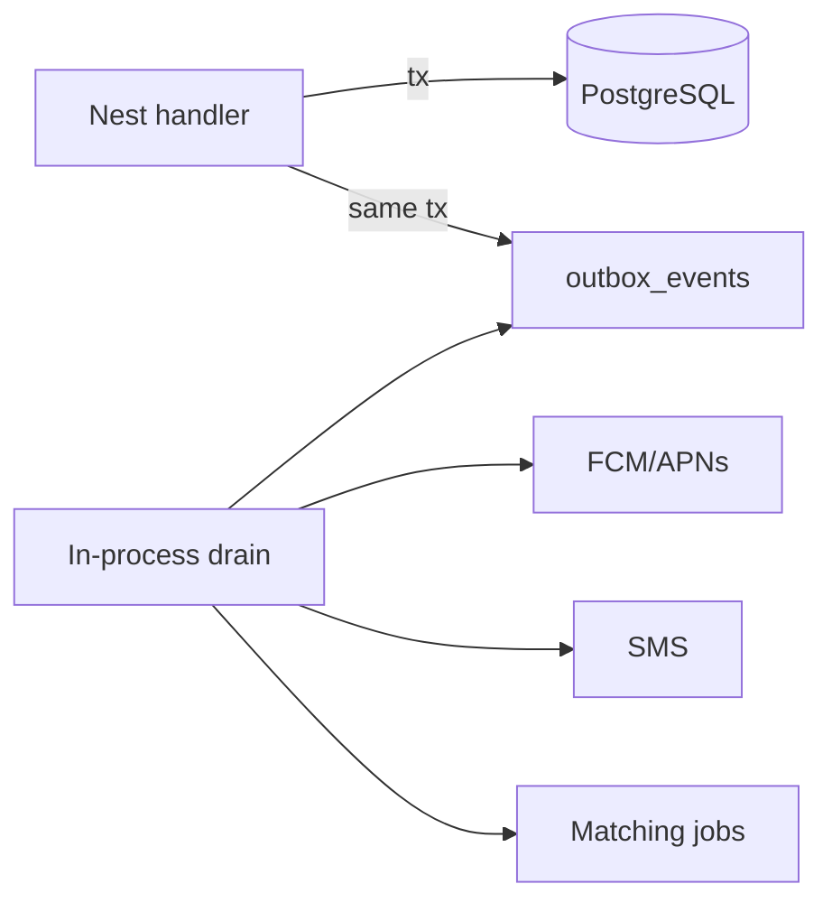
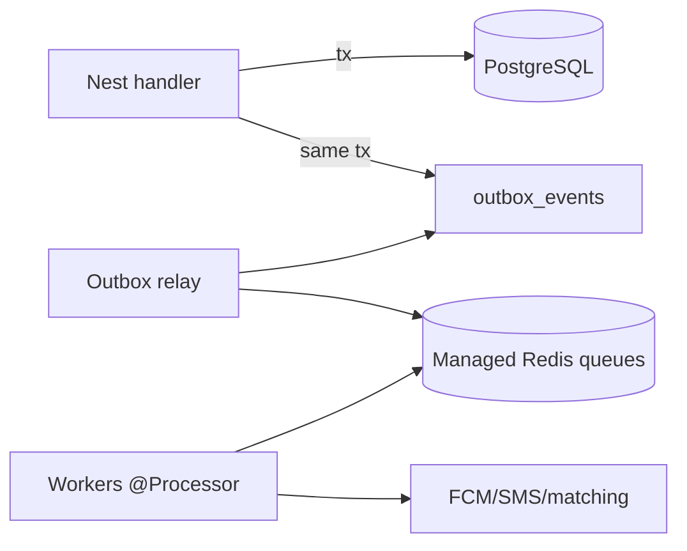

# 08 — Async work & events

**Status:** `proposed` (patterns); queue product choice `accepted`  
**Last updated:** 2026-10-09  
**Queue decision:** [14-bullmq-vs-rabbitmq.md](14-bullmq-vs-rabbitmq.md) · [ADR-0007](adr/0007-bullmq-over-rabbitmq.md)  
**Redis ops:** [15-redis-management.md](15-redis-management.md) · [ADR-0008](adr/0008-managed-redis.md)

## Why async

Some PartOn flows should not block the HTTP request:

- Push notification fan-out
- Matching score recompute / feed materialization
- SMS retries
- Abuse heuristics
- Rating reminders after shift complete
- Delayed 3h availability confirm nudges

## Approach (staged)

| Stage | Mechanism | Status |
| --- | --- | --- |
| **A — Start (locked)** | Nest request writes DB + **outbox row** in one transaction; **in-process** drain (or Nest scheduled tasks) | Required now |
| **B — First broker** | **BullMQ + managed Redis** via `@nestjs/bullmq`; prefer outbox → relay → enqueue | When evidence gates hit (P4 / AO-3) — Redis ops: [15-redis-management.md](15-redis-management.md) |
| **C — Bus (optional later)** | RabbitMQ / Kafka only if polyglot or true multi-service streaming | Hold — new ADR required |

**Do not** introduce RabbitMQ for PartOn’s modular monolith job workloads. See comparison doc.

Stage B (when promoted):

## Evidence gates (promote A → B)

Introduce BullMQ when **any** of these is true under load tests / staging:

1. Outbox drain competes with HTTP and worsens p95 latency  
2. Notify fan-out or matching recompute misses CASE-PERF budgets (T-226–T-234)  
3. Need worker replicas independent of API process count  

Until then, stay on Stage A.

When promoting: provision **managed Redis** with `maxmemory-policy=noeviction` and AOF before enabling BullMQ ([15-redis-management.md](15-redis-management.md)).

## Suggested BullMQ queues (Stage B)

| Queue | Responsibility |
| --- | --- |
| `notifications` | Push, SMS, inbox fan-out |
| `matching` | Feed recompute / materialization |
| `shifts.schedule` | 3h confirm, check-in nudge, rating window (+24h) |
| `moderation` | Abuse / risk heuristics |

Payloads: small IDs + type; load entities from Postgres in the worker.

## Domain events (examples)

| Event | Producers | Consumers | Catalog |
| --- | --- | --- | --- |
| `user.registered` | auth | notifications, policies | CASE-AUTH |
| `job.published` | jobs | matching, notifications | T-100, T-107–T-108 |
| `application.submitted` | applications | notifications | T-101 |
| `application.accepted` / `rejected` | applications | shifts, notifications, tokens | T-102–T-103, T-096–T-097 |
| `shift.confirm_3h_due` | scheduler | notifications | T-104, T-114 |
| `shift.checkin_due` | scheduler | notifications | T-105, T-123 |
| `shift.availability_declined` | shifts | notifications, tokens | T-116, T-119 |
| `shift.checked_in` | shifts | notifications, tokens capture | T-133, T-156 |
| `shift.dispute_opened` | shifts | notifications, moderation | T-135, T-212 |
| `shift.completed` | shifts | ratings schedule (+24h) | T-106, T-172 |
| `favorite.job_for_audience` | jobs/favorites | notifications | T-107–T-108 |

Notification invariants from CASE-NOTIFICATIONS: no duplicates (T-110), correct deep link (T-109), inbox fallback if push off (T-111), never wrong user (T-113).

Keep event payloads small (IDs + type); load details in consumers.

## Nest patterns

- Prefer dedicated providers (`NotificationsDispatcher`, `MatchingScheduler`) imported where needed  
- For looser coupling, use an internal `EventBus` (Nest `EventEmitter` or CQRS) **inside** the monolith  
- Stage B: `@nestjs/bullmq` producers + `@Processor` workers (same process first; extract worker app later)  
- Do not expose raw event bus or Redis queues on the public internet  

## Reliability rules

1. Side effects after commit (or via outbox) — never SMS before user row exists  
2. Consumers idempotent (`event_id` / job id processed table)  
3. Retries with exponential backoff; retain failed jobs for inspection  
4. Observability: queue depth, failure rate, lag (Bull Board or metrics in Stage B)  
5. No OTP codes or raw secrets in job payloads  

## Sync vs async decision guide

| Do sync | Do async |
| --- | --- |
| Auth verify response | Push “you got a job” |
| Create application row | Recompute feed for many workers |
| Check-in validation result | Post-shift rating nudge |

## Related

- FCM dispatch: [`20-fcm-messaging.md`](20-fcm-messaging.md) · [ADR-0013](adr/0013-fcm-push.md)  
- Comparison: [`14-bullmq-vs-rabbitmq.md`](14-bullmq-vs-rabbitmq.md)  
- ADR: [`adr/0007-bullmq-over-rabbitmq.md`](adr/0007-bullmq-over-rabbitmq.md)  
- Case groups: `CASE-NOTIFICATIONS`, `CASE-MATCHING`, `CASE-PERF`, `CASE-E2E`, `CASE-AVAILABILITY-3H`  
