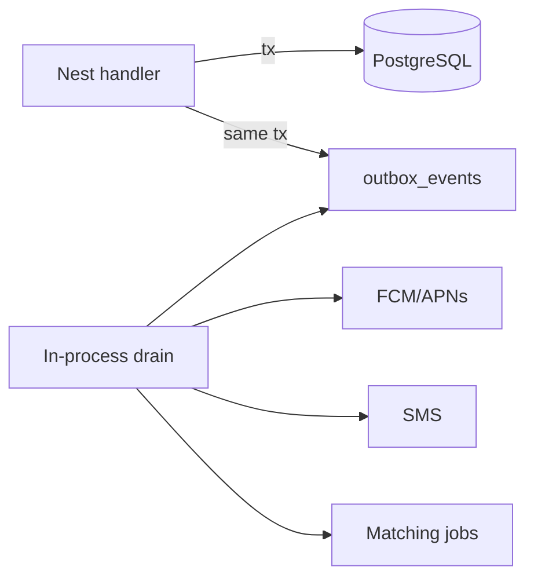

# 08 — Async work & events

**Status:** `proposed`  
**Last updated:** 2026-10-07

## Why async

Some PartOn flows should not block the HTTP request:

- Push notification fan-out
- Matching score recompute / feed materialization
- SMS retries
- Abuse heuristics
- Rating reminders after shift complete

## Approach

**Start (locked):** no separate worker app/process. Nest request path writes DB + **outbox row**; **in-process** drain (or Nest scheduled tasks) handles side effects.

**Later (when needed):** introduce a separate worker and/or Redis + BullMQ (or equivalent). Horizontal scaling, connection pooling, cache, and observability follow the scalability section in [`../01-architecture-decisions.md`](../01-architecture-decisions.md).

## Domain events (examples)

| Event | Producers | Consumers | Catalog |
| --- | --- | --- | --- |
| `user.registered` | auth | notifications, policies | CASE-AUTH |
| `job.published` | jobs | matching, notifications | T-100, T-107–T-108 |
| `application.submitted` | applications | notifications | T-101 |
| `application.accepted` / `rejected` | applications | shifts, notifications, tokens | T-102–T-103, T-096–T-097 |
| `shift.confirm_3h_due` | scheduler | notifications | T-104, T-114 |
| `shift.checkin_due` | scheduler | notifications | T-105, T-123 |
| `shift.availability_declined` | shifts | notifications, tokens | T-116, T-119 |
| `shift.checked_in` | shifts | notifications, tokens capture | T-133, T-156 |
| `shift.dispute_opened` | shifts | notifications, moderation | T-135, T-212 |
| `shift.completed` | shifts | ratings schedule (+24h) | T-106, T-172 |
| `favorite.job_for_audience` | jobs/favorites | notifications | T-107–T-108 |

Notification invariants from CASE-NOTIFICATIONS: no duplicates (T-110), correct deep link (T-109), inbox fallback if push off (T-111), never wrong user (T-113).

Keep event payloads small (IDs + type); load details in consumers.

## Nest patterns

- Prefer dedicated providers (`NotificationsDispatcher`, `MatchingScheduler`) imported where needed
- For looser coupling, use an internal `EventBus` (Nest `EventEmitter` or CQRS) **inside** the monolith
- Do not expose raw event bus over the public internet

## Reliability rules

1. Side effects after commit (or via outbox) — never SMS before user row exists
2. Consumers idempotent (`event_id` processed table)
3. Retries with backoff; dead-letter for poison messages
4. Observability: queue depth, failure rate, lag

## Sync vs async decision guide

| Do sync | Do async |
| --- | --- |
| Auth verify response | Push “you got a job” |
| Create application row | Recompute feed for many workers |
| Check-in validation result | Post-shift rating nudge |

## Related case groups

`CASE-NOTIFICATIONS`, `CASE-MATCHING`, `CASE-PERF`, `CASE-E2E`
