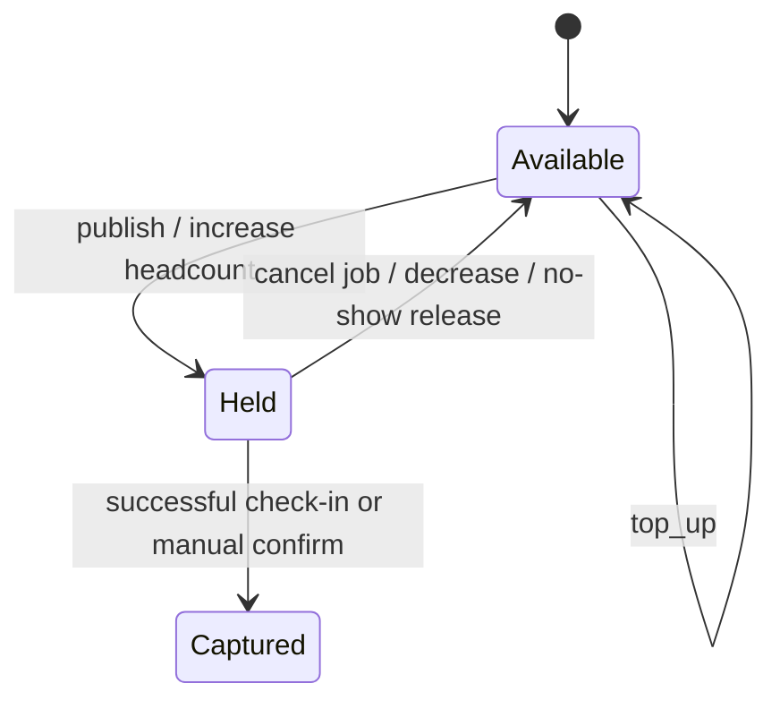

# 11 — Tokens & provision (CASE-TOKEN)

**Status:** `proposed`  
**Cases:** T-149–T-163 (+ E2E T-203, T-209, T-214, T-220, T-225)  
**Module:** first-class Nest `tokens`

## Why first-class

Token holds/captures are money-adjacent and appear in job publish, headcount changes, no-shows, check-in, and disputes. They must not be ad-hoc fields on `jobs`.

## Ledger model

| Concept | Meaning |
| --- | --- |
| `balance` | Spendable tokens |
| `hold` | Reserved for open headcount seats |
| `capture` | Final debit when attendance confirmed |
| `release` | Return hold to balance |
| `top_up` | Credit from payment |



## Rules (from catalog)

| Rule | Cases |
| --- | --- |
| Publish requires `available >= headcount` | T-149, T-150 |
| Hold amount = headcount | T-151, T-220 |
| Cancel unpublished/open job → release holds | T-152 |
| No applicants / no accepts → release on close/expiry | T-153, T-154 |
| Accepted but no-show → release or penalty policy (`open`) | T-155 |
| Check-in / manual confirm → capture 1 per attendee | T-156, T-203 |
| Multi-headcount partial attendance → partial capture | T-157, T-225 |
| Increase headcount → additional hold or block | T-158 |
| Decrease headcount → release excess hold | T-159 |
| Idempotent ops (network retry safe) | T-160, T-232, T-233 |
| Failed payment → job stays draft | T-161 |
| Full movement history | T-162 |
| Balance updates immediately in UI | T-163 |

## Suggested tables

- `token_accounts` (employer_id, balance)
- `token_holds` (job_id, seat_index?, amount, status)
- `token_ledger_entries` (id, employer_id, type, amount, ref_type, ref_id, idempotency_key, created_at)

## REST API

Public (employer-facing):

```http
GET  /api/v1/employers/me/tokens
GET  /api/v1/employers/me/tokens/ledger
POST /api/v1/employers/me/tokens/top-ups   # payment intent
```

Internal Nest service methods used by `jobs` / `shifts` (in-process — not a second HTTP API):

- `holdForJob(jobId, headcount, idemKey)`
- `adjustHold(jobId, newHeadcount, idemKey)`
- `releaseHold(jobId, reason, idemKey)`
- `captureForShift(shiftId, idemKey)`

## UI

- Mobile: `m.employer.tokens.root`
- Web: `w.employer.tokens.overview`, `w.employer.tokens.history`
- UX case T-243: copy must explain hold vs capture

## Open product questions

| ID | Question |
| --- | --- |
| TK-1 | No-show after `can_come`: capture fee, release, or strike only? |
| TK-2 | Manual GPS confirm: always capture? |
| TK-3 | Payment provider |
