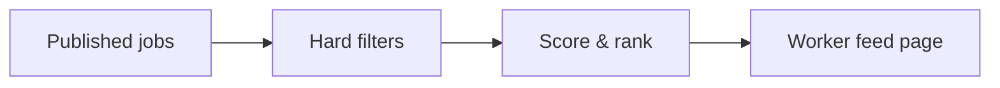

# 12 — Matching rules engine (CASE-MATCHING)

**Status:** `proposed`  
**Cases:** T-058–T-079 (+ feed visibility in E2E T-197)  
**Module:** `matching` (server-only; RN never invents eligibility)

## Pipeline



## Hard filters (must hide job)

| Filter | Pass when | Cases |
| --- | --- | --- |
| Day | Worker availability includes job day | T-058, T-059 |
| Time | Worker ranges cover job window per coverage rule | T-060, T-061, T-071, T-072 |
| Sector | Intersection with worker sectors | T-062, T-063, T-069 |
| Occupation | Intersection with worker occupations | T-064, T-065, T-070 |
| Documents | Worker has all required doc types | T-066, T-067 |
| Demographics | Age/gender match job constraints if set | T-027, T-028, T-044 |
| Favorites-only | Worker is favorited by employer (or mutual — product) | T-075, T-168, T-169 |
| Profile complete | Worker may apply (also enforced on apply) | T-029, T-082 |
| Job state | Published, not expired, seats remaining | T-083, T-084 |

### Time coverage (`open` product)

| Mode | Meaning | Cases |
| --- | --- | --- |
| `full_cover` | Worker range fully contains job interval | T-072 |
| `partial_overlap` | Any overlap counts | T-071 |

Night shifts (cross-midnight) must use interval normalization (T-019, T-073).

## Ranking (soft)

Suggested score components (weights tunable via admin config):

| Signal | Effect | Cases |
| --- | --- | --- |
| Distance | nearer → higher | T-068, T-076 |
| Match score | more matched attributes | T-077 |
| Favorite employer | boost | T-074, T-078 |
| Start time soonness | sooner → higher | T-079 |

Return `matchReasons[]` to the client for UX (T-238).

## Recompute triggers

- Worker availability/sectors/occupations/docs/demographics/location change (T-026–T-028)
- Job publish/edit/close
- Favorite add/remove (T-171)

Prefer async re-index for large fan-out (CASE-PERF T-228).

## REST API

Matching is server-side; clients only consume REST:

```http
GET /api/v1/jobs/feed?cursor=&limit=
GET /api/v1/jobs/:id   # includes eligibility + reasons for current user
```

## Anti-patterns

- Client-side only filtering of a global job list
- Showing favorites-only jobs to non-favorites “greyed out” if that leaks existence — prefer omit (T-075)
