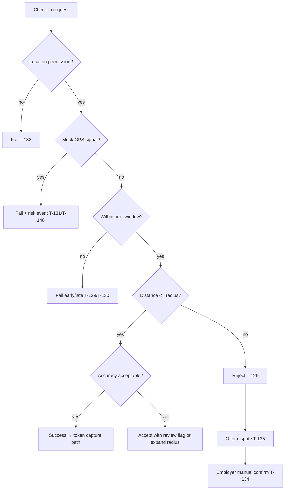

# 13 — Location & geofence policy (CASE-LOCATION + CHECKIN)

**Status:** `proposed`  
**Cases:** T-125–T-135, T-136–T-148, E2E T-201–T-202, T-210–T-214  
**Modules:** `location`, `shifts`, `branches`, `moderation`

## Goals

1. Trust branch coordinates as geofence center (T-136–T-137).
2. Validate check-in with configurable radius (T-138–T-139).
3. Soften UX for known GPS pain (indoor/mall/high-rise/rural) without opening fraud (T-140–T-143).
4. Reject mock GPS / spoofing attempts (T-131, T-148, T-188).
5. Provide manual confirm + dispute when GPS fails but worker is present (T-134–T-135, T-212–T-213).

## Check-in decision tree



## Config (admin `w.admin.config.remote`)

| Key | Example | Cases |
| --- | --- | --- |
| `geofence.radius_m` | 50 / 100 | T-138, T-139 |
| `geofence.max_accuracy_m` | 30–80 | T-127 |
| `geofence.soft_radius_m` | 150 indoor assist | T-140–T-142 |
| `checkin.early_minutes` | 15 | T-129 |
| `checkin.late_minutes` | 30 | T-130 |
| `location.require_background` | false v1 | T-146 |

## Platform notes

| Topic | Guidance | Cases |
| --- | --- | --- |
| iOS vs Android | Document permission strings & accuracy APIs separately | T-147 |
| Wi-Fi assist | Optional fused location; never sole trust | T-144 |
| Moving check-in | Require stable sample or short dwell | T-145 |
| No background loc | Foreground only for v1 check-in | T-146 |

## Persistence & privacy (CASE-SECURITY · KVKK)

- Store check-in event: lat/lng/accuracy/timestamp/device flags — **not** continuous tracks (T-250)
- Signed access only; not in public logs (T-252); round/omit coords in application logs
- Purpose: attendance verification unless legal expands purpose
- Retention: raw geo **90 days** then anonymize — locked matrix in [`17-privacy-kvkk-gdpr.md`](17-privacy-kvkk-gdpr.md)
- Dispute: keep evidence window, then anonymize coordinates

## REST APIs

```http
POST /api/v1/shifts/:id/check-in
POST /api/v1/shifts/:id/disputes
POST /api/v1/shifts/:id/manual-confirm   # employer/manager
```

## Screens

- `m.worker.shift.check-in`
- `m.worker.shift.dispute` (**new**)
- `m.employer.shift.manual-confirm` / `w.employer.shift.attendance` (**new**)
