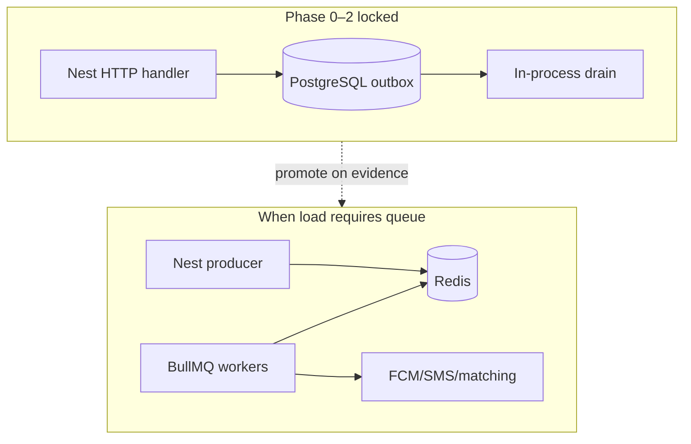

# 14 — BullMQ vs RabbitMQ (async backbone)

**Status:** `accepted` (default when a broker is introduced)  
**Last updated:** 2026-10-09  
**ADR:** [0007 — BullMQ over RabbitMQ for PartOn jobs](adr/0007-bullmq-over-rabbitmq.md)  
**Architecture home:** [`../04-application-architecture.md`](../04-application-architecture.md) §0 · §4  
**Depends on:** locked “no separate worker at start” → Postgres **outbox + in-process drain** first ([08-async-events.md](08-async-events.md))

## Verdict

| Question | Answer |
| --- | --- |
| Day-1 async? | **Neither.** Transactional outbox in PostgreSQL + in-process drain. |
| First external queue (when load requires it)? | **BullMQ on Redis** via `@nestjs/bullmq`. |
| RabbitMQ? | **Hold** for PartOn’s Nest modular monolith — revisit only if polyglot consumers or AMQP routing become real requirements. |
| Kafka / NATS? | Still **Hold** for v1–v2 (event streaming / multi-service bus). |

**One-line rule:** PartOn needs *reliable background jobs* (“do this work, retry, delay, observe”), not a *multi-service message bus*. BullMQ fits; RabbitMQ is the wrong complexity tax for our locked shape.

---

## What PartOn actually queues

Map async work to the right abstraction before picking a broker.

| Workload | Pattern | Catalog signals |
| --- | --- | --- |
| Push / SMS send + retry | Job with exponential backoff | CASE-NOTIFICATIONS |
| Matching feed recompute | Job / batch job | CASE-MATCHING, CASE-PERF |
| 3h confirm / check-in / rating reminders | **Delayed / repeatable** jobs | CASE-AVAILABILITY-3H, CASE-CHECKIN, CASE-RATINGS |
| Abuse heuristics | Job (low priority) | CASE-ABUSE |
| Domain “something happened” inside monolith | In-process event bus **or** outbox → job | All modules |

These are **commands/tasks**, not cross-language fan-out topics. Delayed and cron-like schedules are first-class in BullMQ; they are awkward to reinvent on raw AMQP.

---

## Side-by-side comparison

| Dimension | BullMQ (+ Redis) | RabbitMQ (AMQP) |
| --- | --- | --- |
| Primary mental model | **Job queue** — named queues, job state machine (waiting/active/completed/failed) | **Message broker** — exchanges, bindings, routing keys |
| NestJS fit | Official `@nestjs/bullmq` (Bull is maintenance-mode; prefer BullMQ) | `@nestjs/microservices` AMQP transport or community wrappers — less “job dashboard” native |
| Delayed / scheduled work | Built-in delayed + repeatable (cron-style) jobs | Needs TTL/DLX/plugin patterns or an external scheduler |
| Retries / backoff | First-class (`attempts`, exponential backoff) | Manual ack/nack + DLX design |
| Rate limiting / concurrency | Built-in limiter + worker concurrency | Prefetch + custom app logic |
| Observability | Job states in Redis; Bull Board (or equiv.) | Management plugin / Prometheus exporters |
| Infra footprint | Redis (often already wanted for cache / rate-limit) | Erlang broker cluster + ops playbooks |
| Persistence story | Redis AOF/RDB; configure retention (`removeOnComplete` / fail keep) | Durable queues / mirrored/quorum queues |
| Polyglot producers/consumers | Weak (Node/Redis-centric; Python BullMQ exists but not our stack) | Strong (AMQP is language-agnostic) |
| Fan-out / topic routing | Weak (one consumer group per job; not pub/sub bus) | Strong (fanout/topic/headers exchanges) |
| Multi-service shared bus | Possible but not the sweet spot | Designed for this |
| Ops complexity for PartOn team | Low–medium | Medium–high |
| Fits modular monolith | Excellent | Overkill until extract/polyglot |

### Architecture fit diagram

RabbitMQ would insert a **broker topology** (exchanges/queues) between Nest modules that today share an in-process address space — paying bus complexity without bus benefits.

---

## Decision matrix (use this in reviews)

Choose **BullMQ** when most of these are true (PartOn today):

- [x] All workers are Nest/Node in our monorepo  
- [x] Work is “process this job” with retries  
- [x] We need delayed jobs (3h confirm, +24h rating)  
- [x] Redis is acceptable infra (cache/rate-limit later anyway)  
- [x] We are not a multi-team AMQP platform  

Choose **RabbitMQ** only if several become true:

- [ ] Non-Node consumers must share the same bus  
- [ ] True pub/sub fan-out to many independent services  
- [ ] Complex topic/header routing across bounded contexts as *deployables*  
- [ ] Org standardizes on AMQP as shared platform infra  

Until those boxes flip, RabbitMQ is a premature platform bet.

---

## Recommended PartOn evolution

### Stage A — Now (locked)

1. Write domain change + `outbox_events` in the **same Postgres transaction**.  
2. In-process (or Nest cron) drain: enqueue side effects after commit.  
3. Consumers **idempotent** (`event_id` / `jobId` processed table).  

### Stage B — First broker (P4 / AO-3 trigger)

Evidence gates (any one is enough to spike):

- Outbox lag / drain CPU blocks HTTP p95  
- Notify fan-out or matching recompute fails CASE-PERF budgets  
- Need horizontal worker replicas without scaling the API process  

Then:

1. Provision **managed Redis** for queues — `noeviction` + AOF (`everysec`) — see [15-redis-management.md](15-redis-management.md) / [ADR-0008](adr/0008-managed-redis.md).  
2. Introduce `@nestjs/bullmq` queues, e.g.:

| Queue name | Jobs |
| --- | --- |
| `notifications` | push, SMS, inbox fan-out |
| `matching` | recompute / materialize feed pages |
| `shifts.schedule` | 3h confirm, check-in nudge, rating window |
| `moderation` | abuse heuristics, risk scoring |

3. Prefer: HTTP handler → outbox → **outbox relay** enqueues BullMQ jobs (keeps transactional integrity). Avoid “enqueue Redis inside the DB transaction” without a dual-write story.  
4. Workers may start **in the same Nest process**; extract a `apps/backend-worker` (or Nest app context) only when Stage B evidence says so.  
5. Configure retries (exponential backoff), failed-job retention, and dead-letter / failed queue inspection (Bull Board or admin ops view).  
6. Do **not** put application cache keys on the queue Redis; split cache Redis later if needed.

### Stage C — Revisit RabbitMQ (unlikely before multi-service)

Only after extracting multiple independently deployed services that need a shared bus, or adding non-Node workers.

---

## Nest implementation notes (BullMQ)

- Use **`@nestjs/bullmq`**, not legacy `@nestjs/bull` (Bull is maintenance-mode).  
- Register queues once; inject `Queue` in producers; `@Processor` classes in workers.  
- Keep payloads small: `{ type, aggregateId, eventId }` — load details from Postgres in the worker (same rule as outbox).  
- Graceful shutdown: wait for active jobs on SIGTERM (deploys).  
- Redis: **managed**, dedicated queue instance; `noeviction` + AOF; monitor memory / `evicted_keys=0`; set `removeOnComplete` age/count limits — [15](15-redis-management.md).  
- Never put PII (OTP codes, full phone+code) in job payloads or Redis logs.

Official Nest queues guide: [docs.nestjs.com/techniques/queues](https://docs.nestjs.com/techniques/queues) (BullMQ package).

---

## Anti-patterns

| Anti-pattern | Why it hurts |
| --- | --- |
| Introducing RabbitMQ “for scale” on day 1 | Ops without payoff; delayed jobs still hard |
| Dual-writing DB + Redis without outbox | Lost or duplicate side effects on crash |
| One giant `default` queue for all work | No isolation; noisy neighbor on matching vs SMS |
| Fire-and-forget `setImmediate` for push | Lost on deploy; no retry; fails CASE-NOTIFICATIONS |
| Using Kafka because “millions of users” | Streaming bus ≠ job queue; Hold until event-log need is real |

---

## Related

- ADR: [`adr/0007-bullmq-over-rabbitmq.md`](adr/0007-bullmq-over-rabbitmq.md)  
- Redis management: [`15-redis-management.md`](15-redis-management.md) · [`adr/0008-managed-redis.md`](adr/0008-managed-redis.md)  
- Async overview: [`08-async-events.md`](08-async-events.md)  
- Tech radar: [`../03-tech-radar-2026.md`](../03-tech-radar-2026.md)  
- Roadmap P4: [`../02-product-roadmap.md`](../02-product-roadmap.md)  
- Cases: `CASE-NOTIFICATIONS`, `CASE-PERF`, `CASE-AVAILABILITY-3H`, `CASE-E2E`  
