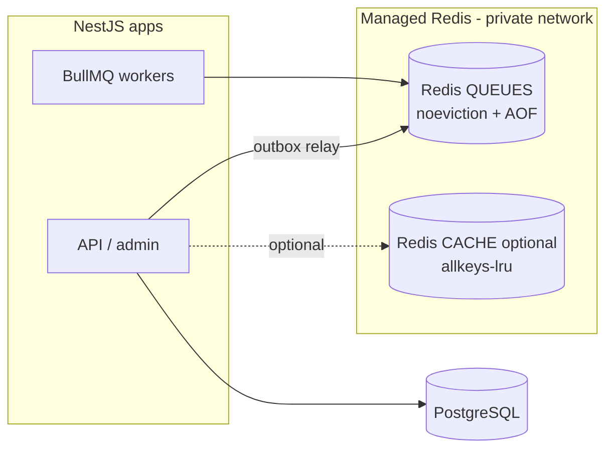
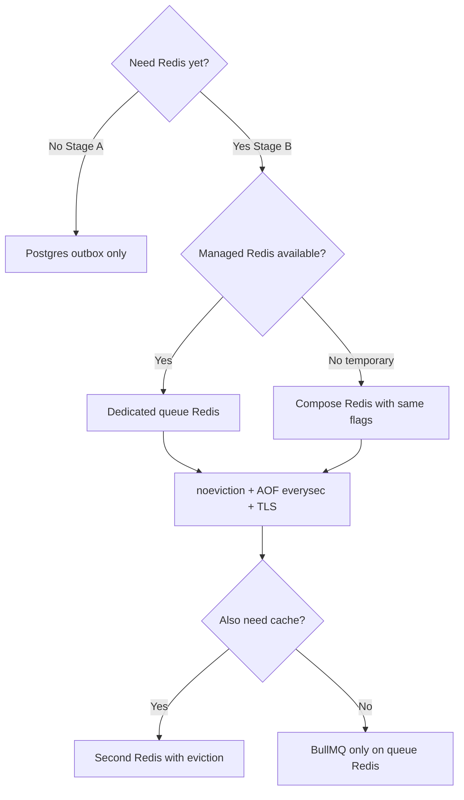

# 15 — Redis management (best practice for PartOn)

**Status:** `accepted` (ops baseline when Redis is introduced)  
**Last updated:** 2026-10-09  
**ADR:** [0008 — Managed Redis for BullMQ](adr/0008-managed-redis.md)  
**Depends on:** Stage B async — [14-bullmq-vs-rabbitmq.md](14-bullmq-vs-rabbitmq.md), [08-async-events.md](08-async-events.md)

## Verdict

| Question | Answer |
| --- | --- |
| Day-1 Redis? | **No.** Stage A uses Postgres outbox only. |
| Best management model? | **Managed Redis** (vendor-operated) — not a self-built Redis cluster on day of Stage B. |
| Best shape for BullMQ? | **Dedicated Redis instance** (or dedicated logical role) with `maxmemory-policy=noeviction` + **AOF** (`everysec`). |
| Same Redis for cache + queues? | **Avoid.** Split: queue Redis (`noeviction`) vs cache Redis (eviction OK). |
| Self-host Redis in k8s? | **Hold** until a platform team owns it; managed is the default. |

**One-line rule:** Treat Redis as a **managed data plane** with BullMQ-safe settings — never as an ephemeral “cache only” box that can evict queue keys.

---

## Why management model matters

BullMQ stores job state in Redis. Wrong hosting choices cause silent job loss:

| Misconfiguration | Failure mode |
| --- | --- |
| Default cache eviction (`allkeys-lru`, etc.) | Queue keys deleted → stuck/lost jobs ([BullMQ production guide](https://docs.bullmq.io/guide/going-to-production)) |
| No persistence | Node restart / failover empties queues |
| ElastiCache **Serverless** (as of BullMQ docs) | Incompatible `maxmemory-policy` for BullMQ — use **standard** nodes |
| Public Redis without TLS/ACL | Credential theft → job injection / data leak |
| One overloaded instance for cache + queues | Cache pressure → OOM; with `noeviction`, Nest writes fail hard |

---

## Recommended topology



| Role | Policy | Persistence | Used for |
| --- | --- | --- | --- |
| **Redis QUEUES** | `maxmemory-policy=noeviction` | AOF `appendfsync everysec` (+ RDB snapshots OK) | BullMQ only |
| **Redis CACHE** (optional, later) | `allkeys-lru` / `volatile-lru` | Optional / weaker OK | HTTP cache, rate-limit counters |

Key prefixes on the queue instance: `bull:` (BullMQ default) — never store app cache keys here.

---

## Managed provider matrix (pick with AO-10)

Cloud vendor is still open. Prefer the **managed Redis of the same cloud** as Nest + Postgres (latency + private networking).

| If cloud is… | Prefer | Notes for BullMQ |
| --- | --- | --- |
| **AWS** | **ElastiCache for Redis** — **standard** cluster/replication group | Custom parameter group: `maxmemory-policy=noeviction`. **Do not** use ElastiCache Serverless for BullMQ until BullMQ docs say it is compatible. Multi-AZ + replica. Private VPC only. |
| **GCP** | **Memorystore for Redis** | Standard tier / HA; set `maxmemory-policy`; enable persistence if offered for the tier you pick. |
| **Azure** | **Azure Cache for Redis** (Premium for persistence/geo options) | Configure `maxmemory-policy`; enable AOF/RDB per SKU. |
| **Cloud-agnostic / multi-cloud** | **Redis Cloud** (Redis Ltd) | Strong ops UX; pick EU/Turkey-adjacent region; enable persistence + HA. |
| **Local / CI** | Docker Redis **7+** | Compose service with AOF + `noeviction` for queue profile. |

**Self-managed Redis on VMs/k8s:** Hold for PartOn until there is a dedicated platform owner. Managed HA, patching, and failover beat “we run bitnami redis” for a product team.

---

## Hard requirements checklist (production queues)

### Redis server

- [ ] Redis **≥ 6.2** (prefer **7.x** line supported by the managed offering)
- [ ] `maxmemory-policy **noeviction**`
- [ ] `maxmemory` set to a real budget; alert at 70% / 85%
- [ ] **AOF on**, `appendfsync everysec` (BullMQ’s usual recommendation; ~1s loss window acceptable for push/SMS jobs)
- [ ] Optional: RDB snapshots for faster recovery (hybrid persistence)
- [ ] Replication + automatic failover (Multi-AZ / HA tier) for staging+prod
- [ ] TLS in transit; AUTH / ACL users (no passwordless prod)
- [ ] Network: private VPC / private service connect only — not public `0.0.0.0/0`
- [ ] Separate **queue** instance from **cache** instance when cache is introduced

### Nest / BullMQ client

- [ ] `@nestjs/bullmq` + ioredis connection from env (`REDIS_QUEUE_URL`)
- [ ] Dedicated connection options per BullMQ guidance (Queue vs Worker offline queue behavior)
- [ ] `removeOnComplete` age/count limits — prevent unbounded Redis growth
- [ ] Keep failed jobs inspectable; alert on failed/stalled counts
- [ ] Graceful shutdown waits for active jobs on deploy
- [ ] Readiness: Redis PING when Stage B is enabled (`GET /health/ready`)

### Ops

- [ ] Metrics: used memory, evicted_keys (**must stay 0** on queue Redis), connected clients, replication lag, BullMQ waiting/active/failed
- [ ] Runbooks: failover, memory full (`noeviction` → OOM / write errors), poison job replay
- [ ] Backups / restore drill once per quarter on staging

---

## Environment matrix

| Env | Redis | Notes |
| --- | --- | --- |
| `local` | Docker Compose Redis 7 | Queue profile: AOF + `noeviction` |
| `ci` | Service container or Testcontainers | Ephemeral OK; same policy flags |
| `staging` | Managed, single-AZ OK | Same policies as prod; smaller size |
| `production` | Managed HA / Multi-AZ | Persistence + noeviction + TLS + ACL |

Example Compose profile (local queues):

```yaml
# illustrative — not scaffolding
services:
  redis-queue:
    image: redis:7-alpine
    command:
      - redis-server
      - --appendonly
      - "yes"
      - --appendfsync
      - everysec
      - --maxmemory-policy
      - noeviction
      - --maxmemory
      - 256mb
```

---

## What not to do

| Anti-pattern | Why |
| --- | --- |
| Use Redis as “cache” with LRU for BullMQ | Jobs disappear under memory pressure |
| ElastiCache Serverless for BullMQ without verifying policy | BullMQ docs: incompatible maxmemory-policy |
| Dual-write Postgres + Redis without outbox relay | Lost/dup side effects on crash |
| Put OTP codes / tokens in Redis job payloads | Security / KVKK |
| One giant shared Redis for every team/env | Blast radius; noisy neighbors |
| Self-host Redis “to save money” without HA/backups | False economy; lost notifications = product defects |

---

## Decision flow



---

## Related

- ADR: [`adr/0008-managed-redis.md`](adr/0008-managed-redis.md)  
- BullMQ vs RabbitMQ: [`14-bullmq-vs-rabbitmq.md`](14-bullmq-vs-rabbitmq.md)  
- Async stages: [`08-async-events.md`](08-async-events.md)  
- Observability: [`09-observability.md`](09-observability.md)  
- Tech radar: [`../03-tech-radar-2026.md`](../03-tech-radar-2026.md)  
