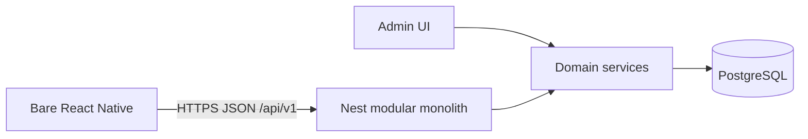
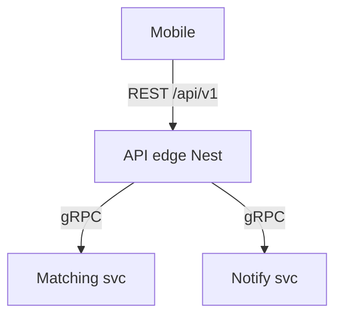

# 16 — REST vs gRPC (vs both)

**Status:** `accepted` (public edge); hybrid `Hold` until multi-service  
**Last updated:** 2026-10-09  
**ADR:** [0004 — REST public API](adr/0004-rest-json-api.md) · [0009 — REST edge; gRPC not for clients](adr/0009-rest-vs-grpc.md)  
**Architecture home:** [`../04-application-architecture.md`](../04-application-architecture.md) §0 · §4

## Verdict

| Surface | Choice | Status |
| --- | --- | --- |
| **Mobile (bare RN) ↔ backend** | **REST / JSON** `/api/v1` only | **Locked** |
| **Admin UI ↔ domain rules** | In-process Nest services (optional REST) | **Locked** |
| **Module ↔ module (today)** | In-process providers (`exports`) — **not** gRPC | **Locked** (modular monolith) |
| **gRPC to mobile / public internet** | **No** | **Hold / rejected** |
| **Both (REST + gRPC)** | Only if we extract internal deployables later: REST north-south, gRPC east-west | **Hold** — needs new ADR + evidence |

**One-line rule:** PartOn’s *product* API is REST. gRPC is an *internal* tool for a future multi-service world we have explicitly not started. Do not run both “for modernity.”

---

## What each protocol optimizes for

| Dimension | REST / JSON (HTTP) | gRPC (HTTP/2 + Protobuf) |
| --- | --- | --- |
| Contract style | Resources + verbs; OpenAPI / Zod | RPC methods; `.proto` |
| Payload | Human-readable JSON | Compact binary |
| Browser / curl / QA | Excellent | Weak without grpc-web / special clients |
| Mobile (RN) | Ubiquitous `fetch` / HTTP clients | Possible natively, but dual contract + codegen cost |
| Streaming | SSE / websockets (separate) | First-class client/server/bidi streams |
| AuthZ at edge | Natural HTTP status + guards | Metadata + status codes; different ops story |
| Case catalog mapping | Already maps to REST paths | Would re-map every screen **API** row |
| Nest fit today | Controllers + Swagger | `@nestjs/microservices` Transport.GRPC |
| Ops familiarity | High for web/mobile teams | Higher platform tax (HTTP/2, protos, LB support) |

PartOn workloads (OTP, apply, accept, check-in, token ledger) are **request/response commands and resource CRUD** — not high-frequency streaming telemetry. REST fits the domain shape.

---

## Options evaluated

### A — REST only (chosen for v1–v2 public + monolith)

**Use when (all true for PartOn now):**

- Clients are mobile + (Nest-hosted) admin  
- One deployable owns business rules  
- Shared Zod/OpenAPI contracts are a locked requirement  
- Team optimizes for debuggability and case-id → endpoint mapping  

### B — gRPC only (rejected)

Expose only gRPC to clients and drop REST.

**Why not:**

- Breaks locked shared JSON schema packages and OpenAPI mobile codegen path  
- Worse day-to-day QA (`curl`, Charles/Proxyman, case harnesses)  
- Admin and partner-style tooling expect HTTP JSON  
- No measured bottleneck justifying binary RPC to the phone  

### C — Both (hybrid) — future pattern only

Industry pattern when you have **many services**:

| Direction | Protocol |
| --- | --- |
| North-south (clients → edge) | **REST** (or gateway) |
| East-west (service → service) | **gRPC** (optional) |

**PartOn today:** east-west is **in-process function calls**, which is faster and simpler than gRPC inside one Node process. Hybrid REST+gRPC only becomes rational **after** extracting independently deployed services *and* proving call volume/latency needs.

**Do not** invent microservices so that gRPC has somewhere to live.

---

## Decision matrix

| Question | REST | gRPC | Both |
| --- | --- | --- | --- |
| Mobile contract for Turkey MVP? | **Yes** | No | REST edge only |
| Shared Zod schemas in monorepo? | **Yes** | Would duplicate as `.proto` | REST keeps Zod; protos internal only later |
| Modular monolith modules? | Controllers → services | Unnecessary | Unnecessary |
| High-frequency internal multi-service calls later? | OK if rare | **Better** | REST + gRPC |
| Public partners / webhooks later? | **Yes** | No | REST |
| Streaming check-in telemetry? | Prefer push + REST commands | Possible | Not a v1 need |

---

## PartOn policy (enforce in reviews)

1. **Every mobile/admin product capability** ships as `/api/v1/...` REST.  
2. **No gRPC (or gRPC-Web) dependency** in `apps/mobile`.  
3. **No second public surface** that bypasses Nest domain services.  
4. **Internal calls stay in-process** until AO-3 / multi-service ADRs say otherwise.  
5. If a future service extract happens, prefer: keep REST at the edge; consider gRPC **only** for east-west; still **one** rule layer ownership story.  
6. Connect-RPC / tRPC remain Hold for the public edge (same rationale as ADR-0004).

---

## Anti-patterns

| Anti-pattern | Why it hurts |
| --- | --- |
| “REST for some screens, gRPC for check-in” | Two client stacks, two auth stories, fractured case mapping |
| gRPC to RN “for performance” without profiles | Premature; OTP/apply are not RPC-bound |
| Dual controllers (REST + gRPC) on every module day-1 | Double maintenance, zero extract benefit |
| Exposing `.proto` as the mobile contract while keeping Zod | Contract drift |
| Using Nest microservices transport inside the monolith for module calls | Distributed complexity without distribution |

---

## Related

- REST conventions: [`06-api-conventions.md`](06-api-conventions.md)  
- ADR-0004: [`adr/0004-rest-json-api.md`](adr/0004-rest-json-api.md)  
- ADR-0009: [`adr/0009-rest-vs-grpc.md`](adr/0009-rest-vs-grpc.md)  
- Modular monolith: [`03-modular-monolith.md`](03-modular-monolith.md)  
- Tech radar: [`../03-tech-radar-2026.md`](../03-tech-radar-2026.md)  
