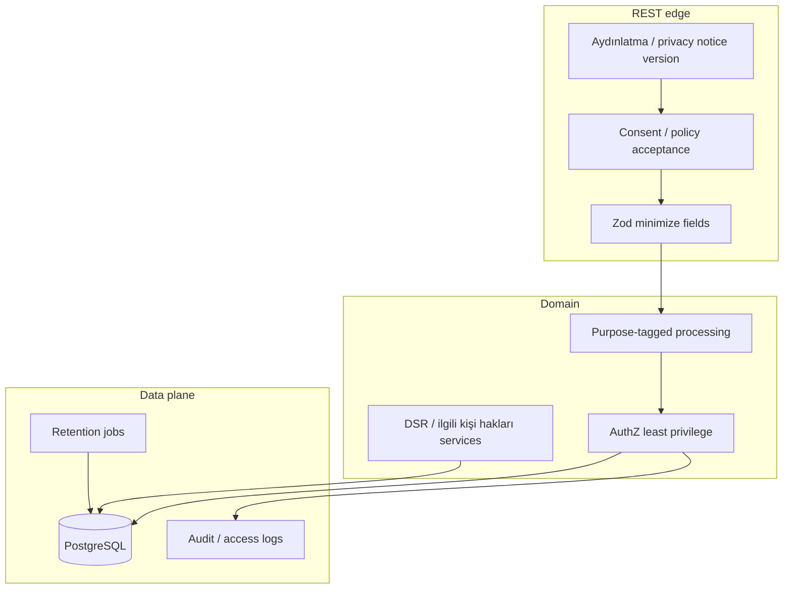
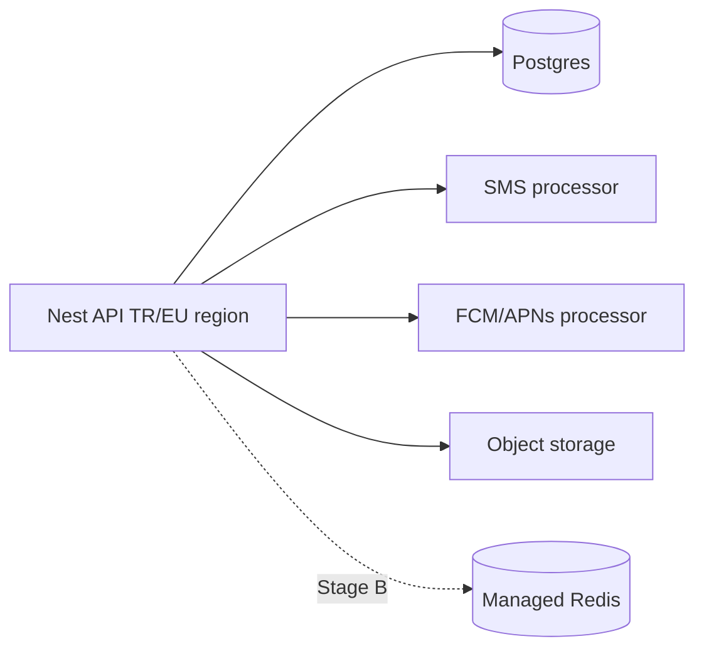

# 17 — Privacy architecture (KVKK + GDPR)

**Status:** `accepted` (engineering baseline); legal texts require counsel  
**Last updated:** 2026-10-09  
**ADR:** [0010 — Privacy-by-design (KVKK primary, GDPR-ready)](adr/0010-privacy-kvkk-gdpr.md)  
**Architecture home:** [`../04-application-architecture.md`](../04-application-architecture.md) § privacy  
**Cases:** `CASE-SECURITY` (T-246–T-252), `CASE-AUTH` (policies), location T-250

> **Not legal advice.** This document defines **application architecture controls** so PartOn can operate as a Turkey-first product under **KVKK (Law 6698)** and stay **GDPR-ready** if EU data subjects or EU hosting appear. Final lawful bases, VERBIS filings, and policy wording belong to legal/compliance.

---

## Verdict

| Topic | PartOn stance |
| --- | --- |
| Primary regime | **KVKK** (Turkey market launch) |
| Secondary | **GDPR-ready** controls (same technical patterns; activate EU-specific transfer tools if needed) |
| Design principle | **Privacy by design & by default** in Nest modules + REST contracts |
| Data residency | Prefer **Turkey or EU-adjacent** region once AO-10 lands; document every cross-border processor |
| Client API | REST only — no PII over gRPC/public buses; minimize job payloads (BullMQ) |

---

## Roles (architecture mapping)

| Role (KVKK / GDPR) | PartOn entity (typical) | System implication |
| --- | --- | --- |
| **Data controller** (veri sorumlusu / controller) | PartOn operating company | Owns purposes, policies, DSR answers, breach process |
| **Data processor** (veri işleyen / processor) | SMS, FCM/APNs, cloud host, object storage, managed Redis, email | Bound by DPA / sözleşmeler; listed in subprocessor register |
| **Data subject** (ilgili kişi / data subject) | Worker, employer user, manager, admin user | Rights via REST + admin ops |

Architecture must make controller vs processor boundaries **visible in config and docs** (which vendor stores what).

---

## Personal data in PartOn (inventory sketch)

Classify every new field before it ships. Update this table in ERD workshops.

| Category | Examples | Sensitivity | Notes |
| --- | --- | --- | --- |
| Identity | phone, name, user id | High | Phone is primary login identifier |
| Auth secrets | OTP hash, refresh token hash | Critical | Never log; never put in BullMQ payloads |
| Profile | age, gender, sectors, availability | Medium–High | Demographics may need explicit purpose + notice |
| Location | home pin, check-in lat/lng/accuracy | High | **Event-based only** — no continuous tracking (T-250) |
| Documents | certificates, uploads | High | Signed URLs; retention per doc type |
| Org / tax | tax id, company name, branch address | High | Employer verification |
| Behavioral | applications, ratings, device signals | Medium | Abuse/risk — purpose-limited |
| Comms | push tokens, notification content | Medium | Provider = processor |

**Special / sensitive categories:** avoid collecting health/biometric data in v1. If product later requires them, gate behind DPIA/KVKK impact assessment + explicit legal sign-off.

---

## Privacy-by-design controls (must build)



| Control | Architecture requirement | Module / API sketch |
| --- | --- | --- |
| **Notice (aydınlatma)** | Versioned legal texts; show before/at collection | `policies` — `GET /api/v1/policies`, acceptances |
| **Consent / acceptance** | Immutable acceptance records (policy id, version, timestamp, user, channel) | `policy_acceptances` |
| **Minimization** | Zod schemas reject unknown/excess fields; no “log the whole body” | `api-contracts` + Nest pipes |
| **Purpose limitation** | Processing tied to stated purposes (account, matching, check-in, billing tokens, security) | Domain services; no secondary reuse without review |
| **Storage limitation** | Retention schedule + scheduled purge/anonymize jobs | Nest `@Cron` / Stage B BullMQ `privacy.retention` |
| **Integrity & confidentiality** | TLS, hashed secrets, least-privilege DB roles, queue `noeviction` Redis without PII payloads | Auth, data layer, Redis doc |
| **Accountability** | ROPA-like processing register (doc + metadata); legal audit logger + admin CSV/PDF | Admin + `legal_audit_events` — [ADR-0037](adr/0037-legal-audit-logger.md) · [22](22-legal-audit-logger.md) |
| **DSR (ilgili kişi hakları)** | Machine-supported export/erase/rectify flows with SLA tracking | `privacy` or `users` module + admin |
| **Breach readiness** | Detect, contain, notify playbook; log correlation ids | Observability + ops runbook |

---

## Lawful processing (engineering hooks — legal fills bases)

Architecture must support **multiple bases**, not “consent for everything”:

| Processing | Typical hook (illustrative) | Product surface |
| --- | --- | --- |
| Account creation / auth | Contract / legitimate interest + notice | OTP register |
| Matching & job feed | Contract / consent as legal directs | Profile + availability |
| Check-in geolocation | Explicit purpose + notice; store event only | Check-in API |
| Marketing push (if any) | Separate opt-in | Notification preferences |
| Fraud / abuse | Security purpose; retain with limits | moderation / risk |
| Employer tax verification | Legal obligation / contract | employer verification |

**Implementation rule:** `notification_preferences` and marketing flags are **separate** from account TOS acceptance. Do not overload one checkbox.

---

## Data subject rights (DSR) — API & ops

Support KVKK ilgili kişi hakları and GDPR-aligned rights with the same technical pipeline:

| Right | Technical behavior | Notes |
| --- | --- | --- |
| **Inform / access** | Export package (JSON) of personal data held | Authenticated user + admin-assisted |
| **Rectification** | Existing `PATCH` profile/employer endpoints | Audit who changed what |
| **Erasure / restriction** | Soft-delete → purge/anonymize per retention matrix | Keep legal hold / dispute exceptions |
| **Objection / withdraw consent** | Preference + consent version records | Especially marketing / optional location |
| **Portability (GDPR-ready)** | Machine-readable export | Same export job |

Proposed REST (illustrative):

```http
POST /api/v1/privacy/export-requests
GET  /api/v1/privacy/export-requests/:id
POST /api/v1/privacy/erasure-requests
GET  /api/v1/me/consents
POST /api/v1/policies/acceptances
PATCH /api/v1/notifications/preferences
```

Admin must be able to process requests that need identity verification beyond self-service.

---

## Location & check-in (KVKK-sensitive)

Aligned with CASE-SECURITY T-250 / location policy:

| Rule | Architecture |
| --- | --- |
| No continuous tracking | Store **check-in/check-out events**, not trails |
| Minimize precision in logs | Round or omit lat/lng in application logs |
| Purpose | Attendance verification only unless legal expands |
| Retention | Shorter TTL for raw geo than for shift outcome |
| Dispute | Keep evidence window, then anonymize |

Doc: [`13-location-policy.md`](13-location-policy.md).

---

## Cross-border transfers & subprocessors

Turkey-first launch still often uses foreign SMS/push/cloud. Architecture requirements:

1. **Maintain a subprocessor register** (vendor, data categories, region, DPA status).  
2. **Prefer regions** that match legal guidance (TR / EU) for Postgres and Redis when AO-10 is decided.  
3. Every new vendor PR updates the register + privacy notice version if categories change.  
4. If GDPR applies later: document SCCs / adequacy / other transfer tools — legal owns text; eng owns “no shadow vendors.”  
5. **BullMQ / Redis / logs** must not become accidental transfer of OTP codes or document contents.



---

## Retention matrix (locked engineering defaults)

| Data class | Retain | Then |
| --- | --- | --- |
| OTP challenges | **24 hours** max | Hard delete |
| Refresh sessions | Until logout/expiry/revoke (token TTL) | Hard delete hash |
| Check-in geo raw | **90 days** | Anonymize / delete coords; keep shift outcome |
| Applications / shifts | Account life + **7 years** after terminal state (or legal hold) | Anonymize PII; keep aggregate stats |
| Ratings text | **3 years** | Moderate / delete on erasure (unless dispute hold) |
| Push tokens | Until invalid / logout | Delete |
| Legal audit events | **7 years** (`LEGAL_AUDIT_RETENTION_DAYS=2555`) — ADR-0037 | Purge unless legal hold |
| Policy acceptances | **10 years** (`POLICY_ACCEPTANCE_RETENTION_DAYS=3650`) | Retain for accountability |

Implement as scheduled jobs (`privacy.retention`) with metrics and dry-run mode in staging. **No TODO placeholders** in code for these defaults; change only via ADR.

---

## REST, jobs, and privacy

| Surface | Privacy rule |
| --- | --- |
| **REST `/api/v1`** | Only fields needed; authz on every read of others’ PII |
| **Outbox / BullMQ** | Payload = ids + type; load PII inside worker from DB under AuthZ |
| **RabbitMQ / gRPC** | Not used for public PII paths (Hold) |
| **OpenAPI / logs** | Redact phone, tokens, geo, documents |
| **Admin** | Privileged access audited; break-glass for exports |

---

## Module ownership

| Concern | Nest home (proposed) |
| --- | --- |
| Policy texts + acceptances | `policies` |
| Consents / preferences | `policies` + `notifications` |
| DSR export/erasure | `privacy` (new) or `users` + admin |
| Retention jobs | `privacy` + infra scheduler/BullMQ |
| Location minimization | `location` + `shifts` |
| Subprocessor config | `config` + ops docs |

---

## Delivery alignment

| Roadmap phase | Privacy outcomes |
| --- | --- |
| **P0** | Policy fetch/accept APIs; no PII in logs; TLS; hashed OTP/refresh |
| **P1** | Minimized schemas for profile/job/apply; AuthZ on reads |
| **P2** | Check-in geo rules + retention hooks; job payloads without PII |
| **P3** | DSR export/erasure MVP; retention jobs; subprocessor register; notice updates |
| **P4** | Load/privacy drills; breach tabletop; GDPR transfer pack if EU expansion |

---

## Legal/product copy (outside eng defaults)

Retention durations are **locked** in the matrix above (and ADR-0037 for legal audit). Agents ship those numbers — **no TODOs**. Policy wording, VERBIS filings, and public notices are owned by product/legal and do not block implementation of eng controls.

---

## Related

- ADR: [`adr/0010-privacy-kvkk-gdpr.md`](adr/0010-privacy-kvkk-gdpr.md)  
- App architecture: [`../04-application-architecture.md`](../04-application-architecture.md)  
- Auth/RBAC: [`18-auth-rbac.md`](18-auth-rbac.md) · checklist [`07-auth-security.md`](07-auth-security.md)  
- Data layer: [`05-data-layer.md`](05-data-layer.md)  
- Location: [`13-location-policy.md`](13-location-policy.md)  
- Cases: `CASE-SECURITY`, `CASE-AUTH`  
