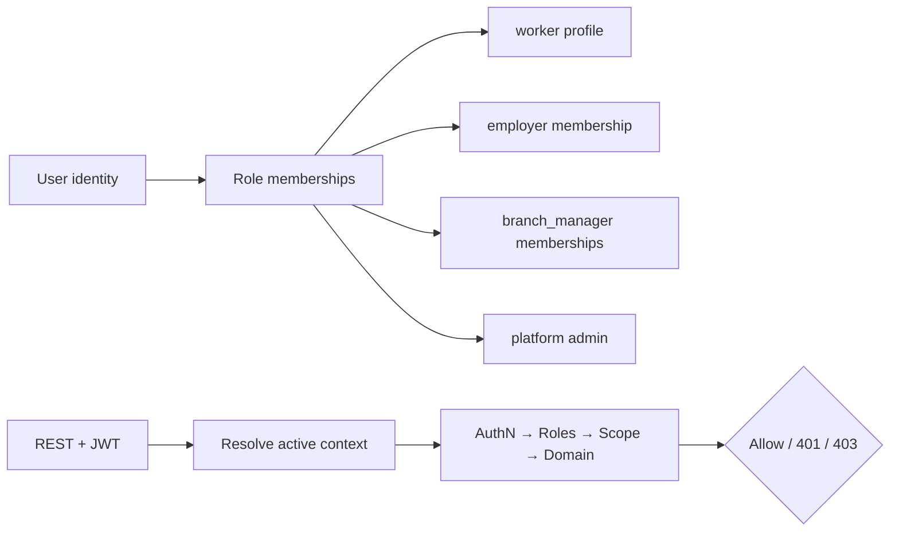
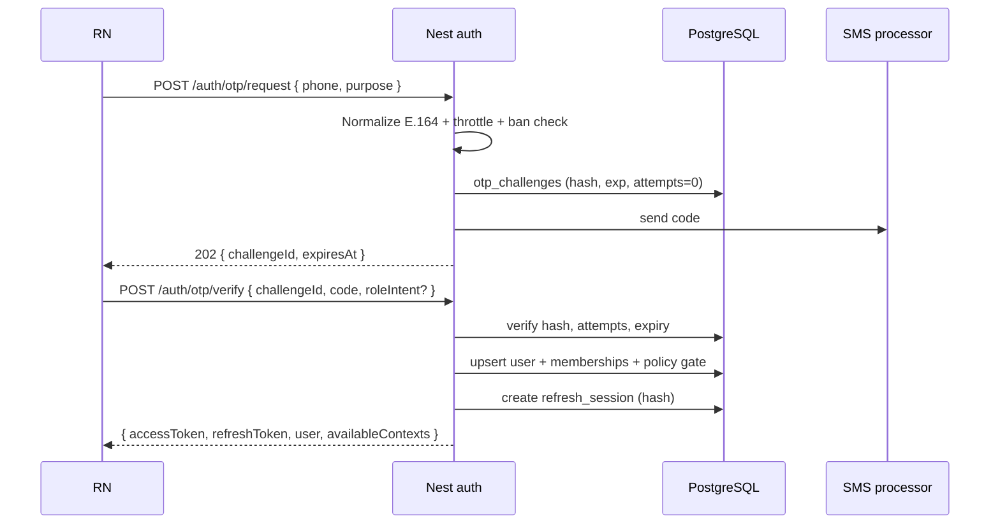
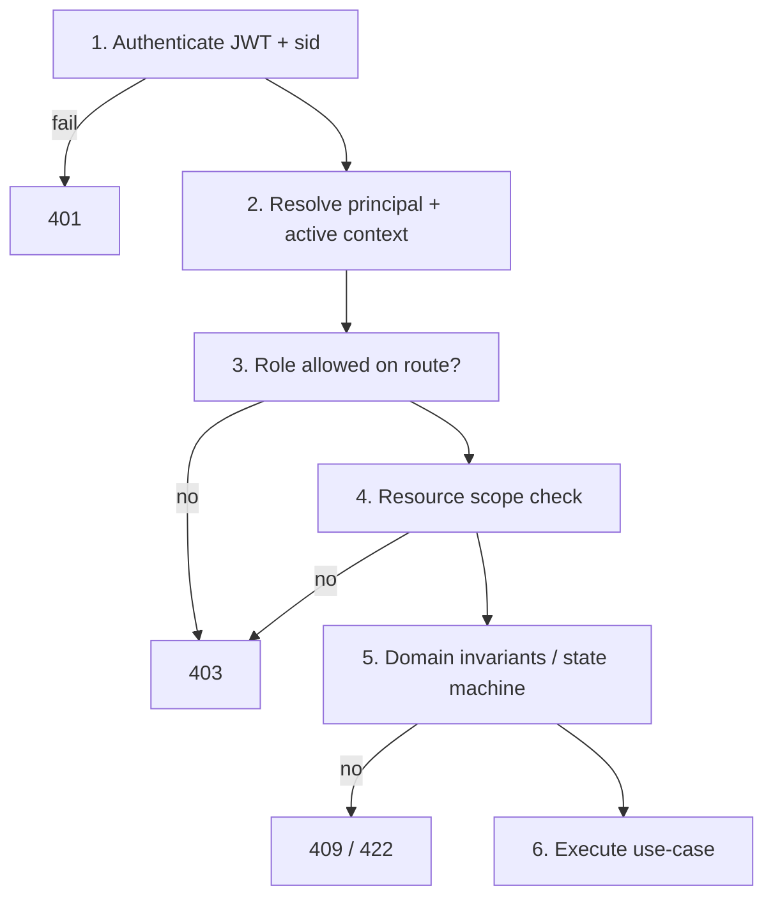

# 18 — Auth & RBAC architecture

**Status:** `accepted` (engineering baseline); product forks marked `open`  
**Last updated:** 2026-10-09  
**ADR:** [0011 — AuthN + RBAC baseline](adr/0011-auth-rbac.md)  
**Architecture home:** [`../04-application-architecture.md`](../04-application-architecture.md) §10  
**Companion:** [`07-auth-security.md`](07-auth-security.md) (checklist) · [`17-privacy-kvkk-gdpr.md`](17-privacy-kvkk-gdpr.md)  
**Cases:** `CASE-AUTH`, `CASE-SECURITY`, `CASE-ABUSE`, `CASE-EMPLOYER-BRANCH`

> AuthN proves **who**; RBAC/AuthZ proves **what they may do** on **which resource**. Mobile UI never grants authority — Nest guards + domain services + SQL constraints do.

---

## Verdict

| Topic | PartOn stance |
| --- | --- |
| Primary AuthN | **Phone OTP** → short-lived **access JWT** + **rotating refresh** (server-side sessions) |
| AuthZ model | **RBAC + resource scope** (employer / branch / ownership) — not ABAC day-1 |
| Roles | `worker`, `employer`, `manager`, `admin` (+ optional future fine-grained permissions) |
| Manager | **First-class membership** on branches for AuthZ (AO-11 product naming still open) |
| Edge | **REST `/api/v1` only** — no client gRPC; admin uses same domain AuthZ |
| Secrets | OTP/refresh hashed; JWT signing keys only on backend; never in shared packages |

---

## 1. Concepts

| Term | Meaning |
| --- | --- |
| **Principal** | Authenticated `userId` from access JWT `sub` |
| **Session** | Server row `refresh_sessions` bound to device/client; `sid` in JWT |
| **Role** | Coarse capability set attached via memberships (not only a string on the user row) |
| **Active context** | Role (+ employer/branch) the client is acting under for this request |
| **Permission** | Named action (`jobs:publish`, `applications:accept`, …) implied by role + scope |
| **Scope** | Resource boundary: own user, employer org, branch set, or platform-wide (admin) |
| **Ban** | Identity block (phone / tax / device) that prevents AuthN or restricted actions |



---

## 2. Identity & data model

### 2.1 Core tables (logical)

| Table | Purpose |
| --- | --- |
| `users` | Stable identity: phone (unique E.164), status, created_at |
| `user_roles` **or** membership tables | Which roles the user holds |
| `worker_profiles` | Worker-side profile (1:1 with user when role present) |
| `employer_memberships` | User ↔ employer org (owner / member) |
| `branch_managers` | User ↔ branch (manager scope) |
| `otp_challenges` | Hashed OTP, expiry, attempt count, phone |
| `refresh_sessions` | Hashed refresh, `sid`, device meta, revoked_at, rotated_from |
| `auth_bans` | phone / tax_id / device fingerprint blocks |
| `policy_acceptances` | Legal acceptances at registration |
| `admin_users` or `platform_roles` | Platform admin principals |

Prefer **membership tables** over a single mutable `users.role` column so a user can hold multiple memberships over time (e.g. worker who later becomes a branch manager — AS-3).

### 2.2 Proposed membership shape

```text
users
  ├── worker_profiles (optional)
  ├── employer_memberships (employer_id, role: owner|member, status)
  ├── branch_managers (branch_id, status, invited_by)
  └── platform_admins (role: support|ops|super — P3+)
```

### 2.3 Active context (request)

JWT carries a **selected context** so AuthZ is deterministic:

```json
{
  "sub": "user-uuid",
  "sid": "session-uuid",
  "ctx": {
    "role": "manager",
    "employerId": "emp-uuid",
    "branchIds": ["branch-uuid"]
  },
  "ver": 1
}
```

| Field | Rule |
| --- | --- |
| `sub` | Required; user id |
| `sid` | Required; must match active `refresh_sessions` / session store |
| `ctx.role` | One of `worker\|employer\|manager\|admin` for this token |
| `ctx.employerId` | Required for employer/manager contexts |
| `ctx.branchIds` | Manager: assigned branches; employer: may be empty (all org branches via DB) |
| Freshness | Guards may re-load memberships from DB on sensitive mutations (`open` default: **reload on write**, trust JWT on read within TTL) |

**Context switch:** `POST /api/v1/auth/context` issues a new access token (same session) with another allowed membership — never client-forged role claims.

---

## 3. Authentication (AuthN)

### 3.1 OTP login / register



| Rule | Detail | Cases |
| --- | --- | --- |
| Phone unique | One active user per E.164 | T-003 |
| OTP hashed | Store only hash; plaintext in SMS only | T-252 |
| Expiry | Short TTL (e.g. 5 min) | T-006 |
| Lockout | Exponential backoff after N fails | T-005, T-007 |
| Rate limit | Per phone + per IP | abuse |
| No location | Registration completes without GPS | T-009 |
| Ban check | Before challenge create and on verify | T-192 |
| Policy | Accept required versions before session mint | KVKK |

### 3.2 Token pair

| Token | Lifetime (proposed) | Client storage | Server |
| --- | --- | --- | --- |
| Access JWT | 15–30 min | Memory / secure store | Stateless verify + optional session check |
| Refresh | 7–30 days, **rotating** | Secure store only | Hashed in `refresh_sessions` |

**Refresh rotation (T-247):**

1. `POST /auth/token/refresh` with refresh token  
2. Validate hash + not revoked + not expired  
3. **Rotate:** revoke old row, insert new refresh hash, mint new access JWT  
4. Reuse of an already-rotated refresh → **revoke family** (theft detection) — AS-2

**Logout:** revoke session (`sid`) + clear client tokens; optional “logout all devices.”

### 3.3 Optional email/password (DM-4 / AS-4)

If product enables T-002 / T-008 / T-248:

- Argon2id password hashes  
- Separate reset flow with one-time tokens + rate limits  
- Prefer phone OTP as recovery for Turkey market  

Default architecture: **OTP-only until product locks email/password.**

### 3.4 REST surface (auth)

```http
POST /api/v1/auth/otp/request
POST /api/v1/auth/otp/verify
POST /api/v1/auth/token/refresh
POST /api/v1/auth/logout
POST /api/v1/auth/logout-all
GET  /api/v1/auth/contexts
POST /api/v1/auth/context                 # switch active role/branch
GET  /api/v1/me
PATCH /api/v1/me
```

Admin auth may share OTP/JWT or use a hardened admin login — same AuthZ services underneath.

---

## 4. Authorization (RBAC + scope)

### 4.1 Evaluation pipeline (every protected REST call)



Never skip step 4 for “list” endpoints — **filter by scope in the query**, do not load then hope.

### 4.2 Roles

| Role | Who | Default scope | Notes |
| --- | --- | --- | --- |
| `worker` | Job seeker | Own user/profile/applications/shifts | Product v1 primary |
| `employer` | Org owner/member | Own employer + all its branches | Org-level ops, tokens, verification |
| `manager` | Branch operator | Explicit `branchIds` only | AuthZ-ready; AO-11 product label open |
| `admin` | Platform staff | Global (break-glass) | Nest admin UI; audited |

Product lock lists two user groups (seeker/employer); **architecture still models `manager` and `admin`** so cases and screens are not blocked.

### 4.3 Permission catalog (coarse → fine)

Start with **role + scope**; introduce named permissions when admin needs differentiation.

| Permission | worker | employer | manager | admin |
| --- | --- | --- | --- | --- |
| `profile:read/write` own | ✓ | ✓ | ✓ | ✓ |
| `jobs:feed` | ✓ | — | — | ✓ |
| `jobs:create/update` | — | ✓ org | ✓ branch | ✓ |
| `jobs:publish` | — | ✓ if verified | ✓ if permitted | ✓ |
| `applications:apply` | ✓ | — | — | — |
| `applications:review` | — | ✓ org | ✓ branch | ✓ |
| `tokens:*` | — | ✓ org | read limited | ✓ |
| `branches:create` | — | ✓ | — | ✓ |
| `branches:manage` | — | ✓ | limited | ✓ |
| `shifts:check-in` | ✓ assigned | — | — | — |
| `shifts:manual-confirm` | — | ✓ | ✓ branch | ✓ |
| `moderation:*` | report | report | report | ✓ |
| `privacy:dsr` own | ✓ | ✓ | ✓ | assist |
| `admin:*` | — | — | — | ✓ |

`jobs:publish` also requires **employer verification** (T-015) — capability ∩ business rule.

### 4.4 Scope rules (critical)

| Actor | May access |
| --- | --- |
| Worker | Own rows only (T-244) |
| Employer | Applicants/jobs/branches under **their** `employerId` (T-037, T-245) |
| Manager | Same as employer **intersected** with `branchIds` |
| Admin | Platform queues; every access audited |

**Object-level AuthZ pattern:**

```text
load resource → assert resource.employerId / branchId / userId ∈ principal.scope
→ else 403 (same message shape as not-found optional for anti-enumeration — product choice)
```

### 4.5 Nest building blocks

| Piece | Responsibility |
| --- | --- |
| `JwtAuthGuard` | Validate signature, exp, `sid` not revoked |
| `RolesGuard` + `@Roles(...)` | Route allows role set |
| `ContextGuard` | `ctx` matches DB membership |
| `BranchScopeGuard` | Path/query `branchId` ∈ manager/employer scope |
| `PoliciesGuard` (optional) | Named permission checks for admin fine-grain later |
| Domain services | State machines + ownership asserts (defense in depth) |

Decorators (illustrative):

```ts
@Roles('employer', 'manager')
@RequireBranch()
@Post('jobs')
```

Shared packages may export **role/permission enums** only — **never** the policy engine ([`shared/README`](../shared/README.md)).

---

## 5. Role × resource matrix (REST-oriented)

| Resource | worker | employer | manager | admin |
| --- | --- | --- | --- | --- |
| `GET /jobs/feed` | ✓ | — | — | ✓ |
| `POST /branches/:id/jobs` | — | ✓ | ✓ scoped | ✓ |
| `GET /jobs/:id/applications` | — | ✓ org | ✓ branch | ✓ |
| `POST /applications/:id/accept` | — | ✓ | ✓ | ✓ |
| `POST /jobs/:id/applications` | ✓ | — | — | — |
| `POST /shifts/:id/check-in` | ✓ own | — | — | — |
| `POST /shifts/:id/manual-confirm` | — | ✓ | ✓ | ✓ |
| `POST /branches` | — | ✓ (T-014) | ✗ | ✓ |
| `GET /employers/me/tokens` | — | ✓ | limited | ✓ |
| Admin moderation | — | — | — | ✓ |

---

## 6. Onboarding & gates (AuthN adjacent)

| Gate | When | Effect |
| --- | --- | --- |
| Policy acceptance | Before first session | Block verify completion |
| Profile completion | Before apply (T-010) | 403/422 with `PROFILE_INCOMPLETE` |
| Employer verification | Before publish (T-015) | Block `jobs:publish` |
| Ban | Any AuthN / sensitive action | 403 `BANNED` |
| Role intent | At verify / context switch | Creates membership only if allowed |

---

## 7. Admin RBAC

| Concern | Stance |
| --- | --- |
| Hosting | Nest-hosted admin UI → **same domain services** |
| Principals | Separate `platform_admins` (or strong flag) — not every employer |
| Privileges | Start coarse (`support`, `ops`, `super`); expand later |
| Audit | Login, impersonation (if any), ban, verification override, DSR assist |
| Impersonation | **Hold** unless product requires; if added, mandatory audit + time-box |

---

## 8. Abuse, bans, device risk

| Control | Mechanism |
| --- | --- |
| OTP spam | Throttle phone + IP; challenge budget |
| Credential stuffing / guess | Lockout on verify |
| Multi-account (T-184) | Device fingerprint signals — Trial P2–P3 |
| Ban list (T-192) | `auth_bans` on phone / tax / device |
| Bot apply (T-186) | Rate limit apply + risk flags in `moderation` |

Bans are evaluated in **AuthN and AuthZ** (banned user with leftover JWT must fail session check).

---

## 9. Client responsibilities (mobile / admin)

| Client may | Client must not |
| --- | --- |
| Store refresh in secure storage | Treat role screens as security |
| Send `Authorization: Bearer` | Embed JWT secrets / forge `ctx` |
| Call context switch API | Cache AuthZ decisions across users |
| Hide UI by role | Skip server validation |

Manager app routes (`m.manager.*`) always send branch context consistent with token.

---

## 10. Error & observability contracts

| Outcome | HTTP | Notes |
| --- | --- | --- |
| Missing/invalid token | 401 | |
| Valid token, wrong role/scope | 403 | |
| Business gate (unverified, incomplete) | 403 or 422 | Stable `error.code` |
| OTP wrong/expired | 401/422 | No user enumeration on request where avoidable |

Log: `userId`, `sid`, `ctx.role`, `route`, decision — **never** OTP, refresh, full phone in clear (T-252).

---

## 11. Module ownership

| Module | Owns |
| --- | --- |
| `auth` | OTP, sessions, JWT mint/verify, context switch, throttling hooks |
| `users` | Identity, bans join, role membership queries |
| `employers` / `branches` | Org membership, manager invites, T-014 |
| `policies` | Acceptance gate at register |
| `moderation` | Abuse → ban requests |
| `admin` | Platform principal management + audit UI |

---

## 12. Delivery alignment

| Phase | Auth / RBAC outcomes |
| --- | --- |
| **P0** | OTP + JWT + refresh rotation; `worker`/`employer` contexts; RolesGuard + ownership checks; policy accept |
| **P1** | Branch create AuthZ (T-014); verification gate (T-015); object-level list filters |
| **P2** | Manager context + `BranchScopeGuard`; device risk signals Trial |
| **P3** | Admin RBAC + audit; ban ops; privacy DSR AuthZ |
| **P4** | Session reuse detection hardening; optional fine-grained permissions |

---

## 13. Open questions

| ID | Question | Default until decided |
| --- | --- | --- |
| AS-1 | SMS provider | Abstract `SmsPort` |
| AS-2 | Device binding / refresh reuse | Rotate + revoke family |
| AS-3 | Multi-role one account vs separate logins | **One account, multiple memberships + context switch** |
| AS-4 | Email + password in v1 | **Off** (OTP only) |
| AO-11 | Manager product naming | **Model as membership role in AuthZ anyway** |
| AS-5 | JWT `branchIds` vs DB-only scope | Claims for UX; **DB reload on writes** |
| AS-6 | 403 vs 404 on cross-tenant read | Prefer 404 for private resources (`open`) |

---

## Related

- ADR: [`adr/0011-auth-rbac.md`](adr/0011-auth-rbac.md)  
- Checklist: [`07-auth-security.md`](07-auth-security.md)  
- App architecture: [`../04-application-architecture.md`](../04-application-architecture.md)  
- Privacy: [`17-privacy-kvkk-gdpr.md`](17-privacy-kvkk-gdpr.md)  
- Domain modules: [`04-domain-modules.md`](04-domain-modules.md)  
- Cases: `CASE-AUTH`, `CASE-SECURITY`  
