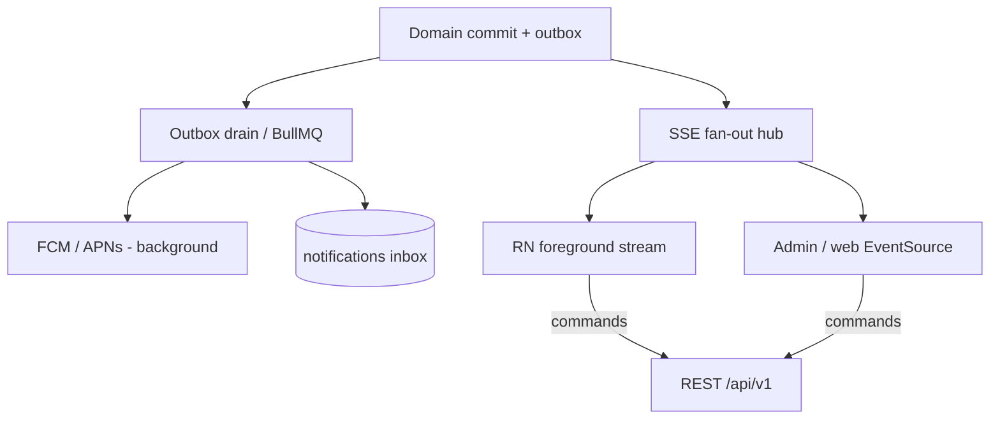

# 19 — Server-Sent Events (SSE)

**Status:** `accepted` (architecture role); product enablement phased  
**Last updated:** 2026-10-09  
**ADR:** [0012 — SSE for foreground realtime](adr/0012-sse-foreground-realtime.md)  
**Architecture home:** [`../04-application-architecture.md`](../04-application-architecture.md) §0 / §12 (vs FCM)  
**Nest docs:** [`@Sse()` + `MessageEvent`](https://docs.nestjs.com/techniques/server-sent-events) (Observable stream)  
**Related:** [20-fcm-messaging](20-fcm-messaging.md) · [08-async-events](08-async-events.md) · [18-auth-rbac](18-auth-rbac.md) · [16-rest-vs-grpc](16-rest-vs-grpc.md)

> SSE is a **one-way server → client** HTTP stream. It complements **REST** (commands/queries) and **FCM/APNs** (background push). It does **not** replace BullMQ, RabbitMQ, or gRPC.

---

## Verdict

| Topic | PartOn stance |
| --- | --- |
| Role of SSE | **Foreground** live updates while a client holds an open connection |
| Background / OS notify | Still **FCM / APNs** (locked) |
| Client commands | Still **REST** `/api/v1` (locked) |
| Job transport | Still **outbox → BullMQ** (Stage B) — not SSE |
| WebSocket | **Hold** for v1 unless bidirectional chat/voice appears |
| gRPC streams to mobile | **Hold** (ADR-0009) |
| Nest API | `@Sse()` handlers returning `Observable<MessageEvent>` |

---

## Where SSE sits (three delivery paths)



| Path | When | Protocol |
| --- | --- | --- |
| **REST** | User action / authoritative read-write | Request/response JSON |
| **SSE** | App/admin **open**; need live list/badge/status | Long-lived `text/event-stream` |
| **Push** | App backgrounded / killed; OS alert | FCM / APNs |

Same domain event can fan out to **inbox row + push + SSE** — push and SSE are delivery, not sources of truth.

---

## When to use SSE

| Use | Example | Prefer SSE? |
| --- | --- | --- |
| Employer watching applicants on a job detail screen | New apply / withdraw | **Yes** (foreground) |
| Manager home “who’s arriving” while open | Check-in status | **Yes** |
| Admin moderation queue | New report | **Yes** (Nest admin) |
| Inbox badge while app foregrounded | Unread count | **Yes** |
| Wake user at 3h confirm when app closed | Reminder | **No** — FCM |
| Apply / accept / check-in command | Mutation | **No** — REST |
| Delayed retry of SMS | Reliability | **No** — BullMQ |

---

## SSE vs WebSocket vs gRPC streams vs push

| Concern | SSE | WebSocket | gRPC stream | FCM/APNs |
| --- | --- | --- | --- | --- |
| Direction | Server → client | Bidirectional | Bidirectional | Server → device |
| Transport | HTTP/1.1 or HTTP/2 | Upgrade / separate | HTTP/2 | Vendor SDK |
| Fits Nest REST app | `@Sse()` native | Extra gateway | Hold for clients | Already planned |
| Auth with EventSource | Ticket / cookie (no custom headers) | Headers/query OK | mTLS/tokens | Device token |
| Background mobile | Poor / none | Poor | N/A | **Best** |
| Proxy friendliness | Good if buffering off | Mixed | Mixed | N/A |
| PartOn v1 | **Trial → Adopt for admin + selected RN** | Hold | Hold | Adopt |

**Why not WebSocket day-1:** marketplace UX is almost entirely server→client hints; REST already covers client→server. WS adds reconnect/state complexity without a chat product.

---

## Nest implementation pattern

Per NestJS: annotate a controller method with `@Sse()`, return an `Observable<MessageEvent>` (or `Promise` of one). Nest unsubscribes on client disconnect; use RxJS `finalize` for teardown.

```ts
// Illustrative — not production code
@Sse('stream')
@UseGuards(SseTicketGuard) // or cookie session for admin
stream(@CurrentUser() user: Principal): Observable<MessageEvent> {
  return this.sseHub.subscribe(user).pipe(
    map((evt) => ({
      id: evt.id,
      type: evt.type,
      data: evt.payload,
      retry: 5000,
    })),
    finalize(() => this.sseHub.unsubscribe(user)),
  );
}
```

`MessageEvent` fields (Nest): `data`, `id`, `type`, `retry`, `comment` (keep-alive).

### Suggested routes

```http
POST /api/v1/realtime/ticket          # short-lived SSE ticket (JWT required)
GET  /api/v1/realtime/stream          # text/event-stream (?ticket=... or cookie)
GET  /api/v1/realtime/stream/jobs/:jobId/applications   # scoped channel
```

Keep streams under `/api/v1` versioning. Content-Type: `text/event-stream`.

---

## Authentication & AuthZ

Browser `EventSource` **cannot** set `Authorization` headers. Architecture options:

| Option | Use when | Notes |
| --- | --- | --- |
| **A. SSE ticket (preferred mobile)** | RN / cross-origin | `POST /realtime/ticket` with Bearer → opaque ticket (TTL 30–120s, single-use or short session) → `GET .../stream?ticket=` |
| **B. Same-site cookie** | Nest admin UI | HttpOnly cookie after admin login; CSRF less relevant for GET stream but ticket still fine |
| **C. fetch streaming + Bearer** | RN polyfill | Possible; more custom than EventSource |

**AuthZ:** after ticket redeem, apply same RBAC + scope as REST (§10 / [18](18-auth-rbac.md)):

- Worker streams: own inbox / own shift only  
- Employer: org-scoped job application channels  
- Manager: `branchIds` intersection  
- Admin: platform queues  

Never put PII-heavy payloads on the wire — **ids + type + minimal fields**; client refetches via REST if needed.

---

## Event envelope (proposed)

```json
{
  "id": "01J…",
  "type": "application.submitted",
  "at": "2026-10-09T19:00:00.000Z",
  "resource": { "kind": "application", "id": "…" },
  "hint": { "jobId": "…", "branchId": "…" }
}
```

| Field | Rule |
| --- | --- |
| `id` | Stable for `Last-Event-ID` resume |
| `type` | Domain event name (align outbox / [08](08-async-events.md)) |
| `resource` | Enough to invalidate cache / refetch |
| Payload size | Small; no OTP, tokens, full documents |

---

## Fan-out architecture

### Stage A (monolith, day-1 capable)

```text
Domain service (after commit)
  → publish to in-process SseHub (per-user / per-channel Subjects)
  → outbox row for FCM/SMS (unchanged)
```

Suitable while API is single-instance or sticky sessions. Multi-instance without shared bus → missed events on other pods.

### Stage B (multi-instance)

```text
Domain / worker
  → Redis Pub/Sub or BullMQ “realtime” fan-out channel
  → each API instance SseHub delivers to local connections
```

Use the **same managed Redis** as BullMQ only if isolated by key prefix/DB index; prefer a dedicated pub/sub connection. Do **not** store SSE backlog in Redis as SoR — Postgres inbox remains authoritative.

### Resume

- Client sends `Last-Event-ID`  
- Server may replay recent buffered ids **or** instruct client to `GET /notifications` since cursor  
- Gap tolerance: **REST reconciliation on reconnect** is mandatory

---

## Channels (catalog sketch)

| Channel | Audience | Triggers |
| --- | --- | --- |
| `user.inbox` | Authenticated user | New notification row |
| `job.applications.:jobId` | Employer/manager scoped | apply / withdraw / accept / reject |
| `branch.shifts.:branchId` | Employer/manager | check-in / confirm / dispute |
| `admin.moderation` | Platform admin | New abuse report |

Subscribe only to channels the principal’s scope allows; reject others with stream close + 403 on ticket mint.

---

## Reliability & ops

| Concern | Practice |
| --- | --- |
| Heartbeat | SSE `comment` keep-alive every 15–30s (proxy idle) |
| Timeouts | Gateway / load balancer idle timeout > heartbeat interval |
| Buffering | Disable response buffering (`X-Accel-Buffering: no` / `proxy_buffering off`) — [web/06-nginx](../web/06-nginx.md) · ADR-0032 |
| Connection limits | Per-user max streams (e.g. 2–3); per-IP cap |
| Backpressure | Drop or coalesce high-frequency events; never block domain TX on SSE |
| Horizontal scale | Stage B Redis pub/sub; sticky sessions optional |
| Observability | Active connections, emit lag, disconnect reasons, ticket failures |
| Privacy | No phone/OTP/geo in events; AuthZ on ticket (KVKK) |

---

## Mobile (bare React Native)

| Concern | Guidance |
| --- | --- |
| Library | Prefer maintained EventSource polyfill or fetch streaming |
| Lifecycle | Connect on foreground / relevant screen; disconnect on background |
| Duplicate UX | SSE updates UI; FCM still arrives — **dedupe by notification/event id** |
| Offline | No SSE; rely on REST refresh + FCM when back |
| Expo | Forbidden (ADR-0006) — does not change SSE design |

Admin web can use native `EventSource` with cookie or ticket.

---

## Delivery phases

| Phase | SSE outcomes |
| --- | --- |
| **P0** | Not required — REST + push inbox enough |
| **P1–P2** | **Trial:** Nest admin live queue **or** employer applicant stream |
| **P3** | Adopt for manager home / inbox badge if UX proves value |
| **P4** | Multi-instance Redis fan-out if API replicas > 1 |

Do not block P0 auth/jobs on SSE.

---

## Anti-patterns

- Using SSE as the **write** API  
- Putting job orchestration on SSE (use BullMQ)  
- Replacing FCM with SSE for background alerts  
- Huge payloads / PII on the stream  
- gRPC streaming to mobile “because Nest can”  
- WebSocket dual-stack day-1 without bidirectional product need  

---

## Open questions

| ID | Question | Default |
| --- | --- | --- |
| SSE-1 | First product surface (admin vs employer applicants) | Admin Trial |
| SSE-2 | Ticket TTL and single-use vs session-bound | 60s mint + session-bound stream |
| SSE-3 | Shared Redis pub/sub vs separate realtime Redis | Same managed Redis, separate connection/prefix at Stage B |
| SSE-4 | RN EventSource library choice | Decide at mobile scaffold |

---

## Related

- ADR: [`adr/0012-sse-foreground-realtime.md`](adr/0012-sse-foreground-realtime.md)  
- NGINX edge: [`../web/06-nginx.md`](../web/06-nginx.md) · [ADR-0032](adr/0032-nginx-reverse-proxy.md)  
- App architecture: [`../04-application-architecture.md`](../04-application-architecture.md)  
- Async/jobs: [`08-async-events.md`](08-async-events.md)  
- Auth: [`18-auth-rbac.md`](18-auth-rbac.md)  
- Nest technique: [Server-Sent Events](https://docs.nestjs.com/techniques/server-sent-events)  
