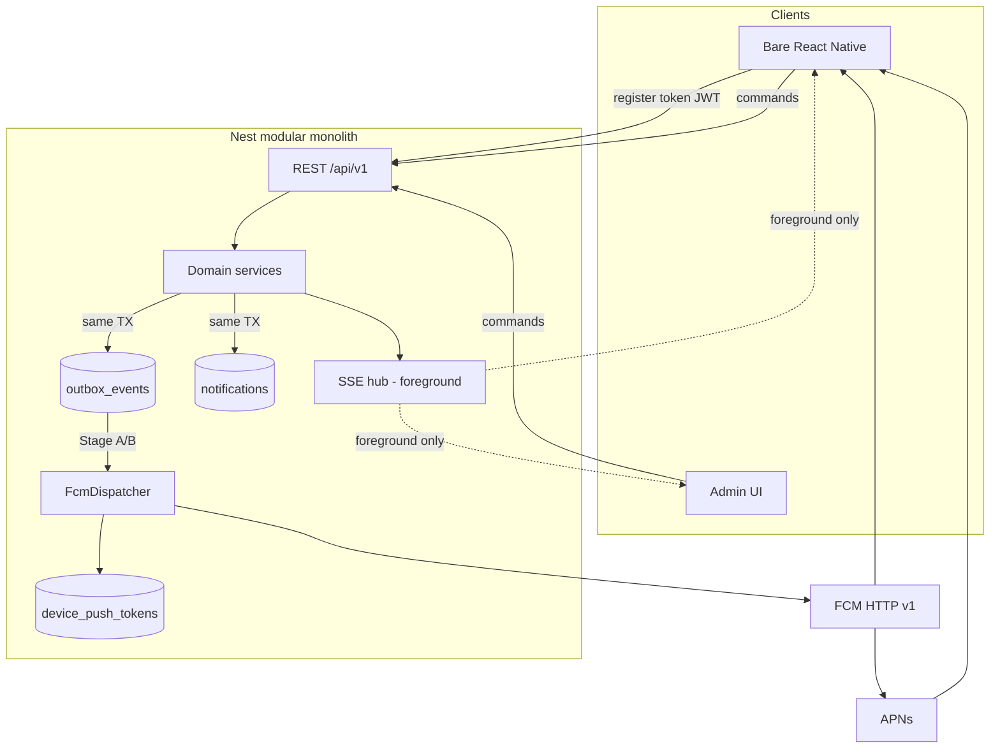
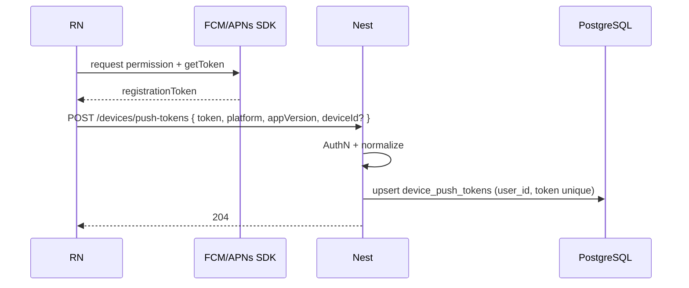
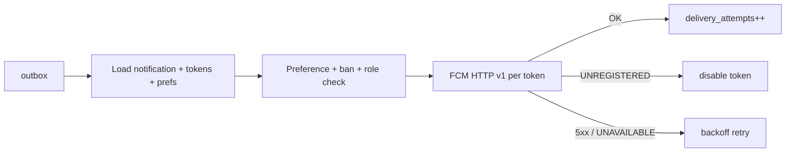

# 20 — Firebase Cloud Messaging (FCM)

**Status:** `accepted` (architecture baseline)  
**Last updated:** 2026-10-09  
**ADR:** [0013 — FCM for mobile push](adr/0013-fcm-push.md)  
**Architecture home:** [`../04-application-architecture.md`](../04-application-architecture.md) §12  
**Cases:** `CASE-NOTIFICATIONS` (T-100–T-113)  
**User experience (copy, prefs, timing):** [`../shared/05-push-notifications-ux.md`](../shared/05-push-notifications-ux.md) · [ADR-0021](adr/0021-push-notifications-ux.md)  
**Related:** [08-async-events](08-async-events.md) · [19-sse](19-sse.md) · [17-privacy](17-privacy-kvkk-gdpr.md) · [18-auth-rbac](18-auth-rbac.md) · [mobile deep links](../mobile/03-flows-and-deep-links.md)

> FCM delivers **OS-level push** to Android and (via APNs) iOS. It is **not** the command API (REST), **not** the job bus (outbox/BullMQ), and **not** foreground live UI (SSE). Firebase is a **messaging processor** only — PartOn owns identity, inbox, and business rules in Nest + Postgres. **What users see and why** is defined in the [user-centered push catalog](../shared/05-push-notifications-ux.md).

---

## Verdict

| Topic | PartOn stance |
| --- | --- |
| Push provider | **Firebase Cloud Messaging** (HTTP v1) for Android + iOS |
| iOS delivery | FCM → **APNs** (APNs auth key configured in Firebase project) |
| Send API | **FCM HTTP v1** (`projects.messages.send`) via **Firebase Admin SDK** on Nest — not legacy server keys |
| Targeting | Prefer **registration tokens** per device; topics only for rare broadcast |
| Reliability path | Domain TX → **outbox** → dispatcher → FCM; Stage B via BullMQ `notifications` |
| Source of truth | Postgres `notifications` inbox + `device_push_tokens` — not Firestore |
| Client | Bare React Native + `@react-native-firebase/messaging` (or equivalent) — **no Expo** |
| Complements | **REST** commands · **SSE** foreground · **FCM** background |

---

## 1. Where FCM sits



| Channel | When | Owns |
| --- | --- | --- |
| **REST** | Always | Commands, inbox CRUD, token register, preferences |
| **FCM** | App background / killed / OS tray | Alert + data → deep link |
| **SSE** | App/admin foreground open | Live badges / list refresh (ADR-0012) |
| **Inbox row** | Always on notify | Durable history if push off (T-111) |

---

## 2. Legacy → target

| Legacy (Firebase-heavy) | Target |
| --- | --- |
| FCM + Firestore listeners as “realtime API” | FCM for push only; REST fetch; optional SSE foreground |
| `SyncFcmTokenUseCase` → Firestore | `POST /api/v1/devices/push-tokens` → Postgres |
| Client trusts push body as state | Push is a **hint**; screen loads via REST |
| Unbounded topics / fan-out in client | Server resolves audience; sends to tokens |

Doc: [`10-legacy-firebase-mapping.md`](10-legacy-firebase-mapping.md).

---

## 3. Token lifecycle

### 3.1 Registration



| Field | Notes |
| --- | --- |
| `token` | FCM registration token (opaque); unique globally |
| `platform` | `android` \| `ios` |
| `user_id` | From JWT; re-bind on login |
| `device_id` | Optional stable install id for multi-device |
| `app_version` | For payload/feature gating |
| `last_seen_at` | Updated on register / successful send |
| `disabled_at` | Set on `UNREGISTERED` / `INVALID_ARGUMENT` from FCM |

**Rules:**

- Register after AuthN (and after OS permission grant).  
- On logout: delete or detach tokens for that user/device.  
- On token refresh (SDK callback): upsert again.  
- Multi-device: many tokens per user; send to **all active** unless prefs say otherwise.

### 3.2 REST surface

```http
POST   /api/v1/devices/push-tokens
DELETE /api/v1/devices/push-tokens/:tokenId
DELETE /api/v1/devices/push-tokens/current
GET    /api/v1/notifications
GET    /api/v1/notifications/:id
POST   /api/v1/notifications/:id/read
POST   /api/v1/notifications/read-all
PATCH  /api/v1/notifications/preferences
```

---

## 4. Send pipeline (reliability)

### 4.1 Write path (domain)

1. Domain use-case commits business state.  
2. **Same transaction:** insert `notifications` inbox row(s) + `outbox_events` (`type=notification.dispatch`, `notificationId` / `eventId`).  
3. Never call FCM inside the request transaction.

### 4.2 Dispatch path

| Stage | Mechanism |
| --- | --- |
| A (locked) | In-process outbox drain → `FcmDispatcher` |
| B | Outbox relay → BullMQ queue `notifications` → worker → `FcmDispatcher` |



### 4.3 Idempotency (T-110)

| Key | Purpose |
| --- | --- |
| `event_id` / outbox id | Drain once |
| `notifications.dedupe_key` | Unique `(user_id, dedupe_key)` for business event |
| FCM `messageId` | Store on success for ops |

Same accept event must not create two inbox rows or two pushes.

### 4.4 Targeting safety (T-113)

Dispatcher loads recipients from **server-side** audience resolution (application owner, assigned worker, branch managers). Never trust client-supplied “send to user X” without AuthZ. Admin broadcast is a separate privileged path with audit.

---

## 5. Message model

### 5.1 Inbox record (Postgres)

| Column | Purpose |
| --- | --- |
| `id` | Public id for deep link `generic` |
| `user_id` | Recipient |
| `type` | Stable enum (`job.matched`, `shift.confirm_3h`, …) |
| `title` / `body` | Localized or template-rendered |
| `data` | JSON for deep link params (ids only) |
| `dedupe_key` | Idempotency |
| `read_at` | Inbox UX |
| `created_at` | Ordering |

### 5.2 FCM payload shape

Use **notification + data** for user-visible alerts; data keys are **strings** (FCM requirement).

```json
{
  "message": {
    "token": "<registration-token>",
    "notification": {
      "title": "Vardiya yaklaşıyor",
      "body": "3 saat içinde müsaitlik onayı"
    },
    "data": {
      "type": "shift.confirm_3h",
      "shiftId": "<uuid>",
      "notificationId": "<uuid>",
      "v": "1"
    },
    "android": {
      "priority": "high",
      "collapse_key": "shift.confirm_3h:<shiftId>",
      "notification": {
        "channel_id": "shifts"
      }
    },
    "apns": {
      "headers": {
        "apns-priority": "10",
        "apns-collapse-id": "shift.confirm_3h:<shiftId>"
      },
      "payload": {
        "aps": {
          "sound": "default",
          "thread-id": "shifts"
        }
      }
    }
  }
}
```

| Concern | Practice |
| --- | --- |
| Priority | Time-critical shift nudges: Android `high`, APNs `10`; marketing/low: normal / `5` |
| Collapse | Same logical alert collapses (3h nudge refreshes) |
| TTL | Set sensible `ttl` / `apns-expiration` so stale check-in nudges die |
| Size | Keep data small; long copy lives in inbox detail (T-111) |
| Secrets | Never put OTP codes, tokens, or precise home coordinates in push |

### 5.3 Template catalog (CASE-NOTIFICATIONS)

**Full user-centered catalog** (copy, audience, urgency, collapse, TTL, tone): [`../shared/05-push-notifications-ux.md`](../shared/05-push-notifications-ux.md) §3 · [ADR-0021](adr/0021-push-notifications-ux.md).

| `type` | Trigger | Cases | Deep link |
| --- | --- | --- | --- |
| `job.matched` | Matching / new eligible job | T-100, T-226 | job detail |
| `application.received` | Worker applied | T-101 | employer applicants |
| `application.accepted` | Accept | T-097, T-102 | process detail |
| `application.rejected` | Reject | T-096, T-103 | process detail |
| `application.accept_revoked` | Cancel prior accept | T-098 | process detail |
| `job.closed_with_accepts` | Close job with accepts | T-099 | process detail |
| `shift.confirm_3h` | Scheduler T−3h / ASAP if &lt;3h | T-104, T-114, T-122 | availability confirm |
| `shift.cannot_come` | Worker cannot come | T-116–T-119, T-121, T-206 | employer attendance |
| `shift.confirm_timeout` | No 3h response | T-117 | employer attendance |
| `shift.checkin_due` | Scheduler T−10m | T-105, T-123 | check-in |
| `shift.worker_checked_in` | Check-in success | T-133 | employer attendance |
| `shift.manual_confirmed` | Manual confirm | T-134 | process / in-shift |
| `shift.dispute_update` | Dispute lifecycle | T-135 | dispute / confirm |
| `rating.pending` | +24h after complete | T-106, T-172 | ratings compose |
| `job.favorite_employer` | Fav employer posted | T-107 | job detail |
| `job.favorites_only` | Favorites-only audience | T-108 | job detail |
| `job.audience_empty` | Favorites-only no audience | T-057 | employer job edit (inbox) |
| `generic` | Fallback / admin | — | inbox detail |

**Full case matrix + copy:** [`../shared/05-push-notifications-ux.md`](../shared/05-push-notifications-ux.md) §0–§3. Deep links: [`../mobile/03-flows-and-deep-links.md`](../mobile/03-flows-and-deep-links.md). Dispatcher must load **locale templates** from the UX catalog — not hardcode English-only strings in send code. Cross-cuts T-109–T-113, T-231 apply to **all** rows.

---

## 6. Preferences & permission UX

Canonical UX: [`../shared/05-push-notifications-ux.md`](../shared/05-push-notifications-ux.md) §1 · §4.

| Layer | Behavior |
| --- | --- |
| OS permission | Soft ask after first **role home** with in-app rationale; app usable if denied (T-111 inbox) |
| In-app categories | `PATCH /notifications/preferences` — `shifts`, `applications`, `matching`, `favorites`, `marketing` |
| Marketing | Separate opt-in (KVKK) — default OFF; not bundled with TOS |
| Quiet hours | Trial/P2 — must **not** mute critical `shifts` by default |
| Foreground | Prefer badge/SSE if user already on target screen |

Registration must not require notification permission (parallel to location T-009).

---

## 7. Mobile (bare React Native)

| Responsibility | Owner |
| --- | --- |
| Obtain FCM token; refresh handler | Mobile messaging module |
| Register/unregister via REST | After login / on refresh / logout |
| Notification channels (Android) | `shifts`, `applications`, `default` |
| Foreground presentation | App policy (banner vs silent + inbox badge) |
| Open / cold start | Parse `data.type` → navigate; invalid → role home |
| Background data-only | Rare; prefer notification+data for v1 |

**Forbidden:** Expo push service as primary; treating FCM payload as authoritative state without REST refresh.

Suggested stack: `@react-native-firebase/app` + `@react-native-firebase/messaging` (bare RN). Confirm versions at scaffold.

---

## 8. Nest module design

| Piece | Role |
| --- | --- |
| `NotificationsModule` | Inbox CRUD, preferences, templates |
| `DeviceTokensModule` or nested service | Token registry |
| `FcmDispatcher` | Maps inbox → HTTP v1 send; token hygiene |
| `FirebaseAdminProvider` | Init app with service account; single instance |
| Outbox consumer / BullMQ `@Processor('notifications')` | Triggers dispatcher |

Config (secrets — never in shared packages):

| Env | Purpose |
| --- | --- |
| `FIREBASE_PROJECT_ID` | FCM project |
| `GOOGLE_APPLICATION_CREDENTIALS` or JSON secret | Service account for Admin SDK |
| Optional APNs | Configured in Firebase console (not Nest) for iOS |

Use **HTTP v1** OAuth via service account. Do **not** use deprecated FCM legacy server keys.

---

## 9. Topics, conditions, multicast

| Mode | Use in PartOn |
| --- | --- |
| **Token** | Default for user-specific events |
| **Topic** | Rare platform announcements; subscribe server-side or carefully from client |
| **Condition** | Avoid v1 complexity |
| **Device group** | Deprecated by Google — **do not use** |

Admin `broadcast` (web): resolve user set in Nest → enqueue per-user inbox + dispatch (or bounded topic with audit). Prefer per-user for correctness (T-113).

---

## 10. Error handling & observability

| FCM outcome | Action |
| --- | --- |
| Success | Store `fcm_message_id`; `last_success_at` |
| `UNREGISTERED` / invalid token | Disable token; stop retry |
| `INVALID_ARGUMENT` | Fix payload; dead-letter with reason |
| `RESOURCE_EXHAUSTED` / `UNAVAILABLE` | Backoff retry (outbox/BullMQ) |
| Partial multi-token failure | Retry only failed tokens |

Metrics: send lag (outbox age), success/fail rate, disabled token rate, template counts, duplicate suppressions (T-110), queue depth (Stage B). Correlate with `X-Request-Id` / `event_id`.

---

## 11. Privacy & security (KVKK)

| Rule | Detail |
| --- | --- |
| Processor | Google FCM / Apple APNs — subprocessor register |
| Minimization | IDs in `data`; no special-category content in push body |
| AuthZ | Only recipient’s tokens; admin broadcast audited |
| Logs | Redact tokens; never log full push bodies with PII |
| Retention | Inbox retention per privacy matrix; tokens deleted on erasure/logout |

---

## 12. Testing strategy

| Layer | What |
| --- | --- |
| Unit | Template render, audience resolve, dedupe_key |
| Integration | Outbox → dispatcher with FCM mock (`FcmPort`) |
| Device | Android/iOS permission, open cold/warm (T-109) |
| Abuse | Wrong-user targeting tests (T-113); duplicate (T-110) |
| Staging | Firebase project separate from prod; real devices |

---

## 13. Delivery alignment

| Phase | Outcomes |
| --- | --- |
| **P0** | Token register API; inbox; outbox → FCM for accept/reject + apply received |
| **P1** | Matching / favorites templates; deep links; preferences |
| **P2** | Scheduled 3h / 10m / +24h via scheduler + outbox; collapse keys |
| **P3** | Admin broadcast + audit; richer prefs; retention |
| **P4** | BullMQ `notifications` if fan-out saturates API |

---

## 14. Open questions

| ID | Question | Default |
| --- | --- | --- |
| FCM-1 | Exact RN Firebase lib versions | Decide at mobile scaffold |
| FCM-2 | Data-only vs notification+data for foreground | notification+data v1 |
| FCM-3 | Per-device vs all-devices send | All active tokens |
| FCM-4 | Localization source | Server templates TR first |
| FCM-5 | Web push for admin | **Hold** — admin uses SSE/inbox |

---

## Related

- ADR: [`adr/0013-fcm-push.md`](adr/0013-fcm-push.md)  
- SSE (foreground): [`19-sse.md`](19-sse.md) · ADR-0012  
- Async: [`08-async-events.md`](08-async-events.md)  
- App architecture: [`../04-application-architecture.md`](../04-application-architecture.md) §12  
- Mobile deep links: [`../mobile/03-flows-and-deep-links.md`](../mobile/03-flows-and-deep-links.md)  
- Cases: `CASE-NOTIFICATIONS`  
