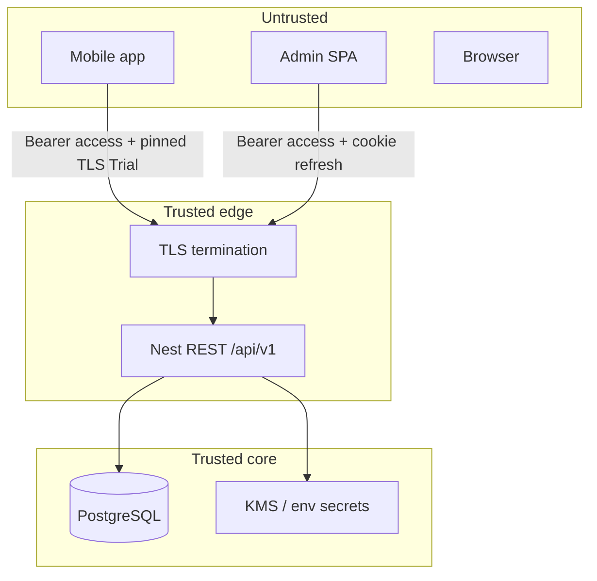

# 21 — Client security (Web + Mobile)

**Status:** `accepted`  
**Last updated:** 2026-10-09  
**ADR:** [0018 — Client security baseline](adr/0018-client-security.md)  
**Architecture:** [`../04-application-architecture.md`](../04-application-architecture.md) §15.2  
**AuthN/AuthZ:** [`18-auth-rbac.md`](18-auth-rbac.md) · [`07-auth-security.md`](07-auth-security.md)  
**Privacy:** [`17-privacy-kvkk-gdpr.md`](17-privacy-kvkk-gdpr.md)  
**Cases:** `CASE-SECURITY`, `CASE-AUTH`, `CASE-ABUSE`, `CASE-LOCATION`

> Nest owns authority. Clients store credentials safely, use TLS, and never invent AuthZ. This doc is the **best practical security baseline** for PartOn’s bare RN app and Nest-hosted Vite admin (and any future employer web console).

---

## Verdict

| Layer | Best choice for PartOn |
| --- | --- |
| Transport | **TLS 1.2+ only**, HSTS on web hosts; no cleartext API |
| AuthN (already locked) | OTP → short **access JWT** + **rotating refresh** (hashed server-side) |
| Mobile token storage | Access in **memory**; refresh in **Keychain / Keystore** (`react-native-keychain`) — never AsyncStorage / MMKV plaintext |
| Web token storage | Access in **memory**; refresh in **`HttpOnly` + `Secure` + `SameSite=Strict` cookie** on the API origin |
| Web CSRF | Cookie refresh/logout require **CSRF defense** (double-submit cookie or custom header + SameSite) |
| AuthZ | Nest guards + SQL scope only — UI hide ≠ security (T-244–246) |
| Docs / media | **Short-lived signed URLs**; never guessable public paths (T-249) |
| Headers (web) | CSP, frame denial, referrer/permissions policy |
| Secrets | No API keys / JWT signing keys in mobile or admin SPA bundles |
| Pinning | **TLS certificate/public-key pinning = Trial** (prod mobile) with backup pins + kill-switch |
| Root/jailbreak hard-block | **Hold** as sole gate; use as **risk signal** for check-in / abuse (T-131, T-184) |

---

## 1. Trust model



| Zone | May hold |
| --- | --- |
| Mobile / SPA | Access JWT (short), UX state, FCM registration token |
| Mobile secure store / web cookie | Refresh credential only |
| Nest | JWT signing keys, OTP hashes, refresh hashes, SMS/FCM credentials |
| Shared packages | Zod shapes + enums — **never** secrets or AuthZ engines |

---

## 2. Shared API security (both clients)

| Control | Requirement |
| --- | --- |
| HTTPS | All `/api/v1` over TLS; reject mixed content |
| Auth header | `Authorization: Bearer <access_jwt>` for resource APIs |
| Refresh | Dedicated `POST /api/v1/auth/token/refresh` — never query string / deep link |
| Rotation | Refresh **rotates**; reuse of old refresh **revokes session family** (T-247) |
| Logout | Revoke `sid` server-side; clear client store/cookie |
| Validation | Zod at edge; parameterized SQL via ORM |
| Rate limits | OTP request/verify, login, refresh, apply, check-in |
| Errors | Stable `error.code`; **no** stack traces / SQL to clients |
| Idempotency | `Idempotency-Key` on apply / check-in / token ops |
| Logging | Redact OTP, tokens, full phone, precise location (T-252) |
| CORS | Explicit allowlist of admin (and employer web) origins — no `*` with credentials |
| SSE | Same AuthN as REST; no long-lived secrets in EventSource URL query |

Deep AuthZ: [18](18-auth-rbac.md). Checklist: [07](07-auth-security.md).

---

## 3. Mobile security (bare React Native)

### 3.1 Session & storage

| Item | Do | Don't |
| --- | --- | --- |
| Access JWT | Keep in process memory; refresh on 401 | Persist access token to disk |
| Refresh | `react-native-keychain` / Keystore with appropriate accessibility | AsyncStorage, plaintext MMKV, UserDefaults |
| Logout | Delete keychain item + unregister FCM token | Leave refresh after “logout” |
| Biometric | **Trial:** require biometric to unlock refresh on sensitive resume | Block login if biometrics unavailable |
| Deep links | Validate host/path; auth codes only via HTTPS App Links / Universal Links | Put tokens in `parton://` query params |

### 3.2 Network

| Control | Stance |
| --- | --- |
| TLS | System trust store; min TLS 1.2 |
| Certificate / SPKI pinning | **Trial** for production builds — pin leaf/intermediate SPKI; ship **backup pin**; remote kill-switch via remote config if pins break |
| Cleartext | Disabled in Info.plist / network security config |
| Proxy debug | Debug builds only; never ship user-installed CA trust for prod |

### 3.3 Device & day-of flows

| Control | Stance |
| --- | --- |
| Mock GPS / emulator flags | Risk signal → Nest abuse scoring (T-131, T-148, T-188) — not silent client bypass |
| Root / jailbreak | Detect as **signal**; do **not** hard-block entire app (false positives) |
| Screenshot | Soft discourage on OTP / document screens where OS allows |
| Clipboard | Do not auto-copy OTP or tokens |
| Local caches | Minimize PII on disk; wipe on logout; no continuous location trail |

### 3.4 Binary & supply chain

- No secrets in `Info.plist` / `BuildConfig` / JS bundle beyond public Firebase/project ids needed for FCM.  
- CI: dependency audit + secret scan.  
- Release signing: Apple / Play official pipelines; Play App Signing.  
- Obfuscation: R8/ProGuard on Android; do not rely on obfuscation for security.

### 3.5 OWASP MASVS mapping (target)

| Area | Target |
| --- | --- |
| Storage & crypto | L1 + selective L2 (refresh in hardware-backed store when available) |
| Network | L1; pinning Trial → L2 for API host |
| Auth | Align with Nest sessions (T-247) |
| Privacy | KVKK minimization — [17](17-privacy-kvkk-gdpr.md) |

---

## 4. Web security (admin SPA + future employer console)

### 4.1 Session model (locked preference)

```text
Access JWT  → JavaScript memory (Axios/fetch auth header)
Refresh     → Set-Cookie: refresh=…; HttpOnly; Secure; SameSite=Strict; Path=/api/v1/auth
CSRF        → Double-submit cookie or required X-CSRF-Token on cookie-authenticated POSTs
```

| Why not localStorage for refresh? | XSS exfiltrates long-lived session |
| Why not both tokens in memory only? | Full logout on tab close is OK; refresh survival needs cookie **or** worse storage |
| Why SameSite=Strict? | Admin/API same-site deployment preferred (Nest serves SPA) — reduces CSRF surface |

If admin is on a **different site** than API, prefer **BFF cookie session** on Nest or careful `SameSite=None; Secure` + CSRF — document in deploy ADR before shipping.

### 4.2 Browser hardening

| Header / control | Value / rule |
| --- | --- |
| `Content-Security-Policy` | Default-src self; script-src self; connect-src API origin; frame-ancestors 'none'; harden iteratively |
| `X-Frame-Options` / CSP frame-ancestors | DENY / none — clickjacking |
| `Referrer-Policy` | `strict-origin-when-cross-origin` |
| `Permissions-Policy` | Disable unused camera/mic/geolocation on admin |
| `Strict-Transport-Security` | max-age ≥ 6 months; includeSubDomains when ready |
| Cookies | `Secure`, `HttpOnly` (refresh), short access never in cookie if Bearer pattern used |
| XSS | React default escaping; no unsanitized HTML; avoid `eval` |
| Dependencies | Lockfile + `npm/pnpm audit` in CI |

### 4.3 Admin-specific

- Separate admin host or `/admin` with **admin-only** AuthZ (platform role) — same domain services, tighter role.  
- Force re-auth for destructive ops (ban, mass restrict) — P1+.  
- Audit log UI reads only; writes go through Nest with actor id.  
- No AdminJS / auto-CRUD that bypasses domain AuthZ.

---

## 5. Documents, location, PII on clients

| Asset | Client rule |
| --- | --- |
| Worker documents | Upload via authenticated API; download via **signed URL** only (T-249) |
| Location | Ephemeral for check-in; no background track — [13](13-location-policy.md) |
| Phone / tax | Mask in UI (T-251); never log full values |
| OTP | Show in SMS only; hashed at rest; lockout (T-005–007) |

---

## 6. What we explicitly reject

| Pattern | Why |
| --- | --- |
| Client-side “security rules” as AuthZ | Bypassable (Firestore-era anti-pattern) |
| Long-lived access JWT (days) in storage | Stolen token window too large |
| Refresh in AsyncStorage / localStorage | Trivial XSS/backup theft |
| Tokens in deep links or FCM data payloads | Leak via logs, OS surfaces |
| Disabling TLS / pinning kill without ops plan | MITM risk |
| Hard root-detect app kill as only defense | Brittle UX; attackers bypass anyway |
| Putting JWT signing keys or SMS keys in apps | Total compromise |

---

## 7. Delivery checklist

### P0

- [ ] HTTPS + HSTS (web)  
- [ ] Mobile: Keychain refresh; memory access  
- [ ] Web: memory access + HttpOnly refresh cookie + CSRF on refresh/logout  
- [ ] Nest: rotation, reuse detection, logout revoke (T-247)  
- [ ] CORS allowlist; security headers on Nest-served SPA  
- [ ] Signed URLs for documents (T-249)  
- [ ] Log redaction (T-252)  
- [ ] Rate limits on auth endpoints  

### P1

- [ ] TLS pinning Trial on mobile prod + backup pins  
- [ ] Biometric unlock for refresh (optional UX)  
- [ ] Admin step-up for bans / mass actions  
- [ ] Device fingerprint as abuse **signal** (T-184)  

### P2+

- [ ] Periodic pen-test / MASVS review  
- [ ] WebAuthn / passkeys for admin (Assess)  

---

## 8. Related

- [ADR-0018](adr/0018-client-security.md)  
- [18-auth-rbac](18-auth-rbac.md) · [07-auth-security](07-auth-security.md)  
- [17-privacy](17-privacy-kvkk-gdpr.md) · [13-location](13-location-policy.md)  
- Web IA session note: [`../web/01-information-architecture.md`](../web/01-information-architecture.md)  
- CASE-SECURITY: [`../cases/groups/CASE-SECURITY.md`](../cases/groups/CASE-SECURITY.md)  
