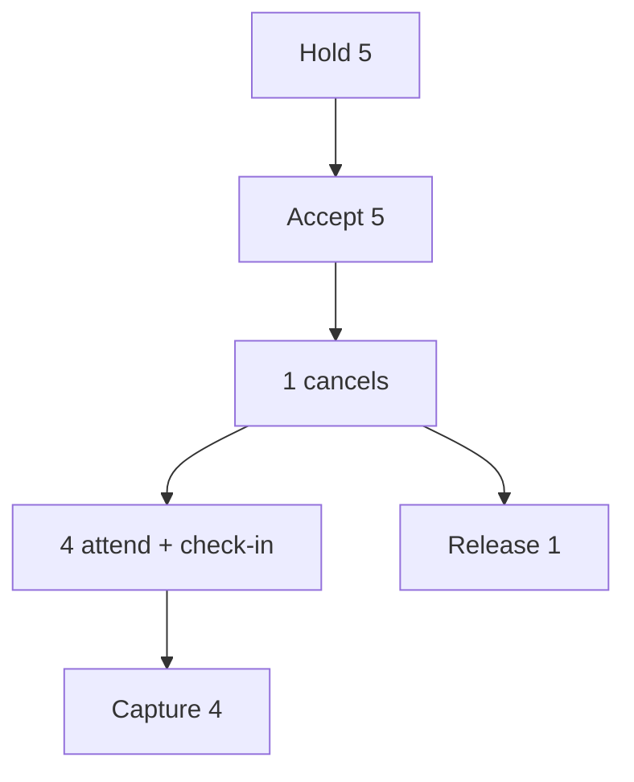

# 02 — E2E journeys (CASE-E2E)

**Status:** `proposed`  
**Cases:** T-193–T-225 (catalog skips T-208, T-224)

Use these as architecture acceptance scripts across Nest + mobile + web.

## Journey 1 — Happy path (T-193–T-204)

| Step | Case | Actor | Screen / API | Pass criteria |
| --- | --- | --- | --- | --- |
| 1 | T-193 | Worker | `m.auth.*` → worker onboarding | Account + role created |
| 2 | T-194 | Employer | `w.auth.*` / mobile employer onboarding | Org created |
| 3 | T-195 | Employer | branch form | Branch + valid coordinates |
| 4 | T-196 | Employer | create job + tokens hold | Job published; hold = headcount |
| 5 | T-197 | Worker | job feed | Job visible via matching rules |
| 6 | T-198 | Worker | apply confirm | Application pending |
| 7 | T-199 | Employer | applicants board | Status accepted; notify worker |
| 8 | T-200 | Worker | 3h confirm | `can_come` |
| 9 | T-201 | Worker | check-in | Arrived asserted |
| 10 | T-202 | System | location policy | Geo pass |
| 11 | T-203 | System | tokens | Hold → capture |
| 12 | T-204 | Both | ratings | Ratings enabled per schedule |

## Journey 2 — Worker cannot come (T-205–T-209)

| Step | Case | Pass criteria |
| --- | --- | --- |
| T-205 | Worker accepted | Seat reserved |
| T-206 | 3h `cannot_come` | Seat released / status updated |
| T-207 | Employer notified | Push + inbox |
| T-209 | Tokens | Hold adjusted (no wrongful capture) |

## Journey 3 — GPS problem + manual (T-210–T-214)

| Step | Case | Pass criteria |
| --- | --- | --- |
| T-210 | Worker on site | — |
| T-211 | GPS fail | Check-in rejected with reason |
| T-212 | Dispute opened | `m.worker.shift.dispute` |
| T-213 | Employer confirms | `manual_confirm` |
| T-214 | Token decision | Capture or release per policy |

## Journey 4 — Favorites rehire (T-215–T-218)

Favorite worker → favorites-only job → only that worker sees → apply/accept.

## Journey 5 — Multi-headcount (T-219–T-225)

Hold 5 tokens → 5 accepts → 1 cancel → capture equals attendees who checked in (not 5 blindly).

