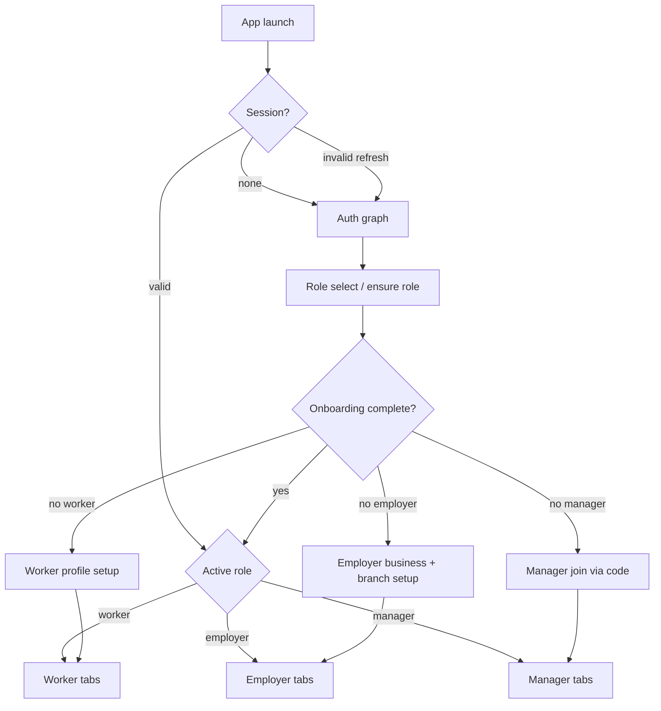

# 01 — Mobile information architecture

**Status:** `proposed`  
**Last updated:** 2026-10-07

## High-level graph

## Global gates (always-on overlays)

Evaluated before role tabs; can short-circuit navigation.

| Gate | Screen | Trigger |
| --- | --- | --- |
| Force update / maintenance | `m.shared.system.maintenance` | App config |
| Account restriction | `m.shared.system.restriction` | Abuse / policy flag |
| Blocking status | `m.shared.system.blocking` | Incomplete critical compliance |
| Policy acceptance | `m.auth.policies.accept` | New policy version |
| Location permission (contextual) | system sheet + in-flow education | Before check-in / geo features |

## Worker tabs

| Tab | Root screen | Purpose |
| --- | --- | --- |
| Home | `m.worker.home.root` | Today’s jobs, CTAs, alerts |
| Jobs | `m.worker.jobs.list` | Matched feed + search/filter |
| Calendar | `m.worker.calendar.root` | Availability + scheduled work |
| Profile | `m.worker.profile.root` | Profile, revenue, settings entry |

Stack screens push above tabs: job detail, apply confirm, check-in, notifications, etc.

## Employer tabs

| Tab | Root screen | Purpose |
| --- | --- | --- |
| Home | `m.employer.home.root` | Ops snapshot, checklist |
| Jobs | `m.employer.jobs.list` | Postings by status |
| Branches | `m.employer.branches.list` | Branch management |
| Profile | `m.employer.profile.root` | Org profile, tokens, settings |

Create-job wizard and applicants live as stacks from Jobs.

## Manager tabs

| Tab | Root screen | Purpose |
| --- | --- | --- |
| Home | `m.manager.home.root` | Today at assigned branch(es) |
| Jobs | `m.manager.jobs.list` | Branch jobs |
| Alerts | `m.manager.notifications.list` | Ops notifications |
| Profile | `m.manager.profile.root` | Manager profile / branch context |

Manager never sees employer-wide billing/token screens unless product later expands (`open`).

## Role switching

**Proposed:** one active role per session; switch requires explicit action and re-entry through onboarding gate for that role.

Documented as `open` in backend notes (`DM-1` / `AS-3`) — UI must not assume multi-role tabs simultaneously.

## Push → screen mapping (summary)

| Notification type | Target screen |
| --- | --- |
| New matching job | `m.worker.jobs.detail` |
| Application received / decision | worker or employer application detail |
| 3h availability confirm | `m.worker.shift.availability-confirm` |
| 10m check-in reminder | `m.worker.shift.check-in` |
| Rating request | `m.shared.ratings.compose` |

Full table: [03-flows-and-deep-links.md](03-flows-and-deep-links.md).
