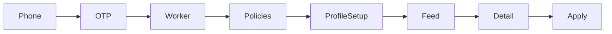
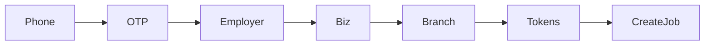
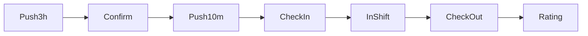
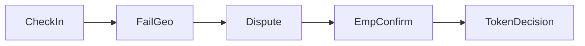

# 03 — Mobile flows & deep links

**Status:** `accepted` · [agents/10](../agents/10-production-ready.md)
**Last updated:** 2026-10-07

## Deep link scheme (proposed)

```text
parton://app/<path>
https://app.parton.<tld>/app/<path>   # universal / app links
```

All links run through: **session → role → onboarding → authorization → screen**.

## Critical user journeys

### J1 — Worker register → apply



Screens: `m.auth.phone` → `otp` → `role-select` → `policies` → `m.worker.onboarding.profile` → `jobs.list` → `jobs.detail` → `jobs.apply-confirm`

Cases: `CASE-AUTH`, `CASE-WORKER-PROFILE`, `CASE-MATCHING`, `CASE-APPLICATION`, `CASE-E2E`

### J2 — Employer register → publish job



Screens: auth… → `m.employer.onboarding.business` → `branches.form` → `tokens.root` → create job steps 1–3

Cases: `CASE-EMPLOYER-BRANCH`, `CASE-JOB-POSTING`, `CASE-TOKEN`, `CASE-E2E`

### J3 — Application review → accept

Employer/Manager: `applicants.list` → `applicants.detail` → accept → worker notified → `m.shared.job-process.detail`

Cases: `CASE-EMPLOYER-REVIEW`, `CASE-NOTIFICATIONS`

### J4 — Job day (3h + check-in)



Screens: `availability-confirm` → `check-in` → `in-shift` → `check-out` → `ratings.compose`

Cases: `CASE-AVAILABILITY-3H`, `CASE-CHECKIN`, `CASE-LOCATION`, `CASE-RATINGS`

### J5 — GPS fail → dispute → manual confirm (E2E 3)



Screens: `m.worker.shift.check-in` → `m.worker.shift.dispute` → `m.employer.shift.manual-confirm` / web attendance

Cases: T-210–T-214, T-134–T-135

Full E2E tables: [`../cases/02-e2e-journeys.md`](../cases/02-e2e-journeys.md)

## Push payload → screen

**User-centered catalog:** [`../shared/05-push-notifications-ux.md`](../shared/05-push-notifications-ux.md) · Transport: [`../backend/20-fcm-messaging.md`](../backend/20-fcm-messaging.md) · app §12.

| `type` | Params | Screen ID |
| --- | --- | --- |
| `job.matched` | `jobId` | `m.worker.jobs.detail` |
| `application.received` | `jobId`, `applicationId` | `m.employer.applicants.detail` (fallback list) |
| `application.accepted` | `applicationId` | `m.shared.job-process.detail` |
| `application.rejected` | `applicationId` | `m.shared.job-process.detail` |
| `application.accept_revoked` | `applicationId` | `m.shared.job-process.detail` |
| `job.closed_with_accepts` | `jobId`, `applicationId?` | `m.shared.job-process.detail` |
| `shift.confirm_3h` | `shiftId` | `m.worker.shift.availability-confirm` |
| `shift.cannot_come` | `shiftId`, `jobId` | `m.employer.applicants.detail` / attendance |
| `shift.confirm_timeout` | `shiftId`, `jobId` | employer attendance / applicants |
| `shift.checkin_due` | `shiftId` | `m.worker.shift.check-in` |
| `shift.worker_checked_in` | `shiftId` | employer attendance / shift detail |
| `shift.manual_confirmed` | `shiftId` | `m.shared.job-process.detail` |
| `shift.dispute_update` | `shiftId` | `m.worker.shift.dispute` / employer confirm |
| `rating.pending` | `shiftId` | `m.shared.ratings.compose` |
| `job.favorite_employer` | `jobId` | `m.worker.jobs.detail` |
| `job.favorites_only` | `jobId` | `m.worker.jobs.detail` |
| `job.audience_empty` | `jobId` | `m.employer.jobs.form` / favorites |
| `generic` | `notificationId` | `m.shared.notifications.detail` |

Full template ↔ case matrix: [`../shared/05-push-notifications-ux.md`](../shared/05-push-notifications-ux.md) §0.

Invalid/expired targets → friendly inbox detail or role home (T-109). Gates: session → role/context → onboarding → AuthZ → screen.

**Navigator baseline:** React Navigation native stack + tabs + linking — [ADR-0024](../backend/adr/0024-fluid-routing.md) · [`../shared/08-routing.md`](../shared/08-routing.md).

## Permission UX

| Permission | First ask | Hard requirement |
| --- | --- | --- |
| Notifications | After role home once + in-app rationale ([push UX §1](../shared/05-push-notifications-ux.md)) | Soft; inbox remains (T-111) |
| Location when-in-use | Before first check-in / distance filter | Check-in blocked without it |
| Background location | Avoid v1 | — |

## Offline (v1 stance)

- Reads: show last cache + offline banner where safe
- Writes (apply, check-in, OTP): require network; queue only if explicitly designed later
- Do not fake check-in success offline
