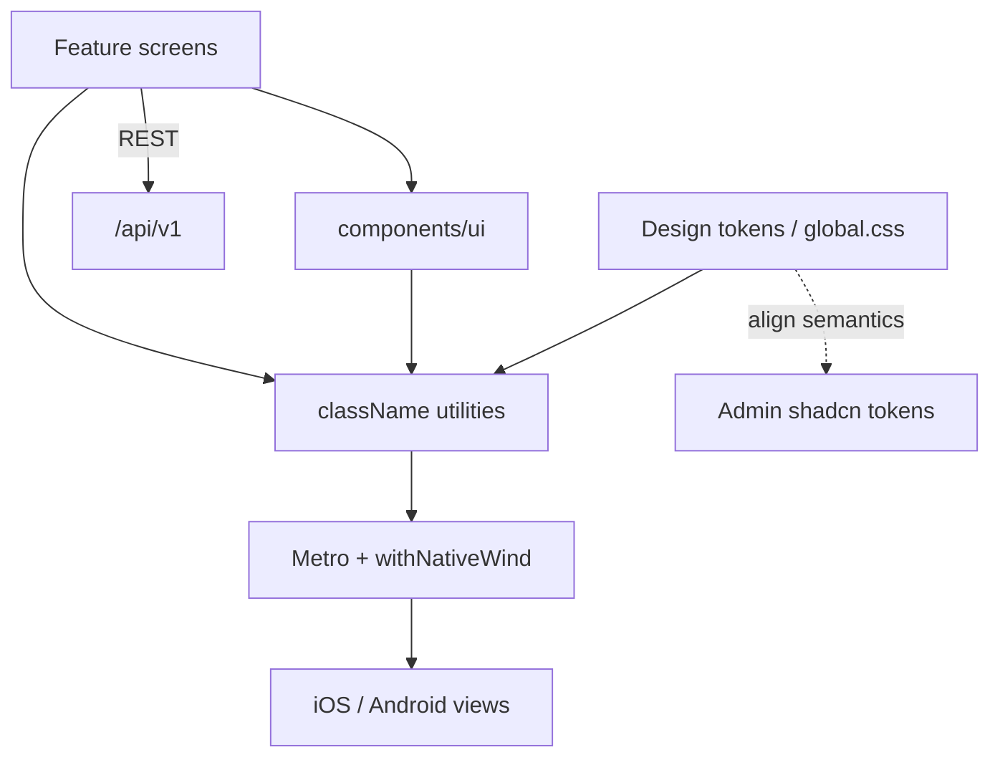

# 04 — Mobile UI stack ([NativeWind](https://www.nativewind.dev/))

**Status:** `accepted` (engineering baseline)  
**Last updated:** 2026-10-10  
**ADR:** [0015 — NativeWind for bare React Native UI](../backend/adr/0015-mobile-ui-nativewind.md) · [0039 — DESIGN.md](../backend/adr/0039-design-md.md)  
**Visual SoR:** [`../DESIGN.md`](../DESIGN.md) (mobile = sparse cream/forest channel) · Stitch screens [08](08-stitch-mobile-ui.md)  
**Architecture home:** [`../04-application-architecture.md`](../04-application-architecture.md) §14  
**Upstream:** [nativewind.dev](https://www.nativewind.dev/) · [NativeWind docs](https://www.nativewind.dev/docs)  
**Companion web:** Admin uses Tailwind via [shadcn/ui](../web/04-shadcn-dark-ui.md) — align **semantic tokens**, not share RN components  
**Design language (iOS):** [05 — WWDC Liquid Glass](05-wwdc-liquid-glass.md) · [ADR-0016](../backend/adr/0016-mobile-ui-wwdc-liquid-glass.md)

> PartOn mobile is **bare React Native** (Expo forbidden). Styling is **[NativeWind](https://www.nativewind.dev/)**. Implement screens from [`DESIGN.md`](../DESIGN.md) + Liquid Glass chrome rules — solid content cards, one orange CTA.

---

## Verdict

| Topic | PartOn stance |
| --- | --- |
| Styling system | **[NativeWind](https://www.nativewind.dev/)** (Tailwind → RN) |
| App shape | **Bare RN** — Metro + owned `ios/` / `android/` — ADR-0006 |
| Version at scaffold | **NativeWind v4.x stable** (e.g. docs’ `nativewind@4.2.7` + Tailwind 3.4); **v5** Assess until stable |
| API | Prefer `className="…"`; `StyleSheet` only for rare escapes |
| Theme | Light **and** dark via NativeWind `useColorScheme`; default **`system`** + override — [color system §8](../shared/01-color-system.md) |
| Colors | **[shared/01-color-system.md](../shared/01-color-system.md)** · ADR-0017 — cream / forest / orange brand |
| Components | App-owned primitives in `src/components/ui`; optional **React Native Reusables** (Trial) as shadcn-like copy kit |
| Navigation | **React Navigation** (not Expo Router) |
| Admin parity | **Same color token names** as shadcn; separate component trees |
| iOS design language | Liquid Glass **principles** — UI chrome translucent; content solid/branded — [05](05-wwdc-liquid-glass.md) |
| Forbidden | Expo styling stack; CSS-in-JS as primary; glass-on-every-card; ad-hoc hex in features |

---

## 1. Why NativeWind

| Driver | Response |
| --- | --- |
| Tailwind literacy | Same mental model as admin shadcn ([web/04](../web/04-shadcn-dark-ui.md)) |
| DX | Utility-first; less StyleSheet sprawl |
| Cross-platform | One class vocabulary for iOS + Android ([NativeWind](https://www.nativewind.dev/)) |
| Performance | Build-time style processing (NativeWind model) |
| Bare RN | Supported via Metro `withNativeWind` — no Expo required |

---

## 2. Placement



| Layer | Owns |
| --- | --- |
| Screens / features | Layout composition, navigation, device APIs |
| `components/ui` | Buttons, inputs, cards, list rows — Tailwind-styled |
| NativeWind / Tailwind | `global.css`, `tailwind.config`, Metro input |
| Nest / domain | **Never** — no UI in backend |

---

## 3. Scaffold (bare / frameworkless)

Follow current [NativeWind installation (frameworkless)](https://www.nativewind.dev/docs/getting-started/installation/frameworkless) at scaffold time. Illustrative (pin exact versions then):

```bash
# peer deps per NativeWind docs — verify Reanimated major compatibility
npm install nativewind@4.2.7 react-native-reanimated react-native-safe-area-context
npm install --save-dev tailwindcss@^3.4.17 prettier-plugin-tailwindcss@^0.5.11
```

| Config | Requirement |
| --- | --- |
| Metro | `withNativeWind(config, { input: "./global.css" })` |
| Entry | `import "./global.css"` in app root |
| Babel / Reanimated | Per NativeWind + Reanimated docs for chosen majors |
| Prettier | `prettier-plugin-tailwindcss` for class sort |

Smoke test pattern from docs: `View`/`Text` with `className` centering and colored text.

---

## 4. Theming & color tokens

Canonical: [`../shared/01-color-system.md`](../shared/01-color-system.md) ([ADR-0017](../backend/adr/0017-color-system.md)).

| Topic | Stance |
| --- | --- |
| Mechanism | NativeWind scheme + Tailwind `dark:` / `@theme` colors |
| Hook | `useColorScheme()` — `setColorScheme('light' \| 'dark' \| 'system')` |
| Default | **`system`** (MOB-1 closed) — outdoor day → cream light; night → forest dark |
| Settings | `m.shared.settings` persists override |
| Surfaces | `bg-surface-base` / `bg-surface-1` / `bg-surface-2` (elevation, not shadows) |
| Text | `text-text-high` / `medium` / `low` / `on` |
| CTA | `bg-action-primary` + `active:bg-action-primary-pressed` (no hover on mobile) |
| Feedback | `text-feedback-error`, `bg-feedback-success`, etc. |

```tsx
// Illustrative
<View className="flex-1 bg-surface-base">
  <View className="rounded-xl bg-surface-1 p-4">
    <Text className="text-text-high">İlan başlığı</Text>
    <Text className="text-text-medium">Açıklama</Text>
    <Pressable className="bg-action-primary active:bg-action-primary-pressed rounded-full px-4 py-3">
      <Text className="text-text-on">Başvur</Text>
    </Pressable>
  </View>
</View>
```

Do **not** hardcode `#E97A3D` / `#F3E8CF` in features — tokens only.

---

## 5. Component strategy

| Approach | Ring | Notes |
| --- | --- | --- |
| Hand-rolled `components/ui` with NativeWind | **Adopt** | Buttons, TextField, Screen, ListItem, Badge, … |
| [React Native Reusables](https://www.nativewind.dev/) (copy-paste kit) | **Trial** | shadcn-like for RN; evaluate in P0 spike |
| NativewindUI / gluestack full kits | **Assess** | Faster ship vs ownership; prefer owned primitives for marketplace UX |
| Raw `StyleSheet` everywhere | **Hold** as primary | Allowed only for animations/interop escapes |

**Rules:**

- Prefer composition over giant screen files.  
- Map complex list props with NativeWind `remapProps` when needed (`FlatList` content containers, etc.).  
- Keep touch targets ≥ 44pt; respect Safe Area.  
- No business AuthZ in UI — hide affordances only.

---

## 6. Design tokens vs admin

| Shared | Not shared |
| --- | --- |
| **Color tokens** ([01-color-system](../shared/01-color-system.md)) | React DOM / Radix / shadcn files |
| Radius / spacing scale (later) | Web-only sidebar layout |

`packages/design-tokens` Tailwind preset for both apps — MOB-2 / WEB-6 (scaffold or P1).

---

## 7. Folder layout (target)

```text
apps/mobile/
  ios/
  android/
  global.css                 # Tailwind / NativeWind input
  metro.config.js            # withNativeWind
  tailwind.config.js         # or CSS-first per NativeWind version
  src/
    app/                     # React Navigation roots
    components/ui/           # primitives (Button, Input, …)
    features/
      auth/
      worker/
      employer/
      shared/
    lib/theme.ts             # scheme helpers
```

---

## 8. Quality bars

| Bar | Practice |
| --- | --- |
| Consistency | Lint class usage; shared primitives for buttons/inputs |
| A11y | **WCAG-equivalent AA** — [shared/06](../shared/06-accessibility-wcag.md) · ADR-0022; labels; contrast light+dark; 44pt targets |
| Perf | Avoid insane class churn in hot lists; memo list rows |
| i18n | **tr-TR primary** — [shared/07](../shared/07-i18n.md) · ADR-0023; keys via i18next; no copy in class names |
| Testing | Maestro/Detox against bare builds; visual smoke on both themes |

---

## 9. Delivery

| Phase | Outcomes |
| --- | --- |
| **P0** | NativeWind Metro scaffold; auth + shell screens on utilities; light/dark plumbing |
| **P1** | Worker/employer primitives library; feed/list patterns |
| **P2** | Theme setting in UI; polish day-of flows |
| **P3+** | Token package alignment with admin if proven |

---

## 10. Open questions

| ID | Question | Default |
| --- | --- | --- |
| MOB-1 | Default color scheme | **`system`** — locked with ADR-0017 |
| MOB-2 | Shared `design-tokens` package timing | Scaffold or P1 |
| MOB-3 | Adopt React Native Reusables? | Trial one flow in P0 |
| MOB-4 | NativeWind v5 promotion | When v5 stable + bare RN guide clear |
| MOB-5 | New Architecture + NativeWind | Enable together only when deps green |

---

## Related

- ADR: [`../backend/adr/0015-mobile-ui-nativewind.md`](../backend/adr/0015-mobile-ui-nativewind.md)  
- App architecture: [`../04-application-architecture.md`](../04-application-architecture.md) §14  
- Color system: [`../shared/01-color-system.md`](../shared/01-color-system.md)  
- WWDC / Liquid Glass: [`05-wwdc-liquid-glass.md`](05-wwdc-liquid-glass.md)  
- Bare RN: [ADR-0006](../backend/adr/0006-bare-react-native-no-expo.md)  
- Admin Tailwind/shadcn: [`../web/04-shadcn-dark-ui.md`](../web/04-shadcn-dark-ui.md)  
- Screens: [`02-screen-catalog.md`](02-screen-catalog.md)  
- Upstream: https://www.nativewind.dev/  
