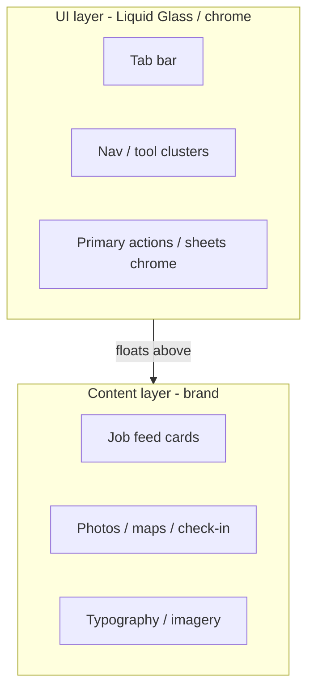

# 05 — Mobile UI design language (WWDC / Liquid Glass)

**Status:** `accepted` (design principles); native API fidelity varies by platform  
**Last updated:** 2026-10-09  
**ADR:** [0016 — Apple Liquid Glass principles on PartOn mobile](../backend/adr/0016-mobile-ui-wwdc-liquid-glass.md)  
**Architecture home:** [`../04-application-architecture.md`](../04-application-architecture.md) §14  
**Styling engine:** [NativeWind](04-nativewind-ui.md) · [nativewind.dev](https://www.nativewind.dev/)  
**Era bar:** [Modern UI principles (Sept 2026)](../shared/09-modern-ui-principles.md) · [ADR-0025](../backend/adr/0025-modern-ui-principles.md)  
**Apple refs:** [Adopting Liquid Glass](https://developer.apple.com/documentation/TechnologyOverviews/adopting-liquid-glass) · [Liquid Glass overview](https://developer.apple.com/documentation/technologyoverviews/liquid-glass) · WWDC26 [Communicate your brand identity on iOS](https://developer.apple.com/videos/play/wwdc2026/251/) · WWDC25 UIKit new design

> PartOn remains **bare React Native + NativeWind** (not SwiftUI). We **adopt Apple’s Liquid Glass design principles** for the **iOS UI layer** and map them to RN patterns. We do **not** rewrite the app in SwiftUI to chase APIs — we keep marketplace content cross-platform and make the **chrome** feel at home on iOS 26/27+.

---

## Verdict

| Topic | PartOn stance |
| --- | --- |
| Design language (iOS) | **Liquid Glass era** — UI/nav layer vs content layer |
| Brand (WWDC26) | Express PartOn brand in **content**; keep **UI chrome** familiar/system-like |
| Styling engine | Still **NativeWind** — ADR-0015 |
| Native glass APIs | Prefer system bars where RN allows; custom glass **sparingly** via blur/material primitives |
| Android | Material 3 Expressive / platform norms — **parallel**, not fake iOS glass everywhere |
| Accessibility | Honor Reduce Transparency, Increase Contrast, Dark Mode, Dynamic Type |
| Admin web | shadcn dark ops — **not** Liquid Glass (different surface) |

---

## 1. Two layers (core WWDC model)

From Apple’s Liquid Glass guidance and WWDC26 brand session: the app is **UI layer** (controls, navigation) floating above a **content layer** (jobs, profiles, maps, media).

| Layer | Purpose | PartOn practice |
| --- | --- | --- |
| **UI** | Familiar controls; glass/translucent chrome | Tab bar, headers, sheets, FABs — translucent, legible, sparse brand color |
| **Content** | Brand + marketplace value | Full-bleed job imagery, sector art, check-in map, TR copy, PartOn accent in status/CTAs |

**WWDC26 brand rule:** move brand color moments into **content** and use color for **actions, status, feedback** — not painting every chrome bar PartOn-purple.

---

## 2. Liquid Glass principles → RN / NativeWind

Apple: glass is for the **topmost functional layer**; [don’t overuse](https://developer.apple.com/documentation/TechnologyOverviews/adopting-liquid-glass); remove custom opaque bar backgrounds that fight system materials; test accessibility.

| Apple principle | PartOn mobile mapping |
| --- | --- |
| Glass on nav/controls, not content | Translucent tab/header; **opaque/solid cards** for job/applicant content |
| Prefer system materials | React Navigation translucent bars; avoid custom solid `#fff` headers on iOS |
| Sparing custom glass | One blur recipe for floating action clusters — not glass on every card |
| Scroll edge / hierarchy | Content scrolls under chrome; edge fades / safe areas respected |
| Rounder, grouped controls | Pill clusters for toolbar actions; larger hit targets |
| Morphing / fluidity | Reanimated for sheet/tab transitions — tasteful, not gimmicky |
| iOS 27 tuning | Expect stronger diffusion / edge definition when OS updates; don’t hardcode brittle blur radii |

Native SwiftUI `.glassEffect()` / `UIGlassEffect` are **not** first-class in RN. Options:

| Approach | Ring | Notes |
| --- | --- | --- |
| System / RN navigator translucent chrome | **Adopt** | Highest fidelity with least code |
| Bare blur view (e.g. community blur) behind chrome | **Trial** | Approximate glass; test Reduce Transparency |
| Fabric/native module wrapping `UIGlassEffect` | **Assess** | Only if product needs pixel-native glass on custom controls |
| Fake glass (white 80% opacity everywhere) | **Hold** | Looks dated; fights Dark Mode |

---

## 3. Brand identity (WWDC26)

Session: [Communicate your brand identity on iOS](https://developer.apple.com/videos/play/wwdc2026/251/).

| Area | Guidance for PartOn |
| --- | --- |
| **Components** | Familiar tab/list/sheet patterns — don’t invent exotic chrome |
| **Content** | Job photos, empty states, illustrations carry brand |
| **Color** | Accent for primary CTA, status (accepted/rejected), token chip — not full-bleed chrome tint |
| **Typography** | Distinct display face OK in content; body supports Dynamic Type; prefer readable system/RN defaults for forms |
| **Iconography** | Consistent set (SF Symbol–like metaphors via Lucide/custom); avoid icon soup on glass bars |

Colors: cream light / forest dark / orange CTA — [`../shared/01-color-system.md`](../shared/01-color-system.md). Admin stays **dark-default**; mobile **`system`** default. Brand accent (`action-primary`, `action-accent`) lives mainly in **content** and CTAs, not full-bleed chrome fills.

---

## 4. Screen patterns (PartOn)

| Surface | UI layer | Content layer |
| --- | --- | --- |
| Worker home / feed | Floating tab bar; search chip | Job cards, imagery, match reasons |
| Job detail | Glass-ish top actions (favorite, share) | Hero media, pay, requirements |
| Check-in | Compact translucent controls | Map / geofence truth (clarity > glass) |
| Employer applicants | Segmented control chrome | Applicant rows (solid, scannable) |
| Auth / OTP | Minimal chrome | Brand welcome content |
| Sheets (apply, dispute) | System sheet detents | Form fields solid for readability |

**Check-in / safety:** Prefer **high contrast, low ornament** — Liquid Glass must not reduce legibility of geo errors or confirm CTAs.

---

## 5. Accessibility & system settings

Canonical baseline: [`../shared/06-accessibility-wcag.md`](../shared/06-accessibility-wcag.md) · [ADR-0022](../backend/adr/0022-accessibility-wcag.md).

| Setting | Requirement |
| --- | --- |
| Dark Mode | Full semantic token path (NativeWind) |
| Reduce Transparency | Fall back to solid chrome (`bg-background` / elevated surfaces) |
| Increase Contrast | Stronger borders/text; disable decorative blur |
| Dynamic Type | Don’t clip OTP/job titles; scalable text |
| Reduce Motion | Skip morphing; instant transitions |
| Screen readers | VoiceOver / TalkBack labels on P0 controls |

Ship a `useGlassEnabled()` (or equivalent) that reads accessibility + platform and toggles blur off.

---

## 6. App icon (Liquid Glass era)

Apple: layered icons, Icon Composer, light/dark/clear/tinted variants ([Adopting Liquid Glass](https://developer.apple.com/documentation/TechnologyOverviews/adopting-liquid-glass)).

| Deliverable | Owner |
| --- | --- |
| Layered PartOn icon (simplified shapes) | Design |
| iOS appearances (default, dark, clear, tinted) | Design + mobile assets |
| Android adaptive icon | Parallel asset set — not iOS layers copy-paste |

---

## 7. Android parity

Do **not** paste iOS glass onto Material.

| iOS | Android |
| --- | --- |
| Liquid Glass chrome | Material 3 surface containers / tonal elevation |
| Floating tab | Material navigation bar |
| Brand in content | Same content components; platform chrome |

Shared: NativeWind tokens, feature layouts, REST — **platform chrome adapters** in `components/ui/chrome/*`.

---

## 8. Tooling & build

| Item | Stance |
| --- | --- |
| Xcode / iOS SDK | Build with latest stable SDK so any native chrome picks up OS materials |
| React Navigation | Configure translucent headers/tabs per platform |
| Reanimated | Approved peer for NativeWind; use for restrained motion |
| Snapshot tests | Light/dark + “reduce transparency” fixtures |

---

## 9. Delivery

| Phase | Outcomes |
| --- | --- |
| **P0** | Layer model in UI kit; translucent tabs; solid content cards; a11y solid fallback |
| **P1** | Brand content moments on feed/detail; accent discipline |
| **P2** | Blur chrome Trial; icon variants; check-in high-contrast pass |
| **P3+** | Assess native `UIGlassEffect` bridge if still needed |

---

## 10. Open questions

| ID | Question | Default |
| --- | --- | --- |
| LG-1 | Default scheme light vs system (MOB-1) | **system** |
| LG-2 | Blur library choice (bare RN) | Decide at P2 Trial |
| LG-3 | Native UIGlassEffect module | Assess after P2 |
| LG-4 | How much glass on employer vs worker | Same chrome system; content differs |

---

## Related

- ADR: [`../backend/adr/0016-mobile-ui-wwdc-liquid-glass.md`](../backend/adr/0016-mobile-ui-wwdc-liquid-glass.md)  
- NativeWind: [`04-nativewind-ui.md`](04-nativewind-ui.md)  
- App architecture §14: [`../04-application-architecture.md`](../04-application-architecture.md)  
- Apple: [Adopting Liquid Glass](https://developer.apple.com/documentation/TechnologyOverviews/adopting-liquid-glass) · WWDC26 [brand on iOS](https://developer.apple.com/videos/play/wwdc2026/251/)  
