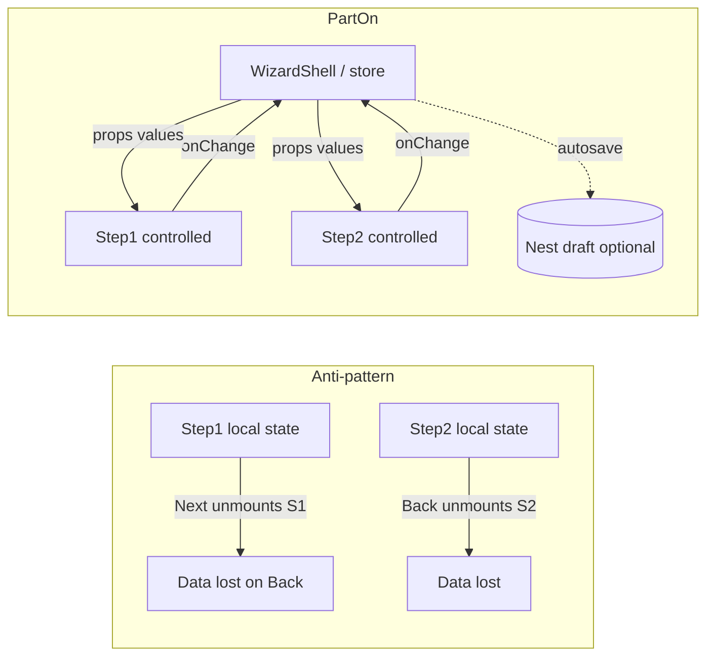

# 04 — Multi-step wizard state (forms that survive Back)

**Status:** `accepted`  
**Last updated:** 2026-10-09  
**ADR:** [0020 — Wizard state ownership](../backend/adr/0020-wizard-state.md)  
**Architecture:** [`../04-application-architecture.md`](../04-application-architecture.md) §15.4  
**Layout recipe:** [03-screen-ux-layout](03-screen-ux-layout.md) **R3**  
**Components:** [`02-ui-components.md`](02-ui-components.md) (`WizardShell`, `JobWizard`, …)  
**Cases:** `CASE-JOB-POSTING` (T-237), `CASE-WORKER-PROFILE` (T-236), `CASE-EMPLOYER-BRANCH`, `CASE-TOKEN` (T-161 draft)

> **Problem:** Each wizard step is often its own component. Navigating Back **unmounts** the forward step → its local React state is destroyed → fields look “reset.”  
> **PartOn fix:** Never keep durable wizard answers only in a step’s `useState`. Own data in a **parent shell** (and for long flows, a **Nest draft**).

---

## Verdict

| Approach | PartOn ring | When |
| --- | --- | --- |
| **1. Lift state to parent (`WizardShell`)** | **Adopt (required)** | Every multi-step form |
| **2. Scoped wizard store (Zustand or React Context)** | **Adopt** when steps are **separate routes/screens** | Create-job stack, long onboarding |
| **3. Server draft (Nest `/api/v1`)** | **Adopt** for durable products | Create job, payment-failed job draft (T-161), resume later |
| **3b. Client draft cache (MMKV / sessionStorage)** | **Trial** — crash/reload assist only | Never system of record; no secrets/PII beyond form fields |
| **4. Hide steps instead of unmount (`display:none` / keep-alive)** | **Hold as sole strategy** | Optional micro-opt **inside** one screen; **not** enough for RN stack Back |

**Forbidden:** Step-local `useState` as the only copy of answers · Redux/global store for every tiny form · Putting OTP/tokens in draft cache · Relying on CSS hide across React Navigation screens.

---

## 1. Root cause (architecture)



Steps are **presentational + validation for the current step**. The shell owns `values`, `stepIndex`, `errors`, and `draftId`.

---

## 2. Pattern A — Lifted state (single screen, step index)

Use when all steps live under **one** route (recommended default for ≤4 short steps).

```tsx
// Conceptual — apps/mobile or apps/admin
function CreateJobWizard() {
  const [step, setStep] = useState(0);
  const [values, setValues] = useState<CreateJobDraft>(emptyDraft);

  const patch = (partial: Partial<CreateJobDraft>) =>
    setValues((v) => ({ ...v, ...partial }));

  return (
    <WizardShell step={step} onStepChange={setStep} values={values}>
      {step === 0 && (
        <StepPositions values={values} onChange={patch} onNext={() => setStep(1)} />
      )}
      {step === 1 && (
        <StepDetails values={values} onChange={patch} onBack={() => setStep(0)} onNext={() => setStep(2)} />
      )}
      {step === 2 && (
        <StepSummary values={values} onBack={() => setStep(1)} onPublish={publish} />
      )}
    </WizardShell>
  );
}
```

| Rule | Detail |
| --- | --- |
| Controlled inputs | Step fields read `values.*`; write via `onChange` |
| Step validation | Zod slice per step (shared `api-contracts`); block Next on fail |
| Unmount OK | Step may unmount; **data stays in shell** |
| R3 UX | Step indicator; one concern per step; one primary CTA |

---

## 3. Pattern B — Scoped store + stack routes

Use when catalog IDs are separate screens (`m.employer.jobs.create.step1` … `step3`) or React Navigation pushes each step.

| Piece | Role |
| --- | --- |
| `WizardShell` provider | Creates store instance keyed by `wizardSessionId` / `draftId` |
| Zustand **or** React Context | Holds `values`, `step`, `dirty`, `draftId` — **scoped to this wizard**, not app-global |
| Step screens | Subscribe to store; never keep answers only in local state |
| Leave wizard | `reset()` store; clear client cache |

```text
packages/ or apps/*/features/wizards/
  create-job/
    createJobWizardStore.ts   # factory: createCreateJobStore(draftId?)
    CreateJobWizardProvider.tsx
    steps/StepPositions.tsx   # controlled
    steps/StepDetails.tsx
    steps/StepSummary.tsx
```

**Why not app-wide Redux for wizards?** Overkill; leaks draft across unrelated flows; harder cleanup. Prefer **per-wizard store factory**.

**Zustand** is the proposed library for mobile + admin wizard stores (light, RN-friendly). Plain **React Context + useReducer** is acceptable if the team wants zero deps for small wizards.

---

## 4. Pattern C — Nest draft (durable)

| Wizard | Server draft | Notes |
| --- | --- | --- |
| Create / edit job | **Yes** — `POST/PATCH /api/v1/jobs` with `status: draft` | Resume after kill; T-161 failed payment stays draft |
| Worker onboarding | **Partial** — save profile sections via existing worker APIs | Prefer progressive PATCH `/workers/me` |
| Employer onboarding | **Partial** — business/branch endpoints | Same |
| Admin one-off forms | Usually **no** | Lifted state enough |
| OTP / auth steps | **No client draft of codes** | Challenge id only; security |

Autosave: debounce PATCH while typing or on **Next**. UI shows “Draft saved” subtly; never block typing on slow network (queue patch).

Client cache (MMKV mobile / `sessionStorage` web) may mirror draft for instant restore **after** hydrate from Nest when `draftId` exists.

---

## 5. Pattern D — Hide vs unmount (limited)

| Allowed | Forbidden |
| --- | --- |
| Within one screen, keep mounted steps and toggle `style={{ display: step===i ? 'flex' : 'none' }}` **in addition to** lifted state | Using hide-only so each step still owns unreplicated local state |
| RN: keep wizard parent mounted while swapping step children | Assuming React Navigation keeps previous stack screen state forever without a store |

Vue `<keep-alive>` is **N/A** (PartOn is React). Do not introduce Vue.

---

## 6. Shared contracts & validation

| Layer | Owns |
| --- | --- |
| `packages/api-contracts` | `CreateJobDraft` Zod schema; per-step `.pick()` / refined slices |
| Step UI | Run step schema on Next |
| Nest | Full schema + AuthZ + token hold on publish |
| Mobile pre-check | Same Zod — never replaces server |

---

## 7. Wizard inventory (must implement pattern)

| Flow | Channel | Pattern | Draft |
| --- | --- | --- | --- |
| Create job | Mobile + web employer | B (stack) or A (single) + C | Nest draft |
| Worker onboarding profile | Mobile | A or B | Progressive API |
| Employer onboarding business | Mobile + web | A or B | Progressive API |
| Manager join | Mobile | A (short) | No |
| Token top-up | Mobile + web | A (short) / R4 sheet | Payment intent server-side |
| Admin multi-step (rare) | Admin | A | Optional |

UI components: `WizardShell`, `WizardStepHeader`, `WizardFooter`, `JobWizard` (compose steps), `DraftSavedHint`.

---

## 8. Screen spec fields (wizards)

Extend screen notes for wizard steps:

| Field | Example |
| --- | --- |
| **Recipe** | `R3` |
| **Wizard id** | `create-job` |
| **State owner** | `WizardShell` + `createJobWizardStore` / parent |
| **Draft API** | `PATCH /api/v1/jobs/:draftId` or `—` |
| **Step schema** | `CreateJobDraftStep1` |

---

## 9. Checklist (PR / review)

- [ ] No durable answers only in step `useState`  
- [ ] Back restores fields from shell/store (manual test)  
- [ ] Process kill + resume works if Nest draft required  
- [ ] Store reset on successful publish / discard  
- [ ] PII: draft cache excluded from logs; no secrets in MMKV/sessionStorage  
- [ ] Step Zod + Nest validation both present  

---

## Related

- [ADR-0020](../backend/adr/0020-wizard-state.md)  
- UX R3: [`03-screen-ux-layout.md`](03-screen-ux-layout.md)  
- Employer create-job screens: [`../mobile/screens/employer.md`](../mobile/screens/employer.md)  
- Tokens draft: [`../backend/11-tokens-and-provision.md`](../backend/11-tokens-and-provision.md)  
