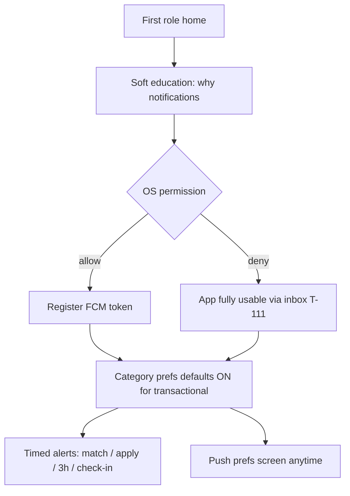

# 05 — Push notifications (user-centered)

**Status:** `accepted`  
**Last updated:** 2026-10-09  
**ADR:** [0021 — User-centered push experience](../backend/adr/0021-push-notifications-ux.md)  
**Transport:** [`../backend/20-fcm-messaging.md`](../backend/20-fcm-messaging.md) · [ADR-0013](../backend/adr/0013-fcm-push.md)  
**Architecture:** [`../04-application-architecture.md`](../04-application-architecture.md) §12  
**Deep links:** [`../mobile/03-flows-and-deep-links.md`](../mobile/03-flows-and-deep-links.md)  
**Cases:** All push/inbox needs from [`../../parton_case_tests_tr.json`](../../parton_case_tests_tr.json) — see **§0 coverage matrix**  
**UI:** Recipe inbox R1 · components in [`02-ui-components.md`](02-ui-components.md)

> Push exists to help a **person take the next right action** (or learn an outcome), not to dump system events. FCM is the pipe; this doc owns **who**, **when**, **what they see**, **where they land**, and **how they stay in control**. Every catalog case that implies a notification **must** map to a template or an explicit non-push channel below.

---

## Verdict

| Principle | Practice |
| --- | --- |
| **Full catalog coverage** | §0 matrix — no orphan notify cases |
| **User job first** | One clear action or outcome per notification |
| **Inbox is truth** | Always write Postgres inbox; push is optional delivery (T-111) |
| **Actionable tap** | Every push opens the right screen (T-109); never a dead end |
| **Correct audience** | Server resolves recipients only (T-113) |
| **No spam** | `dedupe_key` + collapse; no duplicate trays (T-110) |
| **Respect prefs** | Category toggles; marketing separate opt-in (KVKK) |
| **Timely, not noisy** | Critical shift nudges high priority; matching may batch (T-226) |
| **Safe copy** | No OTP, secrets, full phone, precise home geo in tray |
| **Locale** | **tr-TR** primary — [07-i18n](07-i18n.md) · ADR-0023; `en` when profile locale set |
| **Not push** | SMS OTP (T-005) stays SMS — never FCM |

---

## 0. Catalog coverage matrix (`parton_case_tests_tr.json`)

### 0.1 Cases with explicit push / in-app signals (22)

| Cases | Template `type` | Notes |
| --- | --- | --- |
| T-100 | `job.matched` | New eligible job |
| T-101 | `application.received` | Employer/managers |
| T-096, T-103 | `application.rejected` | Same template; T-096 = delivery QA |
| T-097, T-102 | `application.accepted` | Same template; T-097 = delivery QA |
| T-104, T-114 | `shift.confirm_3h` | Worker T−3h; T-122 adapts schedule |
| T-105, T-123 | `shift.checkin_due` | Worker T−10m |
| T-106, T-172 | `rating.pending` | +24h both sides |
| T-107 | `job.favorite_employer` | Fav employer posted |
| T-108 | `job.favorites_only` | Favorites-only audience only |
| T-109 | *(cross-cut)* | Deep-link router for all types |
| T-110 | *(cross-cut)* | `dedupe_key` + collapse on all |
| T-111 | *(cross-cut)* | Inbox-first; push optional |
| T-112, T-231 | *(cross-cut)* | Lag: inbox still visible; queue metrics |
| T-113 | *(cross-cut)* | Nest audience only |
| T-133 | `shift.worker_checked_in` | **Employer/managers** on success |
| T-226 | `job.matched` (+ fan-out) | Perf: BullMQ Stage B; no UX change |

### 0.2 Domain cases that require notify (implied)

| Cases | Template `type` | Audience |
| --- | --- | --- |
| T-116, T-118, T-119, T-121*, T-206 | `shift.cannot_come` | Employer + branch managers |
| T-117 | `shift.confirm_timeout` | Employer (+ optional worker reminder once) |
| T-122 | `shift.confirm_3h` | Same template; **scheduler** fires ASAP if job starts &lt;3h |
| T-098 | `application.accept_revoked` | Worker |
| T-099 | `job.closed_with_accepts` | Accepted workers |
| T-135 | `shift.dispute_update` | Counterpart + optional admin |
| T-134 | `shift.manual_confirmed` | Worker (manual attendance OK) |

\* T-121: one `shift.cannot_come` per cancelling worker (not one bulk wrong user).

### 0.3 Related but not FCM push

| Cases | Channel |
| --- | --- |
| T-005 OTP | **SMS** only |
| T-057 favorites-only empty audience | **In-app** publish gate / employer banner — optional `job.audience_empty` inbox to employer (no worker push) |
| T-069–T-078 matching visibility | Feed/UI; push only via T-100/T-107/T-108 when eligible |
| T-115 can-come | Updates state; **no** separate “success spam” push (optional quiet inbox) |
| Admin abuse bans | Admin console + optional later `account.restricted` |

### 0.4 Coverage gate

A notify-related case is **architecture-complete** only if: template row exists · audience rule · deep link · prefs category · `dedupe_key` · inbox write · listed in FCM dispatcher catalog ([20](../backend/20-fcm-messaging.md)).

---

## 1. User journey (permission → value)

| Moment | UX |
| --- | --- |
| Before OS dialog | In-app `PermissionExplainer`: *“Vardiya ve başvuru güncellemelerini kaçırma”* + Continue / Not now |
| Denied | No blocking; badge on bell from inbox; settings deep link “Bildirimleri aç” |
| After first accept | Confirm toast; ensure token registered |
| Prefs | Toggles: Vardiyalar · Başvurular · Uygun işler · Favoriler · Pazarlama (off by default) |

Registration / login **must not** require notification permission (same spirit as location T-009).

---

## 2. Delivery modes the user feels

| Mode | What user experiences |
| --- | --- |
| **Tray push** | OS banner/lock screen when app background/killed |
| **Foreground** | Soft in-app banner or inbox badge + optional SSE refresh — not a second loud OS alert if already on that screen |
| **Inbox** | Durable list always; full body; mark read |
| **Delayed** | If FCM lag (T-112): inbox still shows; user sees content when opening app; ops metrics track lag |

If the user is **already on the target screen**, suppress redundant foreground banner; update that screen via REST/SSE instead.

---

## 3. Template catalog (detailed)

Copy below is **product baseline (tr-TR)**. Variables in `{braces}`. English strings live beside Turkish in template locale files.

### Shared fields (every template)

| Field | Rule |
| --- | --- |
| `type` | Stable machine id (deep link) |
| `title` / `body` | Short; body ≤ ~120 chars for tray |
| `inboxBody` | Longer optional text for detail screen |
| `data` | `type`, entity ids, `notificationId`, `v` — strings only |
| `category` | Pref bucket: `shifts` \| `applications` \| `matching` \| `favorites` \| `marketing` |
| `urgency` | `critical` \| `high` \| `normal` |
| `collapseKey` | Logical id so updates replace, not stack |
| `ttl` | Stale nudges expire (esp. check-in) |
| `dedupe_key` | Server unique per logical event (T-110) |

---

### T-100 — `job.matched` — New eligible job

| | |
| --- | --- |
| **Audience** | Worker(s) who newly match |
| **When** | After matching run includes job |
| **Category** | `matching` · urgency `normal` |
| **Title** | Yeni iş fırsatı |
| **Body** | `{jobTitle} · {branchArea} · {startLocal}` |
| **Tap →** | `m.worker.jobs.detail` (`jobId`) |
| **Collapse** | `job.matched:{jobId}:{userId}` |
| **User need** | Discover work without opening the feed constantly |
| **Do not** | Spam every tiny ranking change; one notify per job per user |

### T-101 — `application.received` — Application received

| | |
| --- | --- |
| **Audience** | Employer owners + managers on that branch/job |
| **When** | Worker apply succeeds |
| **Category** | `applications` · urgency `high` |
| **Title** | Yeni başvuru |
| **Body** | `{workerDisplayName} · {jobTitle} için başvurdu` |
| **Tap →** | `m.employer.applicants.detail` or list filtered (`jobId`, `applicationId`) |
| **Collapse** | `application.received:{applicationId}` |
| **User need** | Review quickly while hiring |

### T-102 — `application.accepted` — Accepted

| | |
| --- | --- |
| **Audience** | Worker |
| **When** | Accept decision committed |
| **Category** | `applications` · urgency `high` |
| **Title** | Başvurun onaylandı |
| **Body** | `{jobTitle} · {startLocal} · {branchName}` |
| **Tap →** | `m.shared.job-process.detail` |
| **User need** | Certainty + next steps (calendar / prep) |
| **Inbox body** | Short “what’s next”: confirm 3h window reminder, address teaser |

### T-103 — `application.rejected` — Rejected

| | |
| --- | --- |
| **Audience** | Worker |
| **When** | Reject committed |
| **Category** | `applications` · urgency `normal` |
| **Title** | Başvuru sonucu |
| **Body** | `{jobTitle} için bu sefer ilerlenemedi` |
| **Tap →** | `m.shared.job-process.detail` or applications list |
| **Tone** | Neutral, respectful; **no** blame; no internal reason codes in tray |
| **User need** | Closure without opening the app blindly |

### T-104 — `shift.confirm_3h` — 3h availability (critical)

| | |
| --- | --- |
| **Audience** | Worker on accepted shift |
| **When** | Scheduler ≈ T−3h |
| **Category** | `shifts` · urgency `critical` |
| **Title** | Vardiyan yaklaşıyor |
| **Body** | 3 saat içinde müsaitliğini onayla · `{jobTitle}` · `{startLocal}` |
| **Tap →** | `m.worker.shift.availability-confirm` |
| **Priority** | Android `high` / APNs `10` · channel `shifts` |
| **TTL** | Until shift start (or confirm window end) |
| **Collapse** | `shift.confirm_3h:{shiftId}` |
| **User need** | Time-boxed yes/no so seat can free (CASE-AVAILABILITY-3H) |
| **If already confirmed** | Do not send / suppress |

### T-105 — `shift.checkin_due` — 10m check-in

| | |
| --- | --- |
| **Audience** | Worker |
| **When** | ≈ T−10m (and/or window open) |
| **Category** | `shifts` · urgency `critical` |
| **Title** | Check-in zamanı |
| **Body** | İşe geldim demeyi unutma · `{branchName}` |
| **Tap →** | `m.worker.shift.check-in` |
| **Priority** | high / 10 · short TTL after window |
| **Collapse** | `shift.checkin_due:{shiftId}` |
| **User need** | Arrive and check in without hunting the screen (T-240 timing UX) |

### T-106 — `rating.pending` — Rate after 24h

| | |
| --- | --- |
| **Audience** | Both sides with pending rating |
| **When** | +24h after shift complete (window rules) |
| **Category** | `applications` or `shifts` · urgency `normal` |
| **Title** | Değerlendirme zamanı |
| **Body** | `{counterpartLabel}` için puanını bırak |
| **Tap →** | `m.shared.ratings.compose` |
| **Collapse** | `rating.pending:{shiftId}:{userId}` |
| **User need** | Trust loop; remind once, gentle re-remind max 1× if unused |

### T-107 — `job.favorite_employer` — Favorite employer posted

| | |
| --- | --- |
| **Audience** | Workers who favorited that employer |
| **When** | Employer publishes (visible) job |
| **Category** | `favorites` · urgency `normal` |
| **Title** | Favori işverenden ilan |
| **Body** | `{employerName}: {jobTitle}` |
| **Tap →** | `m.worker.jobs.detail` |
| **User need** | Stay close to preferred employers |

### T-108 — `job.favorites_only` — Favorites-only job

| | |
| --- | --- |
| **Audience** | Employer’s favorited workers only |
| **When** | Favorites-only job published |
| **Category** | `favorites` · urgency `high` |
| **Title** | Sana özel ilan |
| **Body** | `{employerName} seni favorilerine özel davet ediyor` |
| **Tap →** | `m.worker.jobs.detail` |
| **User need** | Feel invited; clear exclusivity without leaking to others (T-113) |
| **Also** | T-168–T-170 visibility; never send to non-favorites |

### T-114 / T-104 — `shift.confirm_3h` (see above)

Scheduler also covers **T-122**: if accepted shift starts in &lt;3h, send confirm nudge **immediately** (adapted window copy: “Vardiyan yakında — müsaitliğini onayla”).

### T-119 (+ T-116, T-118, T-121, T-206) — `shift.cannot_come`

| | |
| --- | --- |
| **Audience** | Employer owners + managers on that branch/job |
| **When** | Worker selects “Gelemiyorum” (or changes mind to cannot) |
| **Category** | `shifts` · urgency `high` |
| **Title** | Çalışan gelemeyecek |
| **Body** | `{workerDisplayName} · {jobTitle} · {startLocal}` |
| **Tap →** | `m.employer.applicants.detail` / job attendance / process |
| **Collapse** | `shift.cannot_come:{shiftId}` |
| **dedupe_key** | `shift.cannot_come:{shiftId}` |
| **User need** | Re-hire / open seat; aligns tokens release rules |

### T-117 — `shift.confirm_timeout`

| | |
| --- | --- |
| **Audience** | Employer (+ optional single soft re-nudge to worker — product fork `gap-3h-no-response`) |
| **When** | 3h window ends with no worker response |
| **Category** | `shifts` · urgency `high` |
| **Title** | Onay alınamadı |
| **Body** | `{workerDisplayName} müsaitlik onayı vermedi · {jobTitle}` |
| **Tap →** | Employer shift / applicants for that job |
| **dedupe_key** | `shift.confirm_timeout:{shiftId}` |

### T-133 — `shift.worker_checked_in`

| | |
| --- | --- |
| **Audience** | Employer + branch managers |
| **When** | Worker check-in succeeds (geo OK or manual later via T-134 template) |
| **Category** | `shifts` · urgency `high` |
| **Title** | Çalışan geldi |
| **Body** | `{workerDisplayName} check-in yaptı · {branchName}` |
| **Tap →** | Employer attendance / shift detail |
| **Collapse** | `shift.worker_checked_in:{shiftId}` |
| **User need** | Day-of ops confidence |

### T-134 — `shift.manual_confirmed`

| | |
| --- | --- |
| **Audience** | Worker |
| **When** | Employer manually confirms attendance |
| **Category** | `shifts` · urgency `normal` |
| **Title** | Yoklaman onaylandı |
| **Body** | `{jobTitle} için işveren katılımını onayladı` |
| **Tap →** | `m.shared.job-process.detail` / in-shift |

### T-098 — `application.accept_revoked`

| | |
| --- | --- |
| **Audience** | Worker |
| **When** | Employer cancels a previously accepted application |
| **Category** | `applications` · urgency `high` |
| **Title** | Onayın iptal edildi |
| **Body** | `{jobTitle} için onayın kaldırıldı` |
| **Tap →** | `m.shared.job-process.detail` |
| **Tone** | Clear, respectful; no internal dispute jargon in tray |

### T-099 — `job.closed_with_accepts`

| | |
| --- | --- |
| **Audience** | Each still-accepted worker on that job |
| **When** | Job closed/unpublished while accepts exist |
| **Category** | `applications` · urgency `high` |
| **Title** | İlan kapatıldı |
| **Body** | `{jobTitle} kapatıldı — vardiya durumunu kontrol et` |
| **Tap →** | `m.shared.job-process.detail` |
| **dedupe_key** | `job.closed_with_accepts:{jobId}:{userId}` |

### T-135 — `shift.dispute_update`

| | |
| --- | --- |
| **Audience** | Worker and/or employer depending on transition |
| **When** | Dispute opened / resolved / manual override |
| **Category** | `shifts` · urgency `high` |
| **Title** | Check-in itirazı güncellendi |
| **Body** | `{jobTitle} · yeni durum: {statusLabel}` |
| **Tap →** | `m.worker.shift.dispute` or employer confirm |

### T-057 — `job.audience_empty` (employer inbox only)

| | |
| --- | --- |
| **Audience** | Employer (publisher) |
| **When** | Favorites-only publish with zero eligible favorites |
| **Category** | `applications` · urgency `normal` |
| **Delivery** | Prefer **blocking publish UI**; optional inbox if they force-save draft |
| **Title** | Favori aday yok |
| **Body** | Bu ilan için bildirilecek favori çalışan bulunamadı |
| **Tap →** | Job edit / favorites list |
| **Push tray** | Optional OFF by default (in-app sufficient) |

### T-109 — Deep link correctness (cross-cutting)

| Rule | Detail |
| --- | --- |
| Map | `type` + ids → screen table in deep-links doc |
| Gates | Session → role/context → onboarding → AuthZ → screen |
| Stale | Job closed / shift done → friendly inbox detail + home CTA |
| Wrong role | Switch context prompt or role home — never 403 raw crash |
| Cold start | Parse `data` before rendering tabs |

### T-110 — No duplicates

| Rule | Detail |
| --- | --- |
| `dedupe_key` | e.g. `application.accepted:{applicationId}` |
| Collapse | OS replaces same collapse id |
| Retries | Outbox/BullMQ must not create second inbox row |

### T-111 — Push off → inbox still works

| Rule | Detail |
| --- | --- |
| Write inbox in same TX as domain event | Always |
| Bell badge | Unread count from REST |
| Empty push path | Prefs off / OS deny / no token → still inbox |

### T-112 — Delayed delivery

| Rule | Detail |
| --- | --- |
| User | Opening app shows inbox item even if tray was late |
| Copy | Do not apologize in every tray; ops watch lag metrics |
| Stale critical | Expire check-in nudges via TTL |

### T-113 — Wrong user never

| Rule | Detail |
| --- | --- |
| Audience | Computed in Nest from memberships/shift/application |
| No client recipient id | Ignored if sent |
| Multi-device | All active tokens of **that** user only |

---

## 4. Preference model (user control)

| Category key | Default | Contains |
| --- | --- | --- |
| `shifts` | ON | confirm_3h, checkin_due, cannot_come, confirm_timeout, worker_checked_in, manual_confirmed, dispute_update |
| `applications` | ON | received, accepted, rejected, accept_revoked, job.closed_with_accepts, rating.pending, audience_empty |
| `matching` | ON | `job.matched` |
| `favorites` | ON | `job.favorite_employer`, `job.favorites_only` |
| `marketing` | **OFF** | Admin promos — separate KVKK opt-in |

| Screen | ID |
| --- | --- |
| Push preferences | `m.shared.notifications.push-prefs` (under settings) |
| Inbox | `m.shared.notifications.list` |
| Detail | `m.shared.notifications.detail` |

API: `GET/PATCH /api/v1/notifications/preferences`.

**Quiet hours (Trial / P2):** User-local window mutes `matching` / `favorites` / `marketing` tray; **never** mute `shifts` critical (3h / check-in) unless product explicitly allows — default **do not mute critical**.

---

## 5. Android channels & iOS threads (user grouping)

| Channel / thread | Templates | Sound |
| --- | --- | --- |
| `shifts` | T-104, T-105 | Default / distinct |
| `applications` | T-101–T-103, T-106 | Default |
| `matching` | T-100, T-107–T-108 | Default |
| `default` | generic / admin | Default |

User can OS-disable a channel without losing inbox (T-111).

---

## 6. Inbox UI (user-centered)

| Recipe | R1 list |
| --- | --- |
| Row | Icon by category · title · body preview · relative time · unread dot |
| Group | Today / Yesterday / Earlier |
| Tap | Same deep-link router as push (T-109) |
| Empty | “Henüz bildirimin yok” + CTA to jobs/home |
| Push denied banner | One dismissible strip → system settings |
| Components | `NotificationRow`, `InboxEmpty`, `PushPrefToggles`, `DeepLinkRouter`, `PermissionExplainer` |

---

## 7. Copy & accessibility rules

| Do | Don't |
| --- | --- |
| Lead with outcome or action | Jargon (`applicationId`, HTTP codes) |
| Include time/place when it helps action | Dump full address in tray if sensitive |
| Use PartOn tone: clear, respectful TR | Clickbait / ALL CAPS / emoji spam |
| Support Dynamic Type / large text in inbox | Tiny unread-only UI |
| Localize via template keys | Hardcode only in Nest dispatcher |

---

## 8. Definition of done (per template)

- [ ] Audience rule documented + unit-tested  
- [ ] tr-TR (+ en) title/body/inboxBody  
- [ ] Pref category + urgency + collapse + TTL  
- [ ] Deep link screen + stale fallback  
- [ ] `dedupe_key` strategy  
- [ ] Inbox row always created  
- [ ] Listed in §0 matrix for every related `T-###`  
- [ ] Manual QA: allow / deny push; Back from deep link; wrong role  

### 8.1 Scale (CASE-PERF)

| Case | Architecture |
| --- | --- |
| T-226 | Fan-out `job.matched` via outbox → BullMQ `notifications` (Stage B); per-user inbox; rate-limit FCM; never block publish TX on send |
| T-231 | Metrics: outbox age / queue lag; user still sees inbox (T-112) |

---

## Related

- [ADR-0021](../backend/adr/0021-push-notifications-ux.md)  
- Transport: [`../backend/20-fcm-messaging.md`](../backend/20-fcm-messaging.md)  
- CASE-NOTIFICATIONS: [`../cases/groups/CASE-NOTIFICATIONS.md`](../cases/groups/CASE-NOTIFICATIONS.md)  
- CASE-AVAILABILITY-3H / CHECKIN / RATINGS / PERF group docs  
- Screens: [`../mobile/screens/shared-system.md`](../mobile/screens/shared-system.md)  
