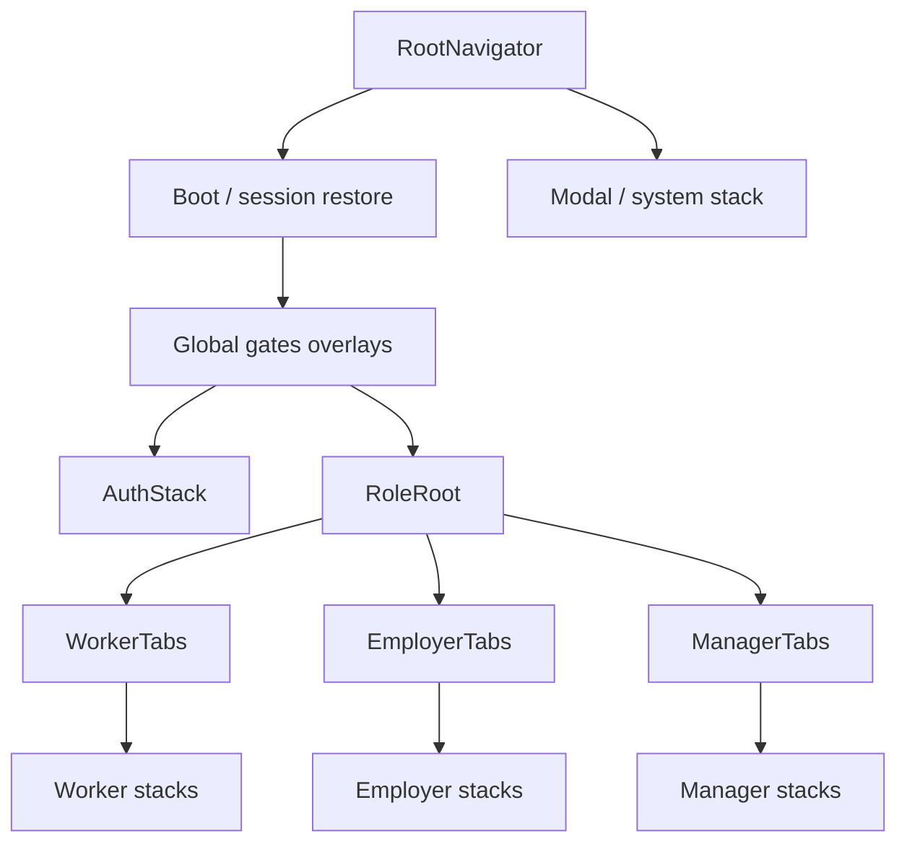

# 08 — Fluid routing (Mobile + Web)

**Status:** `accepted`  
**Last updated:** 2026-10-09  
**ADR:** [0024 — Fluid routing baseline](../backend/adr/0024-fluid-routing.md)  
**Architecture:** [`../04-application-architecture.md`](../04-application-architecture.md) §15.7  
**Mobile IA:** [`../mobile/01-information-architecture.md`](../mobile/01-information-architecture.md) · Deep links: [`../mobile/03-flows-and-deep-links.md`](../mobile/03-flows-and-deep-links.md)  
**Web IA:** [`../web/01-information-architecture.md`](../web/01-information-architecture.md)  
**Related:** [Wizard state](04-wizard-state.md) · [Push UX](05-push-notifications-ux.md) · [A11y](06-accessibility-wcag.md)

> Routing should feel **instant, predictable, and gated**—native stack physics on mobile, URL-true layouts on web—without Expo Router or a second Next.js admin. **Screen IDs** (`m.*` / `w.*`) stay the product vocabulary; navigators map paths ↔ those IDs.

---

## Verdict

| Topic | PartOn stance |
| --- | --- |
| Mobile navigator | **React Navigation** — native **stack** + **bottom tabs** (+ native stack for modals/sheets) |
| Mobile performance | **`react-native-screens`** + native stack (not JS stack as default) |
| Mobile fluid motion | Platform stack transitions; Reanimated for sheets; honor **Reduce Motion** |
| Mobile file router | **Expo Router = Hold / banned** (ADR-0006) |
| Deep links | React Navigation **linking** config ↔ Universal Links / App Links / `parton://` |
| Web admin | **React Router** (Vite SPA) — nested layouts, URL as source of truth |
| Web Next App Router | **Hold** for admin (ADR-0014) |
| Gates | Auth → role/context → onboarding → AuthZ → screen (same order as push) |
| Typed routes | Type-safe param helpers / const route map — Adopt |
| State vs route | Entity ids in route params; wizard draft in shell/store (ADR-0020) |

---

## 1. Mobile — navigator architecture



| Layer | Navigator | Owns |
| --- | --- | --- |
| **Root** | Native stack | Boot, gate redirects, auth vs app, fullscreen system screens |
| **AuthStack** | Native stack | Phone → OTP → role → policies |
| **Role tabs** | Bottom tabs | Worker / Employer / Manager roots (one role at a time) |
| **Per-tab stack** | Native stack | Detail, wizards, check-in, settings pushed above tab |
| **Modals** | Native stack `presentation: 'modal'` / sheet | Apply confirm, context switch, some R4 sheets |

### 1.1 Fluid UX rules

| Do | Don't |
| --- | --- |
| Native stack push/pop (iOS/Android physics) | Default to `@react-navigation/stack` (JS) for main flows |
| Keep tab state when switching tabs | Reset entire app on every tab press |
| Push day-of screens (3h, check-in) on the active tab stack | Jump with `reset` unless logout / role switch |
| Shared `DeepLinkRouter` → `navigation.navigate` | Ad-hoc ` Linking.openURL` into random screens |
| Prefetch REST on focus (`useFocusEffect`) for detail | Block transition waiting for full waterfall |
| Reduce Motion → `animation: 'fade'` or none | Custom spring spam on every push |

### 1.2 Linking (deep links + push)

```text
prefixes: ['parton://', 'https://app.parton.<tld>']
screens map → React Navigation route names ↔ path segments
```

| Rule | Detail |
| --- | --- |
| Gate pipeline | session → role/context → onboarding → AuthZ → target (T-109) |
| Params | Only ids (`jobId`, `shiftId`, …) — never tokens |
| Cold start | Parse link after session restore; queue intent if still authing |
| Stale target | Fallback route + inbox detail |
| Push | Same map as [`03-flows-and-deep-links`](../mobile/03-flows-and-deep-links.md) |

### 1.3 Role & context switch

| Event | Navigation |
| --- | --- |
| Login success | `reset` to role root (clear auth stack) |
| Logout | `reset` to AuthStack |
| Context switch (AS-3) | `reset` to that role’s tabs (avoid mixed stacks) |
| Restriction / maintenance | Replace with system screen; block back into app |

### 1.4 Wizards

Prefer **one stack screen + step index** (Pattern A) for short wizards; multi-route steps share scoped store (ADR-0020). Back = previous step or `goBack()` without wiping shell state.

---

## 2. Web — admin (and future employer console)

| Topic | Stance |
| --- | --- |
| Router | **React Router v6.4+** (data APIs: `createBrowserRouter`, loaders, layouts) |
| Hosting | Nest serves SPA; client-side routes under `/admin/*` (or admin host) |
| Layouts | Shell (sidebar) → section layout → page |
| Auth gate | Loader / layout checks session; redirect `/login` |
| URLs | Readable paths: `/users`, `/abuse/:id`, `/ops/perf` |
| Scroll | Restore on back where helpful; tables keep querystring filters |
| Fluid feel | Instant layout swap; Suspense/skeleton for loaders; no full reload |

```text
/admin
  /login
  /                    → dashboard
  /ops/perf
  /users · /users/:id
  /workers · /workers/:id
  /employers · /employers/:id
  /branches · /verification · /documents
  /jobs · /jobs/:id · /catalog
  /applications · /applications/:id
  /shifts · /shifts/:id · /disputes
  /matching/diagnostics
  /tokens/ledger
  /ratings · /ratings/:id
  /notifications/outbox · /notifications/broadcast
  /abuse · /abuse/:id · /risk
  /policies · /config · /audit · /audit/reports
  /devops · /devops/errors · /devops/errors/:fingerprint
  /devops/releases · /devops/services · /devops/clients
```

Full admin case map: [`../web/08-admin-case-coverage.md`](../web/08-admin-case-coverage.md) · ADR-0034.  
DevOps: [`../web/09-admin-devops.md`](../web/09-admin-devops.md) · ADR-0035.

**Employer console** (if shipped): same React Router pattern on `app.parton.*`; do **not** invent a third router.

| Hold | Why |
| --- | --- |
| Next.js App Router for admin | Violates Nest-hosted SPA (ADR-0014) |
| HashRouter as default | Breaks clean URLs / some SSE assumptions |
| Parallel React Navigation on web | Wrong paradigm |

---

## 2b. Web — marketing (`apps/marketing`)

| Topic | Stance |
| --- | --- |
| Router | **React Router** (same family as admin) |
| Hosting | NGINX static on `www` — [web/07](../web/07-marketing.md) · ADR-0033 |
| Routes | `/`, `/pricing`, `/legal/privacy`, `/legal/terms` — **all** `w.public.*` required (production) |
| Render | **Prerender/SSG** at build — not CSR-only |
| Auth | None required for public pages; CTAs exit to stores / employer login |

Do **not** mount marketing routes under `/admin`. Do not defer pricing or SEO as “MVP later.”

---

## 3. Cross-platform principles

| Principle | Practice |
| --- | --- |
| **Screen ID is canonical** | Docs/cases use `m.*` / `w.*`; route names alias them |
| **One job per route** | Align with UX recipes R1–R8 |
| **AuthZ not in router alone** | Router hides; Nest enforces |
| **Typed params** | Shared zod/parse for `jobId` etc. before navigate |
| **Analytics** | Log screen ID on focus / route change |
| **i18n** | Paths stay locale-neutral (`/jobs` not `/isler`) — TR is copy, not URL |

---

## 4. Stack choices (radar)

| Tech | Ring | Role |
| --- | --- | --- |
| React Navigation (native stack + tabs) | **Adopt** | Mobile |
| react-native-screens | **Adopt** | Native containers |
| React Navigation linking | **Adopt** | Deep links / Universal Links |
| react-native-reanimated (sheets/transitions) | **Trial → Adopt** | Fluid chrome; respect Reduce Motion |
| Expo Router | **Hold** | Banned with Expo |
| React Router (data mode) | **Adopt** | Admin (+ employer web) |
| TanStack Router | **Assess** | Only if RR blocked |
| Next.js App Router | **Hold** | Admin |

---

## 5. Performance & fluidity checklist

- [ ] Native stack for primary mobile pushes  
- [ ] Tabs preserve stack history per tab  
- [ ] Heavy lists unmount off-tab or freeze (`react-native-screens` freeze) where needed  
- [ ] Deep link → single navigate, not nested reset storms  
- [ ] Web: layout route doesn’t remount sidebar on every child  
- [ ] Skeletons on destination, not blank during transition  
- [ ] Reduce Motion / `prefers-reduced-motion` honored  

---

## Related

- [ADR-0024](../backend/adr/0024-fluid-routing.md)  
- Mobile IA: [`../mobile/01-information-architecture.md`](../mobile/01-information-architecture.md)  
- Deep links: [`../mobile/03-flows-and-deep-links.md`](../mobile/03-flows-and-deep-links.md)  
- Web IA: [`../web/01-information-architecture.md`](../web/01-information-architecture.md)  
- No Expo: [ADR-0006](../backend/adr/0006-bare-react-native-no-expo.md)  
