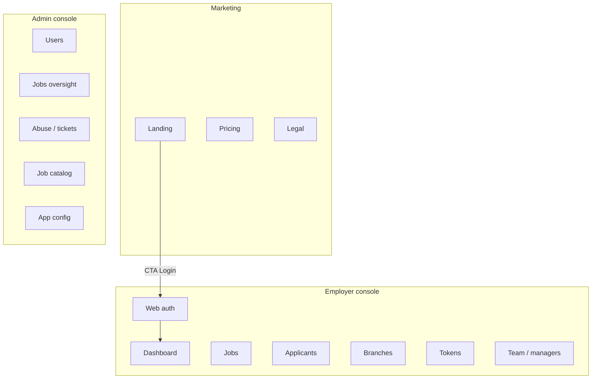

# 01 — Web information architecture

**Status:** `proposed`  
**Last updated:** 2026-10-07

## Sites / apps

| Surface | Host (example) | Audience | Boundary status |
| --- | --- | --- | --- |
| Marketing | `www.parton.*` | Public | Optional / later |
| Employer console | `app.parton.*` | Employer | **Not locked** for v1 (mobile is primary) |
| Admin | `admin.parton.*` (or path on API host) | Internal ops | **Locked** — same NestJS app as REST API |

Admin presentation tooling (static SPA served by Nest, AdminJS, etc.) is `open`. Employer web console may reuse REST `/api/v1` later if product re-locks it.

## High-level map



## Employer console shell

```text
┌──────────────────────────────────────────────────────┐
│ Top bar: org switcher · token chip · bell · avatar   │
├────────────┬─────────────────────────────────────────┤
│ Sidebar    │  Main content                           │
│ Dashboard  │                                         │
│ Jobs       │                                         │
│ Applicants │                                         │
│ Branches   │                                         │
│ Team       │                                         │
│ Tokens     │                                         │
│ Settings   │                                         │
└────────────┴─────────────────────────────────────────┘
```

Responsive: sidebar collapses to drawer &lt; 1024px; tables switch to stacked cards on narrow widths (still secondary to mobile RN for field use).

## Admin shell

Same pattern with ops-focused nav; stronger audit banners; impersonation disabled by default (`open`).

## Auth model on web

| Topic | Proposal |
| --- | --- |
| Login | Same phone OTP as mobile (email magic link later — `open`) |
| Session | Access JWT in memory; refresh in httpOnly secure cookie **or** secure storage pattern aligned with API |
| CSRF | If cookie refresh used, require CSRF strategy |
| Roles | Employer (console); Admin (admin site); Manager web = P2 |

## Gates

- Unauthenticated → login
- Authenticated without employer org → onboarding wizard
- Policy unsigned → policy gate page
- Maintenance → static maintenance page
