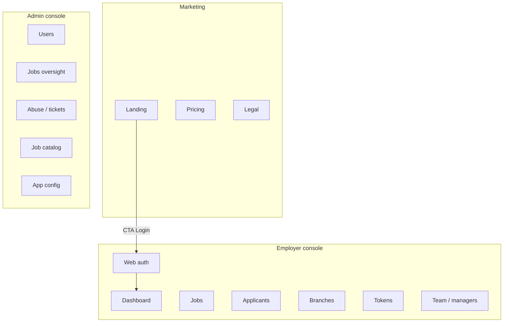

# 01 — Web information architecture

**Status:** `accepted` (IA + admin stack) · [agents/10](../agents/10-production-ready.md)
**Last updated:** 2026-10-09  
**UI stack:** [`04-shadcn-dark-ui.md`](04-shadcn-dark-ui.md) · [ADR-0014](../backend/adr/0014-web-ui-shadcn-dark.md)

## Sites / apps

| Surface | Host (example) | Audience | Boundary status |
| --- | --- | --- | --- |
| Marketing | `www.parton.*` | Public | **Locked** — `apps/marketing` Vite; NGINX static — [07-marketing](07-marketing.md) · ADR-0033 |
| Employer console | `app.parton.*` | Employer | **Not locked** for v1 (mobile is primary) |
| Admin | `admin.parton.*` or `/admin` on API host | Internal ops | **Locked** — same NestJS app; **Vite + shadcn/ui dark** |

Admin presentation: **React + Vite SPA + shadcn/ui (dark default)**, static-served by Nest — BQ-4 closed. Marketing is a **separate** Vite app (brand chrome, not admin dark). Employer web console may reuse admin stack + REST `/api/v1` later if product re-locks it.

## High-level map



## Employer console shell

```text
┌──────────────────────────────────────────────────────┐
│ Top bar: org switcher · token chip · bell · avatar   │
├────────────┬─────────────────────────────────────────┤
│ Sidebar    │  Main content                           │
│ Dashboard  │                                         │
│ Jobs       │                                         │
│ Applicants │                                         │
│ Branches   │                                         │
│ Team       │                                         │
│ Tokens     │                                         │
│ Settings   │                                         │
└────────────┴─────────────────────────────────────────┘
```

Responsive: sidebar collapses to drawer &lt; 1024px; tables switch to stacked cards on narrow widths (still secondary to mobile RN for field use).

## Admin shell

Same pattern with ops-focused nav; **dark shadcn Sidebar** as default chrome; stronger audit banners (`Alert`); impersonation disabled by default (`open`). Implementation notes: [`04-shadcn-dark-ui.md`](04-shadcn-dark-ui.md).

**Full case-domain nav (required):** users, workers, employers, branches, verification, jobs, catalog, applications, shifts, disputes, matching diagnostics, tokens ledger, ratings, documents, notifications outbox/broadcast, abuse, risk, policies, config, **audit** (log + CSV/PDF reports), perf, **DevOps** (errors/releases/services/clients) — [`08-admin-case-coverage.md`](08-admin-case-coverage.md) · [`09-admin-devops.md`](09-admin-devops.md) · [`11-legal-audit-reports.md`](11-legal-audit-reports.md) · ADR-0034/0035/0037.

## Auth model on web

| Topic | Stance (ADR-0018) |
| --- | --- |
| Login | Same phone OTP as mobile (email magic link later — `open`) |
| Session | Access JWT in **memory**; refresh in **`HttpOnly` + `Secure` + `SameSite=Strict` cookie** |
| CSRF | **Required** on cookie refresh/logout (double-submit or custom header) |
| Headers | CSP, frame denial, HSTS — [`../backend/21-client-security.md`](../backend/21-client-security.md) |
| Roles | Employer (console); Admin (admin site); Manager web = P2 |

## Gates

- Unauthenticated → login
- Authenticated without employer org → onboarding wizard
- Policy unsigned → policy gate page
- Maintenance → static maintenance page

**Router:** React Router (data APIs, nested layouts) inside the Vite SPA — [ADR-0024](../backend/adr/0024-fluid-routing.md) · [`../shared/08-routing.md`](../shared/08-routing.md).
