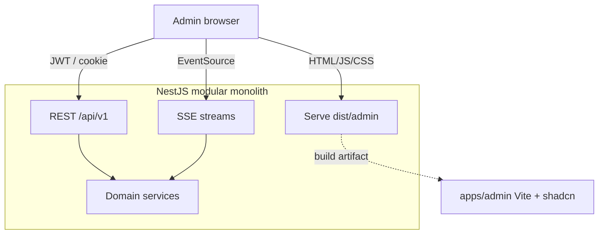

# 04 — Web UI stack (shadcn/ui · dark)

**Status:** `accepted` (engineering baseline)  
**Last updated:** 2026-10-10  
**ADR:** [0014 — Nest-hosted Vite admin + shadcn/ui dark](../backend/adr/0014-web-ui-shadcn-dark.md) · [0039 — DESIGN.md](../backend/adr/0039-design-md.md)  
**Visual SoR:** [`../DESIGN.md`](../DESIGN.md) (admin = dark forest density channel)  
**Architecture home:** [`../04-application-architecture.md`](../04-application-architecture.md) §13  
**Upstream:** [shadcn/ui](https://github.com/shadcn-ui/ui) · [ui.shadcn.com](https://ui.shadcn.com)  
**Screens:** [`02-screen-catalog.md`](02-screen-catalog.md) · [`screens/admin-console.md`](screens/admin-console.md)

> PartOn’s **locked admin web surface** is the **platform admin** panel. It is a **React + Vite** SPA using **shadcn/ui** (Tailwind + Radix primitives, components copied into the repo), with **dark theme as the default**. Map shadcn CSS vars to PartOn tokens per [`DESIGN.md`](../DESIGN.md) + [shared/01](../shared/01-color-system.md). The SPA is **built and served by the same NestJS app** as `/api/v1`. **Marketing** is a separate locked app — [07-marketing](07-marketing.md) · ADR-0033.

---

## Verdict

| Topic | PartOn stance |
| --- | --- |
| Primary web product | **Admin console** (ops) |
| Hosting | **Same Nest deployable** — static assets + SPA fallback (ADR-0001) |
| Framework | **React + Vite** + TypeScript |
| Component system | **[shadcn/ui](https://github.com/shadcn-ui/ui)** — copy/CLI into `components/ui` (not an npm black-box library) |
| Styling | **Tailwind CSS** + CSS variables (`tailwind.cssVariables`) |
| Theme | **Dark default** for admin; light optional — colors from [shared color system](../shared/01-color-system.md) |
| Theme toggle | `next-themes` `attribute="class"`; tokens swap under `.dark` |
| Color source | **[shared/01-color-system.md](../shared/01-color-system.md)** · ADR-0017 — not default shadcn zinc |
| Data access | **REST `/api/v1`** with admin JWT/cookie — no parallel business logic in the SPA |
| Foreground live | **SSE** (ADR-0012) — not WebSocket, not FCM for admin |
| Employer web console | **Not locked** for v1; if revisited, reuse same stack + `/api/v1` |
| Separate Next.js admin app | **Hold** (v1) |
| AdminJS / generic CRUD admin | **Hold** — insufficient for PartOn ops UX |

---

## 1. Why this stack

| Driver | Response |
| --- | --- |
| Locked monolith | Nest serves API + admin; one AuthZ/rule layer |
| Ops density | Tables, sheets, dialogs, sidebar — shadcn patterns fit |
| Ownership | shadcn components are **source in repo** — customize without fork hell |
| Turkey ops | Dark default reduces glare for long queue sessions; professional ops look |
| Consistency | Radix accessibility + Tailwind tokens |
| Reject AdminJS | Weak fit for abuse queues, geo config, broadcast, audit UX |

---

## 2. Placement in the system



| Rule | Detail |
| --- | --- |
| No domain SQL in SPA | All mutations through REST → Nest guards → domain |
| Shared contracts | Zod types from `packages/api-contracts` |
| Secrets | Never in the Vite bundle — only public API base URL |
| RBAC | `admin` (and future `support`/`ops`) — [18-auth-rbac](../backend/18-auth-rbac.md) |

---

## 3. Monorepo layout (target)

```text
apps/
  backend/                 # Nest — serves /api/v1 + admin static
  admin/                   # Vite React SPA (shadcn/ui)
    src/
      main.tsx
      styles/globals.css   # Tailwind + :root + .dark tokens
      components/ui/       # shadcn CLI output (owned)
      components/          # app composites (DataTable, PageHeader, …)
      features/            # users, abuse, catalog, policies, …
      lib/utils.ts         # cn() helper
      routes/
    components.json        # shadcn config
    vite.config.ts
  mobile/
packages/
  api-contracts/
```

Nest serves `apps/admin/dist` at `/admin` (or root of admin host) with SPA fallback to `index.html`. Dev: Vite proxy → Nest API. Staging/prod Nest process: **PM2** — [05-pm2.md](05-pm2.md) · ADR-0031.

---

## 4. shadcn/ui conventions

Reference: [shadcn/ui](https://github.com/shadcn-ui/ui) — components are **added** to the project (`npx shadcn@latest add …`), not imported as a closed package.

| Practice | Stance |
| --- | --- |
| `components.json` | Checked in; `style`, `rsc: false` (Vite SPA), CSS variables on |
| `components/ui/*` | Generated/edited primitives — review in PRs |
| App composites | `components/` or `features/*/ui` — compose shadcn, don’t fork casually |
| Icons | `lucide-react` (shadcn default) |
| Forms | React Hook Form + Zod resolvers aligned with `api-contracts` |
| Tables | TanStack Table + shadcn Data Table pattern for queues |
| Toasts | shadcn Sonner / Toast for mutation feedback |
| Charts | Optional later (`chart-*` tokens already in theme) |

**Baseline components to add early:** `button`, `input`, `label`, `form`, `table`, `card`, `dialog`, `sheet`, `dropdown-menu`, `select`, `badge`, `tabs`, `sidebar`, `separator`, `avatar`, `alert`, `sonner`, `skeleton`, `breadcrumb`, `command` (palette).

---

## 5. Color system & theme

Canonical tokens: [`../shared/01-color-system.md`](../shared/01-color-system.md) ([ADR-0017](../backend/adr/0017-color-system.md)).

shadcn uses **CSS variables**; modes override under `.dark` ([theming](https://ui.shadcn.com/docs/theming)).

| Topic | Stance |
| --- | --- |
| Default (admin) | **`dark`** — branded charcoal + forest cards (`#252823` / `#234D3C`) |
| Light | Optional — cream ladder `#F3E8CF` → `#EADCC5` → `#DDD4C7` |
| Primary | `#E97A3D` → `--primary`; hover/pressed via component variants |
| Destructive / error | `#B94E32` → `--destructive` (rust, not default red) |
| Charts | `--chart-1`…`4` = orange → chartreuse → cool grey → olive |
| Elevation | Surface steps, not heavy shadows |
| FOUC | Inline theme script; `defaultTheme="dark"` |

```css
/* :root — light (optional admin / a11y) */
:root {
  --background: #F3E8CF;          /* surface-base */
  --card: #EADCC5;                /* surface-level-1 */
  --popover: #DDD4C7;             /* surface-level-2 */
  --foreground: #252823;          /* text-high */
  --muted-foreground: #83947A;    /* text-low */
  --primary: #E97A3D;             /* action-primary-default */
  --primary-foreground: #F3E8CF;  /* text-on-color */
  --secondary: #344A32;           /* action-secondary */
  --accent: #E2B83F;              /* action-accent */
  --destructive: #B94E32;         /* feedback-error */
  --chart-1: #E97A3D;
  --chart-2: #BFD85A;
  --chart-3: #AAB8BD;
  --chart-4: #68734A;
}

/* .dark — admin default */
.dark {
  --background: #252823;          /* surface-base dark */
  --card: #234D3C;                /* forest cards */
  --popover: #334B43;             /* floating */
  --foreground: #F3E8CF;
  --muted-foreground: #AAB8BD;
  --primary: #E97A3D;
  --primary-foreground: #F3E8CF;
  --secondary: #344A32;
  --accent: #E2B83F;
  --destructive: #B94E32;
  /* charts same sequence — chart-2 lime reads well on dark */
}
```

```tsx
<ThemeProvider attribute="class" defaultTheme="dark" enableSystem={false}>
  <App />
</ThemeProvider>
```

Shell: Sidebar on `surface-level-1` / `--card`; one orange primary CTA per view; Sonner/Alert use feedback tokens.

---

## 6. Shell & IA mapping

Admin shell (from [01-information-architecture](01-information-architecture.md)) implemented with shadcn Sidebar:

```text
┌ Sidebar (dark) ────────┬ Main ─────────────────────────┐
│ PartOn Admin           │ Breadcrumb · user · theme     │
│ Dashboard              │                               │
│ Users / Employers      │ Feature route (table/detail)  │
│ Jobs / Catalog         │                               │
│ Abuse / Risk           │ Sheets / Dialogs for actions  │
│ Policies / Config      │                               │
│ Notifications          │ SSE badge on queues           │
│ Audit                  │                               │
└────────────────────────┴───────────────────────────────┘
```

| Screen area | Typical shadcn building blocks |
| --- | --- |
| Queues (abuse, risk) | `Table`, `Badge`, `Sheet`, filters `Select` |
| User restrict | `Dialog` + `Alert` confirm; audit note `Textarea` |
| Catalog CMS | `Form` + `DataTable` |
| Policies | `Tabs` + markdown preview |
| Broadcast | `Form` + confirmation `AlertDialog` |
| Live ops | SSE → toast / row highlight |

---

## 7. Auth, session, CSRF

| Topic | Stance |
| --- | --- |
| Login | Admin OTP or hardened admin login → same Nest AuthN |
| Access | Short-lived JWT (memory) or BFF cookie pattern |
| Refresh | Prefer **httpOnly Secure** cookie for admin SPA (same site) + CSRF on mutating REST |
| AuthZ | Server-side only; hide nav by role but never trust UI |
| Impersonation | Hold (ADR-0011) |

Align with [18-auth-rbac](../backend/18-auth-rbac.md) and SSE cookie/ticket notes in [19-sse](../backend/19-sse.md).

---

## 8. Data & realtime

| Concern | Approach |
| --- | --- |
| Queries/mutations | `fetch`/TanStack Query → `/api/v1/...` |
| Validation | Shared Zod schemas; show field errors from API envelope |
| Live queues | **SSE** subscribe (badges, new ticket hints) → invalidate queries |
| Push | **No FCM** for admin web (FCM-5 Hold) |
| Idempotency | Send `Idempotency-Key` on restrict/ban/broadcast |

---

## 9. Nest integration

| Piece | Responsibility |
| --- | --- |
| Build pipeline | `pnpm --filter admin build` → output to Nest `public/admin` or `client/admin/dist` |
| Static middleware | Serve assets; SPA fallback for `/admin/*` |
| API | Unchanged `/api/v1` with CORS only if admin ever split host |
| Dev DX | Vite `@` alias; proxy `/api` → Nest; hot reload |

Do **not** put Prisma or domain services into the Vite app.

---

## 10. Accessibility & quality

| Bar | Practice |
| --- | --- |
| a11y | **WCAG 2.2 AA** — [shared/06](../shared/06-accessibility-wcag.md) · ADR-0022; Radix/shadcn; keyboard paths; focus visible |
| Contrast | Dark/light tokens meet WCAG AA (4.5:1 / 3:1) on surfaces — color system |
| i18n | **tr-TR primary** — [shared/07](../shared/07-i18n.md) · ADR-0023; `lang="tr"`; i18next keys |
| Testing | Component tests (Vitest + Testing Library); Playwright smoke on login + abuse queue |
| Bundle | Code-split routes; don’t ship mobile RN into admin |

---

## 11. Delivery

| Phase | Outcomes |
| --- | --- |
| **P0** | Full admin case matrix (32 screens) — [08-admin-case-coverage](08-admin-case-coverage.md) · ADR-0034 |
| **P0** | Dark shell; login; all domain ops nav; perf metrics; abuse/risk |
| — | No deferred “admin MVP” — every CASE-* group has a surface |
| **P3** | Hardened RBAC roles; retention/DSR admin assist UI |
| **Later** | Employer console only if product re-locks — reuse stack |

---

## 12. Open questions

| ID | Question | Default |
| --- | --- | --- |
| WEB-1 | Admin path `/admin` vs subdomain | Path on API host first |
| WEB-2 | Cookie vs bearer-only for SPA | Cookie refresh + CSRF for admin |
| WEB-3 | Enable system theme for admin | Off — dark default; light toggle OK |
| WEB-4 | Exact shadcn style preset | `new-york` or current CLI default at scaffold |
| WEB-5 | Tailwind v3 vs v4 | Follow shadcn Vite install guide at scaffold time |
| WEB-6 | `packages/design-tokens` timing | With monorepo scaffold or P1 |

---

## Related

- ADR: [`../backend/adr/0014-web-ui-shadcn-dark.md`](../backend/adr/0014-web-ui-shadcn-dark.md)  
- App architecture: [`../04-application-architecture.md`](../04-application-architecture.md) §13  
- IA / screens: [`01-information-architecture.md`](01-information-architecture.md) · [`02-screen-catalog.md`](02-screen-catalog.md)  
- Auth: [`../backend/18-auth-rbac.md`](../backend/18-auth-rbac.md)  
- SSE: [`../backend/19-sse.md`](../backend/19-sse.md)  
- Color system: [`../shared/01-color-system.md`](../shared/01-color-system.md)  
- Mobile Tailwind (NativeWind): [`../mobile/04-nativewind-ui.md`](../mobile/04-nativewind-ui.md)  
- Upstream: https://github.com/shadcn-ui/ui  
