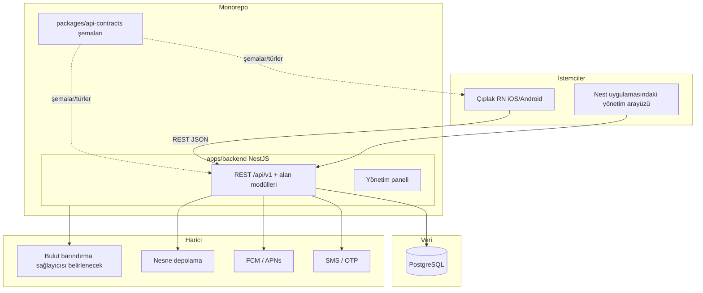

# 00 — Ürün ve Teknoloji Yığını

**Durum:** `accepted`  
**Son güncelleme:** 2026-10-07  
**Karar günlüğü:** [`01-architecture-decisions.md`](01-architecture-decisions.md)

## PartOn nedir?

PartOn (eski kod adı StaffMatch), **yarı zamanlı iş arayanları** **işverenlerle** buluşturan bir **mobil** pazaryeridir.

| Rol (ürün v1) | Temel işler |
| --- | --- |
| İş arayan (çalışan) | Profil, müsaitlik, başvuru, işe giriş kaydı, puanlama, bildirimler |
| İşveren | Şirket / şube kurulumu, iş ilanı, başvuruları inceleme |

Şube **yöneticisi** eski vaka kataloğunda yer alıyor; birinci sınıf bir rol olup olmayacağı **açık** ([AO-11](01-architecture-decisions.md)).

İlk pazar: yalnızca **Türkiye**. Bulut bölgesi henüz belirlenmedi.

Kabul testlerinin alan kapsamı hâlâ Türkçe Parton vaka kataloğunu kullanıyor (248 vaka / 19 grup): [`cases/`](cases/).

## Neden yeniden yapılıyor?

| Eski yaklaşım | Yeni yaklaşım |
| --- | --- |
| Kotlin Multiplatform istemcisi | Çıplak **React Native** (iOS + Android); **Expo yasak** |
| Arka uç olarak Firebase Auth + Firestore | NestJS 11 **REST / JSON API** + yönetim paneli (aynı uygulamada) |
| İstemci ağırlıklı iş kuralları | Nest alan modüllerinde sunucu tarafında uygulanan kurallar |
| Belge deposu + yerel Room önbelleği | Tek doğruluk kaynağı olarak **PostgreSQL 18** (`uuidv7`, modern indeksler) |
| Sözleşme olarak istemci SDK'sı / dinleyiciler | `/api/v1` altında sürümlü REST + **Zod** paylaşılan şema paketleri |

Hedefler:

1. **Veri modelinin sahibi olmak** — ilişkisel bütünlük, geçişler ve raporlama.
2. **İş kurallarını merkezileştirmek** — API ve yönetim paneli aynı kural katmanını kullanır.
3. **Kararlı istemci sözleşmesi** — sürümlü REST; mobil uygulama veritabanı modellerine bağımlı olmaz.
4. **Anlaşılır monorepo** — mobil ve arka uç uygulamaları ayrı paketlerdir; yalnızca sözleşmeler paylaşılır.

## Kesinleşen teknoloji yığını

| Seçim | Durum |
| --- | --- |
| Monorepo (mobil + arka uç + paylaşılan paketler) | `accepted` — [ADR-0005](backend/adr/0005-monorepo.md) |
| NestJS modüler monolit (API + yönetim, aynı uygulama) | `accepted` — [ADR-0001](backend/adr/0001-nestjs-modular-monolith.md) |
| PostgreSQL | `accepted` — [ADR-0002](backend/adr/0002-postgresql-owned-db.md) |
| REST / JSON over HTTPS | `accepted` — [ADR-0004](backend/adr/0004-rest-json-api.md) |
| Temel yol `/api/v1` | `accepted` |
| TypeScript (mobil, arka uç, paylaşılan) | `accepted` |
| Çıplak React Native (iOS + Android); Expo yasak | `accepted` — [ADR-0006](backend/adr/0006-bare-react-native-no-expo.md) |
| Başlangıçta ayrı işçi süreci yok | `accepted` |
| Bulut barındırma (sağlayıcı belirlenecek) | `accepted` (sağlayıcı `open`) |
| İstemciler için GraphQL / gRPC / tRPC | v1 için reddedildi |

## Eyl 2026 için önerilen araç zinciri

Bkz. [`03-tech-radar-2026.md`](03-tech-radar-2026.md) ve [`02-product-roadmap.md`](02-product-roadmap.md) içindeki aşamalı teslimat.

| Konu | Önerilen varsayılan | Durum |
| --- | --- | --- |
| Monorepo araçları | pnpm + Turborepo | `proposed` |
| Doğrulama / sözleşmeler | `packages/api-contracts` içinde Zod 4 | `proposed` |
| ORM | Prisma 7+ (`@prisma/adapter-pg`) | `proposed` |
| Mobil araç zinciri | Çıplak RN CLI + sahip olunan `ios/`/`android/`; Fastlane (veya eşdeğeri) | `accepted` |
| Gözlemlenebilirlik | OpenTelemetry → OTLP | `proposed` |
| API belgeleri | Denetleyiciler + Zod üzerinden `@nestjs/swagger` | `proposed` |

## Şimdilik hedef dışı olanlar

- Mikroservislere bölme
- GraphQL (veya REST dışı herhangi bir genel istemci API'si)
- Firestore koleksiyonlarını düşünmeden bire bir taşıma
- İhtiyaç kanıtlanana kadar ayrı işçi / kuyruk süreci
- Ürün kapsamı belirlenmeden alan adlarını tamamıyla netleştirme

## Paylaşılan ve sahipli kod

| Paylaşılan paketlerde yer alır | Yalnızca arka uç | Yalnızca mobil |
| --- | --- | --- |
| API istek/yanıt şemaları | Veritabanı erişimi / ORM modelleri | Ekranlar ve gezinme |
| Türetilmiş TypeScript türleri | İş kuralları ve AuthZ | Cihaz API'leri (GPS, anlık bildirim jetonu, güvenli depolama) |
| Platformdan bağımsız yardımcılar | Sunucu sırları ve ortam değişkenleri | |

Mobil uygulama arka uca **yalnızca** REST sözleşmesi üzerinden bağlanır. Paylaşılan paketlerde arka uca özel kod veya gizli bilgi bulunmamalıdır.

## Ölçeklenebilirlik yaklaşımı

Büyüyen kullanıcı tabanını destekleyecek şekilde tasarlayın; ancak mimari seçimini kapasite garantisi saymayın. Eşzamanlı yük, gecikme/kullanılabilirlik SLO'ları, bağlantı havuzlama, önbellek ve arka plan işleri daha sonra kararlaştırılır ve yük testleriyle kanıtlanır. Bkz. [`01-architecture-decisions.md`](01-architecture-decisions.md).

## Hedef çalışma zamanı taslağı

Süreç içi asenkron işler (outbox / zamanlayıcılar) kullanılabilir; **ayrı işçi uygulaması ertelendi**.

## Netleştirme sırası

1. Uygulama sınırları, araçlar, paylaşılan paketler ve dağıtım  
2. Özellikler → alan adları, veri modeli, ayrıntılı API/güvenlik

## İlgili belgeler

- Kararlar: [`01-architecture-decisions.md`](01-architecture-decisions.md)
- Yol haritası: [`02-product-roadmap.md`](02-product-roadmap.md)
- Teknoloji radarı: [`03-tech-radar-2026.md`](03-tech-radar-2026.md)
- Arka uç dizini: [`backend/README.md`](backend/README.md)
- Eski wiki: [`../parton-codebase-wiki/00-index.md`](../parton-codebase-wiki/00-index.md)
