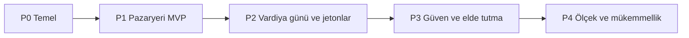

# 02 — Ürün yol haritası (güncel durum · Eyl 2026)

**Durum:** `proposed`  
**Son güncelleme:** 2026-10-07  
**Ufuk:** Temel → Türkiye MVP → Ölçek  
**Dayanaklar:** [`01-architecture-decisions.md`](01-architecture-decisions.md) · [`03-tech-radar-2026.md`](03-tech-radar-2026.md) · [`cases/`](cases/)

Bu yol haritası kesinleşen mimari kararları bir **teslimat planına** dönüştürür. Özellik ayrıntıları 248 vakalık katalogdan gelir; aşağıdaki aşamalar *ne zaman neyin yayımlanacağını* ve *hangi modern teknoloji yığınının bunu mümkün kılacağını* sıralar.

## Kuzey yıldızı

> Türkiye'de güvenilir bir pazaryeri: yarı zamanlı iş arayanlar ve işverenler doğrulanmış bir vardiyayı keşfet → başvur → onayla → işe giriş yap → puanla akışıyla tamamlar; kurallar sunucu tarafında yönetilir ve REST sözleşmesi sürümlenir.

| Sonuç | Nasıl ölçeriz? |
| --- | --- |
| **Eşleşme kalitesi** | Yalnızca uygun işler gösterilir (CASE-MATCHING); yalnızca favorilere açık işler sızmaz |
| **Vardiya günü güvenilirliği** | İşe giriş / anlaşmazlık / jeton tahsilatı yeniden denemelerde tutarlı çalışır |
| **Güven** | Büyüme pazarlamasından önce şirket doğrulaması + kötüye kullanım kontrolleri |
| **İşletilebilirlik** | Tek Nest dağıtımı (API + yönetim); `/api/v1` için OTel izleri |
| **Sözleşme bütünlüğü** | Paylaşılan Zod şemaları; Nest'ten OpenAPI; mobil uygulama veritabanını içe aktarmaz |

## İlkeler (bu yol haritasına özgü)

1. **Vaka kataloğu = kabul** — her aşama `CASE-*` / uçtan uca yolculuklara dayanır.  
2. **İnce dikey dilimler** — her ekranı cilalamadan önce kimlik doğrulama → yayımlama → başvuru akışını teslim edin.  
3. **Özelliklerden önce platform** — P0'da monorepo, sözleşmeler, CI ve gözlemlenebilirlik.  
4. **Modern varsayılanlar, kesinleşmiş sınırlar** — Eyl 2026 teknolojileri Nest modüler monoliti + RN + Postgres içinde (GraphQL, ilk günden mikroservis/işçi yok).  
5. **Ölçeklemeden önce ölçün** — ayrı işçi sürecine geçmeden önce yük testleri ve SLO'lar.

## Aşama haritası

| Aşama | Hedef | Tamamlanma ölçütleri |
| --- | --- | --- |
| **P0** Temel | Yayımlanabilir monorepo + `/api/v1` iskeleti + RN kabuğu | CI başarılı; OTP kimlik doğrulama duman testi; OpenAPI yayımlanmış; hazırlık veritabanı |
| **P1** Pazaryeri MVP | İşveren ilan verir; çalışan akışı görür ve başvurur | T-199'a kadar Uçtan Uca Yolculuk 1 (kabul) |
| **P2** Vardiya günü ve jetonlar | 3 saatlik onay, işe giriş, kayıt defteri tahsilat/serbest bırakma | Yolculuklar 1–3 + 5 (jetonlar / GPS / çoklu kişi sayısı) |
| **P3** Güven ve elde tutma | Belgeler, doğrulama, favoriler, puanlar, temel kötüye kullanım kontrolleri | Yolculuk 4; P0 boşlukları kapalı; yönetim operasyonları kullanılabilir |
| **P4** Ölçek ve mükemmellik | Performans, daha kapsamlı yönetim, isteğe bağlı işçi, ASO | T-226–T-234 yük planı; AO-12 kullanımdan kaldırma politikası |

Önerilen takvim (ekip büyüklüğünden bağımsız): **P0 ~4–6 hf · P1 ~6–8 · P2 ~6–8 · P3 ~6–8 · P4 sürekli**.

---

## P0 — Temel (mimariden çalışan sisteme)

**Ürün:** Henüz pazaryeri değeri sunmaz; sonraki tüm dilimlerin önünü açar.

| İş akışı | Teslimat | Teknoloji (Eyl 2026) |
| --- | --- | --- |
| Monorepo | `apps/mobile`, `apps/backend`, `packages/api-contracts` | **pnpm** workspaces + **Turborepo** (AO-7 önerisi) |
| Arka uç iskeleti | Nest modüler monolit, genel `/api/v1` öneki, sağlık uç noktası | **NestJS 11.x** (Node ≥20), `@nestjs/swagger` |
| Sözleşmeler | Paylaşılan istek/yanıt şemaları + TS türleri | `packages/api-contracts` içinde **Zod 4**; Nest, nestjs-zod / Standard Schema ile doğrular (AO-8 önerisi) |
| Veri | Postgres + geçişler + Prisma modülü | **PostgreSQL 18** (`uuidv7()`), sürücü bağdaştırıcılı **Prisma 7+** (ADR-0003) |
| Kimlik doğrulama dilimi | OTP iste/doğrula + JWT erişim/yenileme | CASE-AUTH kritik yol |
| Mobil kabuk | Çıplak RN uygulaması, güvenli jeton deposu, türlenmiş API istemcisi | **Çıplak React Native** (sahip olunan `ios/`/`android/`); **Expo yok** — [ADR-0006](backend/adr/0006-bare-react-native-no-expo.md) |
| Yönetim taslağı | Aynı servisleri çağıran, Nest tarafından sunulan yönetim kabuğu | Kesinleşti: API ile aynı uygulama |
| Gözlemlenebilirlik | Yapılandırılmış günlükler + istek kimliği + OTel izleri | OpenTelemetry Node SDK → OTLP |
| CI | Yola göre filtrelenmiş lint/tür denetimi/test/build | GitHub Actions / GitLab CI |

**Tamamlanma kontrol listesi**

- [ ] Hazırlık ortamında `GET /health/live|ready` başarılı  
- [ ] `POST /api/v1/auth/otp/*`, SMS sanal ortamıyla baştan sona çalışıyor  
- [ ] `/api/v1` için OpenAPI oluşturuldu ve mobil istemci üretiminde kullanılıyor  
- [ ] Mobil uygulama iOS + Android geliştirme derlemelerinde açılıyor  
- [ ] Paylaşılan paketlerde sır yok; mobil Prisma'yı içe aktaramıyor

**Kapatır / ilerletir:** AO-2 (çıplak RN / Expo yok — kabul edildi); AO-7, AO-8 (önerildiği şekilde); BQ-1 tamamlandı; AO-1 için iskelet (yol filtreleri).

---

## P1 — Pazaryeri MVP (keşfet → başvur → kabul et)

**Ürün:** Türkiye'de sınırlı lansman için ilk kapalı döngü (yalnızca davetle olabilir).

| Yetenek | Vakalar / yolculuklar | Modüller |
| --- | --- | --- |
| Çalışan profili + müsaitlik | CASE-WORKER-PROFILE, T-016–T-029 | `workers` |
| İşveren + şube + coğrafi konum | CASE-EMPLOYER-BRANCH, T-194–T-195 | `employers`, `branches` |
| İş kataloğu + yayımlama | CASE-JOB-POSTING | `jobs` (jeton **bekletme** taslağı yeterli) |
| Eşleştirme akışı | CASE-MATCHING kesin filtreleri (alt küme) | `matching` |
| Başvur / geri çek | CASE-APPLICATION | `applications` |
| İşveren kabul/ret incelemesi | CASE-EMPLOYER-REVIEW | `applications` |
| Temel push + gelen kutusu | CASE-NOTIFICATIONS | `notifications` |

**Tamamlanma kontrol listesi**

- [ ] Uçtan Uca Yolculuk 1, T-193–T-199 adımları  
- [ ] Eşleştirme uygun olmayan işleri çıkarır (yalnızca istemci tarafında filtre yok)  
- [ ] Başvuru idempotent (`Idempotency-Key`)  
- [ ] Yönetim paneli kullanıcıları / işleri listeleyebilir (salt okunur yeterli)

**P2+ aşamasına ertelenenler:** jeton kayıt defterinin tüm anlambilimi, işe giriş, puanlar, yalnızca favoriler, belgeler.

---

## P2 — Vardiya günü operasyonları ve jeton ekonomisi

**Ürün:** Para işlemleriyle ilişkili doğrulukta tamamlanan vardiyalar.

| Yetenek | Vakalar | Modüller |
| --- | --- | --- |
| Jeton kayıt defteri bekletme/tahsilat/serbest bırakma | CASE-TOKEN, Yolculuk 5 | `tokens` |
| 3 saatlik müsaitlik onayı | CASE-AVAILABILITY-3H | `shifts` |
| İşe giriş / çıkış + coğrafi çit | CASE-CHECKIN, CASE-LOCATION | `shifts`, `location` |
| Anlaşmazlık + elle onay | T-210–T-214 | `shifts`, `moderation` |
| Bildirim derin bağlantıları | T-109–T-113 | `notifications` |

**Tamamlanma kontrol listesi**

- [ ] Yolculuklar 1 (T-204 jeton/puan eşiğine kadar), 2, 3, 5  
- [ ] Yeniden denemelerde jeton işlemleri idempotent (T-160)  
- [ ] Sahte GPS reddetme yolu izleniyor (v1'de buluşsal yöntem olsa bile)  
- [ ] Outbox **süreç içinde** tüketiliyor (henüz ayrı işçi yok)

**Bu aşamada kararlaştırılacak ürün ayrımları:** TK-1 işe gelmeme politikası, gap-3h-no-response, gap-payments sağlayıcısı.

---

## P3 — Güven, elde tutma ve operasyon derinliği

**Ürün:** Türkiye'de daha geniş kullanıcı kazanımına hazır.

| Yetenek | Vakalar | Notlar |
| --- | --- | --- |
| Şirket doğrulama eşiği | T-013, T-015 | Doğrulanana kadar ilan vermeyi engelle |
| Çalışan belgeleri + iş gereksinimleri | gap-documents | İmzalı nesne depolama URL'leri |
| Favoriler + yalnızca favorilere açık işler | CASE-FAVORITES, Yolculuk 4 | |
| Puanlama süresi + moderasyon | CASE-RATINGS | |
| Kötüye kullanım / yasaklama / risk | CASE-ABUSE, CASE-SECURITY | Yönetim kuyrukları |
| UX cilası | CASE-UX T-235–T-243 | Jeton açıklama metinleri |

**Tamamlanma kontrol listesi**

- [ ] [`cases/01-gap-backlog.md`](cases/01-gap-backlog.md) içindeki P0 boşlukları kapatıldı veya sorumlular atanarak açıkça ertelendi  
- [ ] Yönetim paneli kullanıcıları kısıtlayabilir, anlaşmazlıkları çözebilir, uzaktaki coğrafi çit ayarlarını düzenleyebilir  
- [ ] Gizlilik: sürekli konum izleri yok (T-250)

---

## P4 — Ölçek ve mükemmellik

**Ürün:** Modüler monoliti yeniden yazmadan büyüme.

| Tema | İş | Tetikleyici |
| --- | --- | --- |
| Performans | Akış sayfalama, eşleştirme yeniden indeksleme, bildirim fan-out'u | CASE-PERF T-226–T-234 |
| Önbellek / havuz | PgBouncer / yönetilen havuzlayıcı; kanıtlanırsa Redis | Havuz doygunluğu / p95 |
| Arka plan işçisi | Outbox tüketimini ayrı sürece çıkar | AO-3 — yalnızca yük kanıtı sonrası |
| İstemci yaşam döngüsü | API kullanımdan kaldırma süresi; politikalarla zorunlu güncelleme | AO-12 |
| Mobil sürüm | Fastlane / CI → App Store ve Play; mağaza ASO'su | Sınırlı lansman → herkese açık lansman |
| Çoklu bölge | Daha ileri tarihte; Türkiye bölgesini seç (AO-4, AO-10) | Uyumluluk / gecikme |

**Tamamlanma kontrol listesi**

- [ ] Belgelenmiş SLO'lar (gecikme / kullanılabilirlik) ve yük testi raporu  
- [ ] Nest + Postgres yatay ölçekleme çalışma kılavuzu  
- [ ] `/api/v1` tüketicileri için kullanımdan kaldırma politikası

---

## Tüm aşamalardaki yatay iş akışları

| Akış | Uygulama |
| --- | --- |
| **Önce sözleşme** | `packages/api-contracts` içindeki Zod şemalarını değiştir → aynı PR'da OpenAPI + mobil türleri yeniden üret |
| **AuthZ** | Her veri değiştiren rotada rol + şube korumaları; yönetim aynı servisleri kullanır |
| **Idempotency** | Başvuru, OTP doğrulama, işe giriş, jeton bekletme/tahsilat |
| **Güvenlik** | Hız sınırları, yasak listesi, bulut KMS/ortam değişkenlerinde sırlar — paylaşılan paketlerde asla değil |
| **Kalite** | Nest birim + HTTP e2e; kritik RN yollarında detox/maestro; PR'larda vaka kimlikleri |
| **Gizlilik (KVKK)** | Türkiye lansmanı: saklama, rıza, veri sahibi talep süreci — P3'te uyumluluk işi olarak izleyin |

## Kilometre taşı → vaka eşlemesi (özet)

| Kilometre taşı | Birincil yolculuklar / gruplar |
| --- | --- |
| M1 Kimlik doğrulama | CASE-AUTH |
| M2 İlan ver ve başvur | CASE-JOB-POSTING, APPLICATION, EMPLOYER-REVIEW, MATCHING (kısmi) |
| M3 Vardiyayı tamamla | AVAILABILITY-3H, CHECKIN, LOCATION, TOKEN |
| M4 Güven döngüsü | FAVORITES, RATINGS, ABUSE, belge/doğrulama boşlukları |
| M5 Sağlamlaştırma | SECURITY, PERF, UX, tam E2E |

## P4+ öncesi açıkça hedef dışı olanlar

- Mikroservislere bölme  
- Genel API'de GraphQL / gRPC  
- İlk günden ayrı işçi  
- Çok ülkeli yerelleştirme / etkin-etkin çoklu bölge  
- İkinci ürün yüzeyi olarak tam işveren web konsolu (Nest içindeki yönetim yeterli)

## Karar eşikleri (atlanmamalı)

| Eşik | Başlamadan önce | Sorumlu |
| --- | --- | --- |
| G0 | API + yönetim için Next değil Nest kullanıldığını doğrula | Mimari |
| G1 | ~~Expo mu çıplak mı~~ → **Çıplak RN kesinleşti; Expo yasak** (ADR-0006) | Mobil |
| G2 | Zod + OpenAPI hattını kabul et | Tam yığın |
| G3 | Prisma 7+ kullanmayı kabul et (veya ADR-0003'ü geçersiz kıl) | Arka uç |
| G4 | Bulut sağlayıcısı + Türkiye bölgesi seç | Operasyon |
| G5 | Jeton, işe gelmeme + ödeme sağlayıcısı | Ürün |
| G6 | Yönetici rolü (AO-11) | Ürün |

## İlgili belgeler

- Teknoloji radarı: [`03-tech-radar-2026.md`](03-tech-radar-2026.md)  
- E2E betikleri: [`cases/02-e2e-journeys.md`](cases/02-e2e-journeys.md)  
- Boşluk listesi: [`cases/01-gap-backlog.md`](cases/01-gap-backlog.md)  
- REST: [`backend/06-api-conventions.md`](backend/06-api-conventions.md)
