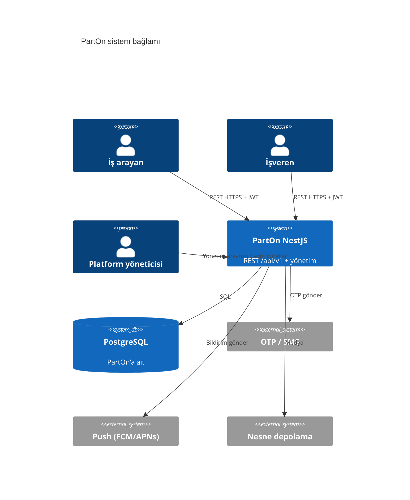

# 02 — Sistem bağlamı

**Durum:** `accepted`  
**Son güncelleme:** 2026-10-07  
**Kararlar:** [`../01-architecture-decisions.md`](../01-architecture-decisions.md)

## Aktörler

| Aktör | Kanal | Güven |
| --- | --- | --- |
| İş arayan (çalışan) | React Native | Kimliği doğrulanmış JWT + `worker` rolü |
| İşveren | React Native | JWT + `employer` rolü |
| Şube yöneticisi | React Native (üründe rol korunursa — AO-11) | JWT + `manager` rolü (+ şube kapsamı) |
| Platform yöneticisi | Nest uygulamasındaki yönetim arayüzü | JWT + `admin` rolü |
| Arka plan işleme | Başlangıçta süreç içi / outbox; ayrı işçi ertelendi | Genel internete açık değil |
| Harici sağlayıcılar | SMS, push, depolama | Yalnızca giden bağlantı; sırlar ortam değişkenlerinde |

Başlangıç pazarı: **Türkiye**. Dağıtım bölgesi belirlenecek.

## Bağlam diyagramı

## Güven sınırları

1. **Genel internet → Nest** — TLS, hız sınırları, korumalı `/api/v1` rotalarında ve yönetimde kimlik doğrulama.
2. **Nest → PostgreSQL** — özel ağ / VPC; en düşük ayrıcalıklı veritabanı rolü.
3. **Nest → sağlayıcılar** — API anahtarları mobil uygulamaya veya paylaşılan paketlere konmaz.
4. **Mobil yerel depolama** — yalnızca yenileme jetonları / oturum; uzun ömürlü sunucu sırları burada tutulmaz.
5. **Paylaşılan paketler** — yalnızca şemalar/türler/yardımcılar; veritabanı veya sır yok.

## Cihazdan taşınacaklar

| Konu | Eski | Yeni |
| --- | --- | --- |
| Kimlik doğrulama oturumu | Firebase Auth + DataStore | Nest JWT + güvenli cihaz depolama |
| İş / başvuru doğrusu | Firestore | REST üzerinden PostgreSQL |
| Eşleştirme / akış sıralaması | İstemci + Firestore sorguları | Sunucu eşleştirmesi + `GET /api/v1/jobs/feed` |
| İşe giriş / etkin vardiya | Yerel veritabanı + Firestore | REST vardiya komutları |
| Bildirim gelen kutusu | Yerel + uzak | REST gelen kutusu + push dağıtımı |
| Politikalar / uzaktan yapılandırma | Firestore / Remote Config | `policies` modülü (+ yapılandırma tablosu) |
| İstemci sözleşmesi | Firebase SDK / dinleyiciler | `/api/v1` + paylaşılan şema paketleri |
| Yönetim operasyonları | (sınırlı) | Aynı Nest uygulamasında yönetim arayüzü / aynı alan servisleri |

## Ortamlar

| Ortam | Amaç |
| --- | --- |
| `local` | Docker Postgres + Nest watch |
| `staging` | Paylaşılan QA; vaka çalıştırmaları için başlangıç verisi |
| `production` | Canlı (bulut sağlayıcısı belirlenecek) |

Yapılandırma Nest `ConfigModule` + ortam değişkenleriyle yapılır; sırlar depoya gönderilmez ve paylaşılan paketlere konmaz.

## İlgili vaka grupları

`CASE-AUTH`, `CASE-SECURITY`, `CASE-TOKEN`, `CASE-NOTIFICATIONS`, `CASE-E2E`
