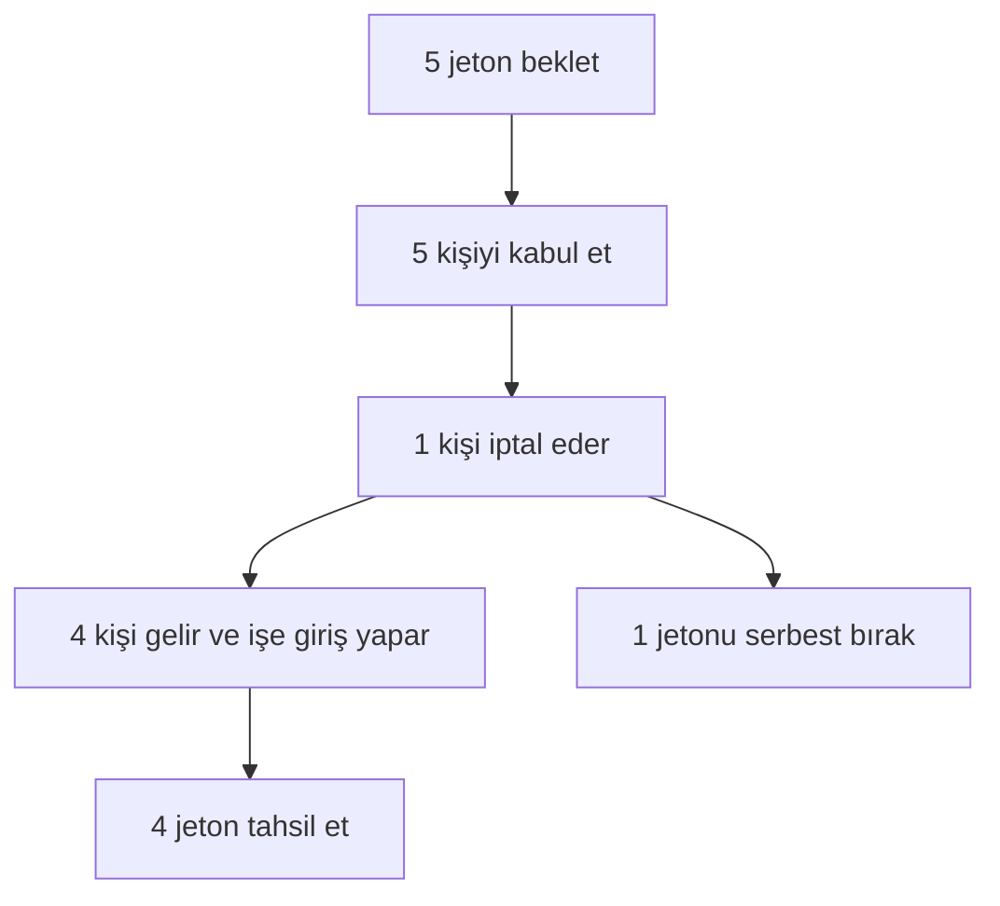

# 02 — Uçtan uca yolculuklar (CASE-E2E)

**Durum:** `proposed`  
**Vakalar:** T-193–T-225 (katalogda T-208, T-224 yok)

Bunları Nest + mobil + web genelinde mimari kabul betikleri olarak kullanın.

## Yolculuk 1 — Sorunsuz akış (T-193–T-204)

| Adım | Vaka | Aktör | Ekran / API | Başarı ölçütü |
| --- | --- | --- | --- | --- |
| 1 | T-193 | Çalışan | `m.auth.*` → çalışan ilk kurulumu | Hesap + rol oluşturuldu |
| 2 | T-194 | İşveren | `w.auth.*` / mobil işveren ilk kurulumu | Kurum oluşturuldu |
| 3 | T-195 | İşveren | Şube formu | Şube + geçerli koordinatlar |
| 4 | T-196 | İşveren | İş oluştur + jeton bekletme | İş yayımlandı; bekletilen = kişi sayısı |
| 5 | T-197 | Çalışan | İş akışı | İş eşleştirme kurallarıyla görünür |
| 6 | T-198 | Çalışan | Başvuru onayı | Başvuru beklemede |
| 7 | T-199 | İşveren | Aday panosu | Durum kabul edildi; çalışana bildir |
| 8 | T-200 | Çalışan | 3 saat kala onay | `can_come` |
| 9 | T-201 | Çalışan | İşe giriş | Geldiği doğrulandı |
| 10 | T-202 | Sistem | Konum politikası | Coğrafi doğrulama başarılı |
| 11 | T-203 | Sistem | Jetonlar | Bekletme → tahsilat |
| 12 | T-204 | Her iki taraf | Puanlamalar | Programa göre puanlama açıldı |

## Yolculuk 2 — Çalışan gelemiyor (T-205–T-209)

| Vaka | Aktör | Başarı ölçütü |
| --- | --- | --- |
| T-205 | Çalışan kabul edildi | Yer ayrıldı |
| T-206 | 3 saat kala `cannot_come` | Yer serbest bırakıldı / durum güncellendi |
| T-207 | İşverene bildirildi | Push + gelen kutusu |
| T-209 | Jetonlar | Bekletme düzeltildi (haksız tahsilat yok) |

## Yolculuk 3 — GPS sorunu + elle işlem (T-210–T-214)

| Vaka | Başarı ölçütü |
| --- | --- |
| T-210 | Çalışan iş yerinde |
| T-211 | GPS başarısız | İşe giriş gerekçeyle reddedildi |
| T-212 | İtiraz açıldı | `m.worker.shift.dispute` |
| T-213 | İşveren onayladı | `manual_confirm` |
| T-214 | Jeton kararı | Politikaya göre tahsil et veya serbest bırak |

## Yolculuk 4 — Favori çalışanı yeniden işe al (T-215–T-218)

Favori çalışan → yalnızca favorilere açık iş → yalnızca o çalışan görür → başvur / kabul et.

## Yolculuk 5 — Birden fazla kişi (T-219–T-225)

5 jeton beklet → 5 kişiyi kabul et → 1 kişi iptal eder → tahsilat, körlemesine 5 kişi için değil, işe giriş yapanlar için yapılır.

