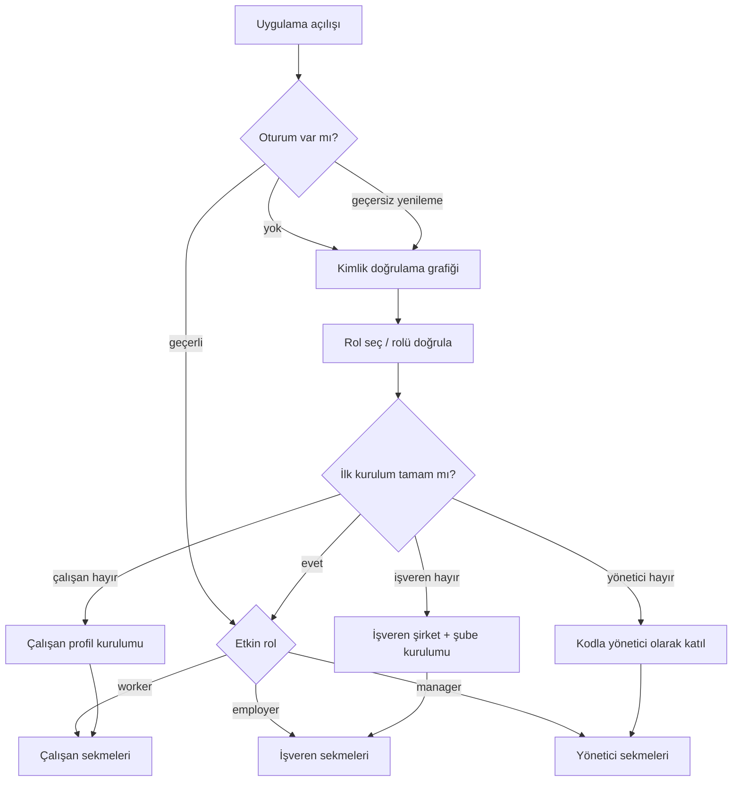

# 01 — Mobil bilgi mimarisi

**Durum:** `proposed`  
**Son güncelleme:** 2026-10-07

## Üst düzey gezinme grafiği

## Genel eşikler (her zaman açık katmanlar)

Rol sekmelerinden önce değerlendirilir; gezinmeyi kesebilir.

| Eşik | Ekran | Tetikleyici |
| --- | --- | --- |
| Zorunlu güncelleme / bakım | `m.shared.system.maintenance` | Uygulama yapılandırması |
| Hesap kısıtlaması | `m.shared.system.restriction` | Kötüye kullanım / politika işareti |
| Engelleme durumu | `m.shared.system.blocking` | Kritik uyumluluk adımlarının tamamlanmaması |
| Politika kabulü | `m.auth.policies.accept` | Yeni politika sürümü |
| Konum izni (bağlama göre) | Sistem izni penceresi + akış içi bilgilendirme | İşe giriş / konum özelliklerinden önce |

## Çalışan sekmeleri

| Sekme | Kök ekran | Amaç |
| --- | --- | --- |
| Ana sayfa | `m.worker.home.root` | Bugünün işleri, CTA'lar, uyarılar |
| İşler | `m.worker.jobs.list` | Eşleşen akış + arama/filtre |
| Takvim | `m.worker.calendar.root` | Müsaitlik + planlanmış işler |
| Profil | `m.worker.profile.root` | Profil, gelir, ayarlara giriş |

İş ayrıntısı, başvuru onayı, işe giriş, bildirimler vb. ekranlar sekmelerin üstüne yığın olarak açılır.

## İşveren sekmeleri

| Sekme | Kök ekran | Amaç |
| --- | --- | --- |
| Ana sayfa | `m.employer.home.root` | Operasyon özeti, kontrol listesi |
| İşler | `m.employer.jobs.list` | Duruma göre ilanlar |
| Şubeler | `m.employer.branches.list` | Şube yönetimi |
| Profil | `m.employer.profile.root` | Kurum profili, jetonlar, ayarlar |

İş oluşturma sihirbazı ve adaylar, İşler sekmesinden yığın olarak açılır.

## Yönetici sekmeleri

| Sekme | Kök ekran | Amaç |
| --- | --- | --- |
| Ana sayfa | `m.manager.home.root` | Atanmış şube(ler)de bugün |
| İşler | `m.manager.jobs.list` | Şube işleri |
| Uyarılar | `m.manager.notifications.list` | Operasyon bildirimleri |
| Profil | `m.manager.profile.root` | Yönetici profili / şube bağlamı |

Ürün daha sonra genişletmediği sürece yönetici işverenin tümüne ait faturalama/jeton ekranlarını görmez (`open`).

## Rol değiştirme

**Öneri:** Oturum başına tek etkin rol; rol değiştirmek açık eylem gerektirir ve o role ait ilk kurulum eşiğinden tekrar geçilir.

Arka uç notlarında `open` olarak belgelenmiştir (`DM-1` / `AS-3`) — arayüz aynı anda birden fazla rol sekmesi olduğunu varsaymamalıdır.

## Push → ekran eşlemesi (özet)

| Bildirim türü | Hedef ekran |
| --- | --- |
| Yeni eşleşen iş | `m.worker.jobs.detail` |
| Başvuru geldi / kararı | Çalışan veya işveren başvuru ayrıntısı |
| 3 saatlik müsaitlik onayı | `m.worker.shift.availability-confirm` |
| 10 dakikalık işe giriş hatırlatması | `m.worker.shift.check-in` |
| Puanlama isteği | `m.shared.ratings.compose` |

Tam tablo: [03-flows-and-deep-links.md](03-flows-and-deep-links.md).
