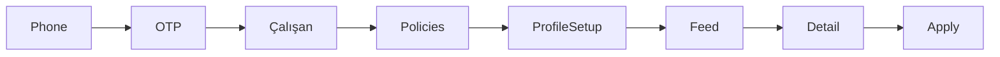
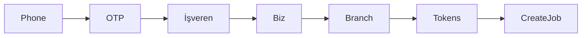
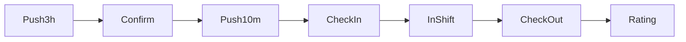
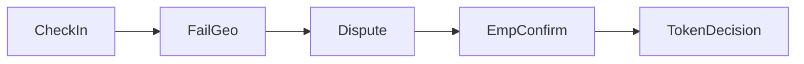

# 03 — Mobil akışlar ve derin bağlantılar

**Durum:** `proposed`  
**Son güncelleme:** 2026-10-07

## Derin bağlantı şeması (öneri)

```text
parton://app/<path>
https://app.parton.<tld>/app/<path>   # evrensel / uygulama bağlantıları
```

Tüm bağlantılar şu sıradan geçer: **oturum → rol → ilk kurulum → yetkilendirme → ekran**.

## Kritik kullanıcı yolculukları

### J1 — Çalışan kaydı → başvuru



Ekranlar: `m.auth.phone` → `otp` → `role-select` → `policies` → `m.worker.onboarding.profile` → `jobs.list` → `jobs.detail` → `jobs.apply-confirm`

Vakalar: `CASE-AUTH`, `CASE-WORKER-PROFILE`, `CASE-MATCHING`, `CASE-APPLICATION`, `CASE-E2E`

### J2 — İşveren kaydı → ilan yayımlama



Ekranlar: kimlik doğrulama… → `m.employer.onboarding.business` → `branches.form` → `tokens.root` → 1–3. iş oluşturma adımları

Vakalar: `CASE-EMPLOYER-BRANCH`, `CASE-JOB-POSTING`, `CASE-TOKEN`, `CASE-E2E`

### J3 — Başvuruyu incele → kabul et

İşveren/Yönetici: `applicants.list` → `applicants.detail` → kabul et → çalışana bildirim gönderilir → `m.shared.job-process.detail`

Vakalar: `CASE-EMPLOYER-REVIEW`, `CASE-NOTIFICATIONS`

### J4 — İş günü (3 saat kala + işe giriş)



Ekranlar: `availability-confirm` → `check-in` → `in-shift` → `check-out` → `ratings.compose`

Vakalar: `CASE-AVAILABILITY-3H`, `CASE-CHECKIN`, `CASE-LOCATION`, `CASE-RATINGS`

### J5 — GPS başarısız → itiraz → elle onay (E2E 3)



Ekranlar: `m.worker.shift.check-in` → `m.worker.shift.dispute` → `m.employer.shift.manual-confirm` / web katılım ekranı

Vakalar: T-210–T-214, T-134–T-135

Tam E2E tabloları: [`../cases/02-e2e-journeys.md`](../cases/02-e2e-journeys.md)

## Push yükü → ekran

| `type` | Parametreler | Ekran kimliği |
| --- | --- | --- |
| `job.matched` | `jobId` | `m.worker.jobs.detail` |
| `application.received` | `jobId` | `m.employer.applicants.list` |
| `application.decision` | `applicationId` | `m.shared.job-process.detail` |
| `shift.confirm_3h` | `shiftId` | `m.worker.shift.availability-confirm` |
| `shift.checkin_due` | `shiftId` | `m.worker.shift.check-in` |
| `shift.dispute_update` | `shiftId` | `m.worker.shift.dispute` / işveren onayı |
| `rating.pending` | `shiftId` | `m.shared.ratings.compose` |
| `job.favorites_only` | `jobId` | `m.worker.jobs.detail` |
| `generic` | `notificationId` | `m.shared.notifications.detail` |

Geçersiz/süresi dolmuş hedefler rol ana sayfasına yönlendirilir.

## İzin deneyimi

| İzin | İlk istem | Kesin gereklilik |
| --- | --- | --- |
| Bildirimler | Rol ana sayfasından sonra bir kez | İsteğe bağlı; özellikler kısıtlı çalışabilir |
| Uygulama kullanılırken konum | İlk işe giriş / mesafe filtresinden önce | İzin olmadan işe giriş engellenir |
| Arka plan konumu | v1'de kaçının | — |

## Çevrimdışı (v1 yaklaşımı)

- Okumalar: güvenliyse son önbelleği + çevrimdışı bandını göster
- Yazmalar (başvuru, işe giriş, OTP): ağ bağlantısı gerektirir; daha sonra açıkça tasarlanmadıkça kuyruğa alma yok
- Çevrimdışıyken işe giriş başarılıymış gibi göstermeyin
