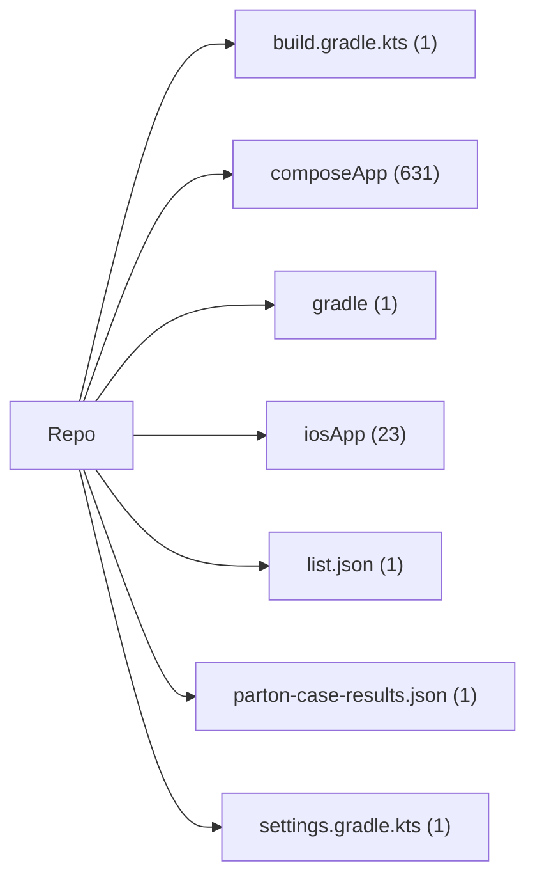

# Parton Kodbase Wiki: StaffMatch

Bu wiki, Türkçe Parton denetim raporunun CodeWiki/DeepWiki tarzı kodbase anlama katmanıdır.

- Hedef framework: `kotlin`
- Tespit güveni: `high`
- İndekslenen dosya: `659`
- Top-level alan: `7`

## Wiki Sayfaları

| Sayfa | Amaç |
| --- | --- |
| [Framework Tespiti](01-framework-detection.md) | Kotlin / React Native / hibrit sınıflandırma kanıtı. |
| [Mimari Harita](02-architecture-map.md) | Repo alanları, katmanlar ve mimari görselleştirme. |
| [Uygulama ve Paket Envanteri](03-app-package-inventory.md) | Uygulama, paket ve top-level dosya yüzeyleri. |
| [Ekranlar ve Görünümler](04-screens-and-views.md) | Ekran, görünüm, navigation ve UI giriş noktaları. |
| [API, Servis ve Modüller](05-api-services-modules.md) | API client, servis, repository, manager ve use case yüzeyleri. |
| [State, Veri ve İş Mantığı](06-state-data-and-logic.md) | State sahipleri, modeller, validatorlar, cache ve iş mantığı. |
| [Native ve Platform Katmanı](07-native-platform.md) | Android/iOS/native köprü, izin, manifest ve platform entegrasyonları. |
| [Veri Akışı ve Yan Etkiler](08-data-flow-and-side-effects.md) | Auth, network, persistence, bildirim, lokasyon ve token yan etkileri. |
| [Performans, Kod Kalitesi ve Güvenlik](09-performance-code-quality-security.md) | Zorunlu mühendislik boyutları için kanıt ve risk haritası. |
| [Test, CI ve Release Guardrail](10-tests-ci-and-release-guards.md) | Test, CI, statik analiz ve release doğrulama yüzeyleri. |
| [Parton Vaka Haritası](11-parton-case-map.md) | Türkçe Parton vaka kataloğunun kod alanlarına bağlanması. |
| [Kanıt Defteri](12-evidence-ledger.md) | Önemli iddialar için kaynak dosya ve gözlem defteri. |
| [Bilinmeyenler ve Çelişkiler](13-unknowns-and-contradictions.md) | Varsayımlar, bilinmeyenler ve tutarsızlıkların kaydı. |
| [Vaka Test Sonuçları](14-case-test-results.md) | Vaka test sonuçlarının durum, güven, test kalitesi ve açık görselleştirmesi. |
| [UI Wiring ve WhatsApp Canlı Test](15-ui-wiring-and-live-test.md) | WhatsApp canlı test planı, rol/faz dağılımı ve ekran-kod bağlantı zinciri. |

## Vaka Test Görsel Sayfaları

| Sayfa | Amaç |
| --- | --- |
| [CASE-ABUSE](case-tests/case-abuse.md) | Parton vaka test grubu için öncelik, test türü, sonuç durumu, güven, test kalitesi ve açık görselleştirmesi |
| [CASE-APPLICATION](case-tests/case-application.md) | Parton vaka test grubu için öncelik, test türü, sonuç durumu, güven, test kalitesi ve açık görselleştirmesi |
| [CASE-AUTH](case-tests/case-auth.md) | Parton vaka test grubu için öncelik, test türü, sonuç durumu, güven, test kalitesi ve açık görselleştirmesi |
| [CASE-AVAILABILITY-3H](case-tests/case-availability-3h.md) | Parton vaka test grubu için öncelik, test türü, sonuç durumu, güven, test kalitesi ve açık görselleştirmesi |
| [CASE-CHECKIN](case-tests/case-checkin.md) | Parton vaka test grubu için öncelik, test türü, sonuç durumu, güven, test kalitesi ve açık görselleştirmesi |
| [CASE-E2E](case-tests/case-e2e.md) | Parton vaka test grubu için öncelik, test türü, sonuç durumu, güven, test kalitesi ve açık görselleştirmesi |
| [CASE-EMPLOYER-BRANCH](case-tests/case-employer-branch.md) | Parton vaka test grubu için öncelik, test türü, sonuç durumu, güven, test kalitesi ve açık görselleştirmesi |
| [CASE-EMPLOYER-REVIEW](case-tests/case-employer-review.md) | Parton vaka test grubu için öncelik, test türü, sonuç durumu, güven, test kalitesi ve açık görselleştirmesi |
| [CASE-FAVORITES](case-tests/case-favorites.md) | Parton vaka test grubu için öncelik, test türü, sonuç durumu, güven, test kalitesi ve açık görselleştirmesi |
| [CASE-JOB-POSTING](case-tests/case-job-posting.md) | Parton vaka test grubu için öncelik, test türü, sonuç durumu, güven, test kalitesi ve açık görselleştirmesi |
| [CASE-LOCATION](case-tests/case-location.md) | Parton vaka test grubu için öncelik, test türü, sonuç durumu, güven, test kalitesi ve açık görselleştirmesi |
| [CASE-MATCHING](case-tests/case-matching.md) | Parton vaka test grubu için öncelik, test türü, sonuç durumu, güven, test kalitesi ve açık görselleştirmesi |
| [CASE-NOTIFICATIONS](case-tests/case-notifications.md) | Parton vaka test grubu için öncelik, test türü, sonuç durumu, güven, test kalitesi ve açık görselleştirmesi |
| [CASE-PERF](case-tests/case-perf.md) | Parton vaka test grubu için öncelik, test türü, sonuç durumu, güven, test kalitesi ve açık görselleştirmesi |
| [CASE-RATINGS](case-tests/case-ratings.md) | Parton vaka test grubu için öncelik, test türü, sonuç durumu, güven, test kalitesi ve açık görselleştirmesi |
| [CASE-SECURITY](case-tests/case-security.md) | Parton vaka test grubu için öncelik, test türü, sonuç durumu, güven, test kalitesi ve açık görselleştirmesi |
| [CASE-TOKEN](case-tests/case-token.md) | Parton vaka test grubu için öncelik, test türü, sonuç durumu, güven, test kalitesi ve açık görselleştirmesi |
| [CASE-UX](case-tests/case-ux.md) | Parton vaka test grubu için öncelik, test türü, sonuç durumu, güven, test kalitesi ve açık görselleştirmesi |
| [CASE-WORKER-PROFILE](case-tests/case-worker-profile.md) | Parton vaka test grubu için öncelik, test türü, sonuç durumu, güven, test kalitesi ve açık görselleştirmesi |

## Görsel Özet

## Nasıl Kullanılır?

- Bu wiki onboarding, kodbase navigasyonu ve implementasyon planlama için kullanılır.
- Denetim raporu; kapsama durumu, risk, açıklar ve öncelikli öneriler için kullanılır.
- Her önemli wiki ifadesi doğrudan dosya kanıtına bağlanmalıdır.
- Belirsizlikleri gizlemek yerine bilinmeyenler ve çelişkiler güncellenmelidir.
