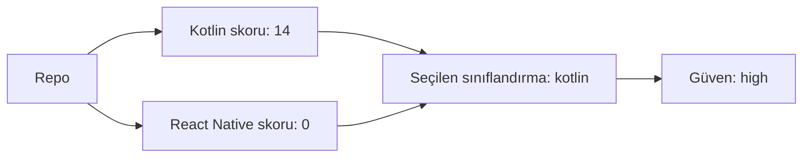

# Framework Tespiti Wiki: StaffMatch

- Seçilen framework: `kotlin`
- Otomatik tespit sonucu: `kotlin`
- Tespit güveni: `high`
- Kotlin skoru: `14`
- React Native skoru: `0`
- Karar gerekçesi: Kotlin/Android signals were strong and React Native evidence was not strong enough to justify a hybrid or RN classification.

## Framework Karar Görselleştirmesi

## Kotlin Kanıtları

| Sinyal | Ağırlık | Kanıt |
| --- | --- | --- |
| `root-gradle` | 4 | `build.gradle.kts` |
| `root-gradle` | 4 | `settings.gradle.kts` |
| `kotlin-source-depth` | 5 | `608 .kt files outside android shell` |
| `gradle-version-catalog` | 1 | `gradle/libs.versions.toml` |

## React Native Kanıtları

| Sinyal | Ağırlık | Kanıt |
| --- | --- | --- |
| yok | yok | yok |

## Belirsizlikler

- yok

## Dokümantasyon Kuralı

- Bu sınıflandırma her raporda kanıta bağlı kalmalıdır.
- Manuel inceleme bu tespit ile çelişirse çelişki `13-unknowns-and-contradictions.md` içinde kaydedilmelidir.
