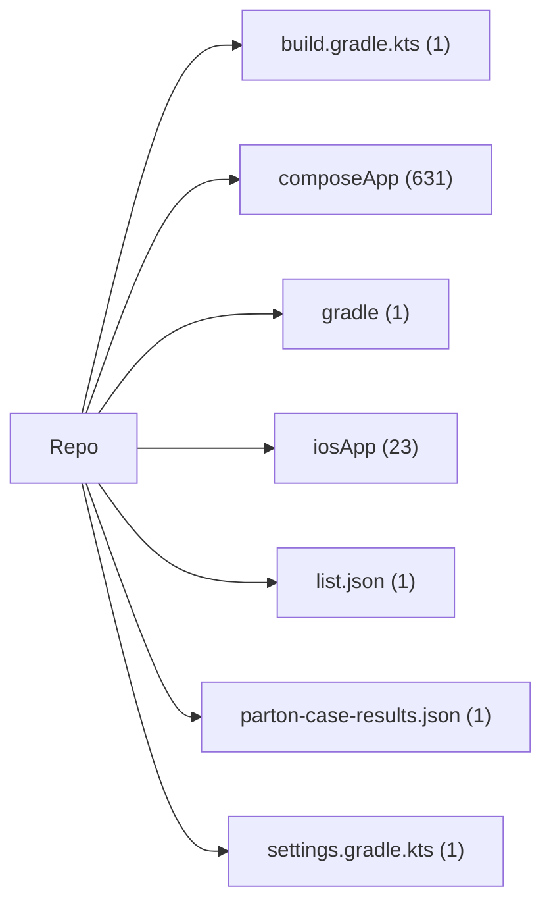
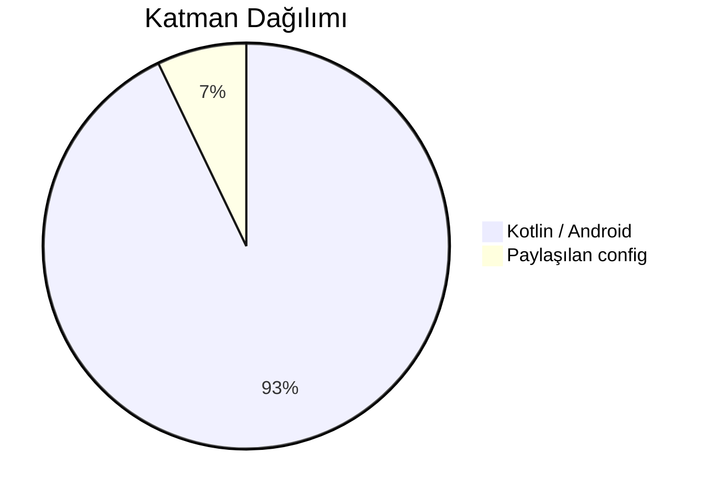

# Mimari Harita Wiki: StaffMatch

Bu sayfa kaynak bağlantılı mimari harita iskeletidir. Zayıf çıkarımlar manuel inceleme sonrası doğrudan dosya kanıtı ile değiştirilmelidir.

## Top-Level Alanlar

| Alan | İndekslenen Dosya Sayısı |
| --- | --- |
| `build.gradle.kts` | 1 |
| `composeApp` | 631 |
| `gradle` | 1 |
| `iosApp` | 23 |
| `list.json` | 1 |
| `parton-case-results.json` | 1 |
| `settings.gradle.kts` | 1 |

## Katman Dağılımı

| Katman | İndekslenen Dosya Sayısı |
| --- | --- |
| `Kotlin / Android` | 612 |
| `Paylaşılan config` | 47 |

## Top-Level Alan Grafiği

## Katman Dağılım Grafiği

## Mimari Anlatım

- Giriş noktaları ve bootstrap sırası: doğrudan kaynak bağlantılarıyla belgelenmelidir.
- Feature/modül sahipliği: her top-level alanın sorumluluğu açıklanmalıdır.
- Katman sınırları: UI, domain, data, native/platform, backend sınırı ve test sorumlulukları ayrılmalıdır.
- Bilinmeyenler: incelenen kodla kanıtlanmayan her şey açık bırakılmalıdır.
