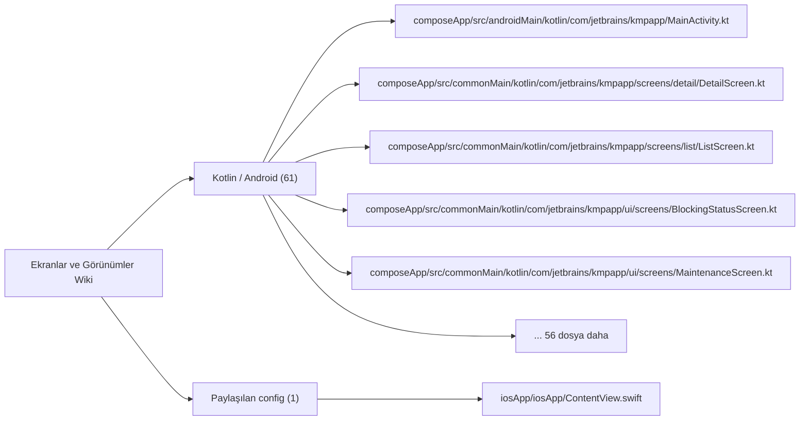

# Ekranlar ve Görünümler Wiki

Ekran, görünüm, fragment, activity, page, modal ve navigation bağlantılı yüzeyler.

## Görselleştirme

## İndekslenen Dosyalar

| Dosya | Katman | Etiketler | Kanıt Durumu |
| --- | --- | --- | --- |
| `composeApp/src/androidMain/kotlin/com/jetbrains/kmpapp/MainActivity.kt` | `Kotlin / Android` | `giriş noktası, ekran` | Manuel doğrulanacak |
| `composeApp/src/commonMain/kotlin/com/jetbrains/kmpapp/screens/detail/DetailScreen.kt` | `Kotlin / Android` | `ekran` | Manuel doğrulanacak |
| `composeApp/src/commonMain/kotlin/com/jetbrains/kmpapp/screens/list/ListScreen.kt` | `Kotlin / Android` | `ekran` | Manuel doğrulanacak |
| `composeApp/src/commonMain/kotlin/com/jetbrains/kmpapp/ui/screens/BlockingStatusScreen.kt` | `Kotlin / Android` | `ekran` | Manuel doğrulanacak |
| `composeApp/src/commonMain/kotlin/com/jetbrains/kmpapp/ui/screens/MaintenanceScreen.kt` | `Kotlin / Android` | `ekran` | Manuel doğrulanacak |
| `composeApp/src/commonMain/kotlin/com/jetbrains/kmpapp/ui/screens/RestrictionScreen.kt` | `Kotlin / Android` | `ekran` | Manuel doğrulanacak |
| `composeApp/src/commonMain/kotlin/com/jetbrains/kmpapp/ui/screens/auth/AppTutorialScreen.kt` | `Kotlin / Android` | `ekran` | Manuel doğrulanacak |
| `composeApp/src/commonMain/kotlin/com/jetbrains/kmpapp/ui/screens/auth/LoginScreen.kt` | `Kotlin / Android` | `ekran` | Manuel doğrulanacak |
| `composeApp/src/commonMain/kotlin/com/jetbrains/kmpapp/ui/screens/auth/OtpScreen.kt` | `Kotlin / Android` | `ekran` | Manuel doğrulanacak |
| `composeApp/src/commonMain/kotlin/com/jetbrains/kmpapp/ui/screens/auth/PhoneEntryScreen.kt` | `Kotlin / Android` | `ekran` | Manuel doğrulanacak |
| `composeApp/src/commonMain/kotlin/com/jetbrains/kmpapp/ui/screens/auth/RoleSelectScreen.kt` | `Kotlin / Android` | `ekran` | Manuel doğrulanacak |
| `composeApp/src/commonMain/kotlin/com/jetbrains/kmpapp/ui/screens/auth/SignInScreen.kt` | `Kotlin / Android` | `ekran` | Manuel doğrulanacak |
| `composeApp/src/commonMain/kotlin/com/jetbrains/kmpapp/ui/screens/auth/SignUpScreen.kt` | `Kotlin / Android` | `ekran` | Manuel doğrulanacak |
| `composeApp/src/commonMain/kotlin/com/jetbrains/kmpapp/ui/screens/employee/EmployeeAvailabilityScreen.kt` | `Kotlin / Android` | `ekran` | Manuel doğrulanacak |
| `composeApp/src/commonMain/kotlin/com/jetbrains/kmpapp/ui/screens/employee/EmployeeCalendarScreen.kt` | `Kotlin / Android` | `ekran` | Manuel doğrulanacak |
| `composeApp/src/commonMain/kotlin/com/jetbrains/kmpapp/ui/screens/employee/EmployeeCheckInScreen.kt` | `Kotlin / Android` | `ekran` | Manuel doğrulanacak |
| `composeApp/src/commonMain/kotlin/com/jetbrains/kmpapp/ui/screens/employee/EmployeeCheckOutScreen.kt` | `Kotlin / Android` | `ekran` | Manuel doğrulanacak |
| `composeApp/src/commonMain/kotlin/com/jetbrains/kmpapp/ui/screens/employee/EmployeeHomeScreen.kt` | `Kotlin / Android` | `ekran` | Manuel doğrulanacak |
| `composeApp/src/commonMain/kotlin/com/jetbrains/kmpapp/ui/screens/employee/EmployeeInShiftActionsScreen.kt` | `Kotlin / Android` | `ekran` | Manuel doğrulanacak |
| `composeApp/src/commonMain/kotlin/com/jetbrains/kmpapp/ui/screens/employee/EmployeeJobDetailScreen.kt` | `Kotlin / Android` | `ekran` | Manuel doğrulanacak |
| `composeApp/src/commonMain/kotlin/com/jetbrains/kmpapp/ui/screens/employee/EmployeeJobsScreen.kt` | `Kotlin / Android` | `ekran` | Manuel doğrulanacak |
| `composeApp/src/commonMain/kotlin/com/jetbrains/kmpapp/ui/screens/employee/EmployeeProfileScreen.kt` | `Kotlin / Android` | `ekran` | Manuel doğrulanacak |
| `composeApp/src/commonMain/kotlin/com/jetbrains/kmpapp/ui/screens/employee/EmployeeProfileSetupScreen.kt` | `Kotlin / Android` | `ekran` | Manuel doğrulanacak |
| `composeApp/src/commonMain/kotlin/com/jetbrains/kmpapp/ui/screens/employee/EmployeePushPrefsScreen.kt` | `Kotlin / Android` | `ekran` | Manuel doğrulanacak |
| `composeApp/src/commonMain/kotlin/com/jetbrains/kmpapp/ui/screens/employee/EmployeeWorkPrepScreen.kt` | `Kotlin / Android` | `ekran` | Manuel doğrulanacak |
| `composeApp/src/commonMain/kotlin/com/jetbrains/kmpapp/ui/screens/employee/revenue/EmployeeRevenueScreen.kt` | `Kotlin / Android` | `ekran` | Manuel doğrulanacak |
| `composeApp/src/commonMain/kotlin/com/jetbrains/kmpapp/ui/screens/employer/EmployerBranchCreateEditScreen.kt` | `Kotlin / Android` | `ekran` | Manuel doğrulanacak |
| `composeApp/src/commonMain/kotlin/com/jetbrains/kmpapp/ui/screens/employer/EmployerBranchListScreen.kt` | `Kotlin / Android` | `ekran` | Manuel doğrulanacak |
| `composeApp/src/commonMain/kotlin/com/jetbrains/kmpapp/ui/screens/employer/EmployerBranchScreen.kt` | `Kotlin / Android` | `ekran` | Manuel doğrulanacak |
| `composeApp/src/commonMain/kotlin/com/jetbrains/kmpapp/ui/screens/employer/EmployerBusinessScreen.kt` | `Kotlin / Android` | `ekran` | Manuel doğrulanacak |
| `composeApp/src/commonMain/kotlin/com/jetbrains/kmpapp/ui/screens/employer/EmployerChecklistScreen.kt` | `Kotlin / Android` | `ekran` | Manuel doğrulanacak |
| `composeApp/src/commonMain/kotlin/com/jetbrains/kmpapp/ui/screens/employer/EmployerDashboardScreen.kt` | `Kotlin / Android` | `ekran` | Manuel doğrulanacak |
| `composeApp/src/commonMain/kotlin/com/jetbrains/kmpapp/ui/screens/employer/EmployerHomeScreen.kt` | `Kotlin / Android` | `ekran` | Manuel doğrulanacak |
| `composeApp/src/commonMain/kotlin/com/jetbrains/kmpapp/ui/screens/employer/EmployerIndustryManagementScreen.kt` | `Kotlin / Android` | `ekran` | Manuel doğrulanacak |
| `composeApp/src/commonMain/kotlin/com/jetbrains/kmpapp/ui/screens/employer/EmployerJobApplicantsScreen.kt` | `Kotlin / Android` | `ekran` | Manuel doğrulanacak |
| `composeApp/src/commonMain/kotlin/com/jetbrains/kmpapp/ui/screens/employer/EmployerJobFormScreen.kt` | `Kotlin / Android` | `ekran` | Manuel doğrulanacak |
| `composeApp/src/commonMain/kotlin/com/jetbrains/kmpapp/ui/screens/employer/EmployerJobsScreen.kt` | `Kotlin / Android` | `ekran` | Manuel doğrulanacak |
| `composeApp/src/commonMain/kotlin/com/jetbrains/kmpapp/ui/screens/employer/EmployerNotificationsScreen.kt` | `Kotlin / Android` | `ekran` | Manuel doğrulanacak |
| `composeApp/src/commonMain/kotlin/com/jetbrains/kmpapp/ui/screens/employer/EmployerOpsSettingsScreen.kt` | `Kotlin / Android` | `ekran` | Manuel doğrulanacak |
| `composeApp/src/commonMain/kotlin/com/jetbrains/kmpapp/ui/screens/employer/EmployerProfileScreen.kt` | `Kotlin / Android` | `ekran` | Manuel doğrulanacak |
| `composeApp/src/commonMain/kotlin/com/jetbrains/kmpapp/ui/screens/employer/createjob/CreateJobTabScreen.kt` | `Kotlin / Android` | `ekran` | Manuel doğrulanacak |
| `composeApp/src/commonMain/kotlin/com/jetbrains/kmpapp/ui/screens/employer/createjob/step1/Step1PositionsScreen.kt` | `Kotlin / Android` | `ekran` | Manuel doğrulanacak |
| `composeApp/src/commonMain/kotlin/com/jetbrains/kmpapp/ui/screens/employer/createjob/step2/Step2DetailsScreen.kt` | `Kotlin / Android` | `ekran` | Manuel doğrulanacak |
| `composeApp/src/commonMain/kotlin/com/jetbrains/kmpapp/ui/screens/employer/createjob/step3/Step3SummaryScreen.kt` | `Kotlin / Android` | `ekran` | Manuel doğrulanacak |
| `composeApp/src/commonMain/kotlin/com/jetbrains/kmpapp/ui/screens/employer/jobdetail/EmployerJobDetailScreen.kt` | `Kotlin / Android` | `ekran` | Manuel doğrulanacak |
| `composeApp/src/commonMain/kotlin/com/jetbrains/kmpapp/ui/screens/manager/ManagerHomeScreen.kt` | `Kotlin / Android` | `mantık odağı, ekran` | Manuel doğrulanacak |
| `composeApp/src/commonMain/kotlin/com/jetbrains/kmpapp/ui/screens/manager/ManagerJobsScreen.kt` | `Kotlin / Android` | `mantık odağı, ekran` | Manuel doğrulanacak |
| `composeApp/src/commonMain/kotlin/com/jetbrains/kmpapp/ui/screens/manager/ManagerNotificationsScreen.kt` | `Kotlin / Android` | `mantık odağı, ekran` | Manuel doğrulanacak |
| `composeApp/src/commonMain/kotlin/com/jetbrains/kmpapp/ui/screens/manager/ManagerProfileScreen.kt` | `Kotlin / Android` | `mantık odağı, ekran` | Manuel doğrulanacak |
| `composeApp/src/commonMain/kotlin/com/jetbrains/kmpapp/ui/screens/profile/ProfileOverviewScreen.kt` | `Kotlin / Android` | `ekran` | Manuel doğrulanacak |
| `composeApp/src/commonMain/kotlin/com/jetbrains/kmpapp/ui/screens/profile/ProfileSettingsScreen.kt` | `Kotlin / Android` | `ekran` | Manuel doğrulanacak |
| `composeApp/src/commonMain/kotlin/com/jetbrains/kmpapp/ui/screens/shared/JobProcessDetailScreen.kt` | `Kotlin / Android` | `ekran` | Manuel doğrulanacak |
| `iosApp/iosApp/ContentView.swift` | `Paylaşılan config` | `ekran` | Manuel doğrulanacak |
| `composeApp/src/commonMain/kotlin/com/jetbrains/kmpapp/ui/navigation/AppNavHost.kt` | `Kotlin / Android` | `navigasyon` | Manuel doğrulanacak |
| `composeApp/src/commonMain/kotlin/com/jetbrains/kmpapp/ui/navigation/AuthGraph.kt` | `Kotlin / Android` | `navigasyon` | Manuel doğrulanacak |
| `composeApp/src/commonMain/kotlin/com/jetbrains/kmpapp/ui/navigation/EmployeeGraph.kt` | `Kotlin / Android` | `navigasyon` | Manuel doğrulanacak |
| `composeApp/src/commonMain/kotlin/com/jetbrains/kmpapp/ui/navigation/EmployerGraph.kt` | `Kotlin / Android` | `navigasyon` | Manuel doğrulanacak |
| `composeApp/src/commonMain/kotlin/com/jetbrains/kmpapp/ui/navigation/ManagerGraph.kt` | `Kotlin / Android` | `mantık odağı, navigasyon` | Manuel doğrulanacak |
| `composeApp/src/commonMain/kotlin/com/jetbrains/kmpapp/ui/navigation/NavArgsExt.kt` | `Kotlin / Android` | `navigasyon` | Manuel doğrulanacak |
| `composeApp/src/commonMain/kotlin/com/jetbrains/kmpapp/ui/navigation/NotificationNavigationBridge.kt` | `Kotlin / Android` | `navigasyon` | Manuel doğrulanacak |
| `composeApp/src/commonMain/kotlin/com/jetbrains/kmpapp/ui/navigation/ProfileGraph.kt` | `Kotlin / Android` | `navigasyon` | Manuel doğrulanacak |
| `composeApp/src/commonMain/kotlin/com/jetbrains/kmpapp/ui/navigation/Routes.kt` | `Kotlin / Android` | `navigasyon` | Manuel doğrulanacak |

## Manuel Dokümantasyon Kontrol Listesi

- Gözlenen davranışı doğrudan dosya yolları ve sembollerle kaydet.
- Gözlenen olguları, çıkarımları ve bilinmeyenleri ayır.
- İlgili ekranları, servisleri, testleri ve Parton vaka gruplarını bağla.
- Kaynak yol kanıtlamıyorsa davranışı implement edilmiş gibi anlatma.
