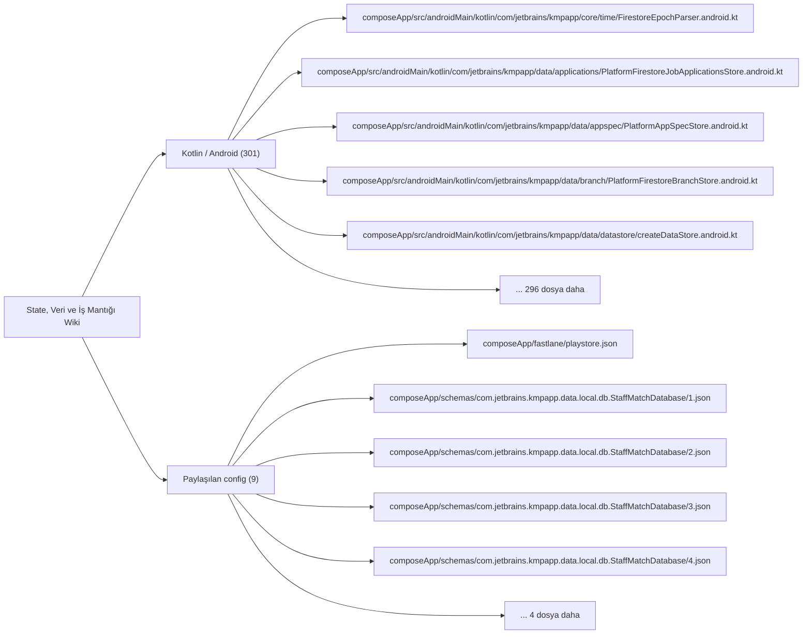

# State, Veri ve İş Mantığı Wiki

State sahipleri, validatorlar, modeller, persistence yolları ve mantık odakları.

## Görselleştirme

## İndekslenen Dosyalar

| Dosya | Katman | Etiketler | Kanıt Durumu |
| --- | --- | --- | --- |
| `composeApp/fastlane/playstore.json` | `Paylaşılan config` | `mantık odağı` | Manuel doğrulanacak |
| `composeApp/schemas/com.jetbrains.kmpapp.data.local.db.StaffMatchDatabase/1.json` | `Paylaşılan config` | `yok` | Manuel doğrulanacak |
| `composeApp/schemas/com.jetbrains.kmpapp.data.local.db.StaffMatchDatabase/2.json` | `Paylaşılan config` | `yok` | Manuel doğrulanacak |
| `composeApp/schemas/com.jetbrains.kmpapp.data.local.db.StaffMatchDatabase/3.json` | `Paylaşılan config` | `yok` | Manuel doğrulanacak |
| `composeApp/schemas/com.jetbrains.kmpapp.data.local.db.StaffMatchDatabase/4.json` | `Paylaşılan config` | `yok` | Manuel doğrulanacak |
| `composeApp/schemas/com.jetbrains.kmpapp.data.local.db.StaffMatchDatabase/5.json` | `Paylaşılan config` | `yok` | Manuel doğrulanacak |
| `composeApp/src/androidMain/kotlin/com/jetbrains/kmpapp/core/time/FirestoreEpochParser.android.kt` | `Kotlin / Android` | `mantık odağı` | Manuel doğrulanacak |
| `composeApp/src/androidMain/kotlin/com/jetbrains/kmpapp/data/applications/PlatformFirestoreJobApplicationsStore.android.kt` | `Kotlin / Android` | `mantık odağı` | Manuel doğrulanacak |
| `composeApp/src/androidMain/kotlin/com/jetbrains/kmpapp/data/appspec/PlatformAppSpecStore.android.kt` | `Kotlin / Android` | `mantık odağı, test` | Manuel doğrulanacak |
| `composeApp/src/androidMain/kotlin/com/jetbrains/kmpapp/data/branch/PlatformFirestoreBranchStore.android.kt` | `Kotlin / Android` | `mantık odağı` | Manuel doğrulanacak |
| `composeApp/src/androidMain/kotlin/com/jetbrains/kmpapp/data/datastore/createDataStore.android.kt` | `Kotlin / Android` | `mantık odağı` | Manuel doğrulanacak |
| `composeApp/src/androidMain/kotlin/com/jetbrains/kmpapp/data/employer/PlatformFirestoreEmployerJobsStore.android.kt` | `Kotlin / Android` | `mantık odağı` | Manuel doğrulanacak |
| `composeApp/src/androidMain/kotlin/com/jetbrains/kmpapp/data/jobcatalog/PlatformFirestoreJobCatalogStore.android.kt` | `Kotlin / Android` | `mantık odağı` | Manuel doğrulanacak |
| `composeApp/src/androidMain/kotlin/com/jetbrains/kmpapp/data/jobratings/PlatformFirestoreJobRatingStore.kt` | `Kotlin / Android` | `mantık odağı` | Manuel doğrulanacak |
| `composeApp/src/androidMain/kotlin/com/jetbrains/kmpapp/data/jobs/PlatformFirestoreJobCompletionStore.kt` | `Kotlin / Android` | `mantık odağı` | Manuel doğrulanacak |
| `composeApp/src/androidMain/kotlin/com/jetbrains/kmpapp/data/jobs/PlatformFirestoreJobsFeedStore.android.kt` | `Kotlin / Android` | `mantık odağı` | Manuel doğrulanacak |
| `composeApp/src/androidMain/kotlin/com/jetbrains/kmpapp/data/local/db/DatabaseBuilder.android.kt` | `Kotlin / Android` | `yok` | Manuel doğrulanacak |
| `composeApp/src/androidMain/kotlin/com/jetbrains/kmpapp/data/location/PlatformFirestoreLocationStore.android.kt` | `Kotlin / Android` | `mantık odağı` | Manuel doğrulanacak |
| `composeApp/src/androidMain/kotlin/com/jetbrains/kmpapp/data/pendingratings/PlatformFirestorePendingRatingsStore.kt` | `Kotlin / Android` | `mantık odağı` | Manuel doğrulanacak |
| `composeApp/src/androidMain/kotlin/com/jetbrains/kmpapp/data/push/PlatformPushTokenStore.android.kt` | `Kotlin / Android` | `mantık odağı` | Manuel doğrulanacak |
| `composeApp/src/androidMain/kotlin/com/jetbrains/kmpapp/data/ratings/PlatformFirestoreBranchRatingStore.kt` | `Kotlin / Android` | `mantık odağı` | Manuel doğrulanacak |
| `composeApp/src/androidMain/kotlin/com/jetbrains/kmpapp/data/ratings/PlatformFirestoreEmployeeRatingStore.kt` | `Kotlin / Android` | `mantık odağı` | Manuel doğrulanacak |
| `composeApp/src/androidMain/kotlin/com/jetbrains/kmpapp/data/time/PlatformFirestoreTimeSyncApi.android.kt` | `Kotlin / Android` | `mantık odağı` | Manuel doğrulanacak |
| `composeApp/src/androidMain/kotlin/com/jetbrains/kmpapp/data/user/PlatformFirestoreUserStore.android.kt` | `Kotlin / Android` | `mantık odağı` | Manuel doğrulanacak |
| `composeApp/src/androidUnitTest/kotlin/com/jetbrains/kmpapp/core/time/FirestoreEpochParserAndroidTest.kt` | `Kotlin / Android` | `mantık odağı, test` | Manuel doğrulanacak |
| `composeApp/src/commonMain/kotlin/com/jetbrains/kmpapp/core/time/FirestoreEpochParser.kt` | `Kotlin / Android` | `mantık odağı` | Manuel doğrulanacak |
| `composeApp/src/commonMain/kotlin/com/jetbrains/kmpapp/core/time/TimeSyncStore.kt` | `Kotlin / Android` | `mantık odağı` | Manuel doğrulanacak |
| `composeApp/src/commonMain/kotlin/com/jetbrains/kmpapp/data/applications/PlatformFirestoreJobApplicationsStore.kt` | `Kotlin / Android` | `mantık odağı` | Manuel doğrulanacak |
| `composeApp/src/commonMain/kotlin/com/jetbrains/kmpapp/data/appspec/PlatformAppSpecStore.kt` | `Kotlin / Android` | `mantık odağı, test` | Manuel doğrulanacak |
| `composeApp/src/commonMain/kotlin/com/jetbrains/kmpapp/data/branch/PlatformFirestoreBranchStore.kt` | `Kotlin / Android` | `mantık odağı` | Manuel doğrulanacak |
| `composeApp/src/commonMain/kotlin/com/jetbrains/kmpapp/data/datastore/createDataStore.kt` | `Kotlin / Android` | `mantık odağı` | Manuel doğrulanacak |
| `composeApp/src/commonMain/kotlin/com/jetbrains/kmpapp/data/employer/DataStoreEmployerIndustryScopeRepository.kt` | `Kotlin / Android` | `mantık odağı` | Manuel doğrulanacak |
| `composeApp/src/commonMain/kotlin/com/jetbrains/kmpapp/data/employer/PlatformFirestoreEmployerJobsStore.kt` | `Kotlin / Android` | `mantık odağı` | Manuel doğrulanacak |
| `composeApp/src/commonMain/kotlin/com/jetbrains/kmpapp/data/fake/FakeDatabase.kt` | `Kotlin / Android` | `yok` | Manuel doğrulanacak |
| `composeApp/src/commonMain/kotlin/com/jetbrains/kmpapp/data/jobcatalog/JobCatalogFirestoreParser.kt` | `Kotlin / Android` | `mantık odağı` | Manuel doğrulanacak |
| `composeApp/src/commonMain/kotlin/com/jetbrains/kmpapp/data/jobcatalog/PlatformFirestoreJobCatalogStore.kt` | `Kotlin / Android` | `mantık odağı` | Manuel doğrulanacak |
| `composeApp/src/commonMain/kotlin/com/jetbrains/kmpapp/data/jobratings/PlatformFirestoreJobRatingStore.kt` | `Kotlin / Android` | `mantık odağı` | Manuel doğrulanacak |
| `composeApp/src/commonMain/kotlin/com/jetbrains/kmpapp/data/jobs/FirestoreJobRepository.kt` | `Kotlin / Android` | `mantık odağı` | Manuel doğrulanacak |
| `composeApp/src/commonMain/kotlin/com/jetbrains/kmpapp/data/jobs/PlatformFirestoreJobCompletionStore.kt` | `Kotlin / Android` | `mantık odağı` | Manuel doğrulanacak |
| `composeApp/src/commonMain/kotlin/com/jetbrains/kmpapp/data/jobs/PlatformFirestoreJobsFeedStore.kt` | `Kotlin / Android` | `mantık odağı` | Manuel doğrulanacak |
| `composeApp/src/commonMain/kotlin/com/jetbrains/kmpapp/data/local/dao/ActiveShiftDao.kt` | `Kotlin / Android` | `yok` | Manuel doğrulanacak |
| `composeApp/src/commonMain/kotlin/com/jetbrains/kmpapp/data/local/dao/NotificationDao.kt` | `Kotlin / Android` | `yok` | Manuel doğrulanacak |
| `composeApp/src/commonMain/kotlin/com/jetbrains/kmpapp/data/local/dao/TrustedTimeStateDao.kt` | `Kotlin / Android` | `yok` | Manuel doğrulanacak |
| `composeApp/src/commonMain/kotlin/com/jetbrains/kmpapp/data/local/db/DatabaseBuilder.kt` | `Kotlin / Android` | `yok` | Manuel doğrulanacak |
| `composeApp/src/commonMain/kotlin/com/jetbrains/kmpapp/data/local/db/DatabaseFactory.kt` | `Kotlin / Android` | `yok` | Manuel doğrulanacak |
| `composeApp/src/commonMain/kotlin/com/jetbrains/kmpapp/data/local/db/StaffMatchDatabase.kt` | `Kotlin / Android` | `yok` | Manuel doğrulanacak |
| `composeApp/src/commonMain/kotlin/com/jetbrains/kmpapp/data/local/entity/CachedActiveShiftEntity.kt` | `Kotlin / Android` | `yok` | Manuel doğrulanacak |
| `composeApp/src/commonMain/kotlin/com/jetbrains/kmpapp/data/local/entity/NotificationEntity.kt` | `Kotlin / Android` | `yok` | Manuel doğrulanacak |
| `composeApp/src/commonMain/kotlin/com/jetbrains/kmpapp/data/local/entity/PendingShiftActionEntity.kt` | `Kotlin / Android` | `yok` | Manuel doğrulanacak |
| `composeApp/src/commonMain/kotlin/com/jetbrains/kmpapp/data/local/entity/TrustedTimeStateEntity.kt` | `Kotlin / Android` | `yok` | Manuel doğrulanacak |
| `composeApp/src/commonMain/kotlin/com/jetbrains/kmpapp/data/location/PlatformFirestoreLocationStore.kt` | `Kotlin / Android` | `mantık odağı` | Manuel doğrulanacak |
| `composeApp/src/commonMain/kotlin/com/jetbrains/kmpapp/data/pendingratings/PendingRatingsRepositoryFirestore.kt` | `Kotlin / Android` | `mantık odağı` | Manuel doğrulanacak |
| `composeApp/src/commonMain/kotlin/com/jetbrains/kmpapp/data/pendingratings/PlatformFirestorePendingRatingsStore.kt` | `Kotlin / Android` | `mantık odağı` | Manuel doğrulanacak |
| `composeApp/src/commonMain/kotlin/com/jetbrains/kmpapp/data/push/PlatformPushTokenStore.kt` | `Kotlin / Android` | `mantık odağı` | Manuel doğrulanacak |
| `composeApp/src/commonMain/kotlin/com/jetbrains/kmpapp/data/ratings/PlatformFirestoreBranchRatingStore.kt` | `Kotlin / Android` | `mantık odağı` | Manuel doğrulanacak |
| `composeApp/src/commonMain/kotlin/com/jetbrains/kmpapp/data/ratings/PlatformFirestoreEmployeeRatingStore.kt` | `Kotlin / Android` | `mantık odağı` | Manuel doğrulanacak |
| `composeApp/src/commonMain/kotlin/com/jetbrains/kmpapp/data/session/DataStoreSessionRepository.kt` | `Kotlin / Android` | `mantık odağı` | Manuel doğrulanacak |
| `composeApp/src/commonMain/kotlin/com/jetbrains/kmpapp/data/tax/FirestoreIndustryBranchTaxVerificationRepository.kt` | `Kotlin / Android` | `mantık odağı` | Manuel doğrulanacak |
| `composeApp/src/commonMain/kotlin/com/jetbrains/kmpapp/data/theme/DataStoreThemePreferenceRepository.kt` | `Kotlin / Android` | `mantık odağı` | Manuel doğrulanacak |
| `composeApp/src/commonMain/kotlin/com/jetbrains/kmpapp/data/tickets/FirestoreTicketRepository.kt` | `Kotlin / Android` | `mantık odağı` | Manuel doğrulanacak |
| `composeApp/src/commonMain/kotlin/com/jetbrains/kmpapp/data/time/RoomTimeSyncStore.kt` | `Kotlin / Android` | `mantık odağı` | Manuel doğrulanacak |
| `composeApp/src/commonMain/kotlin/com/jetbrains/kmpapp/data/user/PlatformFirestoreUserStore.kt` | `Kotlin / Android` | `mantık odağı` | Manuel doğrulanacak |
| `composeApp/src/commonMain/kotlin/com/jetbrains/kmpapp/di/datastoreModule.kt` | `Kotlin / Android` | `mantık odağı` | Manuel doğrulanacak |
| `composeApp/src/commonMain/kotlin/com/jetbrains/kmpapp/domain/action/CreateJobActorIdentity.kt` | `Kotlin / Android` | `yok` | Manuel doğrulanacak |
| `composeApp/src/commonMain/kotlin/com/jetbrains/kmpapp/domain/activeshift/ActiveShiftModels.kt` | `Kotlin / Android` | `yok` | Manuel doğrulanacak |
| `composeApp/src/commonMain/kotlin/com/jetbrains/kmpapp/domain/auth/EmailPasswordModels.kt` | `Kotlin / Android` | `yok` | Manuel doğrulanacak |
| `composeApp/src/commonMain/kotlin/com/jetbrains/kmpapp/domain/auth/OtpModels.kt` | `Kotlin / Android` | `yok` | Manuel doğrulanacak |
| `composeApp/src/commonMain/kotlin/com/jetbrains/kmpapp/domain/auth/PrimaryProviderAuthModels.kt` | `Kotlin / Android` | `yok` | Manuel doğrulanacak |
| `composeApp/src/commonMain/kotlin/com/jetbrains/kmpapp/domain/branch/BranchModels.kt` | `Kotlin / Android` | `yok` | Manuel doğrulanacak |
| `composeApp/src/commonMain/kotlin/com/jetbrains/kmpapp/domain/crypto/IdentityHashing.kt` | `Kotlin / Android` | `yok` | Manuel doğrulanacak |
| `composeApp/src/commonMain/kotlin/com/jetbrains/kmpapp/domain/jobcatalog/JobCatalogModels.kt` | `Kotlin / Android` | `yok` | Manuel doğrulanacak |
| `composeApp/src/commonMain/kotlin/com/jetbrains/kmpapp/domain/model/AppResult.kt` | `Kotlin / Android` | `yok` | Manuel doğrulanacak |
| `composeApp/src/commonMain/kotlin/com/jetbrains/kmpapp/domain/model/AppUiState.kt` | `Kotlin / Android` | `yok` | Manuel doğrulanacak |
| `composeApp/src/commonMain/kotlin/com/jetbrains/kmpapp/domain/model/DeleteRequestDoc.kt` | `Kotlin / Android` | `yok` | Manuel doğrulanacak |
| `composeApp/src/commonMain/kotlin/com/jetbrains/kmpapp/domain/model/EmployeeDoc.kt` | `Kotlin / Android` | `yok` | Manuel doğrulanacak |
| `composeApp/src/commonMain/kotlin/com/jetbrains/kmpapp/domain/model/EmployeeModels.kt` | `Kotlin / Android` | `yok` | Manuel doğrulanacak |
| `composeApp/src/commonMain/kotlin/com/jetbrains/kmpapp/domain/model/EmployeeUser.kt` | `Kotlin / Android` | `yok` | Manuel doğrulanacak |
| `composeApp/src/commonMain/kotlin/com/jetbrains/kmpapp/domain/model/EmployerDoc.kt` | `Kotlin / Android` | `yok` | Manuel doğrulanacak |
| `composeApp/src/commonMain/kotlin/com/jetbrains/kmpapp/domain/model/EmployerIndustry.kt` | `Kotlin / Android` | `yok` | Manuel doğrulanacak |
| `composeApp/src/commonMain/kotlin/com/jetbrains/kmpapp/domain/model/EmployerModels.kt` | `Kotlin / Android` | `yok` | Manuel doğrulanacak |
| `composeApp/src/commonMain/kotlin/com/jetbrains/kmpapp/domain/model/EmployerUser.kt` | `Kotlin / Android` | `yok` | Manuel doğrulanacak |
| `composeApp/src/commonMain/kotlin/com/jetbrains/kmpapp/domain/model/EmployerWalletDoc.kt` | `Kotlin / Android` | `yok` | Manuel doğrulanacak |
| `composeApp/src/commonMain/kotlin/com/jetbrains/kmpapp/domain/model/Job.kt` | `Kotlin / Android` | `yok` | Manuel doğrulanacak |
| `composeApp/src/commonMain/kotlin/com/jetbrains/kmpapp/domain/model/JobAmenities.kt` | `Kotlin / Android` | `yok` | Manuel doğrulanacak |
| `composeApp/src/commonMain/kotlin/com/jetbrains/kmpapp/domain/model/JobAttendance.kt` | `Kotlin / Android` | `yok` | Manuel doğrulanacak |
| `composeApp/src/commonMain/kotlin/com/jetbrains/kmpapp/domain/model/JobCalendar.kt` | `Kotlin / Android` | `yok` | Manuel doğrulanacak |
| `composeApp/src/commonMain/kotlin/com/jetbrains/kmpapp/domain/model/JobCompletionState.kt` | `Kotlin / Android` | `yok` | Manuel doğrulanacak |
| `composeApp/src/commonMain/kotlin/com/jetbrains/kmpapp/domain/model/JobHistory.kt` | `Kotlin / Android` | `yok` | Manuel doğrulanacak |
| `composeApp/src/commonMain/kotlin/com/jetbrains/kmpapp/domain/model/JobOpportunity.kt` | `Kotlin / Android` | `yok` | Manuel doğrulanacak |
| `composeApp/src/commonMain/kotlin/com/jetbrains/kmpapp/domain/model/JobProcess.kt` | `Kotlin / Android` | `yok` | Manuel doğrulanacak |
| `composeApp/src/commonMain/kotlin/com/jetbrains/kmpapp/domain/model/JobQuery.kt` | `Kotlin / Android` | `yok` | Manuel doğrulanacak |
| `composeApp/src/commonMain/kotlin/com/jetbrains/kmpapp/domain/model/JobWithBranch.kt` | `Kotlin / Android` | `yok` | Manuel doğrulanacak |
| `composeApp/src/commonMain/kotlin/com/jetbrains/kmpapp/domain/model/ManagerDoc.kt` | `Kotlin / Android` | `mantık odağı` | Manuel doğrulanacak |
| `composeApp/src/commonMain/kotlin/com/jetbrains/kmpapp/domain/model/RequestedIndustryBranchesDoc.kt` | `Kotlin / Android` | `yok` | Manuel doğrulanacak |
| `composeApp/src/commonMain/kotlin/com/jetbrains/kmpapp/domain/model/ResolvedRoleResult.kt` | `Kotlin / Android` | `yok` | Manuel doğrulanacak |
| `composeApp/src/commonMain/kotlin/com/jetbrains/kmpapp/domain/model/RestrictionDoc.kt` | `Kotlin / Android` | `yok` | Manuel doğrulanacak |
| `composeApp/src/commonMain/kotlin/com/jetbrains/kmpapp/domain/model/SessionInfo.kt` | `Kotlin / Android` | `yok` | Manuel doğrulanacak |
| `composeApp/src/commonMain/kotlin/com/jetbrains/kmpapp/domain/model/UserRole.kt` | `Kotlin / Android` | `yok` | Manuel doğrulanacak |
| `composeApp/src/commonMain/kotlin/com/jetbrains/kmpapp/domain/revenue/RevenueModels.kt` | `Kotlin / Android` | `yok` | Manuel doğrulanacak |
| `composeApp/src/commonMain/kotlin/com/jetbrains/kmpapp/domain/user/RoleIdentityRules.kt` | `Kotlin / Android` | `yok` | Manuel doğrulanacak |
| `composeApp/src/commonMain/kotlin/com/jetbrains/kmpapp/presentation/AppViewModel.kt` | `Kotlin / Android` | `yok` | Manuel doğrulanacak |
| `composeApp/src/commonMain/kotlin/com/jetbrains/kmpapp/presentation/auth/AuthViewModel.kt` | `Kotlin / Android` | `yok` | Manuel doğrulanacak |
| `composeApp/src/commonMain/kotlin/com/jetbrains/kmpapp/presentation/employee/EmployeeCalendarViewModel.kt` | `Kotlin / Android` | `yok` | Manuel doğrulanacak |
| `composeApp/src/commonMain/kotlin/com/jetbrains/kmpapp/presentation/employee/EmployeeHomeViewModel.kt` | `Kotlin / Android` | `yok` | Manuel doğrulanacak |
| `composeApp/src/commonMain/kotlin/com/jetbrains/kmpapp/presentation/employee/EmployeeJobDetailViewModel.kt` | `Kotlin / Android` | `yok` | Manuel doğrulanacak |
| `composeApp/src/commonMain/kotlin/com/jetbrains/kmpapp/presentation/employee/EmployeeNotificationsViewModel.kt` | `Kotlin / Android` | `yok` | Manuel doğrulanacak |
| `composeApp/src/commonMain/kotlin/com/jetbrains/kmpapp/presentation/employee/EmployeeOnboardingViewModel.kt` | `Kotlin / Android` | `yok` | Manuel doğrulanacak |
| `composeApp/src/commonMain/kotlin/com/jetbrains/kmpapp/presentation/employee/EmployeeProfileViewModel.kt` | `Kotlin / Android` | `yok` | Manuel doğrulanacak |
| `composeApp/src/commonMain/kotlin/com/jetbrains/kmpapp/presentation/employee/EmployeeShiftWorkflowViewModel.kt` | `Kotlin / Android` | `yok` | Manuel doğrulanacak |
| `composeApp/src/commonMain/kotlin/com/jetbrains/kmpapp/presentation/employee/revenue/EmployeeRevenueViewModel.kt` | `Kotlin / Android` | `yok` | Manuel doğrulanacak |
| `composeApp/src/commonMain/kotlin/com/jetbrains/kmpapp/presentation/employer/EmployerHomeViewModel.kt` | `Kotlin / Android` | `yok` | Manuel doğrulanacak |
| `composeApp/src/commonMain/kotlin/com/jetbrains/kmpapp/presentation/employer/EmployerJobApplicantsViewModel.kt` | `Kotlin / Android` | `yok` | Manuel doğrulanacak |
| `composeApp/src/commonMain/kotlin/com/jetbrains/kmpapp/presentation/employer/EmployerJobFormViewModel.kt` | `Kotlin / Android` | `yok` | Manuel doğrulanacak |
| `composeApp/src/commonMain/kotlin/com/jetbrains/kmpapp/presentation/employer/EmployerJobsViewModel.kt` | `Kotlin / Android` | `yok` | Manuel doğrulanacak |
| `composeApp/src/commonMain/kotlin/com/jetbrains/kmpapp/presentation/employer/EmployerOnboardingViewModel.kt` | `Kotlin / Android` | `yok` | Manuel doğrulanacak |
| `composeApp/src/commonMain/kotlin/com/jetbrains/kmpapp/presentation/employer/EmployerProfileViewModel.kt` | `Kotlin / Android` | `yok` | Manuel doğrulanacak |
| `composeApp/src/commonMain/kotlin/com/jetbrains/kmpapp/presentation/jobprocess/JobProcessDetailUiModel.kt` | `Kotlin / Android` | `yok` | Manuel doğrulanacak |
| `composeApp/src/commonMain/kotlin/com/jetbrains/kmpapp/presentation/jobs/JobsViewModel.kt` | `Kotlin / Android` | `yok` | Manuel doğrulanacak |
| `composeApp/src/commonMain/kotlin/com/jetbrains/kmpapp/presentation/manager/ManagerHomeViewModel.kt` | `Kotlin / Android` | `mantık odağı` | Manuel doğrulanacak |
| `composeApp/src/commonMain/kotlin/com/jetbrains/kmpapp/presentation/manager/ManagerJobApplicantsViewModel.kt` | `Kotlin / Android` | `mantık odağı` | Manuel doğrulanacak |

- Tabloda gösterilmeyen ek indekslenmiş dosya: `190`

## Manuel Dokümantasyon Kontrol Listesi

- Gözlenen davranışı doğrudan dosya yolları ve sembollerle kaydet.
- Gözlenen olguları, çıkarımları ve bilinmeyenleri ayır.
- İlgili ekranları, servisleri, testleri ve Parton vaka gruplarını bağla.
- Kaynak yol kanıtlamıyorsa davranışı implement edilmiş gibi anlatma.
