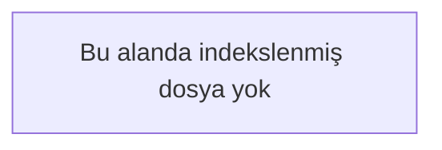

# Native ve Platform Wiki

Android/iOS/native shell, izin, manifest, bildirim, arka plan ve bridge yüzeyleri.

## Görselleştirme

## İndekslenen Dosyalar

| Dosya | Katman | Etiketler | Kanıt Durumu |
| --- | --- | --- | --- |
| yok | yok | yok | yok |

## Manuel Dokümantasyon Kontrol Listesi

- Gözlenen davranışı doğrudan dosya yolları ve sembollerle kaydet.
- Gözlenen olguları, çıkarımları ve bilinmeyenleri ayır.
- İlgili ekranları, servisleri, testleri ve Parton vaka gruplarını bağla.
- Kaynak yol kanıtlamıyorsa davranışı implement edilmiş gibi anlatma.
