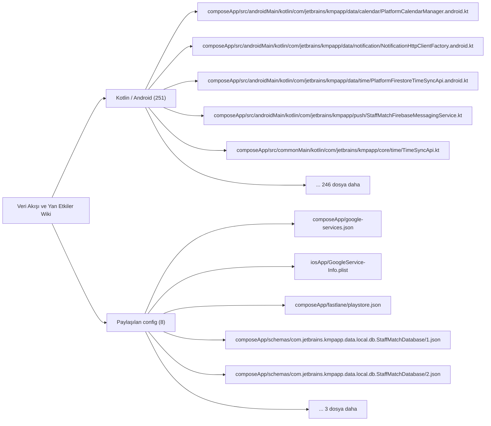
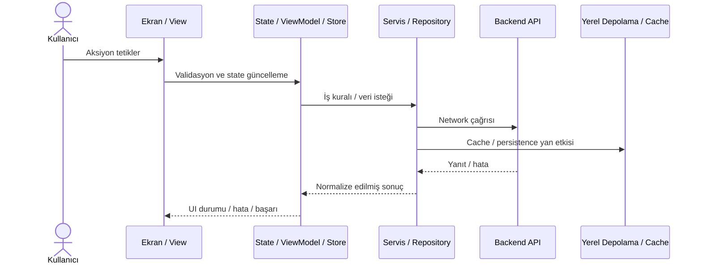

# Veri Akışı ve Yan Etkiler Wiki

Auth/session, network, persistence, bildirim, lokasyon, token ve arka plan yan etkileri burada izlenir.

## Görselleştirme

## İndekslenen Dosyalar

| Dosya | Katman | Etiketler | Kanıt Durumu |
| --- | --- | --- | --- |
| `composeApp/google-services.json` | `Paylaşılan config` | `mantık odağı` | Manuel doğrulanacak |
| `composeApp/src/androidMain/kotlin/com/jetbrains/kmpapp/data/calendar/PlatformCalendarManager.android.kt` | `Kotlin / Android` | `mantık odağı` | Manuel doğrulanacak |
| `composeApp/src/androidMain/kotlin/com/jetbrains/kmpapp/data/notification/NotificationHttpClientFactory.android.kt` | `Kotlin / Android` | `yok` | Manuel doğrulanacak |
| `composeApp/src/androidMain/kotlin/com/jetbrains/kmpapp/data/time/PlatformFirestoreTimeSyncApi.android.kt` | `Kotlin / Android` | `mantık odağı` | Manuel doğrulanacak |
| `composeApp/src/androidMain/kotlin/com/jetbrains/kmpapp/push/StaffMatchFirebaseMessagingService.kt` | `Kotlin / Android` | `mantık odağı` | Manuel doğrulanacak |
| `composeApp/src/commonMain/kotlin/com/jetbrains/kmpapp/core/time/TimeSyncApi.kt` | `Kotlin / Android` | `yok` | Manuel doğrulanacak |
| `composeApp/src/commonMain/kotlin/com/jetbrains/kmpapp/data/MuseumApi.kt` | `Kotlin / Android` | `yok` | Manuel doğrulanacak |
| `composeApp/src/commonMain/kotlin/com/jetbrains/kmpapp/data/MuseumRepository.kt` | `Kotlin / Android` | `mantık odağı` | Manuel doğrulanacak |
| `composeApp/src/commonMain/kotlin/com/jetbrains/kmpapp/data/activeshift/FirebaseActiveShiftRepository.kt` | `Kotlin / Android` | `mantık odağı` | Manuel doğrulanacak |
| `composeApp/src/commonMain/kotlin/com/jetbrains/kmpapp/data/applications/FirebaseJobApplicationsRepository.kt` | `Kotlin / Android` | `mantık odağı` | Manuel doğrulanacak |
| `composeApp/src/commonMain/kotlin/com/jetbrains/kmpapp/data/applications/JobApplicationsRepository.kt` | `Kotlin / Android` | `mantık odağı` | Manuel doğrulanacak |
| `composeApp/src/commonMain/kotlin/com/jetbrains/kmpapp/data/appspec/FirebaseAppSpecRepository.kt` | `Kotlin / Android` | `mantık odağı, test` | Manuel doğrulanacak |
| `composeApp/src/commonMain/kotlin/com/jetbrains/kmpapp/data/auth/FirebaseAuthRepository.kt` | `Kotlin / Android` | `mantık odağı` | Manuel doğrulanacak |
| `composeApp/src/commonMain/kotlin/com/jetbrains/kmpapp/data/auth/OtpAuthRepository.kt` | `Kotlin / Android` | `mantık odağı` | Manuel doğrulanacak |
| `composeApp/src/commonMain/kotlin/com/jetbrains/kmpapp/data/branch/FirebaseBranchRepository.kt` | `Kotlin / Android` | `mantık odağı` | Manuel doğrulanacak |
| `composeApp/src/commonMain/kotlin/com/jetbrains/kmpapp/data/calendar/PlatformCalendarManager.kt` | `Kotlin / Android` | `mantık odağı` | Manuel doğrulanacak |
| `composeApp/src/commonMain/kotlin/com/jetbrains/kmpapp/data/employee/FakeEmployeeOnboardingRepository.kt` | `Kotlin / Android` | `mantık odağı` | Manuel doğrulanacak |
| `composeApp/src/commonMain/kotlin/com/jetbrains/kmpapp/data/employer/DataStoreEmployerIndustryScopeRepository.kt` | `Kotlin / Android` | `mantık odağı` | Manuel doğrulanacak |
| `composeApp/src/commonMain/kotlin/com/jetbrains/kmpapp/data/employer/EmployerJobsRepository.kt` | `Kotlin / Android` | `mantık odağı` | Manuel doğrulanacak |
| `composeApp/src/commonMain/kotlin/com/jetbrains/kmpapp/data/employer/FakeEmployerOnboardingRepository.kt` | `Kotlin / Android` | `mantık odağı` | Manuel doğrulanacak |
| `composeApp/src/commonMain/kotlin/com/jetbrains/kmpapp/data/jobcatalog/FirebaseJobCatalogRepository.kt` | `Kotlin / Android` | `mantık odağı` | Manuel doğrulanacak |
| `composeApp/src/commonMain/kotlin/com/jetbrains/kmpapp/data/jobratings/JobRatingRepository.kt` | `Kotlin / Android` | `mantık odağı` | Manuel doğrulanacak |
| `composeApp/src/commonMain/kotlin/com/jetbrains/kmpapp/data/jobs/FakeJobsRepository.kt` | `Kotlin / Android` | `mantık odağı` | Manuel doğrulanacak |
| `composeApp/src/commonMain/kotlin/com/jetbrains/kmpapp/data/jobs/FirebaseJobsFeedRepository.kt` | `Kotlin / Android` | `mantık odağı` | Manuel doğrulanacak |
| `composeApp/src/commonMain/kotlin/com/jetbrains/kmpapp/data/jobs/FirestoreJobRepository.kt` | `Kotlin / Android` | `mantık odağı` | Manuel doğrulanacak |
| `composeApp/src/commonMain/kotlin/com/jetbrains/kmpapp/data/location/FirebaseLocationRepository.kt` | `Kotlin / Android` | `mantık odağı` | Manuel doğrulanacak |
| `composeApp/src/commonMain/kotlin/com/jetbrains/kmpapp/data/manager/FirebaseManagerRepository.kt` | `Kotlin / Android` | `mantık odağı` | Manuel doğrulanacak |
| `composeApp/src/commonMain/kotlin/com/jetbrains/kmpapp/data/manager/ManagerJobsRepository.kt` | `Kotlin / Android` | `mantık odağı` | Manuel doğrulanacak |
| `composeApp/src/commonMain/kotlin/com/jetbrains/kmpapp/data/notification/DefaultEmployeeNotificationRepository.kt` | `Kotlin / Android` | `mantık odağı` | Manuel doğrulanacak |
| `composeApp/src/commonMain/kotlin/com/jetbrains/kmpapp/data/notification/NotificationApiClient.kt` | `Kotlin / Android` | `yok` | Manuel doğrulanacak |
| `composeApp/src/commonMain/kotlin/com/jetbrains/kmpapp/data/notification/NotificationHttpClientFactory.kt` | `Kotlin / Android` | `yok` | Manuel doğrulanacak |
| `composeApp/src/commonMain/kotlin/com/jetbrains/kmpapp/data/pendingratings/PendingRatingsRepositoryFirestore.kt` | `Kotlin / Android` | `mantık odağı` | Manuel doğrulanacak |
| `composeApp/src/commonMain/kotlin/com/jetbrains/kmpapp/data/policy/PolicyAcceptanceRepositoryImpl.kt` | `Kotlin / Android` | `mantık odağı` | Manuel doğrulanacak |
| `composeApp/src/commonMain/kotlin/com/jetbrains/kmpapp/data/policy/RemoteConfigRepositoryImpl.kt` | `Kotlin / Android` | `mantık odağı` | Manuel doğrulanacak |
| `composeApp/src/commonMain/kotlin/com/jetbrains/kmpapp/data/push/FirebaseFcmTokenRepository.kt` | `Kotlin / Android` | `mantık odağı` | Manuel doğrulanacak |
| `composeApp/src/commonMain/kotlin/com/jetbrains/kmpapp/data/revenue/EmployeeRevenueRepository.kt` | `Kotlin / Android` | `mantık odağı` | Manuel doğrulanacak |
| `composeApp/src/commonMain/kotlin/com/jetbrains/kmpapp/data/session/DataStoreSessionRepository.kt` | `Kotlin / Android` | `mantık odağı` | Manuel doğrulanacak |
| `composeApp/src/commonMain/kotlin/com/jetbrains/kmpapp/data/tax/FirestoreIndustryBranchTaxVerificationRepository.kt` | `Kotlin / Android` | `mantık odağı` | Manuel doğrulanacak |
| `composeApp/src/commonMain/kotlin/com/jetbrains/kmpapp/data/theme/DataStoreThemePreferenceRepository.kt` | `Kotlin / Android` | `mantık odağı` | Manuel doğrulanacak |
| `composeApp/src/commonMain/kotlin/com/jetbrains/kmpapp/data/tickets/FirestoreTicketRepository.kt` | `Kotlin / Android` | `mantık odağı` | Manuel doğrulanacak |
| `composeApp/src/commonMain/kotlin/com/jetbrains/kmpapp/data/tickets/TicketRepository.kt` | `Kotlin / Android` | `mantık odağı` | Manuel doğrulanacak |
| `composeApp/src/commonMain/kotlin/com/jetbrains/kmpapp/data/user/FirebaseUserProfileRepository.kt` | `Kotlin / Android` | `mantık odağı` | Manuel doğrulanacak |
| `composeApp/src/commonMain/kotlin/com/jetbrains/kmpapp/data/user/ManagerCodeAllocator.kt` | `Kotlin / Android` | `mantık odağı` | Manuel doğrulanacak |
| `composeApp/src/commonMain/kotlin/com/jetbrains/kmpapp/data/user/ManagerPhoneNumberMigration.kt` | `Kotlin / Android` | `mantık odağı` | Manuel doğrulanacak |
| `composeApp/src/commonMain/kotlin/com/jetbrains/kmpapp/domain/activeshift/ActiveShiftRepository.kt` | `Kotlin / Android` | `mantık odağı` | Manuel doğrulanacak |
| `composeApp/src/commonMain/kotlin/com/jetbrains/kmpapp/domain/appspec/AppSpecRepository.kt` | `Kotlin / Android` | `mantık odağı, test` | Manuel doğrulanacak |
| `composeApp/src/commonMain/kotlin/com/jetbrains/kmpapp/domain/auth/AuthRepository.kt` | `Kotlin / Android` | `mantık odağı` | Manuel doğrulanacak |
| `composeApp/src/commonMain/kotlin/com/jetbrains/kmpapp/domain/branch/BranchManagerNormalization.kt` | `Kotlin / Android` | `mantık odağı` | Manuel doğrulanacak |
| `composeApp/src/commonMain/kotlin/com/jetbrains/kmpapp/domain/branch/BranchRepository.kt` | `Kotlin / Android` | `mantık odağı` | Manuel doğrulanacak |
| `composeApp/src/commonMain/kotlin/com/jetbrains/kmpapp/domain/employee/EmployeeOnboardingRepository.kt` | `Kotlin / Android` | `mantık odağı` | Manuel doğrulanacak |
| `composeApp/src/commonMain/kotlin/com/jetbrains/kmpapp/domain/employee/EmployeeWorkStatsRepository.kt` | `Kotlin / Android` | `mantık odağı` | Manuel doğrulanacak |
| `composeApp/src/commonMain/kotlin/com/jetbrains/kmpapp/domain/employer/EmployerIndustryScopeRepository.kt` | `Kotlin / Android` | `mantık odağı` | Manuel doğrulanacak |
| `composeApp/src/commonMain/kotlin/com/jetbrains/kmpapp/domain/employer/EmployerOnboardingRepository.kt` | `Kotlin / Android` | `mantık odağı` | Manuel doğrulanacak |
| `composeApp/src/commonMain/kotlin/com/jetbrains/kmpapp/domain/jobcatalog/JobCatalogRepository.kt` | `Kotlin / Android` | `mantık odağı` | Manuel doğrulanacak |
| `composeApp/src/commonMain/kotlin/com/jetbrains/kmpapp/domain/jobs/JobRepository.kt` | `Kotlin / Android` | `mantık odağı` | Manuel doğrulanacak |
| `composeApp/src/commonMain/kotlin/com/jetbrains/kmpapp/domain/jobs/JobsRepository.kt` | `Kotlin / Android` | `mantık odağı` | Manuel doğrulanacak |
| `composeApp/src/commonMain/kotlin/com/jetbrains/kmpapp/domain/location/LocationRepository.kt` | `Kotlin / Android` | `mantık odağı` | Manuel doğrulanacak |
| `composeApp/src/commonMain/kotlin/com/jetbrains/kmpapp/domain/manager/ManagerRepository.kt` | `Kotlin / Android` | `mantık odağı` | Manuel doğrulanacak |
| `composeApp/src/commonMain/kotlin/com/jetbrains/kmpapp/domain/model/ManagerDoc.kt` | `Kotlin / Android` | `mantık odağı` | Manuel doğrulanacak |
| `composeApp/src/commonMain/kotlin/com/jetbrains/kmpapp/domain/notification/EmployeeNotificationRepository.kt` | `Kotlin / Android` | `mantık odağı` | Manuel doğrulanacak |
| `composeApp/src/commonMain/kotlin/com/jetbrains/kmpapp/domain/policy/PolicyAcceptanceRepository.kt` | `Kotlin / Android` | `mantık odağı` | Manuel doğrulanacak |
| `composeApp/src/commonMain/kotlin/com/jetbrains/kmpapp/domain/policy/RemoteConfigRepository.kt` | `Kotlin / Android` | `mantık odağı` | Manuel doğrulanacak |
| `composeApp/src/commonMain/kotlin/com/jetbrains/kmpapp/domain/push/FcmTokenRepository.kt` | `Kotlin / Android` | `mantık odağı` | Manuel doğrulanacak |
| `composeApp/src/commonMain/kotlin/com/jetbrains/kmpapp/domain/session/SessionRepository.kt` | `Kotlin / Android` | `mantık odağı` | Manuel doğrulanacak |
| `composeApp/src/commonMain/kotlin/com/jetbrains/kmpapp/domain/tax/IndustryBranchTaxVerificationRepository.kt` | `Kotlin / Android` | `mantık odağı` | Manuel doğrulanacak |
| `composeApp/src/commonMain/kotlin/com/jetbrains/kmpapp/domain/theme/ThemePreferenceRepository.kt` | `Kotlin / Android` | `mantık odağı` | Manuel doğrulanacak |
| `composeApp/src/commonMain/kotlin/com/jetbrains/kmpapp/domain/usecase/AcceptPolicyUseCase.kt` | `Kotlin / Android` | `mantık odağı` | Manuel doğrulanacak |
| `composeApp/src/commonMain/kotlin/com/jetbrains/kmpapp/domain/usecase/CompleteEmployeeOnboardingUseCase.kt` | `Kotlin / Android` | `mantık odağı` | Manuel doğrulanacak |
| `composeApp/src/commonMain/kotlin/com/jetbrains/kmpapp/domain/usecase/CompleteEmployerOnboardingUseCase.kt` | `Kotlin / Android` | `mantık odağı` | Manuel doğrulanacak |
| `composeApp/src/commonMain/kotlin/com/jetbrains/kmpapp/domain/usecase/FetchPoliciesUseCase.kt` | `Kotlin / Android` | `mantık odağı` | Manuel doğrulanacak |
| `composeApp/src/commonMain/kotlin/com/jetbrains/kmpapp/domain/usecase/SyncFcmTokenUseCase.kt` | `Kotlin / Android` | `mantık odağı` | Manuel doğrulanacak |
| `composeApp/src/commonMain/kotlin/com/jetbrains/kmpapp/domain/usecase/notification/MarkAllEmployeeNotificationsReadUseCase.kt` | `Kotlin / Android` | `mantık odağı` | Manuel doğrulanacak |
| `composeApp/src/commonMain/kotlin/com/jetbrains/kmpapp/domain/usecase/notification/MarkEmployeeNotificationReadUseCase.kt` | `Kotlin / Android` | `mantık odağı` | Manuel doğrulanacak |
| `composeApp/src/commonMain/kotlin/com/jetbrains/kmpapp/domain/usecase/notification/ObserveEmployeeNotificationsUseCase.kt` | `Kotlin / Android` | `mantık odağı` | Manuel doğrulanacak |
| `composeApp/src/commonMain/kotlin/com/jetbrains/kmpapp/domain/usecase/notification/SaveEmployeeNotificationUseCase.kt` | `Kotlin / Android` | `mantık odağı` | Manuel doğrulanacak |
| `composeApp/src/commonMain/kotlin/com/jetbrains/kmpapp/domain/user/EnsureRoleDocumentUseCase.kt` | `Kotlin / Android` | `mantık odağı` | Manuel doğrulanacak |
| `composeApp/src/commonMain/kotlin/com/jetbrains/kmpapp/domain/user/ManagerCode.kt` | `Kotlin / Android` | `mantık odağı` | Manuel doğrulanacak |
| `composeApp/src/commonMain/kotlin/com/jetbrains/kmpapp/domain/user/UserProfileRepository.kt` | `Kotlin / Android` | `mantık odağı` | Manuel doğrulanacak |
| `composeApp/src/commonMain/kotlin/com/jetbrains/kmpapp/presentation/manager/ManagerHomeViewModel.kt` | `Kotlin / Android` | `mantık odağı` | Manuel doğrulanacak |
| `composeApp/src/commonMain/kotlin/com/jetbrains/kmpapp/presentation/manager/ManagerJobApplicantsViewModel.kt` | `Kotlin / Android` | `mantık odağı` | Manuel doğrulanacak |
| `composeApp/src/commonMain/kotlin/com/jetbrains/kmpapp/presentation/manager/ManagerJobFormViewModel.kt` | `Kotlin / Android` | `mantık odağı` | Manuel doğrulanacak |
| `composeApp/src/commonMain/kotlin/com/jetbrains/kmpapp/presentation/manager/ManagerProfileViewModel.kt` | `Kotlin / Android` | `mantık odağı` | Manuel doğrulanacak |
| `composeApp/src/commonMain/kotlin/com/jetbrains/kmpapp/ui/navigation/ManagerGraph.kt` | `Kotlin / Android` | `mantık odağı, navigasyon` | Manuel doğrulanacak |
| `composeApp/src/commonMain/kotlin/com/jetbrains/kmpapp/ui/screens/manager/ManagerHomeScreen.kt` | `Kotlin / Android` | `mantık odağı, ekran` | Manuel doğrulanacak |
| `composeApp/src/commonMain/kotlin/com/jetbrains/kmpapp/ui/screens/manager/ManagerJobsScreen.kt` | `Kotlin / Android` | `mantık odağı, ekran` | Manuel doğrulanacak |
| `composeApp/src/commonMain/kotlin/com/jetbrains/kmpapp/ui/screens/manager/ManagerMainScaffold.kt` | `Kotlin / Android` | `mantık odağı` | Manuel doğrulanacak |
| `composeApp/src/commonMain/kotlin/com/jetbrains/kmpapp/ui/screens/manager/ManagerNotificationsScreen.kt` | `Kotlin / Android` | `mantık odağı, ekran` | Manuel doğrulanacak |
| `composeApp/src/commonMain/kotlin/com/jetbrains/kmpapp/ui/screens/manager/ManagerProfileScreen.kt` | `Kotlin / Android` | `mantık odağı, ekran` | Manuel doğrulanacak |
| `composeApp/src/commonTest/kotlin/com/jetbrains/kmpapp/data/employer/EmployerJobsRepositoryBucketsTest.kt` | `Kotlin / Android` | `mantık odağı, test` | Manuel doğrulanacak |
| `composeApp/src/commonTest/kotlin/com/jetbrains/kmpapp/data/jobs/FirebaseJobsFeedRepositoryBucketsTest.kt` | `Kotlin / Android` | `mantık odağı, test` | Manuel doğrulanacak |
| `composeApp/src/commonTest/kotlin/com/jetbrains/kmpapp/data/policy/RemoteConfigRepositoryImplTest.kt` | `Kotlin / Android` | `mantık odağı, test` | Manuel doğrulanacak |
| `composeApp/src/commonTest/kotlin/com/jetbrains/kmpapp/domain/usecase/SyncFcmTokenUseCaseTest.kt` | `Kotlin / Android` | `mantık odağı, test` | Manuel doğrulanacak |
| `composeApp/src/commonTest/kotlin/com/jetbrains/kmpapp/domain/usecase/notification/SaveEmployeeNotificationUseCaseTest.kt` | `Kotlin / Android` | `mantık odağı, test` | Manuel doğrulanacak |
| `composeApp/src/commonTest/kotlin/com/jetbrains/kmpapp/domain/user/EnsureRoleDocumentUseCaseTest.kt` | `Kotlin / Android` | `mantık odağı, test` | Manuel doğrulanacak |
| `composeApp/src/iosMain/kotlin/com/jetbrains/kmpapp/data/calendar/PlatformCalendarManager.ios.kt` | `Kotlin / Android` | `mantık odağı` | Manuel doğrulanacak |
| `composeApp/src/iosMain/kotlin/com/jetbrains/kmpapp/data/notification/NotificationHttpClientFactory.ios.kt` | `Kotlin / Android` | `yok` | Manuel doğrulanacak |
| `composeApp/src/iosMain/kotlin/com/jetbrains/kmpapp/data/time/PlatformFirestoreTimeSyncApi.ios.kt` | `Kotlin / Android` | `mantık odağı` | Manuel doğrulanacak |
| `iosApp/GoogleService-Info.plist` | `Paylaşılan config` | `mantık odağı` | Manuel doğrulanacak |
| `composeApp/fastlane/playstore.json` | `Paylaşılan config` | `mantık odağı` | Manuel doğrulanacak |
| `composeApp/schemas/com.jetbrains.kmpapp.data.local.db.StaffMatchDatabase/1.json` | `Paylaşılan config` | `yok` | Manuel doğrulanacak |
| `composeApp/schemas/com.jetbrains.kmpapp.data.local.db.StaffMatchDatabase/2.json` | `Paylaşılan config` | `yok` | Manuel doğrulanacak |
| `composeApp/schemas/com.jetbrains.kmpapp.data.local.db.StaffMatchDatabase/3.json` | `Paylaşılan config` | `yok` | Manuel doğrulanacak |
| `composeApp/schemas/com.jetbrains.kmpapp.data.local.db.StaffMatchDatabase/4.json` | `Paylaşılan config` | `yok` | Manuel doğrulanacak |
| `composeApp/schemas/com.jetbrains.kmpapp.data.local.db.StaffMatchDatabase/5.json` | `Paylaşılan config` | `yok` | Manuel doğrulanacak |
| `composeApp/src/androidMain/kotlin/com/jetbrains/kmpapp/core/time/FirestoreEpochParser.android.kt` | `Kotlin / Android` | `mantık odağı` | Manuel doğrulanacak |
| `composeApp/src/androidMain/kotlin/com/jetbrains/kmpapp/data/applications/PlatformFirestoreJobApplicationsStore.android.kt` | `Kotlin / Android` | `mantık odağı` | Manuel doğrulanacak |
| `composeApp/src/androidMain/kotlin/com/jetbrains/kmpapp/data/appspec/PlatformAppSpecStore.android.kt` | `Kotlin / Android` | `mantık odağı, test` | Manuel doğrulanacak |
| `composeApp/src/androidMain/kotlin/com/jetbrains/kmpapp/data/branch/PlatformFirestoreBranchStore.android.kt` | `Kotlin / Android` | `mantık odağı` | Manuel doğrulanacak |
| `composeApp/src/androidMain/kotlin/com/jetbrains/kmpapp/data/datastore/createDataStore.android.kt` | `Kotlin / Android` | `mantık odağı` | Manuel doğrulanacak |
| `composeApp/src/androidMain/kotlin/com/jetbrains/kmpapp/data/employer/PlatformFirestoreEmployerJobsStore.android.kt` | `Kotlin / Android` | `mantık odağı` | Manuel doğrulanacak |
| `composeApp/src/androidMain/kotlin/com/jetbrains/kmpapp/data/jobcatalog/PlatformFirestoreJobCatalogStore.android.kt` | `Kotlin / Android` | `mantık odağı` | Manuel doğrulanacak |
| `composeApp/src/androidMain/kotlin/com/jetbrains/kmpapp/data/jobratings/PlatformFirestoreJobRatingStore.kt` | `Kotlin / Android` | `mantık odağı` | Manuel doğrulanacak |
| `composeApp/src/androidMain/kotlin/com/jetbrains/kmpapp/data/jobs/PlatformFirestoreJobCompletionStore.kt` | `Kotlin / Android` | `mantık odağı` | Manuel doğrulanacak |
| `composeApp/src/androidMain/kotlin/com/jetbrains/kmpapp/data/jobs/PlatformFirestoreJobsFeedStore.android.kt` | `Kotlin / Android` | `mantık odağı` | Manuel doğrulanacak |
| `composeApp/src/androidMain/kotlin/com/jetbrains/kmpapp/data/local/db/DatabaseBuilder.android.kt` | `Kotlin / Android` | `yok` | Manuel doğrulanacak |
| `composeApp/src/androidMain/kotlin/com/jetbrains/kmpapp/data/location/PlatformFirestoreLocationStore.android.kt` | `Kotlin / Android` | `mantık odağı` | Manuel doğrulanacak |
| `composeApp/src/androidMain/kotlin/com/jetbrains/kmpapp/data/pendingratings/PlatformFirestorePendingRatingsStore.kt` | `Kotlin / Android` | `mantık odağı` | Manuel doğrulanacak |
| `composeApp/src/androidMain/kotlin/com/jetbrains/kmpapp/data/push/PlatformPushTokenStore.android.kt` | `Kotlin / Android` | `mantık odağı` | Manuel doğrulanacak |
| `composeApp/src/androidMain/kotlin/com/jetbrains/kmpapp/data/ratings/PlatformFirestoreBranchRatingStore.kt` | `Kotlin / Android` | `mantık odağı` | Manuel doğrulanacak |
| `composeApp/src/androidMain/kotlin/com/jetbrains/kmpapp/data/ratings/PlatformFirestoreEmployeeRatingStore.kt` | `Kotlin / Android` | `mantık odağı` | Manuel doğrulanacak |

- Tabloda gösterilmeyen ek indekslenmiş dosya: `139`

## Uçtan Uca Veri Akışı Görselleştirmesi

## İzlenecek Kritik Akışlar

- Kullanıcı aksiyonu -> validasyon -> state güncelleme -> servis/repository -> backend/cache -> UI sonucu.
- Bildirim, token, lokasyon, analytics ve background job gibi yan etkiler ayrı ayrı kanıtlanmalıdır.

## Manuel Dokümantasyon Kontrol Listesi

- Gözlenen davranışı doğrudan dosya yolları ve sembollerle kaydet.
- Gözlenen olguları, çıkarımları ve bilinmeyenleri ayır.
- İlgili ekranları, servisleri, testleri ve Parton vaka gruplarını bağla.
- Kaynak yol kanıtlamıyorsa davranışı implement edilmiş gibi anlatma.
