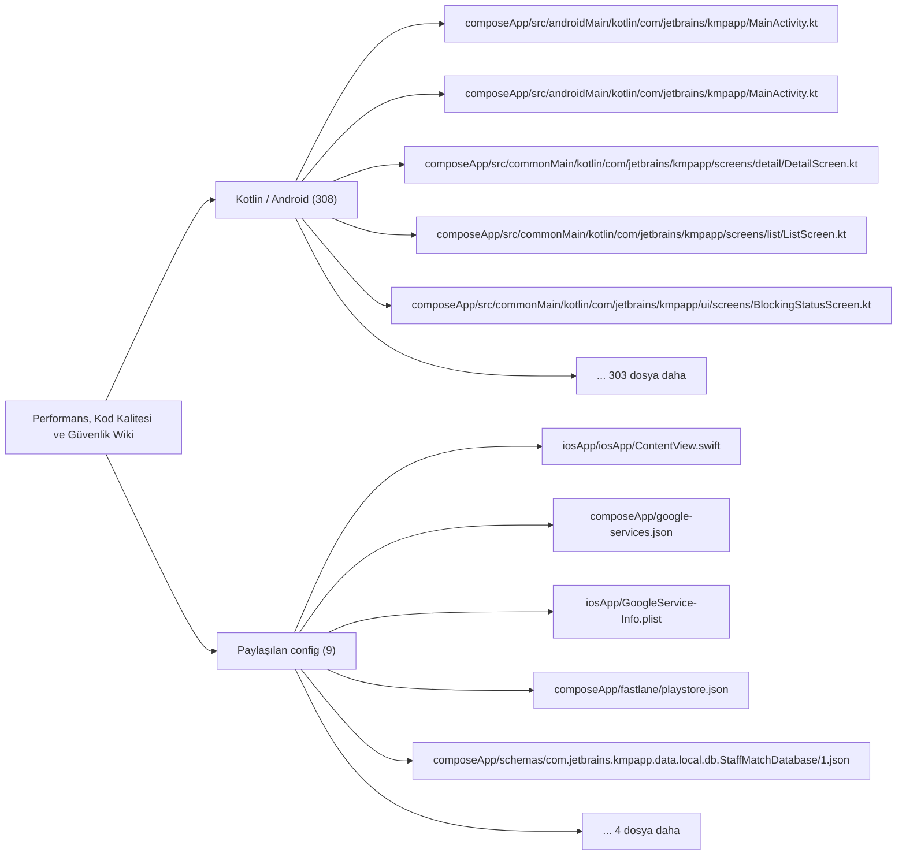
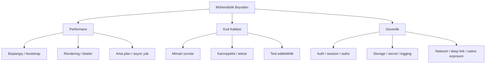

# Performans, Kod Kalitesi ve Güvenlik Wiki

Zorunlu mühendislik boyutları için kanıt, risk ve ana kod alanları bu sayfada haritalanır.

## Görselleştirme

## İndekslenen Dosyalar

| Dosya | Katman | Etiketler | Kanıt Durumu |
| --- | --- | --- | --- |
| `composeApp/src/androidMain/kotlin/com/jetbrains/kmpapp/MainActivity.kt` | `Kotlin / Android` | `giriş noktası, ekran` | Manuel doğrulanacak |
| `composeApp/src/androidMain/kotlin/com/jetbrains/kmpapp/MainActivity.kt` | `Kotlin / Android` | `giriş noktası, ekran` | Manuel doğrulanacak |
| `composeApp/src/commonMain/kotlin/com/jetbrains/kmpapp/screens/detail/DetailScreen.kt` | `Kotlin / Android` | `ekran` | Manuel doğrulanacak |
| `composeApp/src/commonMain/kotlin/com/jetbrains/kmpapp/screens/list/ListScreen.kt` | `Kotlin / Android` | `ekran` | Manuel doğrulanacak |
| `composeApp/src/commonMain/kotlin/com/jetbrains/kmpapp/ui/screens/BlockingStatusScreen.kt` | `Kotlin / Android` | `ekran` | Manuel doğrulanacak |
| `composeApp/src/commonMain/kotlin/com/jetbrains/kmpapp/ui/screens/MaintenanceScreen.kt` | `Kotlin / Android` | `ekran` | Manuel doğrulanacak |
| `composeApp/src/commonMain/kotlin/com/jetbrains/kmpapp/ui/screens/RestrictionScreen.kt` | `Kotlin / Android` | `ekran` | Manuel doğrulanacak |
| `composeApp/src/commonMain/kotlin/com/jetbrains/kmpapp/ui/screens/auth/AppTutorialScreen.kt` | `Kotlin / Android` | `ekran` | Manuel doğrulanacak |
| `composeApp/src/commonMain/kotlin/com/jetbrains/kmpapp/ui/screens/auth/LoginScreen.kt` | `Kotlin / Android` | `ekran` | Manuel doğrulanacak |
| `composeApp/src/commonMain/kotlin/com/jetbrains/kmpapp/ui/screens/auth/OtpScreen.kt` | `Kotlin / Android` | `ekran` | Manuel doğrulanacak |
| `composeApp/src/commonMain/kotlin/com/jetbrains/kmpapp/ui/screens/auth/PhoneEntryScreen.kt` | `Kotlin / Android` | `ekran` | Manuel doğrulanacak |
| `composeApp/src/commonMain/kotlin/com/jetbrains/kmpapp/ui/screens/auth/RoleSelectScreen.kt` | `Kotlin / Android` | `ekran` | Manuel doğrulanacak |
| `composeApp/src/commonMain/kotlin/com/jetbrains/kmpapp/ui/screens/auth/SignInScreen.kt` | `Kotlin / Android` | `ekran` | Manuel doğrulanacak |
| `composeApp/src/commonMain/kotlin/com/jetbrains/kmpapp/ui/screens/auth/SignUpScreen.kt` | `Kotlin / Android` | `ekran` | Manuel doğrulanacak |
| `composeApp/src/commonMain/kotlin/com/jetbrains/kmpapp/ui/screens/employee/EmployeeAvailabilityScreen.kt` | `Kotlin / Android` | `ekran` | Manuel doğrulanacak |
| `composeApp/src/commonMain/kotlin/com/jetbrains/kmpapp/ui/screens/employee/EmployeeCalendarScreen.kt` | `Kotlin / Android` | `ekran` | Manuel doğrulanacak |
| `composeApp/src/commonMain/kotlin/com/jetbrains/kmpapp/ui/screens/employee/EmployeeCheckInScreen.kt` | `Kotlin / Android` | `ekran` | Manuel doğrulanacak |
| `composeApp/src/commonMain/kotlin/com/jetbrains/kmpapp/ui/screens/employee/EmployeeCheckOutScreen.kt` | `Kotlin / Android` | `ekran` | Manuel doğrulanacak |
| `composeApp/src/commonMain/kotlin/com/jetbrains/kmpapp/ui/screens/employee/EmployeeHomeScreen.kt` | `Kotlin / Android` | `ekran` | Manuel doğrulanacak |
| `composeApp/src/commonMain/kotlin/com/jetbrains/kmpapp/ui/screens/employee/EmployeeInShiftActionsScreen.kt` | `Kotlin / Android` | `ekran` | Manuel doğrulanacak |
| `composeApp/src/commonMain/kotlin/com/jetbrains/kmpapp/ui/screens/employee/EmployeeJobDetailScreen.kt` | `Kotlin / Android` | `ekran` | Manuel doğrulanacak |
| `composeApp/src/commonMain/kotlin/com/jetbrains/kmpapp/ui/screens/employee/EmployeeJobsScreen.kt` | `Kotlin / Android` | `ekran` | Manuel doğrulanacak |
| `composeApp/src/commonMain/kotlin/com/jetbrains/kmpapp/ui/screens/employee/EmployeeProfileScreen.kt` | `Kotlin / Android` | `ekran` | Manuel doğrulanacak |
| `composeApp/src/commonMain/kotlin/com/jetbrains/kmpapp/ui/screens/employee/EmployeeProfileSetupScreen.kt` | `Kotlin / Android` | `ekran` | Manuel doğrulanacak |
| `composeApp/src/commonMain/kotlin/com/jetbrains/kmpapp/ui/screens/employee/EmployeePushPrefsScreen.kt` | `Kotlin / Android` | `ekran` | Manuel doğrulanacak |
| `composeApp/src/commonMain/kotlin/com/jetbrains/kmpapp/ui/screens/employee/EmployeeWorkPrepScreen.kt` | `Kotlin / Android` | `ekran` | Manuel doğrulanacak |
| `composeApp/src/commonMain/kotlin/com/jetbrains/kmpapp/ui/screens/employee/revenue/EmployeeRevenueScreen.kt` | `Kotlin / Android` | `ekran` | Manuel doğrulanacak |
| `composeApp/src/commonMain/kotlin/com/jetbrains/kmpapp/ui/screens/employer/EmployerBranchCreateEditScreen.kt` | `Kotlin / Android` | `ekran` | Manuel doğrulanacak |
| `composeApp/src/commonMain/kotlin/com/jetbrains/kmpapp/ui/screens/employer/EmployerBranchListScreen.kt` | `Kotlin / Android` | `ekran` | Manuel doğrulanacak |
| `composeApp/src/commonMain/kotlin/com/jetbrains/kmpapp/ui/screens/employer/EmployerBranchScreen.kt` | `Kotlin / Android` | `ekran` | Manuel doğrulanacak |
| `composeApp/src/commonMain/kotlin/com/jetbrains/kmpapp/ui/screens/employer/EmployerBusinessScreen.kt` | `Kotlin / Android` | `ekran` | Manuel doğrulanacak |
| `composeApp/src/commonMain/kotlin/com/jetbrains/kmpapp/ui/screens/employer/EmployerChecklistScreen.kt` | `Kotlin / Android` | `ekran` | Manuel doğrulanacak |
| `composeApp/src/commonMain/kotlin/com/jetbrains/kmpapp/ui/screens/employer/EmployerDashboardScreen.kt` | `Kotlin / Android` | `ekran` | Manuel doğrulanacak |
| `composeApp/src/commonMain/kotlin/com/jetbrains/kmpapp/ui/screens/employer/EmployerHomeScreen.kt` | `Kotlin / Android` | `ekran` | Manuel doğrulanacak |
| `composeApp/src/commonMain/kotlin/com/jetbrains/kmpapp/ui/screens/employer/EmployerIndustryManagementScreen.kt` | `Kotlin / Android` | `ekran` | Manuel doğrulanacak |
| `composeApp/src/commonMain/kotlin/com/jetbrains/kmpapp/ui/screens/employer/EmployerJobApplicantsScreen.kt` | `Kotlin / Android` | `ekran` | Manuel doğrulanacak |
| `composeApp/src/commonMain/kotlin/com/jetbrains/kmpapp/ui/screens/employer/EmployerJobFormScreen.kt` | `Kotlin / Android` | `ekran` | Manuel doğrulanacak |
| `composeApp/src/commonMain/kotlin/com/jetbrains/kmpapp/ui/screens/employer/EmployerJobsScreen.kt` | `Kotlin / Android` | `ekran` | Manuel doğrulanacak |
| `composeApp/src/commonMain/kotlin/com/jetbrains/kmpapp/ui/screens/employer/EmployerNotificationsScreen.kt` | `Kotlin / Android` | `ekran` | Manuel doğrulanacak |
| `composeApp/src/commonMain/kotlin/com/jetbrains/kmpapp/ui/screens/employer/EmployerOpsSettingsScreen.kt` | `Kotlin / Android` | `ekran` | Manuel doğrulanacak |
| `composeApp/src/commonMain/kotlin/com/jetbrains/kmpapp/ui/screens/employer/EmployerProfileScreen.kt` | `Kotlin / Android` | `ekran` | Manuel doğrulanacak |
| `composeApp/src/commonMain/kotlin/com/jetbrains/kmpapp/ui/screens/employer/createjob/CreateJobTabScreen.kt` | `Kotlin / Android` | `ekran` | Manuel doğrulanacak |
| `composeApp/src/commonMain/kotlin/com/jetbrains/kmpapp/ui/screens/employer/createjob/step1/Step1PositionsScreen.kt` | `Kotlin / Android` | `ekran` | Manuel doğrulanacak |
| `composeApp/src/commonMain/kotlin/com/jetbrains/kmpapp/ui/screens/employer/createjob/step2/Step2DetailsScreen.kt` | `Kotlin / Android` | `ekran` | Manuel doğrulanacak |
| `composeApp/src/commonMain/kotlin/com/jetbrains/kmpapp/ui/screens/employer/createjob/step3/Step3SummaryScreen.kt` | `Kotlin / Android` | `ekran` | Manuel doğrulanacak |
| `composeApp/src/commonMain/kotlin/com/jetbrains/kmpapp/ui/screens/employer/jobdetail/EmployerJobDetailScreen.kt` | `Kotlin / Android` | `ekran` | Manuel doğrulanacak |
| `composeApp/src/commonMain/kotlin/com/jetbrains/kmpapp/ui/screens/manager/ManagerHomeScreen.kt` | `Kotlin / Android` | `mantık odağı, ekran` | Manuel doğrulanacak |
| `composeApp/src/commonMain/kotlin/com/jetbrains/kmpapp/ui/screens/manager/ManagerJobsScreen.kt` | `Kotlin / Android` | `mantık odağı, ekran` | Manuel doğrulanacak |
| `composeApp/src/commonMain/kotlin/com/jetbrains/kmpapp/ui/screens/manager/ManagerNotificationsScreen.kt` | `Kotlin / Android` | `mantık odağı, ekran` | Manuel doğrulanacak |
| `composeApp/src/commonMain/kotlin/com/jetbrains/kmpapp/ui/screens/manager/ManagerProfileScreen.kt` | `Kotlin / Android` | `mantık odağı, ekran` | Manuel doğrulanacak |
| `composeApp/src/commonMain/kotlin/com/jetbrains/kmpapp/ui/screens/profile/ProfileOverviewScreen.kt` | `Kotlin / Android` | `ekran` | Manuel doğrulanacak |
| `composeApp/src/commonMain/kotlin/com/jetbrains/kmpapp/ui/screens/profile/ProfileSettingsScreen.kt` | `Kotlin / Android` | `ekran` | Manuel doğrulanacak |
| `composeApp/src/commonMain/kotlin/com/jetbrains/kmpapp/ui/screens/shared/JobProcessDetailScreen.kt` | `Kotlin / Android` | `ekran` | Manuel doğrulanacak |
| `iosApp/iosApp/ContentView.swift` | `Paylaşılan config` | `ekran` | Manuel doğrulanacak |
| `composeApp/google-services.json` | `Paylaşılan config` | `mantık odağı` | Manuel doğrulanacak |
| `composeApp/src/androidMain/kotlin/com/jetbrains/kmpapp/data/calendar/PlatformCalendarManager.android.kt` | `Kotlin / Android` | `mantık odağı` | Manuel doğrulanacak |
| `composeApp/src/androidMain/kotlin/com/jetbrains/kmpapp/data/notification/NotificationHttpClientFactory.android.kt` | `Kotlin / Android` | `yok` | Manuel doğrulanacak |
| `composeApp/src/androidMain/kotlin/com/jetbrains/kmpapp/data/time/PlatformFirestoreTimeSyncApi.android.kt` | `Kotlin / Android` | `mantık odağı` | Manuel doğrulanacak |
| `composeApp/src/androidMain/kotlin/com/jetbrains/kmpapp/push/StaffMatchFirebaseMessagingService.kt` | `Kotlin / Android` | `mantık odağı` | Manuel doğrulanacak |
| `composeApp/src/commonMain/kotlin/com/jetbrains/kmpapp/core/time/TimeSyncApi.kt` | `Kotlin / Android` | `yok` | Manuel doğrulanacak |
| `composeApp/src/commonMain/kotlin/com/jetbrains/kmpapp/data/MuseumApi.kt` | `Kotlin / Android` | `yok` | Manuel doğrulanacak |
| `composeApp/src/commonMain/kotlin/com/jetbrains/kmpapp/data/MuseumRepository.kt` | `Kotlin / Android` | `mantık odağı` | Manuel doğrulanacak |
| `composeApp/src/commonMain/kotlin/com/jetbrains/kmpapp/data/activeshift/FirebaseActiveShiftRepository.kt` | `Kotlin / Android` | `mantık odağı` | Manuel doğrulanacak |
| `composeApp/src/commonMain/kotlin/com/jetbrains/kmpapp/data/applications/FirebaseJobApplicationsRepository.kt` | `Kotlin / Android` | `mantık odağı` | Manuel doğrulanacak |
| `composeApp/src/commonMain/kotlin/com/jetbrains/kmpapp/data/applications/JobApplicationsRepository.kt` | `Kotlin / Android` | `mantık odağı` | Manuel doğrulanacak |
| `composeApp/src/commonMain/kotlin/com/jetbrains/kmpapp/data/appspec/FirebaseAppSpecRepository.kt` | `Kotlin / Android` | `mantık odağı, test` | Manuel doğrulanacak |
| `composeApp/src/commonMain/kotlin/com/jetbrains/kmpapp/data/auth/FirebaseAuthRepository.kt` | `Kotlin / Android` | `mantık odağı` | Manuel doğrulanacak |
| `composeApp/src/commonMain/kotlin/com/jetbrains/kmpapp/data/auth/OtpAuthRepository.kt` | `Kotlin / Android` | `mantık odağı` | Manuel doğrulanacak |
| `composeApp/src/commonMain/kotlin/com/jetbrains/kmpapp/data/branch/FirebaseBranchRepository.kt` | `Kotlin / Android` | `mantık odağı` | Manuel doğrulanacak |
| `composeApp/src/commonMain/kotlin/com/jetbrains/kmpapp/data/calendar/PlatformCalendarManager.kt` | `Kotlin / Android` | `mantık odağı` | Manuel doğrulanacak |
| `composeApp/src/commonMain/kotlin/com/jetbrains/kmpapp/data/employee/FakeEmployeeOnboardingRepository.kt` | `Kotlin / Android` | `mantık odağı` | Manuel doğrulanacak |
| `composeApp/src/commonMain/kotlin/com/jetbrains/kmpapp/data/employer/DataStoreEmployerIndustryScopeRepository.kt` | `Kotlin / Android` | `mantık odağı` | Manuel doğrulanacak |
| `composeApp/src/commonMain/kotlin/com/jetbrains/kmpapp/data/employer/EmployerJobsRepository.kt` | `Kotlin / Android` | `mantık odağı` | Manuel doğrulanacak |
| `composeApp/src/commonMain/kotlin/com/jetbrains/kmpapp/data/employer/FakeEmployerOnboardingRepository.kt` | `Kotlin / Android` | `mantık odağı` | Manuel doğrulanacak |
| `composeApp/src/commonMain/kotlin/com/jetbrains/kmpapp/data/jobcatalog/FirebaseJobCatalogRepository.kt` | `Kotlin / Android` | `mantık odağı` | Manuel doğrulanacak |
| `composeApp/src/commonMain/kotlin/com/jetbrains/kmpapp/data/jobratings/JobRatingRepository.kt` | `Kotlin / Android` | `mantık odağı` | Manuel doğrulanacak |
| `composeApp/src/commonMain/kotlin/com/jetbrains/kmpapp/data/jobs/FakeJobsRepository.kt` | `Kotlin / Android` | `mantık odağı` | Manuel doğrulanacak |
| `composeApp/src/commonMain/kotlin/com/jetbrains/kmpapp/data/jobs/FirebaseJobsFeedRepository.kt` | `Kotlin / Android` | `mantık odağı` | Manuel doğrulanacak |
| `composeApp/src/commonMain/kotlin/com/jetbrains/kmpapp/data/jobs/FirestoreJobRepository.kt` | `Kotlin / Android` | `mantık odağı` | Manuel doğrulanacak |
| `composeApp/src/commonMain/kotlin/com/jetbrains/kmpapp/data/location/FirebaseLocationRepository.kt` | `Kotlin / Android` | `mantık odağı` | Manuel doğrulanacak |
| `composeApp/src/commonMain/kotlin/com/jetbrains/kmpapp/data/manager/FirebaseManagerRepository.kt` | `Kotlin / Android` | `mantık odağı` | Manuel doğrulanacak |
| `composeApp/src/commonMain/kotlin/com/jetbrains/kmpapp/data/manager/ManagerJobsRepository.kt` | `Kotlin / Android` | `mantık odağı` | Manuel doğrulanacak |
| `composeApp/src/commonMain/kotlin/com/jetbrains/kmpapp/data/notification/DefaultEmployeeNotificationRepository.kt` | `Kotlin / Android` | `mantık odağı` | Manuel doğrulanacak |
| `composeApp/src/commonMain/kotlin/com/jetbrains/kmpapp/data/notification/NotificationApiClient.kt` | `Kotlin / Android` | `yok` | Manuel doğrulanacak |
| `composeApp/src/commonMain/kotlin/com/jetbrains/kmpapp/data/notification/NotificationHttpClientFactory.kt` | `Kotlin / Android` | `yok` | Manuel doğrulanacak |
| `composeApp/src/commonMain/kotlin/com/jetbrains/kmpapp/data/pendingratings/PendingRatingsRepositoryFirestore.kt` | `Kotlin / Android` | `mantık odağı` | Manuel doğrulanacak |
| `composeApp/src/commonMain/kotlin/com/jetbrains/kmpapp/data/policy/PolicyAcceptanceRepositoryImpl.kt` | `Kotlin / Android` | `mantık odağı` | Manuel doğrulanacak |
| `composeApp/src/commonMain/kotlin/com/jetbrains/kmpapp/data/policy/RemoteConfigRepositoryImpl.kt` | `Kotlin / Android` | `mantık odağı` | Manuel doğrulanacak |
| `composeApp/src/commonMain/kotlin/com/jetbrains/kmpapp/data/push/FirebaseFcmTokenRepository.kt` | `Kotlin / Android` | `mantık odağı` | Manuel doğrulanacak |
| `composeApp/src/commonMain/kotlin/com/jetbrains/kmpapp/data/revenue/EmployeeRevenueRepository.kt` | `Kotlin / Android` | `mantık odağı` | Manuel doğrulanacak |
| `composeApp/src/commonMain/kotlin/com/jetbrains/kmpapp/data/session/DataStoreSessionRepository.kt` | `Kotlin / Android` | `mantık odağı` | Manuel doğrulanacak |
| `composeApp/src/commonMain/kotlin/com/jetbrains/kmpapp/data/tax/FirestoreIndustryBranchTaxVerificationRepository.kt` | `Kotlin / Android` | `mantık odağı` | Manuel doğrulanacak |
| `composeApp/src/commonMain/kotlin/com/jetbrains/kmpapp/data/theme/DataStoreThemePreferenceRepository.kt` | `Kotlin / Android` | `mantık odağı` | Manuel doğrulanacak |
| `composeApp/src/commonMain/kotlin/com/jetbrains/kmpapp/data/tickets/FirestoreTicketRepository.kt` | `Kotlin / Android` | `mantık odağı` | Manuel doğrulanacak |
| `composeApp/src/commonMain/kotlin/com/jetbrains/kmpapp/data/tickets/TicketRepository.kt` | `Kotlin / Android` | `mantık odağı` | Manuel doğrulanacak |
| `composeApp/src/commonMain/kotlin/com/jetbrains/kmpapp/data/user/FirebaseUserProfileRepository.kt` | `Kotlin / Android` | `mantık odağı` | Manuel doğrulanacak |
| `composeApp/src/commonMain/kotlin/com/jetbrains/kmpapp/data/user/ManagerCodeAllocator.kt` | `Kotlin / Android` | `mantık odağı` | Manuel doğrulanacak |
| `composeApp/src/commonMain/kotlin/com/jetbrains/kmpapp/data/user/ManagerPhoneNumberMigration.kt` | `Kotlin / Android` | `mantık odağı` | Manuel doğrulanacak |
| `composeApp/src/commonMain/kotlin/com/jetbrains/kmpapp/domain/activeshift/ActiveShiftRepository.kt` | `Kotlin / Android` | `mantık odağı` | Manuel doğrulanacak |
| `composeApp/src/commonMain/kotlin/com/jetbrains/kmpapp/domain/appspec/AppSpecRepository.kt` | `Kotlin / Android` | `mantık odağı, test` | Manuel doğrulanacak |
| `composeApp/src/commonMain/kotlin/com/jetbrains/kmpapp/domain/auth/AuthRepository.kt` | `Kotlin / Android` | `mantık odağı` | Manuel doğrulanacak |
| `composeApp/src/commonMain/kotlin/com/jetbrains/kmpapp/domain/branch/BranchManagerNormalization.kt` | `Kotlin / Android` | `mantık odağı` | Manuel doğrulanacak |
| `composeApp/src/commonMain/kotlin/com/jetbrains/kmpapp/domain/branch/BranchRepository.kt` | `Kotlin / Android` | `mantık odağı` | Manuel doğrulanacak |
| `composeApp/src/commonMain/kotlin/com/jetbrains/kmpapp/domain/employee/EmployeeOnboardingRepository.kt` | `Kotlin / Android` | `mantık odağı` | Manuel doğrulanacak |
| `composeApp/src/commonMain/kotlin/com/jetbrains/kmpapp/domain/employee/EmployeeWorkStatsRepository.kt` | `Kotlin / Android` | `mantık odağı` | Manuel doğrulanacak |
| `composeApp/src/commonMain/kotlin/com/jetbrains/kmpapp/domain/employer/EmployerIndustryScopeRepository.kt` | `Kotlin / Android` | `mantık odağı` | Manuel doğrulanacak |
| `composeApp/src/commonMain/kotlin/com/jetbrains/kmpapp/domain/employer/EmployerOnboardingRepository.kt` | `Kotlin / Android` | `mantık odağı` | Manuel doğrulanacak |
| `composeApp/src/commonMain/kotlin/com/jetbrains/kmpapp/domain/jobcatalog/JobCatalogRepository.kt` | `Kotlin / Android` | `mantık odağı` | Manuel doğrulanacak |
| `composeApp/src/commonMain/kotlin/com/jetbrains/kmpapp/domain/jobs/JobRepository.kt` | `Kotlin / Android` | `mantık odağı` | Manuel doğrulanacak |
| `composeApp/src/commonMain/kotlin/com/jetbrains/kmpapp/domain/jobs/JobsRepository.kt` | `Kotlin / Android` | `mantık odağı` | Manuel doğrulanacak |
| `composeApp/src/commonMain/kotlin/com/jetbrains/kmpapp/domain/location/LocationRepository.kt` | `Kotlin / Android` | `mantık odağı` | Manuel doğrulanacak |
| `composeApp/src/commonMain/kotlin/com/jetbrains/kmpapp/domain/manager/ManagerRepository.kt` | `Kotlin / Android` | `mantık odağı` | Manuel doğrulanacak |
| `composeApp/src/commonMain/kotlin/com/jetbrains/kmpapp/domain/model/ManagerDoc.kt` | `Kotlin / Android` | `mantık odağı` | Manuel doğrulanacak |
| `composeApp/src/commonMain/kotlin/com/jetbrains/kmpapp/domain/notification/EmployeeNotificationRepository.kt` | `Kotlin / Android` | `mantık odağı` | Manuel doğrulanacak |
| `composeApp/src/commonMain/kotlin/com/jetbrains/kmpapp/domain/policy/PolicyAcceptanceRepository.kt` | `Kotlin / Android` | `mantık odağı` | Manuel doğrulanacak |
| `composeApp/src/commonMain/kotlin/com/jetbrains/kmpapp/domain/policy/RemoteConfigRepository.kt` | `Kotlin / Android` | `mantık odağı` | Manuel doğrulanacak |
| `composeApp/src/commonMain/kotlin/com/jetbrains/kmpapp/domain/push/FcmTokenRepository.kt` | `Kotlin / Android` | `mantık odağı` | Manuel doğrulanacak |
| `composeApp/src/commonMain/kotlin/com/jetbrains/kmpapp/domain/session/SessionRepository.kt` | `Kotlin / Android` | `mantık odağı` | Manuel doğrulanacak |
| `composeApp/src/commonMain/kotlin/com/jetbrains/kmpapp/domain/tax/IndustryBranchTaxVerificationRepository.kt` | `Kotlin / Android` | `mantık odağı` | Manuel doğrulanacak |
| `composeApp/src/commonMain/kotlin/com/jetbrains/kmpapp/domain/theme/ThemePreferenceRepository.kt` | `Kotlin / Android` | `mantık odağı` | Manuel doğrulanacak |

- Tabloda gösterilmeyen ek indekslenmiş dosya: `197`

## Boyut Haritası

## Kanıt Beklentisi

- Performans: pagination, cache, rendering, threading, bridge, queueing veya benchmark/profiling kanıtı aranır.
- Kod kalitesi: mimari sınırlar, karmaşıklık, tekrar, validasyon sahipliği, hata yönetimi ve tooling kanıtı aranır.
- Güvenlik: auth/session/authz, storage, secret, logging, deep link, permission ve network config kanıtı aranır.

## Manuel Dokümantasyon Kontrol Listesi

- Gözlenen davranışı doğrudan dosya yolları ve sembollerle kaydet.
- Gözlenen olguları, çıkarımları ve bilinmeyenleri ayır.
- İlgili ekranları, servisleri, testleri ve Parton vaka gruplarını bağla.
- Kaynak yol kanıtlamıyorsa davranışı implement edilmiş gibi anlatma.
